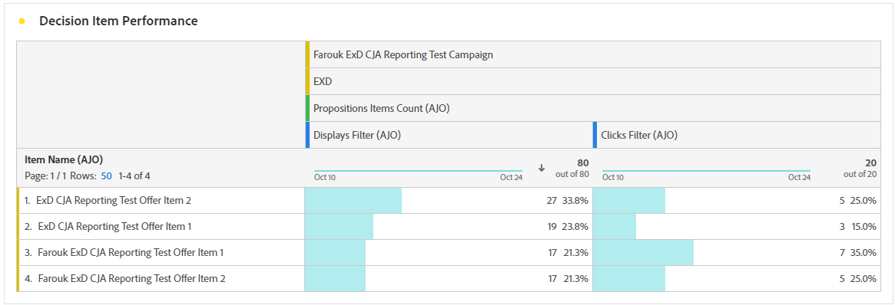

# Rapport om beslut {#decisioning-report}

## Beslutsrapportering {#campaigns}

När resor eller kampanjer med urvalsstrategier är live kan du få tillgång till dedikerade rapporter för att övervaka KPI:er (Decisioning Key Performance Indicators).

<!--Once code-based experiences are live, you can access dedicated reports to monitor Key Performance Indicators (KPIs) as an all-encompassing dashboard, delivering an analysis of essential metrics associated with your campaign.

This encompasses details related to the decision items performances and how users interacted with them. [Learn how to work with Code-based experience reports](../reports/campaign-global-report-cja-code.md)-->

Ni kan också få information om resultaten av beslutsartiklarna och hur användarna interagerade med dem, vilket ger en analys av viktig information som är kopplad till er kampanj.

Lär dig hur du arbetar med kodbaserade upplevelserapporter om beslutsfattande i [det här avsnittet](../reports/campaign-global-report-cja-code.md#decisioning-reporting).

## Rapportering i Customer Journey Analytics {#cja}

Om du arbetar med Customer Journey Analytics kan du skapa anpassade rapportinstrumentpaneler för kodbaserade kampanjer med hjälp av Beslutsfattande.

De huvudsakliga stegen visas nedan. Detaljerad information om hur du arbetar med Customer Journey Analytics finns i [Customer Journey Analytics-dokumentationen](https://experienceleague.adobe.com/sv/docs/analytics-platform/using/cja-landing){target="_blank"}.

1. Skapa och konfigurera en **anslutning** i Customer Journey Analytics. På så sätt kan du ansluta till den datauppsättning som du vill ha rapporter för. [Lär dig skapa en anslutning](https://experienceleague.adobe.com/sv/docs/analytics-platform/using/cja-connections/create-connection){target="_blank"}

1. Skapa en **datavy** och koppla den till anslutningen som skapades tidigare. På fliken **[!UICONTROL Components]** väljer du de relevanta schemafält som du vill visa i rapporter. Kontrollera att du inkluderar fälten **propositionInteract** och **propositionDisplay** för beslut. [Lär dig hur du skapar och konfigurerar datavyer](https://experienceleague.adobe.com/sv/docs/analytics-platform/using/cja-dataviews/create-dataview){target="_blank"}

1. Kombinera datakomponenter, tabeller och visualiseringar i **arbetsyteprojekt** för att skapa och dela rapporter för den kodbaserade kampanjen. [Lär dig skapa arbetsyteprojekt](https://experienceleague.adobe.com/sv/docs/analytics-platform/using/cja-workspace/build-workspace-project/create-projects){target="_blank"}
