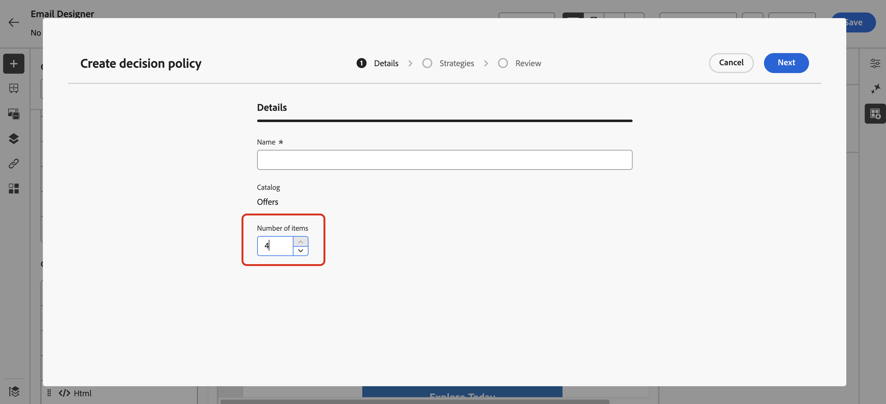
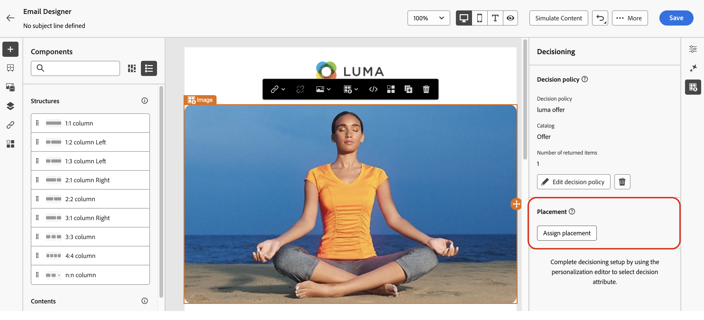

# Skapa beslutsprofiler {#create-decision}

>[!CONTEXTUALHELP]
>id="ajo_code_based_item_number"
>title="Definiera antalet artiklar som ska returneras"
>abstract="Välj det antal beslutsartiklar som du vill returnera. Om du till exempel väljer 2 visas de två bästa erbjudandena för den aktuella konfigurationen."

>[!CONTEXTUALHELP]
>id="ajo_code_based_fallback"
>title="Välj en reservlinje"
>abstract="Ett reservobjekt visas för användaren när ingen av de urvalsstrategier som definierats för den beslutsprincipen är kvalificerad."

>[!CONTEXTUALHELP]
>id="ajo_code_based_strategy"
>title="Vad är en strategi?"
>abstract="Sekvensen med urvalsstrategi avgör vilken strategi som ska utvärderas först. Minst en strategi krävs. Beslutsposter i kombinerade strategier kommer att utvärderas tillsammans."
>additional-url="https://experienceleague.adobe.com/sv/docs/journey-optimizer/using/decisioning/offer-decisioning/get-started-decision/starting-offer-decisioning" text="Skapa strategier"

Om du vill presentera det bästa dynamiska erbjudandet och upplevelsen för dina kunder lägger du till en beslutsprincip i innehållet i en kampanj eller resa och konfigurerar sedan objekten som ska returneras och urvalsstrategin som ska användas. För att göra detta, följ nedanstående steg:

1. [Lägg till en beslutspolicy](#add)
1. [Konfigurera beslutsprincipen](#configure) - Lägg till ett namn och ange antalet objekt som ska returneras för e-postkanalen.
1. [Konfigurera en strategisekvens](#strategy) - Välj de objekt som ska returneras med beslutsprincipen.
1. [Välj reserverbjudanden](#fallback) (valfritt) - Välj objekt som ska visas om inga objekt eller urvalsstrategier är kvalificerade.
1. [Granska och spara](#review) markeringsstrategin
1. [Tilldela en placering](#placement) (e-postkanal)

>[!AVAILABILITY]
>
>Beslutsprinciper är tillgängliga för alla kunder för kanalerna **Kodbaserad upplevelse**, **Push-meddelanden** och SMS.
>
>Beslut om e-postkanalen finns i Begränsad tillgänglighet. Kontakta din Adobe-representant för att få åtkomst. Läs mer om [tillgänglighetsetiketter](../rn/releases.md#availability-labels).

## Lägg till en beslutspolicy {#add}

Om du vill lägga till en beslutsprincip i meddelandet öppnar du en resa eller kampanj och väljer en [kanalåtgärd](../building-journeys/journeys-message.md).

Redigera innehållet i ditt meddelande och bläddra bland flikarna nedan om du vill ha mer information om hur du lägger till beslutsprincipen baserat på den valda kanalen.

>[!BEGINTABS]

>[!TAB Kodbaserad upplevelse]

För kodbaserade upplevelser kan du lägga till en ny beslutsprincip med antingen **kodredigeraren** eller menyn **Beslutsfattning** som finns i egenskapspanelen.

+++Lägga till en beslutsprincip från kodredigeraren

1. Öppna kodredigeraren med knappen **[!UICONTROL Edit code]**.

1. Navigera till menyn **[!UICONTROL Decision policy]** och klicka sedan på knappen **[!UICONTROL Add decision policy]**.

   

+++

+++Lägg till en beslutsprincip från menyn Beslut

1. Klicka på ikonen  i egenskapsrutan för att komma åt menyn **[!UICONTROL Decisioning]**.

1. Klicka på knappen **[!UICONTROL Add decision policy]**.

   

+++

>[!TAB E-post]

1. Växla alternativet **[!UICONTROL Enable decisioning]**.

   

   >[!IMPORTANT]
   >
   >Om du aktiverar beslutsfattande rensas befintligt e-postinnehåll. Om du redan har utformat e-postmeddelandet måste du spara innehållet som en mall i förväg.

1. Lägg till en ny beslutsprincip med antingen **anpassningsredigeraren** eller menyn **Beslutsfattare** som finns i e-postdesignern.

   +++Lägga till en beslutspolicy från Personalization Editor

   1. Öppna personaliseringsredigeraren med ikonen  som finns i ämnesraden eller i något fält i e-postbrödtexten där du kan lägga till personalisering.

   1. Navigera till menyn **[!UICONTROL Decision policies]** och klicka sedan på knappen **[!UICONTROL Add decision policy]**.

      

   +++

   +++Lägg till en beslutsprincip från menyn Beslut

   1. Öppna e-post-Designer och markera en komponent i e-poststrukturen.

   1. Klicka på ikonen  i egenskapsrutan för att komma åt menyn **[!UICONTROL Decisioning]**.

   1. Klicka på knappen **[!UICONTROL Add new policy]**.

      

   >[!NOTE]
   >
   >Med **[!UICONTROL Reuse decision output]** kan du återanvända en beslutsprincip som redan har skapats i det här e-postmeddelandet.

>[!TAB SMS]

För SMS kan du lägga till en ny beslutsprincip med antingen **personaliseringsredigeraren** eller med menyn **Beslutsfattning** som finns i egenskapspanelen.

+++Lägg till en beslutsprincip från personaliseringsredigeraren

1. Öppna personaliseringsredigeraren med ikonen .
1. Navigera till menyn **[!UICONTROL Decision policies]** och klicka sedan på knappen **[!UICONTROL Add decision policy]**.

   

+++

+++Lägg till en beslutsprincip från menyn Beslut

1. Klicka på ikonen  i egenskapsrutan för att komma åt menyn **[!UICONTROL Decisioning]**.

1. Klicka på knappen **[!UICONTROL Add decision policy]**.

   

>[!TAB Push-meddelande]

För push-meddelanden kan du lägga till en ny beslutsprincip med antingen **personaliseringsredigeraren** eller menyn **Beslutsfattning** som finns i egenskapsrutan.

+++Lägg till en beslutsprincip från personaliseringsredigeraren

1. Öppna personaliseringsredigeraren med ikonen .
1. Navigera till menyn **[!UICONTROL Decision policies]** och klicka sedan på knappen **[!UICONTROL Add decision policy]**.

   

+++

+++Lägg till en beslutsprincip från menyn Beslut

1. Klicka på ikonen  i egenskapsrutan för att komma åt menyn **[!UICONTROL Decisioning]**.

1. Klicka på knappen **[!UICONTROL Add decision policy]**.

   

>[!IMPORTANT]
>
>Experience Decision med push-meddelanden kräver en specifik version av Mobile SDK. Innan du implementerar den här funktionen bör du kontrollera [versionsinformationen](https://developer.adobe.com/client-sdks/home/release-notes){target="_blank"} för att identifiera den version som krävs och kontrollera att du har uppgraderat därefter. Du kan även visa alla tillgängliga SDK-versioner för din plattform i [det här avsnittet](https://developer.adobe.com/client-sdks/home/current-sdk-versions/){target="_blank"}.

>[!ENDTABS]

## Konfigurera beslutsprincipen {#configure}

När du har lagt till en ny beslutsprincip i innehållet öppnas skärmen för konfiguration av beslutsprincip. Så här konfigurerar du beslutsprincipen:

1. Ange ett namn för beslutsprincipen och välj en katalog (som för närvarande är begränsad till standardkatalogen **[!UICONTROL Offers]**).

   

1. I fältet **[!UICONTROL Number of items]** kan du definiera antalet beslutsobjekt som ska returneras med en beslutspolicy. Om du till exempel väljer 2 visas de två bästa erbjudandena för den aktuella konfigurationen.

   >[!NOTE]
   >
   >Det här alternativet är endast tillgängligt för e-post- och kodbaserade upplevelsekanaler. För alla andra kanaler kan bara 1 beslutsobjekt returneras per åtgärd.

   Om du vill returnera flera objekt för e-postkanalen måste du lägga till beslutsprincipen i en **[!UICONTROL Repeat Grid]**-komponent. Expandera avsnittet nedan om du vill ha mer information:

   +++Returnera flera beslutsobjekt i e-postmeddelanden

   1. Dra en **[!UICONTROL Repeat Grid]**-komponent i e-postmeddelandet och konfigurera den som du vill med hjälp av rutan **[!UICONTROL Settings]**.

      

   1. Klicka på ikonen **[!UICONTROL Decisioning]** i verktygsfältet på arbetsytan eller öppna rutan **[!UICONTROL Decisioning]** och välj **[!UICONTROL Add decision policy]**.

   1. Ange antalet objekt som ska returneras i fältet **[!UICONTROL Number of items]** och konfigurera sedan beslutsprincipen enligt nedan. Det maximala antalet objekt som du kan markera begränsas av antalet rutor som definieras i komponenten **[!UICONTROL Repeat grid]**.

   

   +++

1. Klicka på **[!UICONTROL Next]**.

## Ställ in en strategisekvens {#strategy}

I avsnittet **[!UICONTROL Strategy sequence]** kan du välja beslutsobjekt och ange urvalsstrategier som ska visas med beslutsprincipen.

1. Klicka på **[!UICONTROL Add]** och välj vilken typ av objekt som ska inkluderas i profilen:

   

   * **[!UICONTROL Selection strategy]** - Beslutsstrategier utnyttjar samlingar som är kopplade till berättigandebegränsningar och rangordningsmetoder för att avgöra vilka objekt som ska visas. Du kan välja en eller flera befintliga markeringsstrategier eller skapa en ny med knappen **[!UICONTROL Create selection strategy]**. [Lär dig hur du skapar urvalsstrategier](selection-strategies.md)

   * **[!UICONTROL Decision item]** - Välj enskilda beslutsobjekt utan att behöva köra en urvalsstrategi. Du kan bara välja ett beslutsobjekt i taget. Alla villkor som anges för artikeln gäller.

   >[!NOTE]
   >
   >En beslutspolicy stöder upp till 10 urvalsstrategier och beslutsposter tillsammans. [Läs mer om hur du bestämmer dig för skyddsprofiler och begränsningar](gs-experience-decisioning.md#guardrails)

1. När du lägger till flera beslutsposter och/eller strategier utvärderas de i en viss ordning. Det första objektet som lades till i sekvensen utvärderas först och så vidare. Om du vill ändra standardsekvensen drar och släpper du objekten och/eller grupperna för att ordna om dem som du vill. Expandera avsnittet nedan om du vill ha mer information.

   +++Hantera utvärderingsordning i en beslutspolicy

   När du har lagt till beslutsposter och urvalsstrategier i din policy kan du ordna dem för att fastställa deras utvärderingsordning och kombinera urvalsstrategier för att utvärdera dem tillsammans.

   Den **sekventiella ordningen** i vilken objekt och strategier utvärderas anges med siffror till vänster om varje objekt eller grupp av objekt. Om du vill flytta positionen för en urvalsstrategi (eller en grupp strategier) i sekvensen drar och släpper du den till en annan position.

   

   >[!NOTE]
   >
   >Endast markeringsstrategier kan dras och släppas i en sekvens. Om du vill ändra positionen för ett beslutsobjekt måste du ta bort det och lägga tillbaka det med knappen **[!UICONTROL Add]** när du har lagt till de andra objekten som du vill utvärdera tidigare.

   Du kan också **kombinera** flera markeringsstrategier i grupper så att de utvärderas tillsammans och inte separat. Om du vill göra det klickar du på knappen **`+`** under en urvalsstrategi för att kombinera den med en annan. Du kan också dra och släppa en markeringsstrategi på en annan om du vill gruppera de två strategierna i en grupp.

   >[!NOTE]
   >
   >Beslutsobjekt kan inte grupperas tillsammans med andra objekt eller urvalsstrategier.

   Flera strategier och grupperingar av dem avgör prioriteringen av strategierna och rangordningen av godtagbara erbjudanden. Den första strategin har högsta prioritet och de strategier som kombineras inom samma grupp har samma prioritet.

   Du har till exempel två samlingar, en i strategi A och en i strategi B. Begäran är att två beslutsobjekt ska skickas tillbaka. Låt oss säga att det finns två giltiga erbjudanden från strategi A och tre giltiga erbjudanden från strategi B.

   * Om de två strategierna **inte kombineras** eller i sekventiell ordning (1 och 2) returneras de två främsta giltiga erbjudandena från den första strategin på den första raden. Om det inte finns två godtagbara erbjudanden för den första strategin kommer beslutsmotorn att gå vidare till nästa strategi i sekvens för att hitta så många erbjudanden som fortfarande behövs, och kommer i slutändan att returnera en reservlösning om det behövs.

     

   * Om de två samlingarna **utvärderas samtidigt**, eftersom det finns två giltiga erbjudanden från strategi A och tre giltiga erbjudanden från strategi B, kommer alla fem erbjudanden att grupperas tillsammans baserat på det värde som fastställs av respektive rangordningsmetod. Två erbjudanden begärs, och därför returneras de två främsta erbjudandena från dessa fem.

     

   **Exempel med flera strategier**

   Låt oss nu titta på ett exempel där du har flera strategier indelade i olika grupper. Du definierade tre strategier. Strategi 1 och strategi 2 kombineras i grupp 1 och strategi 3 är oberoende (grupp 2). De berättigade erbjudandena för varje strategi och deras prioritet (används vid rankningsfunktionens utvärdering) är följande:

   * Grupp 1:
      * Strategi 1 - (erbjudande 1, erbjudande 2, erbjudande 3) - prioritet 1
      * Strategi 2 - (erbjudande 3, erbjudande 4, erbjudande 5) - prioritet 1

   * Grupp 2:
      * Strategi 3 - (erbjudande 5, erbjudande 6) - Prioritet 0

   Strategierbjudanden med högst prioritet utvärderas först och läggs till i listan med rankade erbjudanden.

   * **Iteration 1:**

     Strategi 1 och strategi 2-erbjudanden utvärderas tillsammans (erbjudande 1, erbjudande 2, erbjudande 3, erbjudande 4, erbjudande 5). Låt oss säga att resultatet är:

     Erbjudande 1-10
Erbjudande 2-20
Erbjudande 3-30 från strategi 1, 45 från strategi 2. Det högsta av båda kommer att övervägas, så 45 kommer att beaktas.
Erbjudande 4-40
Erbjudande 5-50

     Rankade erbjudanden: Erbjudande 5, Erbjudande 3, Erbjudande 4, Erbjudande 2, Erbjudande 1.

   * **Iteration 2:**

     Strategi 3-erbjudanden utvärderas (erbjudande 5, erbjudande 6). Låt oss säga att resultatet är:

      * Erbjudande 5 - Kommer inte att utvärderas eftersom det redan finns i resultatet ovan.
      * Erbjudande 6-60

     Rankade erbjudanden: Erbjudande 5, Erbjudande 3, Erbjudande 4, Erbjudande 2, Erbjudande 1, Erbjudande 6.

   +++

1. När din urvalsstrategi är klar klickar du på **[!UICONTROL Next]**.

## Lägg till reserverbjudanden {#fallback}

När du har valt beslutsobjekt och/eller urvalsstrategier kan du lägga till reserverbjudanden som visas om ingen av ovanstående poster eller urvalsstrategier är kvalificerad.

Du kan välja valfritt objekt i listan, som visar alla beslutsobjekt som har skapats i den aktuella sandlådan. Om ingen urvalsstrategi är kvalificerad visas reservdelen för användaren oavsett vilka datum och villkor för behörighet som gäller för det valda objektet <!--nor frequency capping when available - TO CLARIFY-->.

>[!NOTE]
> Reservationer är valfria. Upp till antalet begärda objekt kan väljas. Om ingen är berättigad och ingen reservlösning är inställd visas ingenting.

## Granska och spara beslutsprocessen {#review}

När du har konfigurerat en urvalsstrategi och lagt till reserverbjudanden klickar du på **[!UICONTROL Next]** för att granska och spara din beslutspolicy och sedan på **[!UICONTROL Create]** för att bekräfta att principen har skapats.

>[!IMPORTANT]
>
>När en beslutspolicy väl har skapats kan det ta upp till 15 minuter att sprida ändringar i den över alla dataområden, och upp till 30 minuter för Kanada. Detta inkluderar ändringar som att lägga till en ny beslutspost i en samling, ändra en regel i en artikel, ändra artikelinnehåll eller uppdatera en formel.

Du kan redigera eller ta bort en beslutsprincip när som helst med hjälp av ellipsknappen i personaliseringsredigeraren, eller på menyn **[!UICONTROL Decisioning]** i komponentens egenskapspanel.

>[!BEGINTABS]

>[!TAB Redigera eller ta bort en princip från personaliseringsredigeraren]

>[!TAB Redigera eller ta bort en princip från beslutsmenyn]

>[!ENDTABS]

## Tilldela en placering (e-post) {#placement}

För e-postmeddelanden måste du definiera en placering för den komponent som är kopplad till beslutspolicyn. Om du vill göra det klickar du på knappen **[!UICONTROL Decisioning]** i egenskapsrutan för komponenten och väljer **[!UICONTROL Assign placement]**. [Lär dig hur du arbetar med placeringar](../experience-decisioning/placements.md)

## Nästa steg {#next-steps}

Nu när du förstår hur du skapar en beslutspolicy är du redo att använda den i [!DNL Journey Optimizer] kanaler för att leverera erbjudanden.

➡️ [Lär dig hur du använder beslutsprinciper i meddelanden](../experience-decisioning/use-decision-policy.md)
