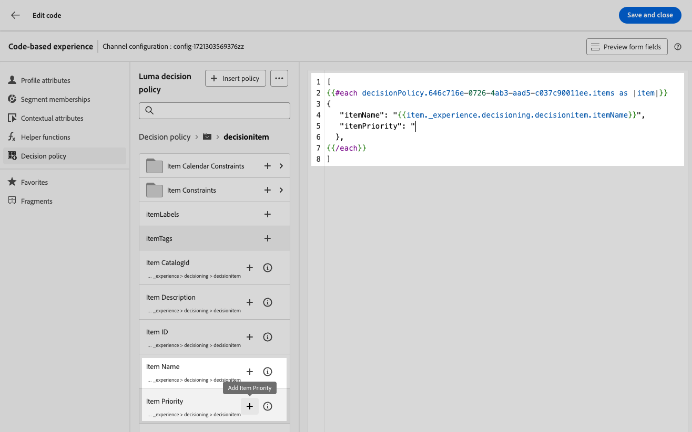

# Skapa beslutsprofiler {#create-decision}

>[!CONTEXTUALHELP]
>id="ajo_code_based_decision"
>title="Vad är ett beslut?"
>abstract="Beslutspolicyn utnyttjar beslutsmotorn för upplevelser för att välja ut det bästa innehåll som ska levereras, beroende på målgruppen."
>additional-url="https://experienceleague.adobe.com/docs/journey-optimizer/using/offer-decisioning/get-started-decision/starting-offer-decisioning.html" text="Om Experience Decision"

>[!BEGINSHADEBOX]

Vad du hittar i den här handboken:

* [Kom igång med Experience Decision](gs-experience-decisioning.md)
* Hantera dina beslutsobjekt
   * [Konfigurera objektkatalogen](catalogs.md)
   * [Skapa beslutsobjekt](items.md)
   * [Hantera artikelsamlingar](collections.md)
* Konfigurera val av objekt
   * [Skapa beslutsregler](rules.md)
   * [Skapa rangordningsmetoder](ranking.md)
* [Skapa urvalsstrategier](selection-strategies.md)
* **[Skapa beslutsprofiler](create-decision.md)**

>[!ENDSHADEBOX]

Beslutspolicyer är behållare för era erbjudanden som utnyttjar beslutsmotorn för upplevelser för att välja det bästa innehåll som ska levereras, beroende på målgruppen.

>[!NOTE]
>
>I [!DNL Journey Optimizer] användargränssnitt, beslutsprinciper anges som beslut<!--but they are decision policies. TBC if this note is needed-->.

## Lägga till en beslutsprincip i en kodbaserad kampanj {#add-decision}

>[!CONTEXTUALHELP]
>id="ajo_code_based_item_number"
>title="Definiera antalet artiklar som ska returneras"
>abstract="Välj det antal beslutsartiklar som du vill returnera. Om du till exempel väljer 2 visas de två bästa erbjudandena för den aktuella ytan."

>[!CONTEXTUALHELP]
>id="ajo_code_based_fallback"
>title="Välj en reservlinje"
>abstract="Ett reservobjekt visas för användaren när ingen av de urvalsstrategier som definierats för den beslutsprincipen är kvalificerad."

>[!CONTEXTUALHELP]
>id="ajo_code_based_strategy"
>title="Vad är en strategi?"
>abstract="Sekvensen med urvalsstrategi avgör vilken strategi som ska utvärderas först. Minst en strategi krävs. Beslutsposter i kombinerade strategier kommer att utvärderas tillsammans."
>additional-url="https://experienceleague.adobe.com/docs/journey-optimizer/using/offer-decisioning/get-started-decision/starting-offer-decisioning.html" text="Skapa strategier"
>additional-url="https://experienceleague.adobe.com/docs/journey-optimizer/using/offer-decisioning/get-started-decision/starting-offer-decisioning.html" text="Utvärderingsorder"

Om du vill presentera det bästa dynamiska erbjudandet och upplevelsen för besökarna på din webbplats eller i din mobilapp lägger du till en beslutspolicy i en kodbaserad kampanj. För att göra detta, följ nedanstående steg.

1. Skapa en kampanj och välj **[!UICONTROL Code-base experience (Beta)]** åtgärd. [Läs mer](../code-based/create-code-based.md)

   >[!NOTE]
   >
   >Funktionen för kodbaserad upplevelse är för närvarande endast tillgänglig som betaversion för utvalda användare.

1. Från [kodredigerare](../code-based/create-code-based.md#edit-code)väljer du **[!UICONTROL Decisions]** ikon och klicka **[!UICONTROL Create a decision]**.

   

1. Fyll i informationen för din beslutsprincip: lägg till ett namn och välj en katalog.

   >[!NOTE]
   >
   >För närvarande är det bara standardinställningen **[!UICONTROL Offers]** katalogen är tillgänglig.

   

1. Välj det antal objekt som du vill returnera. Om du till exempel väljer 2 visas de två bästa erbjudandena för den aktuella ytan. Klicka på **[!UICONTROL Next]**

1. Använd **[!UICONTROL Add strategy]** för att definiera urvalsstrategier för din beslutspolicy. Varje strategi består av en erbjudandesamling som är kopplad till en begränsning för behörighet och en rangordningsmetod för att avgöra vilka erbjudanden som ska visas. [Läs mer](selection-strategies.md)

   

   >[!NOTE]
   >
   >Minst en strategi krävs. Du kan inte lägga till fler än 10 strategier.

1. Från **[!UICONTROL Add strategy]** kan du även skapa en strategi. The **[!UICONTROL Create selection strategy]** omdirigerar dig till **[!UICONTROL Experience decisioning]** > **[!UICONTROL Configurations]** -menyn. [Läs mer](selection-strategies.md)

   

1. När du lägger till flera strategier utvärderas de i en viss ordning. Den första strategin som lades till i sekvensen utvärderas först och så vidare. [Läs mer](#evaluation-order)

   Om du vill ändra standardsekvensen kan du dra och släppa strategierna och/eller grupperna för att ordna om dem som du vill.

   

1. Lägg till ett reserv. Ett reservobjekt visas för användaren om ingen av ovanstående urvalsstrategier är kvalificerad.

   

   Du kan välja valfritt objekt i listan, som visar alla beslutsobjekt som har skapats i den aktuella sandlådan. Om ingen urvalsstrategi är kvalificerad visas reservdelen för användaren oavsett datum och behörighetskrav för den valda artikeln<!--nor frequency capping when available - TO CLARIFY-->.

   >[!NOTE]
   >
   >En reservlösning är valfri. Om ingen reservlösning har valts och ingen strategi är kvalificerad visas ingenting av [!DNL Journey Optimizer].

1. Spara markeringen och klicka **[!UICONTROL Create]**. Den nya beslutspolicyn läggs till i **[!UICONTROL Decisions]**.

   

Nu när beslutspolicyn har skapats kan du använda beslutsattributen i ditt kodbaserade upplevelseinnehåll. [Läs mer](#use-decision-policy)

## Utvärderingsorder {#evaluation-order}

Som beskrivs ovan består en strategi av en samling, en rangordningsmetod och begränsningar för behörighet.

Du kan:

* Ange den sekventiella ordning du vill att strategierna ska utvärderas,
* Kombinera olika strategier så att de utvärderas tillsammans och inte separat.

Flera strategier och grupperingar av dem avgör prioriteringen av strategierna och rangordningen av godtagbara erbjudanden. Den första strategin har högsta prioritet och de strategier som kombineras inom samma grupp har samma prioritet.

Du har till exempel två samlingar, en i strategi A och en i strategi B. Begäran är att två beslutsobjekt ska skickas tillbaka. Låt oss säga att det finns två giltiga erbjudanden från strategi A och tre giltiga erbjudanden från strategi B.

* Om de två strategierna är **inte kombinerad** eller i sekventiell ordning (1 och 2), returneras de två främsta erbjudandena från den första strategin på den första raden. Om det inte finns två godtagbara erbjudanden för den första strategin kommer beslutsmotorn att gå vidare till nästa strategi i sekvens för att hitta så många erbjudanden som fortfarande behövs, och kommer i slutändan att returnera en reservlösning om det behövs.

  

* Om de två samlingarna **utvärderas samtidigt** Eftersom det finns två godtagbara erbjudanden från strategi A och tre giltiga erbjudanden från strategi B, kommer alla fem erbjudanden att samlas i hög med det värde som fastställs av respektive rangordningsmetod. Två erbjudanden begärs, och därför returneras de två främsta erbjudandena från dessa fem.

  

+++ **Exempel med flera strategier**

Låt oss nu titta på ett exempel där du har flera strategier indelade i olika grupper.

Du definierade tre strategier. Strategi 1 och strategi 2 kombineras i grupp 1 och strategi 3 är oberoende (grupp 2).

De berättigade erbjudandena för varje strategi och deras prioritet (används vid rankningsfunktionens utvärdering) är följande:

* Grupp 1:
   * Strategi 1 - (erbjudande 1, erbjudande 2, erbjudande 3) - prioritet 1
   * Strategi 2 - (erbjudande 3, erbjudande 4, erbjudande 5) - prioritet 1

* Grupp 2:
   * Strategi 3 - (erbjudande 5, erbjudande 6) - Prioritet 0

Strategierbjudanden med högst prioritet utvärderas först och läggs till i listan med rankade erbjudanden.

**Upprepning 1:**

Strategi 1 och strategi 2-erbjudanden utvärderas tillsammans (erbjudande 1, erbjudande 2, erbjudande 3, erbjudande 4, erbjudande 5). Låt oss säga att resultatet är:

Erbjudande 1 - 10 Erbjudande 2 - 20 Erbjudande 3 - 30 från strategi 1, 45 från strategi 2. Det högsta av båda kommer att övervägas, så 45 kommer att beaktas.
Erbjudande 4 - 40 Erbjudande 5 - 50

Rankade erbjudanden: Erbjudande 5, Erbjudande 3, Erbjudande 4, Erbjudande 2, Erbjudande 1.

**Upprepning 2:**

Strategi 3-erbjudanden utvärderas (erbjudande 5, erbjudande 6). Låt oss säga att resultatet är:

* Erbjudande 5 - Kommer inte att utvärderas eftersom det redan finns i resultatet ovan.
* Erbjudande 6-60

Rankade erbjudanden: Erbjudande 5, Erbjudande 3, Erbjudande 4, Erbjudande 2, Erbjudande 1, Erbjudande 6.

+++

## Använd beslutsprincipen i kodredigeraren {#use-decision-policy}

När du har skapat en beslutspolicy kan du använda den i [kodredigerare](../code-based/create-code-based.md#edit-code). För att göra detta, följ nedanstående steg.

>[!NOTE]
>
>Kodredigeraren använder [!DNL Journey Optimizer] Uttrycksredigeraren med alla dess funktioner för personalisering och redigering. [Läs mer](../personalization/personalization-build-expressions.md)

1. Klicka på ikonen +. Koden som motsvarar beslutspolicyn läggs till. Nu kan du lägga till alla beslutsattribut du vill i den koden.

   

   >[!NOTE]
   >
   >Den här sekvensen upprepas det antal gånger som du vill att beslutsprincipen ska returneras. Om du t.ex. väljer att returnera två objekt när [skapa beslut](#add-decision), upprepas samma sekvens två gånger.

1. Klicka på beslutspolicyn. Beslutsattributen visas.

   Dessa attribut lagras i **[!UICONTROL Offers]** katalogschema. Anpassade attribut lagras i **cjmstage** mapp- och standardattribut i **upplevelse** mapp. [Läs mer om offertkatalogens schema](catalogs.md)

   

1. Klicka på varje mapp för att expandera den. Placera musmarkören på önskad plats och klicka på ikonen + bredvid det attribut du vill lägga till. Du kan lägga till så många attribut du vill i koden.

   

1. Klicka på mappikonen om du vill gå tillbaka till beslutsprinciproten.

   

1. Du kan också lägga till andra attribut som är tillgängliga i uttrycksredigeraren, till exempel profilattribut.

   
