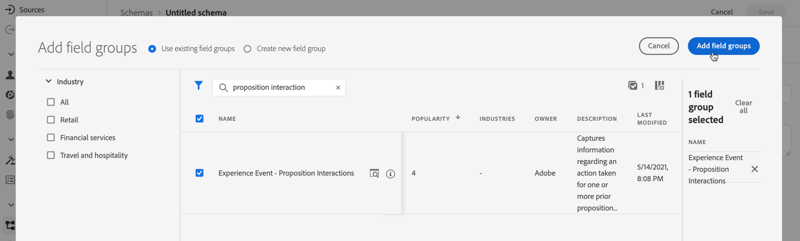
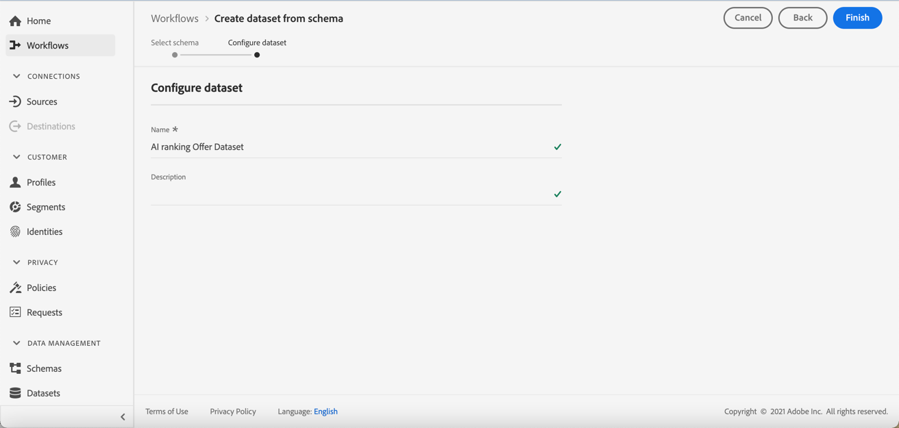

# Skapa en datauppsättning för att samla in händelser {#create-dataset}

Om du vill samla in upplevelsehändelser måste du först skapa en datauppsättning där dessa händelser skickas.

Börja med att skapa schemat som ska användas i din datauppsättning:

1. Välj **[!UICONTROL Data Management]** på menyn **[!UICONTROL Schema]**.

1. Klicka på **[!UICONTROL Create schema]** i det övre högra hörnet, markera **[!UICONTROL Experience Event]** och klicka på **Nästa**.

   

   >[!NOTE]
   >
   >Läs mer om XDM-scheman och fältgrupper i [översiktsdokumentationen för XDM-systemet](https://experienceleague.adobe.com/docs/experience-platform/xdm/home.html?lang=sv){target="_blank"}.

1. Ange ett namn och en beskrivning för ditt schema och klicka på **Slutför**.
   

1. Välj **[!UICONTROL Field groups]** i avsnittet **[!UICONTROL Add]** till vänster.

   

1. I fältet **[!UICONTROL Search]** skriver du &quot;Föreslå interaktion&quot;.

1. Markera fältgruppen **[!UICONTROL Experience Event - Proposition Interactions]** och klicka på **[!UICONTROL Add field groups]**.

   

   >[!CAUTION]
   >
   >Schemat som ska användas i datauppsättningen måste ha fältgruppen **[!UICONTROL Experience Event - Proposition Interactions]** associerad med den. Annars kan du inte använda den i AI-modellen.

1. Spara schemat.

>[!NOTE]
>
>Läs mer om att skapa scheman i [Grunderna för schemakomposition](https://experienceleague.adobe.com/docs/experience-platform/xdm/schema/composition.html?lang=sv-SE#understanding-schemas){target="_blank"}.

Du är nu redo att skapa en datauppsättning med det här schemat. Gör så här:

1. Välj **[!UICONTROL Data Management]** på menyn **[!UICONTROL Datasets]** och gå till fliken **[!UICONTROL Browse]**.

1. Klicka på **[!UICONTROL Create dataset]** och välj **[!UICONTROL Create dataset from schema]**.

   

1. Välj det schema som du just skapade från listan och klicka på **[!UICONTROL Next]**.

1. Ange ett unikt namn för datauppsättningen i fältet **[!UICONTROL Name]** och klicka på **[!UICONTROL Finish]**.

   

>[!NOTE]
>
>Den här datauppsättningen kan nu väljas för att samla in händelsedata när en [AI-modell](../ranking/create-ai-models.md) skapas.
