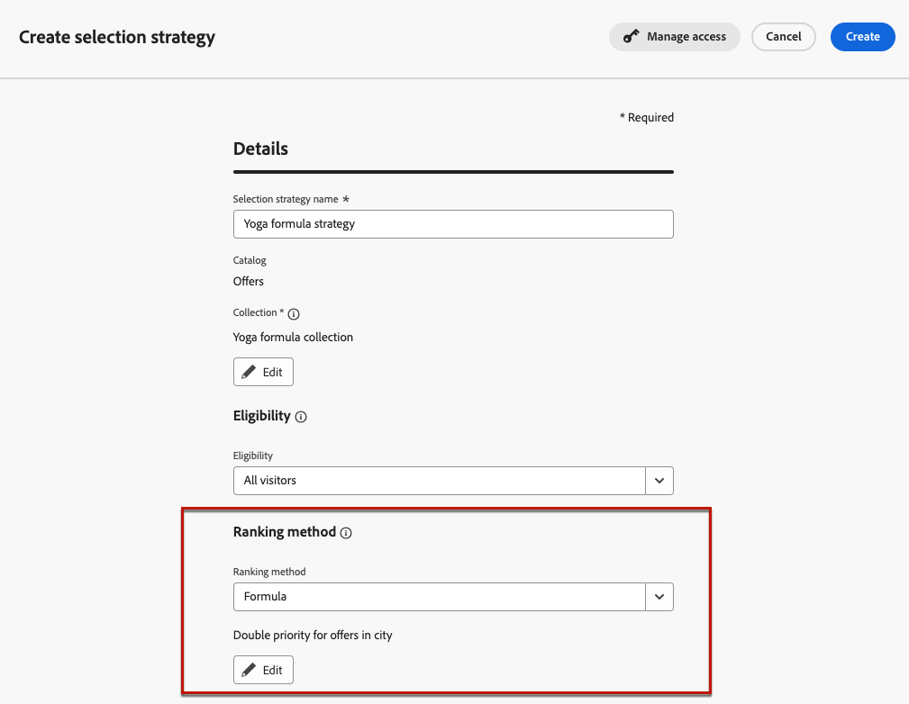

# Användningsfall vid beslut {#experience-decisioning-uc}

I det här användningsexemplet beskrivs alla steg som behövs för att använda Decisionering med den kodbaserade kanalen [!DNL Journey Optimizer].

<!--In this use case, you create a campaign where you define two delivery treatments - each containing a different decision policy in order to measure which one performs best for your target audience.-->

I det här fallet är du osäker på om en viss rankningsformel kommer att fungera bättre än de förtilldelade prioriteterna.

Om du vill mäta vilken som fungerar bäst för målgruppen skapar du en kampanj med [Innehållsexperiment](../content-management/content-experiment.md) där du definierar två leveranssätt:

<!--Set up the experiment such that:-->

* Den första behandlingen innehåller en urvalsstrategi med prioritet som rangordningsmetod.
* Den andra behandlingen innehåller en annan urvalsstrategi där en formel är rangordningsmetoden.

## Skapa urvalsstrategier

Först måste du bygga två urvalsstrategier: en med prioritet som rangordningsmetod och en med en formel som rangordningsmetod.

### Skapa den första urvalsstrategin

I den första urvalsstrategin väljer du prioritet som rangordningsmetod. Följ stegen nedan.

1. Skapa ett beslutsobjekt. [Lär dig hur](items.md)

1. Ange **[!UICONTROL Priority]** för beslutsobjektet jämfört med andra. Om en profil kvalificerar för flera objekt ger en högre prioritet objektets prioritet framför andra.

   

   >[!NOTE]
   >
   >Prioriteten är en heltalsdatatyp. Alla attribut som är heltalsdatatyper ska innehålla heltalsvärden (inga decimaler).

1. Ange berättigandestatus för beslutsobjektet:

   * Definiera målgrupper eller regler för att begränsa objektet till enbart specifika profiler. [Läs mer](items.md#eligibility)

   * Ange regler för begränsning för hur många gånger ett erbjudande får presenteras. [Läs mer](items.md#capping)

1. Om det behövs upprepar du stegen ovan för att skapa ytterligare beslutsobjekt.

1. Skapa en **samling** där dina beslutsobjekt ska inkluderas. [Läs mer](collections.md)

1. Skapa en [urvalsstrategi](selection-strategies.md#create-selection-strategy) och välj den [samling](collections.md) som innehåller de erbjudanden som ska beaktas.

1. [Välj den rangordningsmetod](#select-ranking-method) som du vill använda för att välja det bästa erbjudandet för varje profil.

   I det här fallet väljer du **[!UICONTROL Offer priority]**: om flera erbjudanden är berättigade för den här strategin använder beslutsmotorn det värde som angetts som **[!UICONTROL Priority]** i erbjudandena. [Läs mer](selection-strategies.md#offer-priority)

   

### Skapa den andra urvalsstrategin

I den andra urvalsstrategin väljer du en formel som rangordningsmetod. Följ stegen nedan.

1. Skapa ett beslutsobjekt. [Lär dig hur](items.md)

<!--1. Set the same **[!UICONTROL Priority]** as for the first decision item. TBC?-->

1. Ange berättigandestatus för beslutsobjektet:

   * Definiera målgrupper eller regler för att begränsa objektet till enbart specifika profiler. [Läs mer](items.md#eligibility)

   * Ange regler för begränsning för hur många gånger ett erbjudande får presenteras. [Läs mer](items.md#capping)

1. Om det behövs upprepar du stegen ovan för att skapa ytterligare beslutsobjekt.

1. Skapa en **samling** där dina beslutsobjekt ska inkluderas. [Läs mer](collections.md)

1. Skapa en [urvalsstrategi](selection-strategies.md#create-selection-strategy) och välj den [samling](collections.md) som innehåller de erbjudanden som ska beaktas.

1. [Välj den rangordningsmetod](#select-ranking-method) som du vill använda för att välja det bästa erbjudandet för varje profil.

   I det här fallet väljer du **[!UICONTROL Formula]** om du vill använda en viss beräknad poäng för att välja vilket kvalificerat erbjudande som ska levereras. [Läs mer](selection-strategies.md#ranking-formula)

   

## Bygg en kodbaserad upplevelsekampanj

<!--To present the best dynamic offer and experience to your visitors on your website or mobile app, add a decision policy to a code-based campaign.

Define two delivery treatments each containing a different decision policy.-->

När du har konfigurerat de två urvalsstrategierna skapar du en kodbaserad upplevelsekampanj där du definierar olika behandlingar för varje strategi för att jämföra vilken som fungerar bäst.

1. Skapa en kampanj och välj åtgärden **[!UICONTROL Code-base experience]**. [Läs mer](../code-based/create-code-based.md)

1. Klicka på **[!UICONTROL Create experiment]** på kampanjsammanfattningssidan för att börja konfigurera ditt innehållsexperiment. [Läs mer](../content-management/content-experiment.md)

   

1. Klicka på **[!UICONTROL Edit content]**.

<!--1. Sart personalizing **Treatment A** by clicking **[!UICONTROL Create]**.

    -->

1. Börja personalisera **Behandling A** från innehållsutgåvans fönster genom att klicka på **[!UICONTROL Edit code]**.

   

1. Välj **[!UICONTROL Decision policy]**, klicka på **[!UICONTROL Add decision policy]** och fyll i beslutsinformationen. [Läs mer](create-decision.md)

   

1. Välj den första strategi som du skapade. Klicka på **[!UICONTROL Add strategy]**.

1. Klicka på **[!UICONTROL Create]**. Det nya beslutet läggs till under **[!UICONTROL Decisions]**.

   

1. Klicka på ikonen för fler åtgärder (tre punkter) och välj **[!UICONTROL Add]**. Nu kan du lägga till alla beslutsattribut som du vill ha i det här.

   

1. Du kan också lägga till andra attribut som är tillgängliga i personaliseringsredigeraren, till exempel profilattribut.

   

1. I innehållsutgåvans fönster väljer du **Behandling B** och upprepar stegen ovan för att skapa en annan beslutsprincip och väljer den andra urvalsstrategi som du har skapat.

   

1. Spara innehållet.
