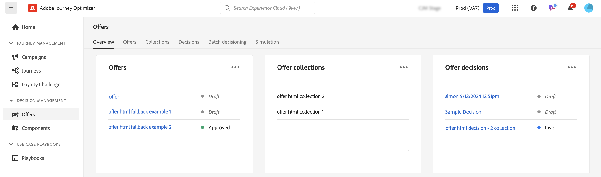

# Kom igång med beslutsfunktioner i [!DNL Journey Optimizer] {#gs-decision}

Beslutsfunktionerna i [!DNL Journey Optimizer] ger er möjlighet att leverera de bästa erbjudandena och personaliserade upplevelserna till era kunder över alla kontaktytor, vid exakt rätt tidpunkt. Dessa funktioner förenklar personaliseringen genom en centraliserad katalog med marknadsföringserbjudanden och en avancerad beslutsmotor som använder regler och rangordningskriterier för att leverera det mest relevanta innehållet för varje individ.

Viktiga fördelar:

* Förbättrade kampanjresultat genom att leverera personaliserade erbjudanden i flera kanaler,
* Förbättrade arbetsflöden: I stället för att skapa flera leveranser eller kampanjer kan marknadsföringsteamen förbättra arbetsflödena genom att skapa en enda leverans och variera erbjudandena i olika delar av mallen.
* Styr hur många gånger ett erbjudande visas för olika kampanjer och kunder.

För närvarande tillhandahåller [!DNL Journey Optimizer] de två kärnlösningarna som beskrivs nedan.

## Beslut {#decisioning}

Vårt nästa generations beslutsramverk, utformat för att förena befintliga Journey Optimizer-arbetsflöden och lägga grunden för hantering av ytterligare innehållskataloger. Beslutserbjudanden:

* Schemabaserad hantering av artikelkataloger: Öka flexibiliteten genom att associera anpassade metadata med varje erbjudande
* Flexibla samlingsregler: gruppera enkelt erbjudanden för framtida utvärdering baserat på olika kriterier
* Uppdaterad policy och konfiguration av urvalsstrategi: Tillåt återanvändning av beslutskomponenter
* Experimentationsfunktioner: Testa beslutslogik mot andra innehållskomponenter för att mäta prestanda

Beslutsfattandet stöds för närvarande i den kodbaserade upplevelsekanalen.

➡️ [Kom igång med beslut](../experience-decisioning/gs-experience-decisioning.md)

>[!NOTE]
>
>Information om hur du migrerar från beslutshantering till beslut finns i [migreringsdokumentationen](../experience-decisioning/migrate-to-decisioning.md) och [API-handboken för migrering](../experience-decisioning/decisioning-migration-api.md).

## Beslutshantering {#decision-management}

Vår etablerade funktion i Journey Optimizer, Decision Management, använder ett centralt bibliotek med marknadsföringserbjudanden och en beslutsmotor som tillämpar regler och begränsningar på kundprofiler i realtid och utnyttjar Adobe Experience Platform data för att leverera rätt erbjudande vid rätt tidpunkt.

Beslutshanteringen har stöd för följande kanaler: e-post, meddelanden i appen, push-meddelanden, SMS och direktreklam.

➡️ [Kom igång med beslutshantering](../offers/get-started/starting-offer-decisioning.md)
