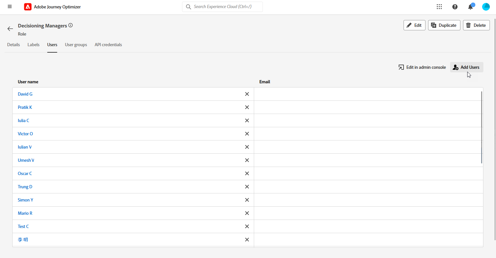

# Kom igång med beslutsfattande {#get-started-experience-decisioning}

## Vad är beslut? {#about}

Beslutsfattandet förenklar personaliseringen genom att erbjuda en centraliserad katalog med marknadsföringserbjudanden som kallas beslutsposter och en avancerad beslutsmotor. Den här motorn använder regler och rankningskriterier för att välja ut och presentera de mest relevanta beslutsobjekten för varje enskild person.

Dessa beslutsobjekt integreras smidigt i ett brett urval av inkommande ytor via den [nya kodbaserade upplevelsekanalen](https://experienceleague.adobe.com/en/docs/journey-optimizer/using/code-based-experience/get-started-code-based), som nu är tillgänglig inom Journey Optimizer-kampanjer. Beslutspolicyer är endast tillgängliga för kodbaserade upplevelsekampanjer.

## Viktiga steg för beslut {#steps}

De viktigaste stegen för att arbeta med beslut är följande:

1. **Tilldela rätt behörigheter**. Beslutsfattandet är endast tillgängligt för användare med tillgång till ett beslutsrelaterat **[!UICONTROL role]**, t.ex. beslutshanterare. Om du inte kan komma åt Beslutsfattandet måste du utöka din behörighet.

   +++Lär dig hur du tilldelar rollen Beslutsledare

   1. Om du vill tilldela en roll till en användare i [!DNL Permissions]-produkten går du till fliken **[!UICONTROL Roles]** och väljer Beslutshanterare.

      

   1. Klicka på **[!UICONTROL Add user]** på fliken **[!UICONTROL Users]**.

      

   1. Ange användarens namn eller e-postadress eller markera användaren i listan och klicka på **[!UICONTROL Save]**.

      Om användaren inte har skapats tidigare, se [dokumentationen för Lägg till användare](https://experienceleague.adobe.com/en/docs/experience-platform/access-control/ui/users).

      

   Användaren bör sedan få ett e-postmeddelande som omdirigeras till din instans.

+++

1. **Konfigurera anpassade attribut**: Anpassa objektkatalogen efter dina specifika krav genom att konfigurera anpassade attribut i katalogschemat.

1. **Skapa beslutsobjekt** som ska visas för målgruppen.

1. **Ordna med samlingar**: Använd samlingar för att kategorisera beslutsobjekt baserat på attributbaserade regler. Införliva samlingar i era urvalsstrategier för att avgöra vilken samling av beslutsobjekt som ska övervägas.

1. **Skapa beslutsregler**: Beslutsregler används i beslutsobjekt och/eller urvalsstrategier för att avgöra till vilka ett beslutsobjekt kan visas.

1. **Implementera rangordningsmetoder**: Skapa rangordningsmetoder och tillämpa dem inom beslutsstrategier för att fastställa prioritetsordningen för val av beslutsobjekt.

1. **Skapa urvalsstrategier**: Bygg urvalsstrategier som utnyttjar samlingar, beslutsregler och rangordningsmetoder för att identifiera de beslutsobjekt som är lämpliga att visa för profiler.

1. **Bädda in en beslutspolicy i din kodbaserade kampanj**: Beslutspolicyer kombinerar flera urvalsstrategier för att bestämma vilka valbara beslutsposter som ska visas för den avsedda målgruppen.
