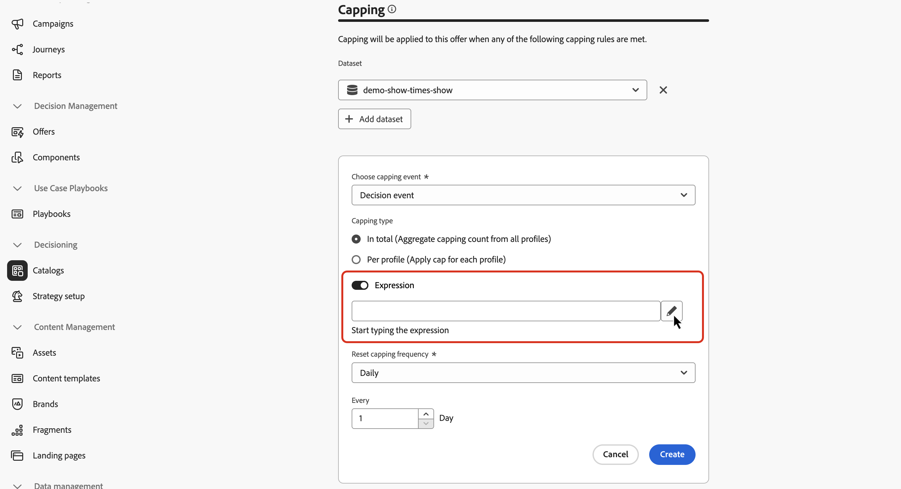

# Skapa ditt första beslutsobjekt {#items}

>[!CONTEXTUALHELP]
>id="ajo_exd_items"
>title="Hantera beslutsobjekt"
>abstract="Med Journey Optimizer kan ni skapa marknadsföringserbjudanden, så kallade beslutsobjekt, som ni kan skapa och ordna i en centraliserad katalog och samlingar. För närvarande konsolideras alla skapade beslutsobjekt i en enda katalog för erbjudanden. Från den här skärmen kan du även komma åt katalogschemat med knappen **Redigera schema** och skapa anpassade attribut för dina beslutsobjekt."

Med Journey Optimizer kan ni skapa marknadsföringserbjudanden, så kallade beslutsobjekt, som ni kan skapa och ordna i en centraliserad katalog och samlingar. De består av standardattribut och anpassade attribut som är anpassade efter just dina behov. Dessutom innehåller de profilbegränsningar som gör att du kan definiera till vilka ett beslutsobjekt kan visas.

Innan du skapar ett beslutsobjekt måste du se till att du har skapat en **beslutsregel** om du vill ange villkor för att avgöra vem beslutsobjektet kan visas för. [Lär dig skapa beslutsregler](rules.md).

Om du vill skapa ett beslutsobjekt går du till **[!UICONTROL Decisioning]** > **[!UICONTROL Catalogs]** och klickar sedan på **[!UICONTROL Create item]**. Följ sedan stegen som beskrivs i avsnitten nedan.

## Definiera beslutsobjektets attribut {#attributes}

>[!CONTEXTUALHELP]
>id="ajo_exd_item_priority"
>title="Definiera beslutsobjektets prioritet"
>abstract="Om en profil kvalificerar för flera artiklar kan prioriteten jämföra det här beslutsobjektet med andra. En högre prioritet ger objektet företräde framför andra."

Börja med att definiera beslutsobjektets standardattribut och anpassade attribut:

1. Ange ett namn och en beskrivning.
1. Ange start- och slutdatum. Posten kommer endast att beaktas av beslutsmotorn inom dessa datum.
1. Ange **[!UICONTROL Priority]** för beslutsobjektet jämfört med andra, om en profil kvalificerar för flera objekt. En högre prioritet ger objektet företräde framför andra.

   >[!NOTE]
   >
   >Prioriteten är en heltalsdatatyp. Alla attribut som är heltalsdatatyper ska innehålla heltalsvärden (inga decimaler).

1. I fältet **Taggar** kan du tilldela enhetliga Adobe Experience Platform-taggar till dina beslutsobjekt. På så sätt kan du enkelt klassificera dem och förbättra sökningen. [Lär dig arbeta med taggar](../start/search-filter-categorize.md#tags)

1. Använd fragment för att lägga till flera innehåll i beslutsobjektet, till exempel om du vill visa olika innehåll för flera mobila enhetsmodeller. [Läs mer om fragment](../content-management/fragments.md)

   >[!AVAILABILITY]
   >
   >Fragment i beslutsobjekt är för närvarande bara tillgängliga för en uppsättning organisationer (begränsad tillgänglighet). Kontakta din Adobe-representant om du vill veta mer.

   I avsnittet **[!UICONTROL Fragments]** markerar du de publicerade fragment som du vill använda och tilldelar dem en referensnyckel. Sedan kan ni utnyttja dessa fragment i er beslutspolicy. [Lär dig hur](use-decision-policy.md#fragments)

   {width=70%}

   Du kan bara markera publicerade fragment och lägga till upp till sex fragment i ett beslutsobjekt.

   >[!WARNING]
   >
   >För närvarande stöds bara [uttrycksfragment](../personalization/use-expression-fragments.md).
   >
   >Kapslade fragment (fragment som refererar till andra fragment) kan inte användas. Beslutsobjektets [godkännande](#approve) misslyckas om du lägger till ett sådant fragment.

1. Ange anpassade attribut (valfritt). Anpassade attribut är specifika attribut som är anpassade efter dina behov och som du kan tilldela till ett beslutsobjekt. De definieras i beslutsobjektens katalogschema. [Lär dig arbeta med kataloger](catalogs.md)

1. När beslutsobjektets attribut har definierats klickar du på **[!UICONTROL Next]**.

## Konfigurera berättigandet för beslutsobjektet {#eligibility}

>[!CONTEXTUALHELP]
>id="ajo_exd_item_constraints"
>title="Lägga till målgrupper eller beslutsregler"
>abstract="Som standard är alla profiler berättigade att ta emot beslutsobjektet, men du kan använda målgrupper eller regler för att begränsa objektet till enbart vissa profiler."

<!--
>"additional-url="https://experienceleague.adobe.com/en/docs/journey-optimizer/using/audiences-profiles-identities/audiences/about-audiences" text="Use audiences"
>additional-url="https://experienceleague.adobe.com/en/docs/journey-optimizer/using/decisioning/experience-decisioning/rules" text="Use decision rules"
-->

Som standard är alla profiler berättigade att ta emot beslutsobjektet, men du kan använda målgrupper eller regler för att begränsa objektet till enbart specifika profiler, båda lösningarna som motsvarar olika användningar. Expandera avsnittet nedan om du vill ha mer information:

+++Använda målgrupper och beslutsregler

En målgrupps utdata är i princip en lista med profiler, medan en beslutsregel är en funktion som körs på begäran mot en enskild profil under beslutsprocessen.

* **Publiker**: Å ena sidan är målgrupper en grupp Adobe Experience Platform-profiler som matchar en viss logik baserat på profilattribut och upplevelsehändelser. Erbjudandehanteringen innebär dock inte att publiken beräknas om, vilket kanske inte är aktuellt när erbjudandet presenteras.

* **Beslutsregler**: Å andra sidan baseras en beslutsregel på data som är tillgängliga i Adobe Experience Platform och avgör till vem ett erbjudande kan visas. När regeln har valts i ett erbjudande eller i ett beslut för en viss placering verkställs den varje gång ett beslut fattas, vilket säkerställer att varje profil får det senaste och bästa erbjudandet.

+++

* Om du vill begränsa presentationen av beslutsobjektet till medlemmar i en eller flera Adobe Experience Platform-målgrupper väljer du alternativet **[!UICONTROL Visitors who fall into one or multiple audiences]**, lägger sedan till en eller flera målgrupper från den vänstra rutan och kombinerar dem med de logiska operatorerna **[!UICONTROL And]** / **[!UICONTROL Or]** . [Läs mer om målgrupper](../audience/about-audiences.md)

* Om du vill koppla en specifik beslutsregel till beslutsobjektet väljer du **[!UICONTROL By rule]** och drar sedan önskad regel från den vänstra rutan till den centrala delen. [Läs mer om beslutsregler](rules.md)

När du väljer målgrupper eller beslutsregler kan du se information om de uppskattade kvalificerade profilerna. Klicka på **[!UICONTROL Refresh]** för att uppdatera data.

>[!NOTE]
>
>Profiluppskattningar är inte tillgängliga när regelparametrar innehåller data som inte finns i profilen, till exempel kontextdata. Exempel: en regel som kräver att det aktuella vädret är ≥80 grader.

## Ange regler för begränsning {#capping}

>[!CONTEXTUALHELP]
>id="ajo_exd_item_capping_expression"
>title="Uttryck"
>abstract="I stället för att använda ett statiskt värde för tröskelvärdet kan du definiera ett eget uttryck. På så sätt kan du beräkna tröskeln dynamiskt med hjälp av beslutsattribut och/eller externa attribut från en Adobe Experience Platform-datauppsättning.  Begränsningsregeln **uttryck** är för närvarande tillgänglig som begränsad tillgänglighet för alla användare. De stöds bara för typen **[!UICONTROL In total]**."

Begränsning används som en begränsning för att definiera det maximala antal gånger som ett erbjudande kan presenteras. Genom att begränsa antalet gånger användarna får specifika erbjudanden kan ni undvika att överdriva era kunder och därmed optimera varje kontaktyta med det bästa erbjudandet. Du kan skapa upp till 10 takbeläggningar för ett visst beslutsobjekt.

>[!NOTE]
>
>
>Det kan ta upp till 3 sekunder att uppdatera värdet för den räknare som används. Anta att du visar en webbanderoll som visar ett erbjudande på din webbplats. Om en viss användare bläddrar till nästa sida på webbplatsen på mindre än 3 sekunder ökas inte räknarvärdet för den användaren.

När du konfigurerar regler för capping kan du referera till attribut som lagras i Adobe Experience Platform datamängder för att definiera tröskelvärden. Om du vill använda en datauppsättning markerar du den i avsnittet **[!UICONTROL Dataset]**.

>[!NOTE]
>
>Den här funktionen är för närvarande tillgänglig som begränsad tillgänglighet för alla användare. Detaljerad information om hur du använder det finns i det här avsnittet: [Använd Adobe Experience Platform-data för beslut](../experience-decisioning/aep-data-exd.md)

Klicka på knappen **[!UICONTROL Create capping]** och följ sedan stegen nedan om du vill ange regler för fästning för beslutsobjektet.

1. Ange vilken **[!UICONTROL Capping event]** som ska beaktas för att öka räknaren.

   * **[!UICONTROL Decision event]** (standardvärde): Maximalt antal gånger ett erbjudande kan presenteras.
   * **[!UICONTROL Impression]** (endast inkommande kanaler): Maximalt antal gånger som erbjudandet kan visas för en användare.
   * **[!UICONTROL Clicks]**: Maximalt antal gånger en användare kan klicka på beslutsobjektet.
   * **[!UICONTROL Custom event]**: Du kan definiera en anpassad händelse som ska användas för att ange hur många gånger objektet ska skickas. Du kan t.ex. sätta ett tak för antalet inlösen tills de blir 10 000 eller tills en viss profil har lösts in 1 gång. Använd [Adobe Experience Platform XDM](https://experienceleague.adobe.com/docs/experience-platform/xdm/home.html?lang=sv){target="_blank"}-scheman för att skapa en anpassad händelseregel.

   >[!NOTE]
   >
   >För alla takthändelser utom beslutshändelser kanske feedback för beslutshanteringen inte samlas in automatiskt, vilket kan leda till att appningsräknaren inte ökas korrekt. För att vara säker på att varje takthändelse spåras och tas med i appningsräknaren måste du se till att schemat som används för att samla in upplevelsehändelser innehåller rätt fältgrupp för den händelsen. Detaljerad information om datainsamling finns i Journey Optimizer beslutsdokumentation:
   >* [Datainsamling för beslutshantering](data-collection/data-collection.md)
   >* [Konfigurera datainsamling](data-collection/schema-requirement.md)

1. Välj typ av begränsning:

   * Välj **[!UICONTROL In total]** om du vill definiera hur många gånger objektet kan föreslås för den kombinerade målgruppen, vilket betyder för alla användare. Om du till exempel är en återförsäljare av elektronikprodukter och har en &quot;TV-affär&quot; vill du att erbjudandet bara ska returneras 200 gånger för alla profiler.

   * Välj **[!UICONTROL Per profile]** om du vill definiera hur många gånger erbjudandet kan föreslås för samma användare. Om du till exempel är en bank med ett Platinum-kreditkortserbjudande vill du inte att erbjudandet ska visas mer än fem gånger per profil. Ni tror faktiskt att om användaren har sett erbjudandet fem gånger och inte har följt det, har de större chans att agera på nästa bästa erbjudande.

1. Definiera gränsvärdet. Om du vill göra det kan du antingen ange ett statiskt värde eller beräkna tröskelvärdet med hjälp av ett uttryck. Expandera avsnitten nedan om du vill ha mer information.

   +++Statiskt tröskelvärde

   I fältet **[!UICONTROL Capping count limit]** anger du hur många gånger erbjudandet kan visas för alla användare eller per profiler, beroende på den valda begränsningstypen. Talet måste vara ett heltal större än 0.

   Du har till exempel definierat en anpassad capping-händelse som antalet utcheckningar som ska beaktas. Om du anger 10 i fältet **[!UICONTROL Capping count limit]** skickas inga fler erbjudanden efter 10 utcheckningar.

   +++

   +++Tröskelvärde för uttryck

   I stället för att använda ett statiskt värde för tröskelvärdet kan du definiera ett eget uttryck. På så sätt kan du beräkna tröskeln dynamiskt med hjälp av beslutsattribut och/eller externa attribut från en Adobe Experience Platform-datauppsättning.

   En markör kan till exempel bestämma sig för att lägga till en multiplikator för att justera exponeringen. De kan t.ex. multiplicera det tillgängliga lagret med två så att erbjudandet kan visas för dubbelt så många kunder som antalet tillgängliga enheter. Detta tillvägagångssätt förutser att inte alla kunder kommer att konvertera, vilket ger bättre räckvidd utan överförsäljning.

   >[!NOTE]
   >
   >Begränsningsregeln **uttryck** är för närvarande tillgänglig som begränsad tillgänglighet för alla användare. De stöds bara för typen **[!UICONTROL In total]**.

   Om du vill använda ett uttryck aktiverar du alternativet **[!UICONTROL Expression]** och redigerar sedan uttrycket efter behov.

   

   +++

1. I listrutan **[!UICONTROL Reset capping frequency]** anger du med vilken frekvens räknaren för fästning ska återställas. Det gör du genom att definiera tidsperioden för inventeringen (varje dag, varje vecka eller varje månad) och ange hur många dagar/veckor/månader du vill ha. Om du till exempel vill att antalet capping ska återställas varannan vecka, väljer du **[!UICONTROL Weekly]** i motsvarande listruta och skriver **&#x200B;**&#x200B;i det andra fältet.

   * Räknaren för frekvensbegränsning återställs kl. **12 UTC**, den dag du definierade eller den första dagen i veckan/månaden, om tillämpligt. Veckostartdagen är **Söndag**. En varaktighet som du väljer får inte vara längre än **2 år** (d.v.s. motsvarande antal månader, veckor eller dagar).

   * När du har publicerat din beslutspost kan du inte ändra tidsperioden (månadsvis, veckovis eller dagligen) som du har valt för frekvensen. Du kan fortfarande redigera frekvensbegränsningen om objektet har statusen **[!UICONTROL Draft]** och aldrig har publicerats tidigare med frekvensbegränsning aktiverad.

   * Det kan finnas en bufferttid på upp till 15 minuter innan händelser räknas mot begränsningar för frekvensbegränsning, antingen när beslutsobjektet godkänns eller när appningen skapas - beroende på vilket som inträffar sist.

1. Klicka på **[!UICONTROL Create]** för att bekräfta skapandet av begränsningsregeln. Du kan skapa upp till 10 regler för ett enskilt beslutsobjekt. Om du vill göra det klickar du på knappen **[!UICONTROL Create capping]** och upprepar stegen ovan.

   

<!--* Identifying how many times a given customer has been shown a decision item. 
If a marketer wants to determine how many times a specific customer has been shown an offer, they can do that. Go to Profiles menu, Attributes tab. You'll see all counter values. The alphanumeric string is associated to the offer. To make the map, go to an item, in the URL check the last alphanumeric strings. D stands for day, w stands for week, m for month. "Ce" custom event-->

## Granska och godkänn beslutsposten {#approve}

1. När du har definierat beslutsobjektets regler för behörighet och begränsning klickar du på **[!UICONTROL Next]** för att granska och spara objektet.

1. Beslutsobjektet visas nu i listan med statusen **[!UICONTROL Draft]**. Klicka på ellipsknappen och välj **[!UICONTROL Approve]** när det är klart att visas för profiler.

   

## Hantera beslutsobjekt {#manage}

I listan över beslutsobjekt kan du redigera ett beslutsobjekt, ändra dess status (**Utkast**, **Godkänt**, **Arkiverat**), duplicera eller ta bort det.

Om du vill ändra ett beslutsobjekt öppnar du det, gör ändringarna och sparar det.

Om du väljer ett beslutsobjekt eller klickar på ellipsknappen aktiveras de åtgärder som beskrivs nedan.

* **[!UICONTROL Approve]**: Anger beslutsobjektets status till Godkänd.
* **[!UICONTROL Undo approve]**: Anger beslutsobjektets status tillbaka till **[!UICONTROL Draft]**.
* **[!UICONTROL Duplicate]**: Skapar ett beslutsobjekt med identiska attribut och begränsningar. Som standard har det nya objektet statusen **[!UICONTROL Draft]**.
* **[!UICONTROL Delete]**: Tar bort beslutsobjektet från listan.

  >[!IMPORTANT]
  >
  >När den tagits bort är beslutsobjektet och dess innehåll inte längre tillgängliga. Det går inte att ångra den här åtgärden.

  Godkända erbjudandeartiklar kan inte tas bort om de används i en samling eller ett beslut. Om du vill ta bort dem ändrar du deras status till Utkast. Om du vill göra det klickar du på ellipsknappen och väljer **[!UICONTROL Undo approve]**.

  

* **[!UICONTROL Archive]**: Anger beslutsobjektets status till **[!UICONTROL Archived]**. Beslutsobjektet är fortfarande tillgängligt från listan, men du kan inte återställa dess status till **[!UICONTROL Draft]** eller **[!UICONTROL Approved]**. Du kan bara duplicera eller ta bort den.

