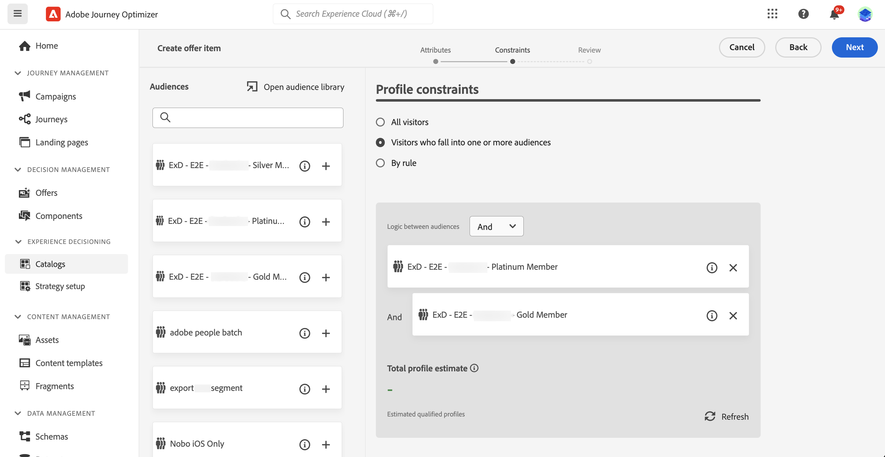
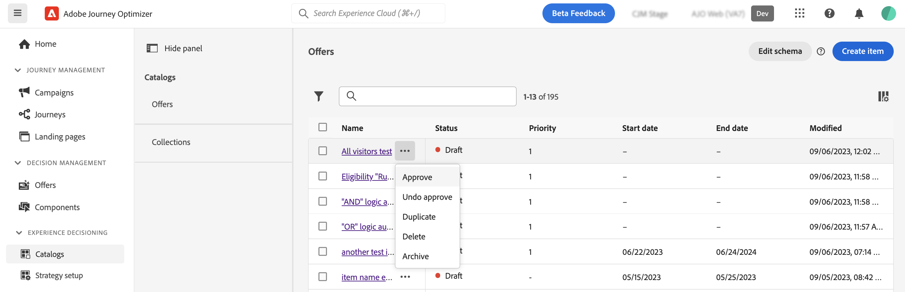

# Create your first decision item {#items}

>[!CONTEXTUALHELP]
>id="ajo_exd_items"
>title="Manage decision items"
>abstract="Journey Optimizer allows you to create marketing offers, known as decision items, that you can create and organize into a centralized catalog and collections. Currently, all created decision items are consolidated within a single &quot;Offers&quot; catalog. ****"
>additional-url="https://experienceleague.adobe.com/docs/journey-optimizer/using/decisioning/experience-decisioning/decision-items/catalogs.html" text="Configure the item catalog"

Med Journey Optimizer kan ni skapa marknadsföringserbjudanden, så kallade beslutsobjekt, som ni kan skapa och ordna i en centraliserad katalog och samlingar. De består av standardattribut och anpassade attribut som är anpassade efter just dina behov. Dessutom innehåller de profilbegränsningar som gör att du kan definiera till vilka ett beslutsobjekt kan visas.

Innan du skapar ett beslutsobjekt måste du se till att du har skapat en **beslutsregel** om du vill ange villkor för att avgöra vem beslutsobjektet kan visas för. [Lär dig skapa beslutsregler](rules.md).

Om du vill skapa ett beslutsobjekt går du till **[!UICONTROL Decisioning]** > **[!UICONTROL  Catalogs]** och klickar sedan på **[!UICONTROL Create item]**. Följ sedan stegen som beskrivs i avsnitten nedan.

## Definiera beslutsobjektets attribut {#attributes}

>[!CONTEXTUALHELP]
>id="ajo_exd_item_priority"
>title="Define the decision item&#39;s priority"
>abstract="If a profile qualifies for multiple items, the priority enables to compare this decision item to others. A higher priority grants the item precedence over others."

>[!CONTEXTUALHELP]
>id="ajo_exd_item_custom_attributes"
>title="Define the custom attributes"
>abstract="Anpassade attribut är specifika attribut som är anpassade efter dina behov och som du kan tilldela till ett beslutsobjekt. They are created in the decision items&#39; catalog schema. Det här avsnittet visas bara om du har lagt till minst ett anpassat attribut i katalogschemat."
>additional-url="https://experienceleague.adobe.com/docs/journey-optimizer/using/decisioning/experience-decisioning/decision-items/catalogs.html" text="Configure the item catalog"

Start by defining the decision item&#39;s standard and custom attributes :

1. Provide a name and a description.
1. Ange start- och slutdatum. Posten kommer endast att beaktas av beslutsmotorn inom dessa datum.
1. **[!UICONTROL Priority]** A higher priority grants the item precedence over others.
1. **** This allows you to easily classify them and improve search. 

   >[!NOTE]
   >
   >The priority is an integer data type. All attributes that are integer data types should contain integer values (no decimals).

1. Specify custom attributes (optional). Anpassade attribut är specifika attribut som är anpassade efter dina behov och som du kan tilldela till ett beslutsobjekt. De definieras i beslutsobjektens katalogschema. [Lär dig arbeta med kataloger](catalogs.md)

1. **[!UICONTROL Next]**

## Configure the decision item&#39;s eligibility {#eligibility}

>[!CONTEXTUALHELP]
>id="ajo_exd_item_constraints"
>title="Add audiences or decision rules"
>abstract="By default, all profiles are eligible to receive the decision item, but you can use audiences or rules to restrict the item to specific profiles only."
>additional-url="https://experienceleague.adobe.com/docs/journey-optimizer/using/audiences-profiles-identities/audiences/about-audiences.html" text="Använda målgrupper"
>additional-url="https://experienceleague.adobe.com/docs/journey-optimizer/using/decisioning/experience-decisioning/selection/rules.html" text="Använd beslutsregler"

Som standard är alla profiler berättigade att ta emot beslutsobjektet, men du kan använda målgrupper eller regler för att begränsa objektet till enbart specifika profiler, båda lösningarna som motsvarar olika användningar. Expandera avsnittet nedan om du vill ha mer information:

+++Using audiences vs decisiong rules

Basically, the output of an audience is a list of profiles, whereas a decision rule is a function executed on demand against a single profile during the decisioning process.

* **** However, Offer Management does not recompute the audience, which may not be up-to-date when presenting the offer.

* **** Once selected in an offer or a decision for a given placement, the rule is executed every single time a decision is made, which ensures that each profile gets the latest and the best offer.

+++

* **[!UICONTROL Visitors who fall into one or multiple audiences]****[!UICONTROL And]****[!UICONTROL Or]** [Läs mer om målgrupper](../audience/about-audiences.md).

* Om du vill koppla en specifik beslutsregel till beslutsobjektet väljer du **[!UICONTROL By rule]** och drar sedan önskad regel från den vänstra rutan till den centrala delen. [Läs mer om beslutsregler](rules.md).

När du väljer målgrupper eller beslutsregler kan du se information om de uppskattade kvalificerade profilerna. Klicka på **[!UICONTROL Refresh]** för att uppdatera data.

>[!NOTE]
>
>Profile estimates are unavailable when rule parameters include data not in the profile such as context data. For example, an eligibility rule that requires the current weather to be ≥80 degrees.

## Ange regler för begränsning {#capping}

Begränsning används som en begränsning för att definiera det maximala antal gånger ett erbjudande kan presenteras. Genom att begränsa antalet gånger användarna får specifika erbjudanden kan ni undvika att överdriva era kunder och därmed optimera varje kontaktyta med det bästa erbjudandet. Du kan skapa upp till 10 takbeläggningar för ett visst beslutsobjekt.

>[!NOTE]
>
>
>Det kan ta upp till 3 sekunder att uppdatera värdet för den räknare som används. Anta att du visar en webbanderoll som visar ett erbjudande på din webbplats. Om en viss användare bläddrar till nästa sida på webbplatsen på mindre än 3 sekunder ökas inte räknarvärdet för den användaren.

**[!UICONTROL Create capping]**

1. **[!UICONTROL Capping event]**

   * **[!UICONTROL Decision event]**
   * **[!UICONTROL Impression]**
   * **[!UICONTROL Clicks]**
   * **[!UICONTROL Custom event]** For example, you can cap on the number of redemptions until they equal 10000, or until a given profile has redeemed 1 time. {target="_blank"}

   >[!NOTE]
   >
   >For all capping events except decision event, the decision management feedback may not be automatically collected, which could result in the capping counter not being correctly incremented. To make sure each capping event is tracked and accounted for in the capping counter, ensure that the schema used to collect experience events includes the correct field group for that event. Detailed information on data collection is available in Journey Optimizer Decision management documentation:
   >* 
   >* 

1. Välj typ av begränsning:

   * Välj **[!UICONTROL In total]** om du vill definiera hur många gånger objektet kan föreslås för den kombinerade målgruppen, vilket betyder för alla användare. Om du till exempel är en återförsäljare av elektronikprodukter och har en &quot;TV-affär&quot; vill du att erbjudandet bara ska returneras 200 gånger för alla profiler.

   * Välj **[!UICONTROL Per profile]** om du vill definiera hur många gånger erbjudandet kan föreslås för samma användare. Om du till exempel är en bank med ett Platinum-kreditkortserbjudande vill du inte att det här erbjudandet ska visas mer än fem gånger per profil. Ni tror faktiskt att om användaren har sett erbjudandet fem gånger och inte har följt det, har de större chans att agera på nästa bästa erbjudande.

1. I fältet **[!UICONTROL Capping count limit]** anger du hur många gånger erbjudandet kan visas för alla användare eller per profiler, beroende på den valda begränsningstypen. Talet måste vara ett heltal större än 0.

   For example, you defined a custom capping event such as the number of checkouts is taken into account. **[!UICONTROL Capping count limit]**

1. **[!UICONTROL Reset capping frequency]** To do this, define the time period for the counting (daily, weekly or monthly) and enter the number of days/weeks/months of your choice. **[!UICONTROL Weekly]******

   >[!NOTE]
   >
   >Räknaren för frekvensbegränsning återställs kl. **12 UTC**, den dag du definierade eller den första dagen i veckan/månaden, om tillämpligt. Veckostartdagen är **Söndag**. En varaktighet som du väljer får inte vara längre än **2 år** (d.v.s. motsvarande antal månader, veckor eller dagar).
   >
   >After publishing your decision item, you will not be able to change the time period (monthly, weekly or daily) you selected for the frequency. **[!UICONTROL Draft]**

1. **[!UICONTROL Create]** You can create up to 10 rules for a single decision item. **[!UICONTROL Create capping]**

   

1. När du har definierat beslutsobjektets regler för behörighet och begränsning klickar du på **[!UICONTROL Next]** för att granska och spara objektet.

1. Beslutsobjektet visas nu i listan med statusen **[!UICONTROL Draft]**. **[!UICONTROL Approve]**

   

<!--* Identifying how many times a given customer has been shown a decision item. 
If a marketer wants to determine how many times a specific customer has been shown an offer, they can do that. Go to Profiles menu, Attributes tab. You'll see all counter values. The alphanumeric string is associated to the offer. To make the map, go to an item, in the URL check the last alphanumeric strings. D stands for day, w stands for week, m for month. "Ce" custom event-->

## Manage decision items {#manage}

************

To modify a decision item, open it, make your modifications and save it.

Selecting a decision item or clicking the ellipsis button enables the actions described below.

* **[!UICONTROL Approve]**
* **[!UICONTROL Undo approve]**: Anger beslutsobjektets status tillbaka till **[!UICONTROL Draft]**.
* **[!UICONTROL Duplicate]** **[!UICONTROL Draft]**
* **[!UICONTROL Delete]**

  >[!IMPORTANT]
  >
  >Once deleted, the decision item and its content are not accessible anymore. This action cannot be undone. If the decision item is used in a collection or a decision, it cannot be deleted. Du måste ta bort beslutsobjektet från alla objekt först.

* **[!UICONTROL Archive]****[!UICONTROL Archived]** **[!UICONTROL Draft]****[!UICONTROL Approved]** You can only duplicate or delete it.
