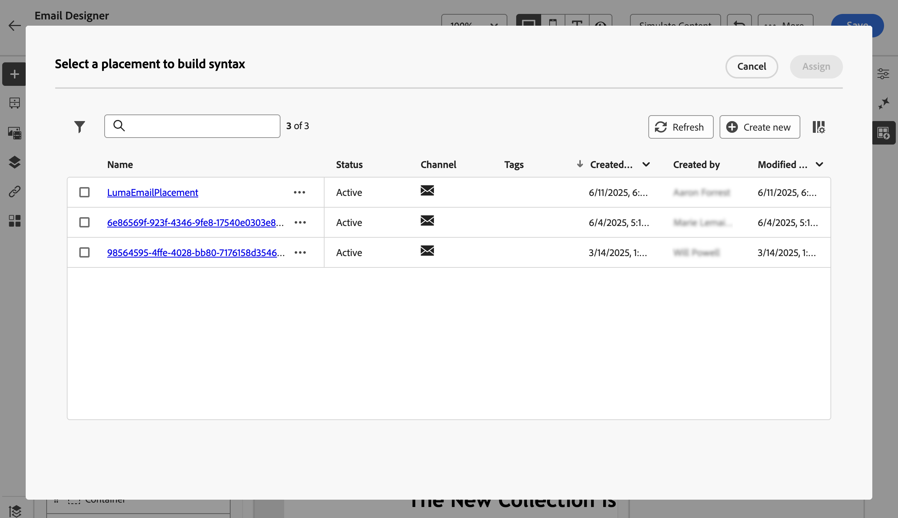

# Arbeta med placeringar {#create-decision}

## Om placeringar {#about}

En placering är en behållare som används för att visa beslutsobjekt. Det hjälper er att se till att rätt erbjudandeinnehåll visas på rätt plats i ert budskap.

När du lägger till en beslutsprincip i ett e-postmeddelande måste du associera en placering till komponenten som visar de returnerade beslutsobjekten. På så sätt kan du till exempel spåra resultat av beslutsobjekt på olika platser i rapporter.

Listan med placeringar finns på menyn **[!UICONTROL Strategy setup]**. Det finns filter som hjälper dig att hämta placeringar enligt en viss kanalyta eller taggar.

>[!NOTE]
>
>För närvarande är placeringar bara tillgängliga för e-postkanalen.

## Skapa en placering {#create}

Så här skapar du en placering:

1. Bläddra till menyn **[!UICONTROL Strategy setup]**, markera **[!UICONTROL Email]** och klicka på knappen **[!UICONTROL Create placement]**.

   Du kan också skapa en placering direkt från e-postdesignern när du lägger till en beslutspolicy. [Lär dig hur du associerar en placering till en e-postkomponent](../experience-decisioning/create-decision.md#save)

1. Definiera placeringens egenskaper:

   

   * **[!UICONTROL Name]**: Placeringens namn. Se till att definiera ett beskrivande namn så att det blir enklare att hämta det.
   * **[!UICONTROL Description]**: En beskrivning av placeringen.
   * **[!UICONTROL Tags]**: Tilldela enhetliga Adobe Experience Platform-taggar till placeringen. På så sätt kan du enkelt klassificera dem och förbättra sökningen. [Lär dig arbeta med taggar](../start/search-filter-categorize.md#tags)
   * **[!UICONTROL Channel]**: Den kanal som placeringen ska användas för. För närvarande finns det bara e-postmeddelanden som kan användas som ersättning.
   * **[!UICONTROL Channel configuration]**: Associera en kanalkonfiguration med placeringen. [Lär dig hur du konfigurerar kanalkonfigurationer](../configuration/channel-surfaces.md).

1. Klicka på **[!UICONTROL Create]**.

När placeringen har skapats visas den i placeringslistan när du lägger till en beslutsprincip i ett e-postmeddelande. Du kan markera den för att visa dess egenskaper och redigera den. [Lär dig hur du skapar beslutsprofiler](../experience-decisioning/create-decision.md)

