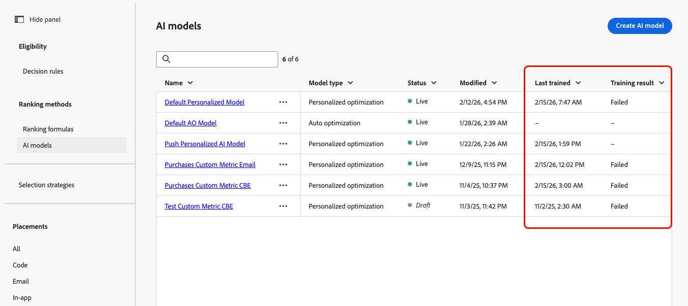
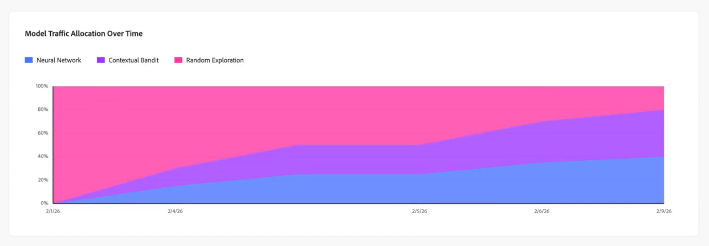
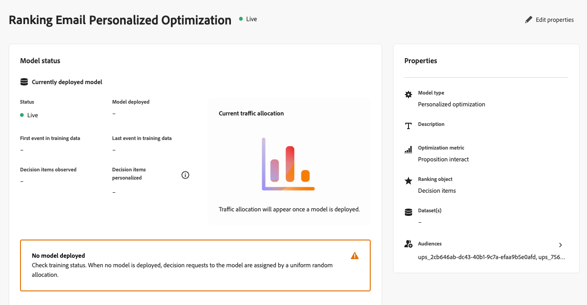
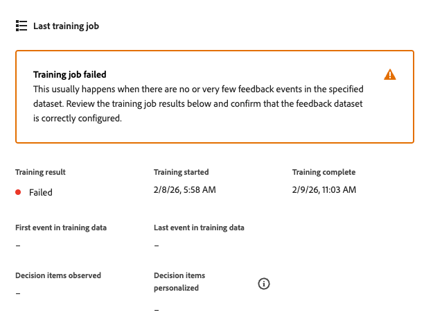

# Övervaka dina AI-modeller {#ai-model-observability}

Oavsett om du är marknadsförare, datavetare eller beslutsadministratör kan du med förståelse för hur era personaliserade optimeringsmodeller fungerar och fungerar hjälpa er att välja de bästa erbjudandena för varje kund med hjälp av AI.

Det gör du genom att övervaka hälsa, utbildningsstatus och utveckling för dina AI-modeller direkt i [!DNL Journey Optimizer].

Detta ger dig en tydlig bild av om din modell fungerar, när den senast tränades, vad som hände under utbildningen, hur den påverkar ditt affärsresultat (till exempel konverteringar eller intäkter) och felsöker när den inte fungerar <!-- (for example, unexpected decision item count, training data date range, or insufficient events)-->.

>[!AVAILABILITY]
>
>Den här funktionen stöds för närvarande endast för [personaliserade optimeringsmodeller](personalized-optimization-model.md).

➡️ [Upptäck den här funktionen i en video](#video)

## Visa utbildningsstatus {#from-ai-model-list}

När en modell är inställd på att vara aktiv går den in i en pågående livscykel: data samlas in och modellen omutbildas regelbundet för att optimera offerternas rankning. Du kan kontrollera utbildningsstatusen för dina personaliserade optimeringsmodeller i AI-modelllistan.

1. Gå till **[!UICONTROL Decisioning]** > **[!UICONTROL Strategy setup]** > **[!UICONTROL AI models]** för att öppna AI-modellagret.

1. Du kan visa alla tillgängliga AI-modeller och deras status.

1. För varje **[!UICONTROL Live]** AI-modell av den anpassade optimeringstypen kan du se två kolumner:
   * när det senaste utbildningsjobbet kördes (**[!UICONTROL Last trained]**), och
   * om varje modell har tränats eller inte (**[!UICONTROL Training result]**).

   

   På så sätt kan du snabbt identifiera modeller som behöver undersökas ytterligare eller felsökas.

## Åtkomst till en modellstatusrapport {#access-ai-model-details}

Klicka på en personlig AI-optimeringsmodell i listan. Därifrån kan du visa elementen som listas nedan:

* **[!UICONTROL Currently deployed model]** - I det här avsnittet visas den modell som distribuerats för närvarande, när den distribuerades, vilket datumintervall med data som används, hur många beslutsobjekt (erbjudanden) som inkluderas och personaliseras samt den aktuella trafikallokeringen mellan delmodeller <!-- (random exploration, new offer booster?, contextual bandit, neural network)-->.

  

  I det här exemplet har modellen utbildats på fem beslutsposter och modellen har tillräckligt med trafik för att utveckla personaliserade prognoser för tre av beslutsposterna. De återstående två beslutsposterna delges på måfå.

  Ni kan också se att modellen för närvarande tilldelar 40 % av trafiken till det personaliserade neurala nätverket, 40 % av trafiken till kontextuell bandit och 20 % av trafiken till slumpmässig prospektering.

* **[!UICONTROL Last training job]** - I det här avsnittet visas status för det senaste utbildningsjobbet, när det kördes, och eventuella felmeddelanden. [Läs mer om feltillstånd](#check-for-error-states)

  

  I det här exemplet kan du se att den distribuerade modellen matchar utbildningsjobbet som förväntat.

* **[!UICONTROL Properties]** - I det här avsnittet visas modellens egenskaper, t.ex. vilken datauppsättning som används, optimeringsmåttet och vilka målgrupper som används för att utbilda den personaliserade optimeringsmodellen.

  

  Klicka på **[!UICONTROL Edit properties]** om du vill ändra de här elementen. Du omdirigeras till skärmen Skapa AI-modell. [Läs mer](create-ai-models.md)

* **[!DNL Model performance]** - I det här avsnittet visas prestanda för varje del av modellen över tid, t.ex. trafikallokering och konverteringsgrad för varje delmodell. Du kan växla mellan de **senaste 7 dagarna** och de **senaste 30 dagarna**. Lyftet och den statistiska betydelsen är de viktigaste indikatorerna på om modellen faktiskt förbättrar ert marknadsföringsresultat.

  

  I det här exemplet ser du att de personaliserade undermodellerna under de senaste 30 dagarna har ökat konverteringsgraden med mer än 60 %, och den här höjningen är statistiskt signifikant, vilket innebär att den här AI-modellen påverkar verksamheten.

* **[!UICONTROL Model traffic allocation over time]** - I det här avsnittet visas hur modellen har utvecklats över tid. När en modell distribueras för första gången är 100 % av trafiken slumpvis eftersom inga erbjudandedata har samlats in ännu. Efter den första omskolningen rör sig trafiken vanligen mot de personaliserade armarna.

  

  I det här exemplet ser du att trafiktilldelningen har växlat från 100 % slumpvis utforskande till neuralnätverk och kontextuell bandit-trafik när modellen omutbildades över tid.

## Förstå utbildningsfel {#check-for-error-states}

Följ stegen nedan om du vill visa felinformation för en anpassad optimerings-AI-modell vars senaste utbildningsjobb misslyckades.

1. Klicka på modellen i listan. Modellstatusinformationen visas.

   {width="95%"}

   I det här exemplet ser du att ingen modell distribueras eftersom det senaste utbildningsjobbet misslyckades.

   >[!NOTE]
   >
   >Om ingen modell används hanteras beslutsbegäranden med enhetlig, slumpmässig trafikallokering.

1. Gå igenom felinformationen i avsnittet **[!UICONTROL Last training job]**.

   {width="70%"}

   Ett utbildningsjobb misslyckas vanligtvis när det inte finns några feedbackhändelser i datauppsättningen som du valde för den här modellen. Det innebär att du måste fylla i datauppsättningen eller välja en ny datauppsättning med lämpliga konverteringshändelser.

1. Du kan kontrollera vilken datauppsättning som har valts i modellens **[!UICONTROL Properties]**. Klicka på **[!UICONTROL Edit properties]** om du vill välja en annan datauppsättning. [Läs mer](create-ai-models.md)

   {align="left" width="45%"}

## Vanliga frågor och svar {#faq}

+++ Vilka AI-modeller kan jag övervaka?

AI-modellövervakning stöds för närvarande endast för [personaliserade optimeringsmodeller](personalized-optimization-model.md). Andra typer av rangordningsmodeller visar ännu inte modellstatusrapporten.
+++

+++ Varför misslyckades min modells utbildningsjobb?

Utbildningsjobb misslyckas ofta när den datauppsättning som valts för modellen inte har några eller mycket få återkoppling (konvertering)-händelser. Kontrollera felinformationen i avsnittet **[!UICONTROL Last training job]** och kontrollera sedan modellens **[!UICONTROL Properties]** för att bekräfta datauppsättningen och optimeringsmåttet. Fyll i datauppsättningen med rätt händelser eller [välj en annan datauppsättning](create-ai-models.md) med rätt konverteringsdata.
+++

+++ Hur hör övervakning av AI-modeller ihop med kampanjer och reserapporter?

Övervakning av AI-modell skiljer sig från kampanj- eller reserapportering. En enda AI-modell kan användas för flera kampanjer eller flera resor, och kampanjrapporter eller reserapporter visar inte vilken modell som användes för en viss leverans. Använd statusövervakningen av AI-modellen för att förstå och övervaka själva modellen. Använd [kampanjrapporter](../../reports/campaign-global-report-cja.md) och [reserapporter](../../reports/journey-global-report-cja.md) för leveransnivåstatistik.
+++

+++ Min optimeringsmetod är ett kontinuerligt mått, som intäkt eller ordervärde, och inte ett binärt mått, som klick eller konverteringar. Hur tolkar jag rapporterade konverteringar och konverteringsgrader?

När man använder ett kontinuerligt mätvärde som intäkt eller ordervärde försöker modellen förutsäga det uppskattade värdet som är kopplat till presentationen av ett visst erbjudande (inte sannolikheten för konvertering). Det rapporterade&quot;konverteringsvärdet&quot; är den totala intäkten (eller ordervärdet) som är kopplad till det registrerade erbjudandet för varje modellarm. Den rapporterade konverteringsgraden är konverteringsvärdet dividerat med visningsvärdet och kan överstiga 100 % vid kontinuerliga mätvärden.
+++

+++ Vad är Lyft betydelse?

Lyftets betydelse är den statistiska betydelsen av den rapporterade lyften jämfört med slumpmässig undersökning. Betydelsen beräknas med ett Chi-quared-test av proportionella skillnader, vilket ger ett identiskt resultat jämfört med signifikansberäkningen för ett Z-test för två populationsproportioner.
+++

+++ Vad är modellen Gini-index? Vad är ett&quot;bra&quot; värde för Gini-index?

Modellen Gini-index (även kallat Gini-koefficient) är ett offlinemått för en modells prediktiva styrka. Modellens Gini-index varierar från 0 (ingen prediktiv kraft) till 1 (exakt förutser konverteringen eller mätvärdet för varje erbjudande för varje kund). Det finns inget universellt&quot;bra&quot; Gini-indexvärde, eftersom olika typer av beslutsanvändning leder till olika användarbeteenden och därmed olika modellresultat. I samma fall visar högre Gini-indexvärden en modell med högre kvalitet.
+++

+++ Hur beräknas Gini-indexet?

Gini-indexvärdet för varje modellarm beräknas på olika sätt beroende på om optimeringsmåttet är binärt eller kontinuerligt:

**Binärt optimeringsmått** (t.ex. klick, order): Gini-indexet beräknas baserat på ytan under kurvan (AUC) för den mottagande operatorns kurva (ROC), som vanligtvis kallas ROC AUC eller AUC för kort. AUC för ROC varierar från 0,5 (slumpmodell utan prediktiv effekt) till 1,0 (perfekt prediktiv effekt). AUC för ROC konverteras till ett Gini-index med formeln Gini = 2 x (ROC AUC) - 1.

**Kontinuerligt optimeringsmått** (t.ex. intäkt, ordervärde): Gini-indexet beräknas baserat på det område under Lorenz-kurvan som är associerat med modellens kumulativa förväntade positiva värden jämfört med de kumulativa verkliga positiva värdena i populationen. Området under Lorenzos-kurvan varierar från 0,0 (perfekt prediktiv effekt) till 0,5 (slumpmässig modell utan prediktiv effekt). Lorenz AUC konverteras till ett Gini- index med formeln Gini = 1 - 2 x (Lorenz AUC).
+++

+++ Vilket är ett bättre mått på modellkvalitet: Gini-index eller Lyft/Lyft-betydelse?

Vanligtvis anses onlinemått av modellkvalitet, t.ex. lyft och lyft, vara &quot;guldstandardmetoden&quot; för att mäta modellens kvalitet. Gini-index rapporteras som en extra datapunkt för kunddatavetenskap som utvärderar beslutsmodeller.
+++

<!--
## Understanding statuses and errors {#statuses-errors}

* **Success** – The latest training job completed successfully. The model is trained and deployed for ranking.
* **Failed** – The latest training job failed (for example, no events in the datasets). The UI shows an error message and a request ID; use these when troubleshooting or contacting support.
* **In progress** – A training job is running. Some metrics may be temporarily unavailable until it finishes.
* **Pending** – No result yet (for example, model recently activated or settings recently changed).

If no model has been successfully deployed yet, the "currently deployed model" section and some performance fields will be empty or show the initial-state messaging.-->

## Instruktionsvideo {#video}

Lär dig övervaka dina AI-rankningsmodeller och tolka utbildningsstatus och prestanda i [!DNL Journey Optimizer].

>[!VIDEO](https://video.tv.adobe.com/v/3479849?quality=12)

## Relaterad dokumentation {#related}

* [Om AI-modeller](ai-models.md)
* [Anpassad optimeringsmodell](personalized-optimization-model.md)
* [Skapa AI-modeller](create-ai-models.md)
* [Skapa en datauppsättning för att samla in händelser](../data-collection/create-dataset.md)
