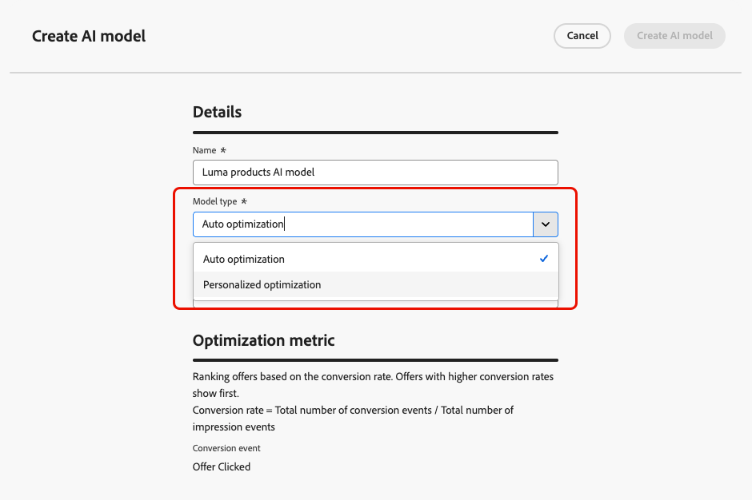

# Skapa AI-modeller {#create-ai-models}

Med [!DNL Journey Optimizer] kan du skapa **AI-modeller** för att rangordna erbjudanden baserat på dina affärsmål.

>[!CAUTION]
>
>Om du vill skapa, redigera eller ta bort AI-modeller måste du ha behörigheten **Hantera rankningsstrategier**. [Läs mer](../../administration/high-low-permissions.md#manage-ranking-strategies)

## Skapa en AI-modell {#create-ranking-strategy}

>[!CONTEXTUALHELP]
>id="ajo_exd_ai_model_metric"
>title="Optimeringsmått"
>abstract="[!DNL Journey Optimizer] rangordnade erbjudanden baserat på **konverteringsgrad** (konverteringsgrad = totalt antal konverteringshändelser/totalt antal inställningshändelser). Konverteringsgraden beräknas med två typer av mätvärden: **Impression-händelser** (erbjudanden som visas) och **Conversion-händelser** (erbjudanden som resulterar i klick via e-post eller webben). Dessa händelser spelas in automatiskt med Web SDK eller Mobile SDK som medföljer."

Så här skapar du en AI-modell:

1. Skapa en datauppsättning där konverteringshändelser samlas in. [Lär dig hur](../data-collection/create-dataset.md)

1. Navigera till menyn **[!UICONTROL Decisioning]** > **[!UICONTROL Strategy setup]** och välj **[!UICONTROL AI models]**.

   

   Alla AI-modeller som har skapats hittills visas.

1. Klicka på knappen **[!UICONTROL Create AI model]**.

1. Ange ett unikt namn och vid behov en beskrivning för AI-modellen.

1. Välj den typ av AI-modell som du vill skapa:

   * **[!UICONTROL Auto-optimization]** optimerar erbjudanden baserat på tidigare erbjudanden. [Läs mer](auto-optimization-model.md)
   * **[!UICONTROL Personalized optimization]** optimerar och personaliserar erbjudanden baserat på målgrupper och erbjuder prestanda. [Läs mer](personalized-optimization-model.md)

   

1. Avsnittet **[!UICONTROL Optimization metric]** innehåller information om konverteringshändelsen som används av AI-modellen för att beräkna offerternas rankning.

   [!DNL Journey Optimizer] rangordnade erbjudanden baserat på **konverteringsgrad** (konverteringsgrad = totalt antal konverteringshändelser/totalt antal inställningshändelser). Konverteringsgraden beräknas med hjälp av två typer av mätvärden:
   * **Impression-händelser** (erbjudanden som visas)
   * **Konverteringshändelser** (erbjudanden som resulterar i klickningar via e-post eller webben).

   Dessa händelser spelas in automatiskt med Web SDK eller Mobile SDK som medföljer. Läs mer i översikten för [Adobe Experience Platform Web SDK](https://experienceleague.adobe.com/docs/experience-platform/edge/home.html?lang=sv-SE).

   +++ Optimera modeller på anpassade [!DNL Customer Journey Analytics]-mått

   >[!NOTE]
   >
   >Den här funktionen är bara tillgänglig för [!DNL Customer Journey Analytics]-kunder med administratörsbehörighet.
   >
   >Innan du börjar bör du kontrollera att du har integrerat Journey Optimizer med Customer Journey Analytics för att exportera Journey Optimizer-datauppsättningar till standarddatavyer. [Lär dig utnyttja [!DNL Journey Optmizer] data i [!DNL Customer Journey Analytics]](../../reports/cja-ajo.md)

   **[!UICONTROL Personalized optimization]**-modeller är en typ av AI-modell som gör att du kan definiera affärsmål och använda kunddata för att utbilda affärsorienterade modeller för att leverera personaliserade erbjudanden och maximera nyckeltal.

   Som standard använder personaliserade optimeringsmodeller **erbjudandeklick** som optimeringsmått. Om du arbetar med [!DNL Customer Journey Analytics] kan du med [!DNL Decisioning] utnyttja dina egna anpassade mått för att optimera din modell.

   Det gör du genom att välja modelltypen **[!UICONTROL Personalized optimization]** och expandera listrutan **[!UICONTROL Conversion event]**. Alla mätvärden från din standardvy för [!DNL Customer Journey Analytics] [data](https://experienceleague.adobe.com/sv/docs/analytics-platform/using/cja-dataviews/data-views){target="_blank"} visas i listan. Välj det mätvärde som du vill optimera modellen på.

   {width=85%}

   >[!NOTE]
   >
   >Som standard använder måtten i [!DNL Customer Journey Analytics] en attribueringsmodell med&quot;sista handen&quot;, som tilldelar 100 % av krediten till kontaktytan som inträffar senast före konverteringen.
   >
   >Även om det går att ändra attribueringsmodellen är inte alla attribueringsmodeller idealiska för optimering av AI-modeller. Vi rekommenderar att du väljer en attribueringsmodell som är anpassad efter dina optimeringsmål för att säkerställa att modellen är korrekt och fungerar korrekt.
   >
   >Mer information om tillgängliga attribueringsmodeller och riktlinjer för hur de används finns i [[!DNL Customer Journey Analytics] dokumentationen](https://experienceleague.adobe.com/sv/docs/analytics-platform/using/cja-dataviews/component-settings/attribution){target="_blank"}

   +++

1. Välj den eller de datauppsättningar där konverterings- och inställningshändelser samlas in. Lär dig hur du skapar sådana datauppsättningar i [det här avsnittet](../data-collection/create-dataset.md).

   {width=85%}

   >[!CAUTION]
   >
   >Endast datauppsättningar som skapats från scheman som är kopplade till fältgruppen **[!UICONTROL Experience Event - Proposition Interactions]** (som tidigare kallades mixin) visas i listrutan.

1. Om du skapar en **[!UICONTROL Personalized optimization]** AI-modell väljer du de segment som ska användas för att utbilda AI-modellen.

   <!--➡️ [Discover this feature in video](#video)-->

   >[!NOTE]
   >
   >Du kan välja upp till fem målgrupper.

1. Spara och aktivera AI-modellen.

<!--At this point, you must have:

* created the AI model,
* defined which type of event you want to capture - offer displayed (impression) and/or offer clicked (conversion),
* and in which dataset you want to collect the event data.-->

Varje gång ett erbjudande visas och/eller klickas vill du att motsvarande händelse ska hämtas automatiskt av fältgruppen **[!UICONTROL Experience Event - Proposition Interactions]** med [Adobe Experience Platform Web SDK](https://experienceleague.adobe.com/docs/experience-platform/edge/web-sdk-faq.html?lang=sv-SE#what-is-adobe-experience-platform-web-sdk%3F){target="_blank"} eller Mobile SDK.

För att kunna skicka i händelsetyper (erbjudandet visas eller erbjudandet klickas) måste du ange rätt värde för varje händelsetyp i en upplevelsehändelse som skickas till Adobe Experience Platform. [Lär dig hur](../data-collection/schema-requirement.md)

<!--
## How-to video {#video}

Learn how to create a personalized optimization model and how to apply it to a decision.

>[!VIDEO](https://video.tv.adobe.com/v/3419954?quality=12)-->
