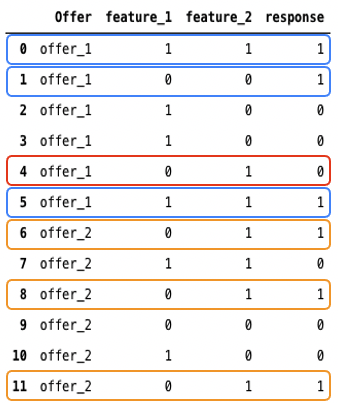

# Anpassad optimeringsmodell {#personalized-optimization-model}

## Översikt {#overview}

Genom att utnyttja den senaste tekniken inom maskininlärning och djupinlärning under övervakning kan en företagsanvändare (marknadsförare) med personaliserad optimering definiera affärsmål och använda sina kunddata för att utbilda affärsorienterade modeller för att leverera personaliserade erbjudanden och maximera nyckeltal.

<!---->

## Krav för datauppsättning

För att utbilda en personaliserad optimeringsmodell måste datauppsättningen uppfylla följande minimikrav:

* Minst 2 erbjudanden i datauppsättningen måste ha minst 250 visningshändelser och 25 lyckade händelser (till exempel klick eller konverteringar) under de senaste 30 dagarna.
* Erbjudanden med färre än 250 displayer och/eller 25 lyckade händelser under de senaste 30 dagarna kan inkluderas i personaliserad trafik, men behandlas enligt personaliseringsmodellen som att de presterar på samma nivå som det värsta poängtalet* tills de överskrider detta tröskelvärde.
* Erbjudanden med färre än 250 bildskärmar och/eller 25 framgångsrika händelser under de senaste 30 dagarna kan även fortsättningsvis inkluderas i utforskningstrafiken.

Tills första gången en personaliserad optimeringsmodell tränas kommer erbjudanden inom en urvalsstrategi som använder en personaliserad optimeringsmodell att erbjudas slumpvis.

## Antaganden och begränsningar för nyckelmodeller {#key}

För att maximera fördelarna med att använda personaliserad optimering finns det vissa viktiga antaganden och begränsningar som man bör känna till.

* **Erbjudandena är tillräckligt olika så att användarna får olika inställningar bland erbjudandena i fråga**. Om erbjudandena är för lika kommer en resulterande modell att få mindre effekt eftersom svaren verkar vara slumpmässiga.
Om en bank t.ex. har två kreditkort med den enda skillnaden att vara färg, spelar det ingen roll vilket kort som rekommenderas, men om varje kort har olika villkor, ger detta en logisk grund för varför vissa kunder skulle välja ett och ger tillräckligt stor skillnad mellan erbjudandena för att skapa en mer slagkraftig modell.
* **Kompositionen för användartrafik är stabil**. Om användartrafikens sammansättning ändras dramatiskt under modellutbildning och -prediktion kan modellens prestanda försämras. Anta till exempel att det i modellutbildningsfasen bara finns data för användare i målgrupp A, men den tränade modellen används för att generera prognoser för användare i målgrupp B, och att modellens prestanda kan påverkas.
* **Prestanda för erbjudanden ändras inte dramatiskt under en kort tidsperiod** eftersom den här modellen uppdateras varje vecka och prestandaändringar visas när modellen uppdateras. En produkt var till exempel mycket populär tidigare, men i en offentlig rapport identifieras produkten som skadlig för vår hälsa och den här produkten blir ovanligt snabb. I det här scenariot kan modellen fortsätta att förutsäga den här produkten tills modellen uppdateras med ändringar i användarbeteendet.

## Så här fungerar det {#how}

Modellen lär sig komplexa funktionsinteraktioner mellan erbjudanden, användarinformation och sammanhangsbaserad information för att rekommendera personaliserade erbjudanden till slutanvändare. Funktioner är indata i modellen.

Det finns tre typer av funktioner:

| Funktionstyper | Så här lägger du till funktioner i modeller |
|--------------|----------------------------|
| Beslutsobjekt (placementID, activityID, DecisionScopeID) | Ingår i beslutsledningens feedback Experience Events skickas till AEP |
| Målgrupper | 0-50 målgrupper kan läggas till som funktioner när du skapar AI-modellen för rankning |
| Kontextdata | En del av beslutsfeedback Experience Events skickas till AEP. Tillgängliga kontextdata att lägga till i schemat: Commerce Details, Channel Details, Application Details, Web Details, Environment Details, Device Details, placeContext |

Modellen har två faser:

* I **offlinemodellutbildningsfasen** har en modell utbildats genom inlärning och minnesanvändning av funktionsinteraktioner i historiska data.
* I **onlinekonferensfasen** rangordnas kandidater baserat på resultat i realtid som genereras av modellen. Till skillnad från traditionell filtreringsteknik för samarbete, som är svår att inkludera funktioner för användare och erbjudanden, är personaliserad optimering en djupgående inlärningsbaserad rekommendationsmetod och kan inkludera och lära sig komplexa och icke-linjära interaktionsmönster.

Här är ett förenklat exempel som illustrerar grundtanken bakom personaliserad optimering. Anta att vi har en datauppsättning som lagrar historiska interaktioner mellan användare och erbjudanden, vilket visas i bild 1. Det finns:

* Två erbjudanden, offer_1 och offer_2,
* Två funktioner, feature_1 och feature_2,
* En svarskolumn.

Värdet för feature_1, feature_2 och response är antingen 0 eller 1. När vi tittar på de blå och orange rutorna i bild 1 ser vi att för offer_1 är det troligare att svaren är 1 när feature_1 och feature_2 har samma värden, medan för offer_2 är etiketterna troligare 1 när feature_1 är 0 och feature_2 är 1. Vi kan också se att offer_1 används i den röda rutan när feature_1 är 0 och feature_2 är 1, och svaret är 0. Baserat på mönstret vi ser i orange rutor är offer_2 förmodligen bättre när feature_1 är 0 och feature_2 är 1.

Det handlar i princip om att lära sig och memorera historiska funktionsinteraktioner och använda dem för att generera personaliserade prognoser.

## Problem med kallstart {#cold-start}

Problem med kallstart uppstår när det inte finns tillräckligt med data för att kunna rekommendera. Det finns två typer av kallstartsproblem för personaliserad optimering.

* **När du har skapat en ny AI-modell utan historiska data**, kommer erbjudanden att skickas slumpmässigt under en tidsperiod för att samla in data, och data kommer att användas för att utbilda den första modellen.
* **När den första modellen har släppts** tilldelas 10 % av den totala trafiken slumpvis, medan 90 % av trafiken kommer att användas för modellrekommendationer. Om nya erbjudanden läggs till i AI-modellen skulle de därför levereras som en del av 10 % av trafiken. De data som samlas in för dessa erbjudanden avgör hur många gånger de väljs ut bland 90 % av trafiken när modellen fortsätter att uppdateras.

## Omskolning {#re-training}

Modellerna kommer att omutbildas för att lära sig de senaste funktionsinteraktionerna och minska prestandaförsämringen varje vecka.
