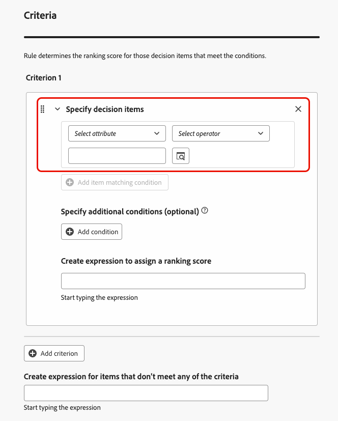
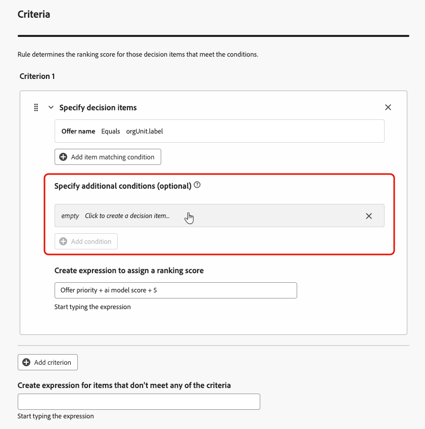
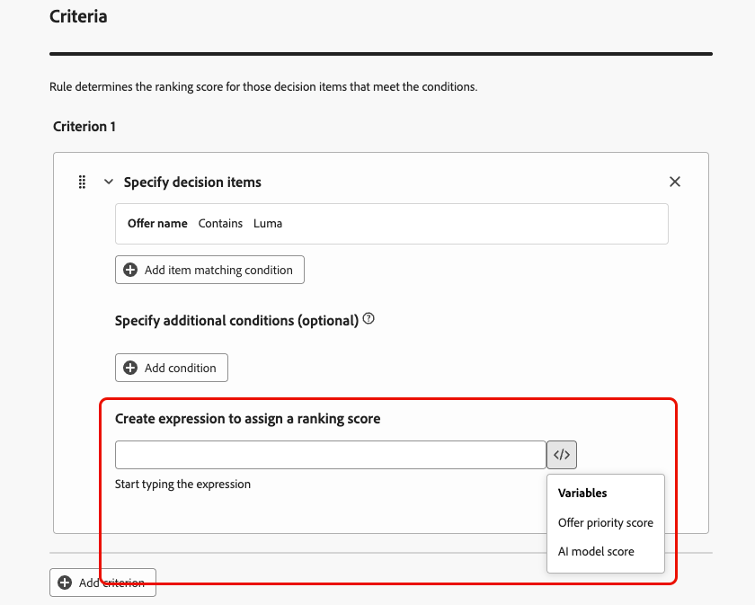

# Använda AI-formelverktyget {#create-ranking-formulas}

**Rankningsformler** gör att du kan definiera regler som avgör vilket erbjudande som ska presenteras först, i stället för att ta hänsyn till prioritetspoängen.

Om du vill skapa de här reglerna ger formelverktyget för AI i **[!UICONTROL Adobe Journey Optimizer]** större flexibilitet och kontroll över hur erbjudanden rangordnas. I stället för att förlita dig på en statisk erbjudandeprioritet kan du nu definiera anpassade rankningsformler som kombinerar AI-modellpoäng, erbjudandeprioriteringar, profilattribut, erbjudandeattribut och sammanhangsbaserade signaler via ett guidat gränssnitt.

Med den här metoden kan ni dynamiskt justera offertrankningen baserat på valfri kombination av AI-driven benägenhet, affärsvärde och realtidskontext, vilket gör det enklare att anpassa beslut efter både marknadsföringsmål och kundbehov. AI-formelverktyget har stöd för enkla eller avancerade formler beroende på hur mycket kontroll du vill använda.

När en rankningsformel har skapats kan du tilldela den till en [urvalsstrategi](../selection-strategies.md). Om flera erbjudanden kan presenteras när den här urvalsstrategin används, kommer beslutsmotorn att använda den valda formeln för att beräkna vilket erbjudande som ska levereras först.

## Skapa en rankningsformel {#create-ranking-formula}

>[!CONTEXTUALHELP]
>id="ajo_exd_config_formulas"
>title="Skapa rankningsformler"
>abstract="Med formler kan du definiera regler som avgör vilken beslutspost som ska presenteras först, i stället för att ta hänsyn till posternas prioritetspoäng. När en rankningsformel har skapats kan du tilldela den till en urvalsstrategi."

Följ stegen nedan för att skapa en rankningsformel.

1. Gå till menyn **[!UICONTROL Strategy setup]** och välj sedan fliken **[!UICONTROL Ranking formulas]**. Listan med formler som skapats tidigare visas.

   

1. Klicka på **[!UICONTROL Create formula]**.

1. Ange formelnamnet och lägg till en beskrivning om du vill.

   {width="80%"}

1. Du kan också klicka på **[!UICONTROL Select AI model]** för att ange den modell som ska användas som referens för att skapa din rankningsformel.

   >[!NOTE]
   >
   >[Personaliserade optimeringsmodeller](personalized-optimization-model.md) som använder kontinuerliga mått stöds inte med formelverktyget för AI.

   Varje gång du refererar till en modellpoäng när du definierar formeln nedan används den AI-modell som du valde.

   >[!CAUTION]
   >
   >När du använder en AI-modell som ingår i en rankningsformel återspeglas inte data i rapporten [Konverteringsgrad för Holdout och Modellstyrd trafik](../../reports/campaign-global-report-cja-code.md#conversion-rate).

1. Definiera villkoren som avgör rangordningsgraden för de matchande beslutsobjekten. Du kan antingen

   * fylla i avsnittet **[!UICONTROL Criteria]** från [användargränssnittet](#ranking-select-criteria),
   * eller växla till [kodredigeraren](#ranking-code-editor).

   >[!NOTE]
   >
   >Inkapslingsdjupet i en rankningsformel är begränsat till 30 nivåer. Detta mäts genom att räkna de `)` avslutande parenteserna i PQL-strängen. En regelsträng kan vara upp till 8 kB för UTF-8-kodade tecken. Detta motsvarar 8 000 ASCII-tecken (1 byte vardera), eller 2 000-4 000 icke-ASCII-tecken (2-4 byte vardera). [Läs mer om hur du bestämmer dig för skyddsprofiler och begränsningar](../decisioning-guardrails.md#ranking-formulas)

1. Ni kan också använda data från Adobe Experience Platform för att dynamiskt justera rankningslogiken så att den speglar de verkliga förhållandena. Detta är särskilt användbart för attribut som ändras ofta, t.ex. produkttillgänglighet eller realtidspriser.

   Den här funktionen är för närvarande tillgänglig för alla kunder som en betaversion. Kontakta din kontorepresentant om du vill ha tillgång till tjänsten. [Lär dig använda Adobe Experience Platform-data för beslut](../aep-data-exd.md)

<!--## Select an ELS dataset {#els-dataset}

Journey Optimizer allows you to leverage data from Adobe Experience Platform. [Learn more](../data/aep-data-perso.md)

To leverage data from an AEP dataset, follow the steps below.

1. From the **[!UICONTROL ELS settings]** section, select an ELS dataset from the list.

1. Select a decision attribute.

    >[!NOTE]
    >
    >This action is mandatory.

{width="80%"-->

## Definiera villkor med formelverktyget {#ranking-select-criteria}

Med ett intuitivt gränssnitt kan du finjustera besluten genom att justera AI-poängen (benägenhet), erbjudandevärdet (prioritet), sammanhangsbaserade hävstångseffekter och egenskaper för externa profiler - individuellt eller i kombination - för att optimera varje interaktion. <!--Whether you are maximizing revenue, promoting strategic offers, or balancing business goals with real-time context, the formula builder gives you total control in defining ranking strategies.-->

Följ stegen nedan för att definiera villkor direkt från gränssnittet.

<!--{width="80%"}-->

1. I avsnittet **[!UICONTROL Criterion 1]** anger du vilka beslutsobjekt du vill tillämpa ett rangordningsresultat på genom att göra följande:
   * välj ett [beslutsobjektattribut](../items.md#attributes),
   * välja en logisk operator,
   * lägg till ett matchande villkor - du kan antingen ange ett värde eller välja ett profilattribut eller [kontextdata](../context-data.md).

   {width="70%"}

1. Om du vill kan du ange ytterligare element för att förfina matchningsvillkoren så att villkoren blir sanna.

   {width="80%"}

   Du har t.ex. definierat kriterium 1, t.ex. det anpassade attributet *Väder* *Lika med* villkoret *varm*. Dessutom kan du lägga till ytterligare ett villkor, till exempel om det första villkoret är uppfyllt och om temperaturen överskrider 75 grader vid tidpunkten för begäran, är villkor 1 sant.<!--Add a screenshot with the example-->

1. Skapa ett uttryck som tilldelar ett rangordningsbetyg till beslutsobjekten som uppfyller villkoret ovan. Du kan referera till något av följande:

   * poängen som kom från AI-modellen som du valfritt valde i **[!UICONTROL Details]** section [above](#create-ranking-formula);
   * beslutsobjektets prioritet, som är ett värde som tilldelas manuellt när [ett beslutsobjekt skapas](../items.md#attributes); <!--If a profile qualifies for multiple decision items, a higher priority grants the item precedence over others.-->
   * Alla attribut som kan finnas i profilen, t.ex. eventuella externt härledda benägenhetspoäng.
   * ett statiskt värde som du kan tilldela i ett kostnadsfritt format,
   * en kombination av samtliga ovanstående.

   {width="70%"}

   >[!NOTE]
   >
   >Klicka på ikonen bredvid fältet för att lägga till fördefinierade variabler.

1. Klicka på **[!UICONTROL Add criterion]** om du vill lägga till ett eller flera villkor så många gånger som behövs. Logiken är följande:
   * Om det första kriteriet är sant för en viss beslutspost har den företräde framför de nästa.
   * Om det inte är sant, går beslutsmotorn vidare till det andra kriteriet och så vidare.

1. I det sista fältet kan du skapa ett uttryck som tilldelas alla beslutsobjekt som inte uppfyller ovanstående villkor.

   {width="70%"}

1. Klicka på **[!UICONTROL Create]** för att slutföra din rankningsformel. Du kan nu markera den i listan för att visa information om den och redigera eller ta bort den. Den är klar att användas i en [urvalsstrategi](../selection-strategies.md) för att rangordna kvalificerade beslutsartiklar.

### Exempel på rangordningsformel

Se exemplet nedan:

{width="80%"}

Om beslutsobjektets region (anpassat attribut) är lika med profilens geografiska etikett (profilattribut), kommer rankningspoängen som uttrycks här (som är en kombination av beslutsobjektsprioriteten, AI-modellpoängen och ett statiskt värde) att tillämpas på alla beslutsposter som uppfyller det villkoret.

## Använda kodredigeraren {#ranking-code-editor}

Om du vill uttrycka rankningsformler i **PQL-syntax** växlar du till kodredigeraren med den dedikerade knappen längst upp till höger på skärmen. Mer information om hur du använder PQL-syntaxen finns i [dedikerad dokumentation](https://experienceleague.adobe.com/docs/experience-platform/segmentation/pql/overview.html?lang=sv-SE).

>[!CAUTION]
>
>Den här åtgärden förhindrar att du återgår till standardvyn för verktyget för den här formeln.

Du kan sedan utnyttja profilattribut, [kontextdata](../context-data.md) och [beslutsobjektattribut](../items.md#attributes).

Du vill till exempel prioritera alla erbjudanden med attributet&quot;hot&quot; om vädret är varmt. För att göra detta skickades **contextData.wall=hot** i beslutsanropet. <!--[Learn how to work with context data](context-data.md)-->

{width="80%"}

>[!IMPORTANT]
>
>När du skapar en rankningsformel stöds inte att titta tillbaka till en tidigare tidsperiod, som att lägga till en upplevelsehändelse som inträffade under den sista månaden som en del av formeln. Alla försök att inkludera en uppslagsperiod när formeln skapas kommer att utlösa ett fel när den sparas.

Om du vill använda attribut som hör till dina beslutsobjekt i formler måste du följa rätt syntax i rankningsformelns kod. Expandera varje avsnitt för mer information:

+++Utnyttja standardattribut för beslutsartiklar


+++

+++Utnyttja anpassade attribut för beslutsartiklar


+++

### Exempel på rankningsformel för PQL {#ranking-formula-examples}

Du kan skapa många olika rankningsformler efter behov. Nedan finns några exempel.

+++Öka erbjudanden med vissa attribut baserade på profilattribut

Om profilen finns i den stad som motsvarar erbjudandet fördubblas prioriteten för alla erbjudanden i den staden.

**Rankningsformel:**

```
if( offer.characteristics.get("city") = homeAddress.city, offer.rank.priority * 2, offer.rank.priority)
```

+++

+++Förbättra erbjudanden där slutdatumet är mindre än 24 timmar från och med nu

**Rankningsformel:**

```
if( offer.selectionConstraint.endDate occurs <= 24 hours after now, offer.rank.priority * 3, offer.rank.priority)
```

+++

+++Öka erbjudandena baserat på kundernas benägenhet att köpa den produkt som erbjuds

Ni kan höja poängen för ett erbjudande baserat på kundens benägenhetspoäng.

I det här exemplet är instanstenanten *_salesvelocity* och profilschemat innehåller ett intervall med poäng lagrade i en array:


Med detta i åtanke för en profil som:

```
{"_salesvelocity": {"individualScoring": [
                    {"core": {
                            "category":"insurance",
                            "propensityScore": 96.9
                        }},
                    {"core": {
                            "category":"personalLoan",
                            "propensityScore": 45.3
                        }},
                    {"core": {
                            "category":"creditCard",
                            "propensityScore": 78.1
                        }}
                    ]}
}
```

+++

+++Öka erbjudandena baserat på en profils postnummer och årsinkomst

I det här exemplet försöker systemet alltid att visa ett ZIP-matchningserbjudande först, och återgår till ett allmänt erbjudande om ingen matchning hittas, så att erbjudanden som är avsedda för andra ZIP-koder inte visas.

```pql
if( offer._luma.offerDetails.zipCode = _luma.zipCode,luma.annualIncome / 1000 + 10000, if( not offer.luma.offerDetails.zipCode,_luma.annualIncome / 1000, -9999) )
```

Vad formeln gör:

* Om erbjudandet har samma ZIP-kod som användaren ger det ett mycket högt poäng så att det plockas först.
* Om erbjudandet inte innehåller någon postnummer alls (det är ett allmänt erbjudande), ger du det en normal poäng baserad på användarens intäkter.
* Om erbjudandet har en annan ZIP-kod än användaren kan du ge det en mycket låg poäng så att det inte väljs.

+++

+++Öka erbjudanden baserat på kontextdata

Med [!DNL Journey Optimizer] kan du öka vissa erbjudanden baserat på de kontextdata som skickas i anropet. Om till exempel `contextData.weather=hot` skickas måste prioriteten för alla erbjudanden med `attribute=hot` öka.

>[!NOTE]
>
>Mer information om hur du skickar kontextdata <!-- using the **Edge Decisioning** and **Decisioning** APIs--> finns i [det här avsnittet](../context-data.md).

Observera att när du använder API:t **Decisioning** läggs kontextdata till i profilelementet i begärandetexten, som i exemplet nedan:

```
"xdm:profiles": [
{
    "xdm:identityMap": {
        "crmid": [
            {
            "xdm:id": "CRMID1"
            }
        ]
    },
    "xdm:contextData": [
        {
            "@type":"_xdm.context.additionalParameters;version=1",
            "xdm:data":{
                "xdm:weather":"hot"
            }
        }
    ]
    
}],
```

+++
