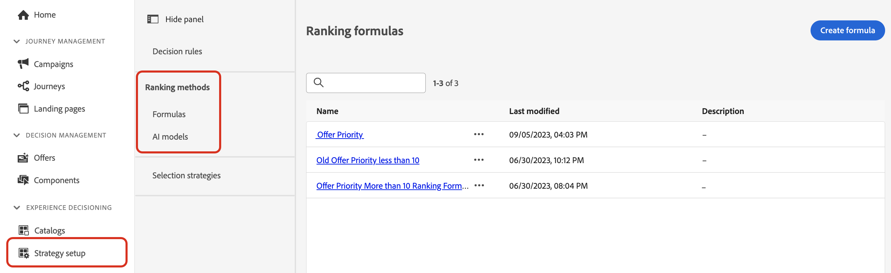

# Rankningsmetoder {#rankings}

Med rangordningsmetoder kan du rangordna objekt som ska visas för en viss profil. När en rangordningsmetod har skapats kan du tilldela den till en urvalsstrategi för att definiera vilka objekt som ska väljas först.

Det finns två sorteringsmetoder:

* **Med formler** kan du definiera regler som avgör vilket objekt som ska presenteras först, i stället för att ta hänsyn till objektets prioritetspoäng.

* **AI-modeller** gör att du kan använda tränade modellsystem som utnyttjar flera datapunkter för att avgöra vilket objekt som ska presenteras först.

## Skapa rangordningsmetoder {#create}

Så här skapar du en rangordningsmetod:

1. Navigera till menyn **[!UICONTROL Strategy setup]** och välj sedan menyn **[!UICONTROL Formulas]** eller **[!UICONTROL AI models]** beroende på vilken typ av rankning du vill använda.

   

1. Klicka på knappen **[!UICONTROL Create formula]** eller **[!UICONTROL Create AI model]** i skärmens övre högra hörn.

   Detaljerad information om hur du skapar rankningsformler och AI-modeller finns i följande avsnitt:

   * [Rankningsformler](ranking-formulas.md)
   * [AI-modeller](ai-models.md)

1. Konfigurera formeln eller AI-modellen så att den passar dina behov och spara den sedan.

Din rangordningsmetod är nu klar att användas i en [urvalsstrategi](../selection-strategies.md) för att rangordna kvalificerade beslutsartiklar.

