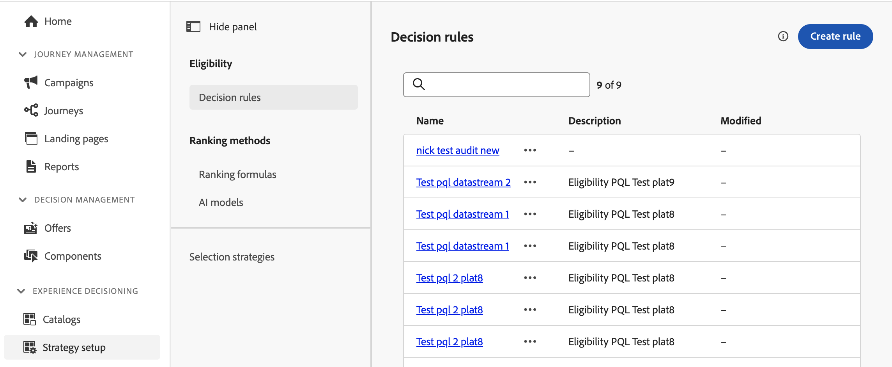

# Beslutsregler {#rules}

>[!BEGINSHADEBOX]

Vad du hittar i den här handboken:

* [Kom igång med Experience Decision](gs-experience-decisioning.md)
* Hantera dina beslutsobjekt
   * [Konfigurera objektkatalogen](catalogs.md)
   * [Skapa beslutsobjekt](items.md)
   * [Hantera artikelsamlingar](collections.md)
* Konfigurera val av objekt
   * **[Skapa beslutsregler](rules.md)**
   * [Skapa rangordningsmetoder](ranking.md)
* [Skapa urvalsstrategier](selection-strategies.md)
* [Skapa beslutsprofiler](create-decision.md)

>[!ENDSHADEBOX]

Med beslutsregler kan ni definiera målgruppen för beslutsposter genom att tillämpa begränsningar, antingen direkt på beslutspostnivå eller inom en viss urvalsstrategi. På så sätt kan du exakt kontrollera vilka objekt som ska presenteras för vem.

Låt oss titta på ett scenario där du har beslutsposter med Yoga-relaterade produkter som utformats för kvinnor. Med beslutsregler kan du ange att de här objekten bara ska visas för profiler vars kön är &quot;kvinna&quot; och som har angett &quot;punkt för intresse&quot; i &quot;Yoga&quot;.

Förutom beslutsregler på artikel- och urvalsstrateginivå kan ni också skapa ytterligare parametrar för den avsedda målgruppen på kampanjnivå. [Läs mer](../campaigns/create-campaign.md)

Listan över beslutsregler finns i **[!UICONTROL Configuration]** / **[!UICONTROL Decisions rules]** -menyn.

<!---->

>[!IMPORTANT]
>
>För närvarande hanteras beslutsregler med Journey Optimizer **Beslutsledning** -menyn. Resultatet blev att **[!UICONTROL Decision rules]** listan i Experience Decision omfattar regler som skapats från båda Journey Optimizer **[!UICONTROL Decision Management]** eller **[!UICONTROL Experience Decisioning]** menyer.

Så här skapar du en samling:

1. Navigera till **[!UICONTROL Configuration]** / **[!UICONTROL Decision rules]**.
1. Journey Optimizer gränssnitt för beslutshantering visas centralt. Följ de steg som beskrivs i [Beslutsfattardokumentation](../offers/offer-library/creating-decision-rules.md) för att bygga upp er regel utifrån era behov.

1. När regeln har skapats visas den i listan och är tillgänglig för användning i beslutsposter och urvalsstrategier som styr presentationen av beslutsposter i profiler.
