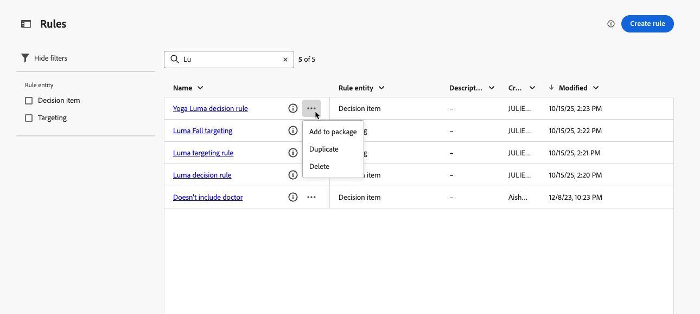
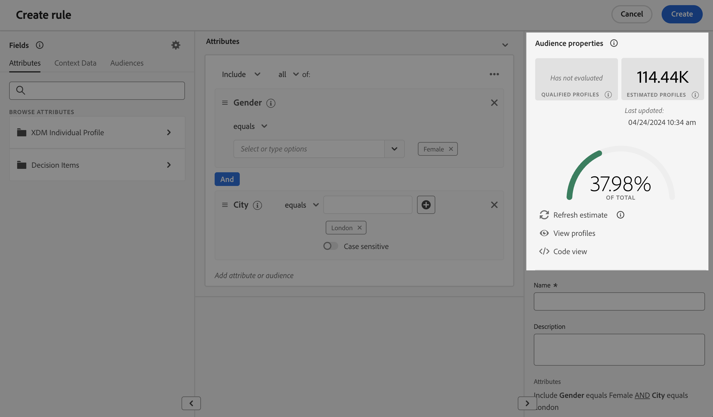

# Skapa regler {#rules}

>[!CONTEXTUALHELP]
>id="ajo_exd_config_rules"
>title="Skapa regler"
>abstract="Du kan skapa två typer av regler: **beslutsregler** som kan användas i beslutsobjekt eller urvalsstrategier, för att styra vilka objekt som ska presenteras för vilken målgrupp, eller **målgruppsregler** för att fastställa specifika målgruppssegment som kan ta emot anpassat innehåll, eller för att ange en specifik kundresa.  När du skapar en beslutsregel kan du välja **[!UICONTROL Enable dataset lookup]** om du vill använda Adobe Experience Platform-data. På så sätt kan ni definiera berättigandekriterier baserat på dynamiska, externa attribut och säkerställa att beslutsobjekten bara visas när det är relevant."

## Om regler {#about}

I [!DNL Journey Optimizer] kan du skapa två typer av återanvändbara regler:

* [Beslutsregler](#decision-rules)
* [Riktningsregler](#targeting-rules)

### Beslutsregler {#decision-rules}

Med beslutsregler kan ni definiera målgruppen för beslutsposter genom att tillämpa begränsningar, antingen direkt på beslutspostnivå eller inom en viss urvalsstrategi. På så sätt kan du exakt kontrollera vilka objekt som ska presenteras för vem.

Låt oss titta på ett scenario där du har beslutsposter med Yoga-relaterade produkter som utformats för kvinnor. Med beslutsregler kan du ange att de här objekten endast ska visas för profiler vars kön är &quot;kvinna&quot; och som har angett &quot;punkt för intresse&quot; i &quot;Yoga&quot;.

>[!NOTE]
>
>Förutom beslutsregler på artikel- och urvalsstrateginivå kan ni också definiera er avsedda målgrupp på kampanjnivå. [Läs mer](../campaigns/create-campaign.md#audience)

### Riktningsregler {#targeting-rules}

>[!AVAILABILITY]
>
>Målreglerna är för närvarande begränsade. Kontakta din Adobe-representant för att få åtkomst.
>
>Observera att den här funktionen bara är tillgänglig för organisationer som har köpt tillägget **Decisioning**. Den kommer att successivt lanseras för alla kunder.

Målgruppsreglerna gör det möjligt att fastställa specifika kvalifikationer som måste uppfyllas för att en kund ska vara berättigad att ta emot personaliserat innehåll eller att ange en specifik resa baserat på specifika målgruppssegment, vilket gör att ni kan inrikta er på undermålgrupper på era resor och kampanjer.

Många gånger är de en kombination av flera attribut, utöver kundbeteendehändelser och kontextdata. För att spara tid och arbete kan ni skapa regler för målinriktning en gång och återanvända dem på alla era resor och i alla kampanjer, med möjlighet att snabbt ändra dem infogade vid redigeringstillfället.

Du kan använda dessa regler:

* När du skapar [innehållsoptimering med &#x200B;](../content-management/optimization-targeting.md) som mål på resor eller kampanjer,
* När [optimering av kundresan](../building-journeys/optimize.md#targeting) skapas.

➡️ [Upptäck den här funktionen i en video](#video)

## Åtkomstregler {#access}

Regellistan är tillgänglig på menyn **[!UICONTROL Decisioning]** > **[!UICONTROL Strategy setup]**.

Följande åtgärder är tillgängliga:

* Du kan filtrera på regelentiteten (**[!UICONTROL Decision item]** eller **[!UICONTROL Targeting]** - [Läs mer](#about)).

* Markera en regel genom att klicka på dess namn och redigera den med regelverktyget. [Lär dig hur](#create)

* Från knappen **[!UICONTROL More actions]** bredvid varje objekt kan du:

   * Om du markerade entiteten **[!UICONTROL Decision item]** lägger du till regeln i ett paket för att exportera den till en annan sandlåda. Lär dig hur du [exporterar objekt till en annan sandlåda](../configuration/copy-objects-to-sandbox.md).
   * Duplicera en regel.
   * Ta bort en regel.

{width=100%}

* Klicka på ikonen **[!UICONTROL More info]** för att visa formeln som utgör regeln.

{width=60%}

## Skapa en regel {#create}

Så här skapar du en regel:

1. Navigera till **[!UICONTROL Decisioning]** > **[!UICONTROL Strategy setup]** > **[!UICONTROL Rules]** och klicka sedan på knappen **[!UICONTROL Create rule]**.

1. Välj regelentiteten för att ange vilken typ av objekt regeln skapas för.

   {width=90%}

   * **[!UICONTROL Decision item]** - Regeln kan tillämpas på ett [beslutsobjekt](#decision-rules) i samband med beslut;
   * **[!UICONTROL Targeting]** - Regeln kan användas när [målinriktningsregler](#targeting-rules) skapas, antingen som en del av [innehållsoptimeringen](../content-management/optimization-targeting.md) i en kampanj eller en resa, antingen i [Optimera reseaktiviteten](../building-journeys/optimize.md#targeting).

1. Om du skapar en **[!UICONTROL Decision item]**-regel kan du välja **[!UICONTROL Enable dataset lookup]** för att använda data från Adobe Experience Platform för att berika din beslutslogik med externa data. Detta är särskilt användbart för attribut som ändras ofta, t.ex. produkttillgänglighet eller realtidspriser.

   >[!AVAILABILITY]
   >
   >Den här funktionen är för närvarande tillgänglig för alla kunder som en betaversion. Kontakta din kontorepresentant om du vill ha tillgång till tjänsten. [Lär dig använda Adobe Experience Platform-data för beslut](../experience-decisioning/aep-data-exd.md)

1. Skärmen för att skapa regler öppnas. Ge regeln ett namn och ange en beskrivning.

1. Bygg upp regeln efter behov med Adobe Experience Platform Segment Builder. Om du vill göra det kan du utnyttja olika datakällor, till exempel:
   * Profilattribut.
   * Attribut för beslutsobjekt - endast tillgängligt när en **[!UICONTROL Decision item]**-regel skapas.
   * Målgrupper;
   * Kontextdata från Adobe Experience Platform. [Lär dig hur du använder kontextdata](context-data.md)

   {width=85%}

   >[!NOTE]
   >
   >Segment Builder som tillhandahålls för att skapa regler har vissa särdrag jämfört med den som används med Adobe Experience Platform Segmentation Service. Den globala processen som beskrivs i dokumentationen är dock giltig för att skapa regler i [!DNL Journey Optimizer]. [Lär dig hur du skapar segmentdefinitioner](../audience/creating-a-segment-definition.md)

1. När du lägger till och konfigurerar nya fält på arbetsytan visas information om de beräknade profilerna som tillhör målgruppen i rutan **[!UICONTROL Audience properties]**. Klicka på **[!UICONTROL Refresh estimate]** för att uppdatera data.

   {width=85%}

   >[!NOTE]
   >
   >Profiluppskattningar är inte tillgängliga när regelparametrarna innehåller data som inte är lagrade i profilen, till exempel kontextdata.

1. När regeln är klar klickar du på **[!UICONTROL Create]**. Den skapade regeln visas i listan och är tillgänglig för användning enligt enheten som du skapade:

   * I **beslutsobjekt** och **urvalsstrategier** som styr presentationen av beslutsobjekt till profiler;
   * Eller när du skapar **mål** i innehållsoptimering eller sökvägsoptimering.

>[!NOTE]
>
>Inkapslingsdjupet i en regel är begränsat till 30 nivåer. Detta mäts genom att räkna de avslutande parenteserna `)` i PQL-strängen.
>
>En regelsträng kan vara upp till 15 kB för UTF-8-kodade tecken. Detta motsvarar 15 000 ASCII-tecken (1 byte vardera), eller 3 750-7 500 icke-ASCII-tecken (2-4 byte vardera).
>
>[Läs mer om reglerna för behörighet, riktlinjer och begränsningar](decisioning-guardrails.md#eligibility-rules)

## Instruktionsvideo {#video}

Lär dig hur du skapar, duplicerar och tillämpar återanvändbara **målinriktningsregler** i Adobe Journey Optimizer för att effektivt personalisera kampanjer baserat på kundattribut som region, språk och beteende, vilket sparar tid samtidigt som målgruppens precision förbättras.

>[!VIDEO](https://video.tv.adobe.com/v/3476131/?captions=swe&quality=12)
