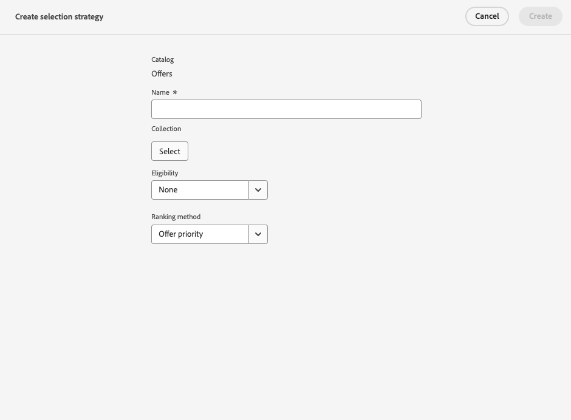
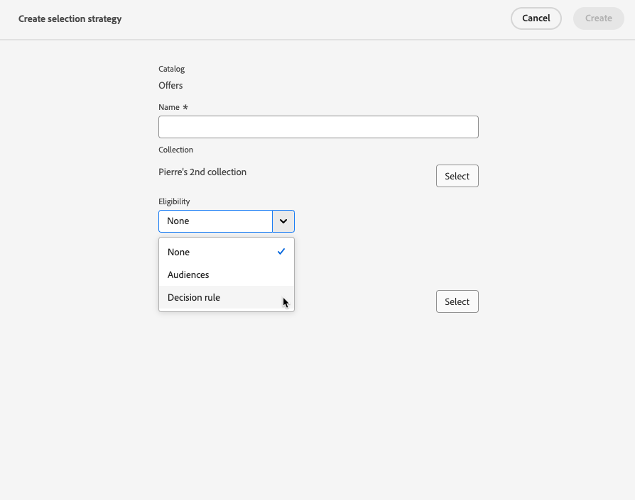

# Skapa urvalsstrategier {#selection-strategies}

>[!CONTEXTUALHELP]
>id="ajo_exd_config_strategies"
>title="Definiera era urvalsstrategier"
>abstract="En urvalsstrategi kan återanvändas och består av en samling som är associerad med en begränsning för behörighet och en rangordningsmetod för att avgöra vilka erbjudanden som ska visas när de väljs ut i en beslutspolicy."

>[!CONTEXTUALHELP]
>id="ajo_exd_strategy_eligibility"
>title="Begränsa giltiga profiler"
>abstract="Du kan begränsa urvalet av erbjudanden för den här urvalsstrategin. Som standard är alla profiler berättigade, men du kan använda målgrupper eller regler för att begränsa urvalet av erbjudanden till enbart specifika profiler."
>additional-url="https://experienceleague.adobe.com/en/docs/journey-optimizer/using/audiences-profiles-identities/audiences/about-audiences" text="Använda målgrupper"
>additional-url="https://experienceleague.adobe.com/en/docs/journey-optimizer/using/decisioning/experience-decisioning/rules" text="Använd beslutsregler"

En urvalsstrategi kan återanvändas och består av en samling som är associerad med en berättigandebegränsning och en rangordningsmetod för att avgöra vilka erbjudanden som ska visas när de väljs i en [beslutspolicy](create-decision.md).

## Få tillgång till och hantera urvalsstrategier

1. Gå till **[!UICONTROL Decisioning]** > **[!UICONTROL Strategy setup]** > **[!UICONTROL Selection strategies]**.

1. Alla markeringsstrategier som har skapats hittills visas. Det finns filter som hjälper dig att hämta strategier enligt rangordningsmetoden.

   

1. Klicka på ett markeringsstrateginamn om du vill redigera det.

1. Samlingen, rangordningsmetoden och behörighetskraven som valts för varje strategi visas också. Du kan klicka på ikonen bredvid varje samlingsnamn om du vill redigera en samling direkt.

   

## Skapa en urvalsstrategi {#create-selection-strategy}

Följ stegen nedan för att skapa en urvalsstrategi.

1. Klicka på **[!UICONTROL Selection strategies]** i **[!UICONTROL Create selection strategy]**-lagret.

   

1. Lägg till ett namn för strategin.

   >[!NOTE]
   >
   >För närvarande är bara standardkatalogen **[!UICONTROL Offers]** tillgänglig.

1. Fyll i informationen för din urvalsstrategi med början av namnet.

   

1. Välj den [samling](collections.md) som innehåller de erbjudanden som ska övervägas.

1. Använd fältet **[!UICONTROL Eligibility]** för att begränsa urvalet av erbjudanden för den här urvalsstrategin.

   

   * Om du vill begränsa urvalet av erbjudanden till medlemmar i en Experience Platform-publik väljer du **[!UICONTROL Audiences]** och väljer en målgrupp i listan. [Lär dig arbeta med målgrupper](../audience/about-audiences.md)

   * Om du vill lägga till en markeringsbegränsning med en beslutsregel använder du alternativet **[!UICONTROL Decision rule]** och väljer önskad regel. [Lär dig skapa en regel](rules.md)

1. Definiera den rangordningsmetod som du vill använda för att välja det bästa erbjudandet för varje profil. [Läs mer](#select-ranking-method)

   

   * Om flera erbjudanden är berättigade för den här strategin använder metoden [Erbjudandeprioritet](#offer-priority) det värde som definieras i erbjudandena.

   * Om du vill använda en viss beräknad poäng för att välja vilket erbjudande som ska levereras väljer du [Formel](#ranking-formula) eller [AI-modell](#ai-ranking).

1. Klicka på **[!UICONTROL Create]**. Den är nu klar att användas i en [beslutspolicy](create-decision.md)

## Välj en rangordningsmetod {#select-ranking-method}

>[!CONTEXTUALHELP]
>id="ajo_exd_strategy_ranking"
>title="Definiera rangordnade erbjudanden"
>abstract="Om flera erbjudanden är berättigade till en viss urvalsstrategi väljer du den metod som ska välja det bästa erbjudandet för varje profil när du skapar en urvalsstrategi: prioritet eller rankningsformel."
>additional-url="https://experienceleague.adobe.com/docs/journey-optimizer/using/decisioning/experience-decisioning/decision-policies/create-decision.html" text="Skapa beslutsprofiler"

Om flera erbjudanden är berättigade till en viss urvalsstrategi kan du välja den metod som ska användas för att välja det bästa erbjudandet för varje profil när du skapar en urvalsstrategi. Du kan rangordna erbjudanden genom att:

* [Prioritet](#offer-priority)
* [Formel](#ranking-formula)
* [AI-rankning](#ai-ranking)

### Prioritet {#offer-priority}

När flera erbjudanden är berättigade enligt en beslutspolicy levereras som standard de objekt som har den högsta **prioriteten** till kunderna först.

{width=85%}

Prioritetspoäng för erbjudanden tilldelas när ett [beslutsobjekt](items.md) skapas.

### Rankningsformel {#ranking-formula}

Förutom att erbjuda prioritet kan du med Journey Optimizer skapa **rankningsformler**. Detta är formler som avgör vilket erbjudande som ska presenteras först för en viss placering, i stället för att beakta offertens prioritetspoäng.

Du kan till exempel öka prioriteten för alla erbjudanden där slutdatumet är mindre än 24 timmar från och med nu, eller öka erbjudandena från kategorin&quot;löpande&quot; om profilens intressepunkt är&quot;igång&quot;. Lär dig hur du skapar en rankningsformel i [det här avsnittet](ranking/ranking-formulas.md).

När du har skapat den kan du använda den här formeln i en urvalsstrategi. Om flera erbjudanden kan presenteras när den här urvalsstrategin används kommer den valda formeln att användas för att beräkna vilket erbjudande som ska levereras först.

### AI-rankning {#ai-ranking}

Du kan också använda ett utbildat modellsystem som automatiskt rangordnar erbjudanden för en viss profil genom att välja en AI-modell. Lär dig hur du skapar en AI-modell i [det här avsnittet](ranking/create-ai-models.md).

När en AI-modell har skapats kan du använda den i en urvalsstrategi. Om flera erbjudanden är berättigade avgör det tränade modellsystemet vilket erbjudande som ska presenteras först för denna urvalsstrategi.

>[!NOTE]
>
>För närvarande är rapporten [Lyft mätning](ranking/auto-optimization-model.md#lift) bara tillgänglig för AI-modellen [Personlig optimering](ranking/personalized-optimization-model.md).

