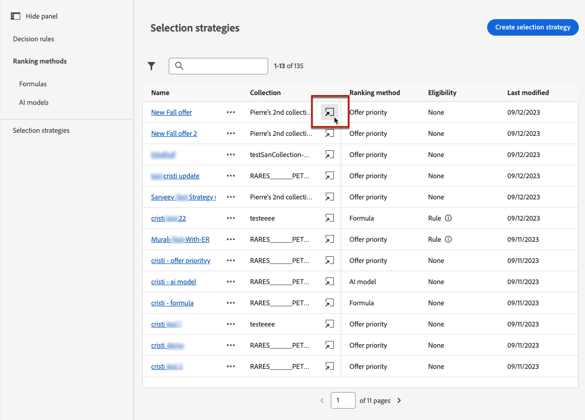

# Create selection strategies {#selection-strategies}

>[!CONTEXTUALHELP]
>id="ajo_exd_config_strategies"
>title="Define your selection strategies"
>abstract="A selection strategy is reusable and consists of a collection associated with an eligibility constraint and a ranking method to determine the offers to be shown when selected in a decision policy."
>additional-url="https://experienceleague.adobe.com/docs/journey-optimizer/using/decisioning/experience-decisioning/create-decision.html" text="Create decision policies"

>[!CONTEXTUALHELP]
>id="ajo_exd_strategy_eligibility"
>title="Restrict the eligible profiles"
>abstract="You can restrict the selection of offers for this selection strategy. By default, all profiles are eligible, but you can use audiences or rules to limit the offer selection to specific profiles only."
>additional-url="https://experienceleague.adobe.com/docs/journey-optimizer/using/audiences-profiles-identities/audiences/about-audiences.html" text="Använda målgrupper"
>additional-url="https://experienceleague.adobe.com/docs/journey-optimizer/using/decisioning/experience-decisioning/selection/rules.html" text="Använd beslutsregler"

## Få tillgång till och hantera urvalsstrategier

1. Gå till **[!UICONTROL Decisioning]** > **[!UICONTROL Strategy setup]** > **[!UICONTROL Selection strategies]**.

1. Alla markeringsstrategier som har skapats hittills visas. Det finns filter som hjälper dig att hämta strategier enligt rangordningsmetoden.

   

1. Klicka på ett markeringsstrateginamn om du vill redigera det.

1. Samlingen, rangordningsmetoden och behörighetskraven som valts för varje strategi visas också. Du kan klicka på ikonen bredvid varje samlingsnamn om du vill redigera en samling direkt.

   

## Create a selection strategy

To create a selection strategy, follow the steps below.

1. **[!UICONTROL Selection strategies]****[!UICONTROL Create selection strategy]**

   

1. Add a name for your strategy.

   >[!NOTE]
   >
   >För närvarande är bara standardkatalogen **[!UICONTROL Offers]** tillgänglig.

1. Fill in the details for your selection strategy, starting by the name.

   

1. 

1. **[!UICONTROL Eligibility]**

   

   * **[!UICONTROL Audiences]** 

   * **[!UICONTROL Decision rule]** 

1. Definiera den rangordningsmetod som du vill använda för att välja det bästa erbjudandet för varje profil. [Läs mer](#select-ranking-method)

   

   * 

   * 

1. Klicka på **[!UICONTROL Create]**. 

## Välj en rangordningsmetod {#select-ranking-method}

>[!CONTEXTUALHELP]
>id="ajo_exd_strategy_ranking"
>title="Definiera rangordnade erbjudanden"
>abstract="Om flera erbjudanden är berättigade till en viss urvalsstrategi väljer du den metod som ska välja det bästa erbjudandet för varje profil när du skapar en urvalsstrategi: prioritet eller rankningsformel."
>additional-url="https://experienceleague.adobe.com/docs/journey-optimizer/using/decisioning/experience-decisioning/create-decision.html" text="Skapa beslutsprofiler"

Om flera erbjudanden är berättigade till en viss urvalsstrategi kan du välja den metod som ska användas för att välja det bästa erbjudandet för varje profil när du skapar en urvalsstrategi. You can rank offers by:

* [Offer priority](#offer-priority)
* [Formula](#ranking-formula)
* [AI-rankning](#ai-ranking)

### Offer priority {#offer-priority}

****

Prioritetspoäng för erbjudanden tilldelas när ett [beslutsobjekt](items.md) skapas.

### Rankningsformel {#ranking-formula}

Förutom att erbjuda prioritet kan du med Journey Optimizer skapa **rankningsformler**. These are formulas that determine which offer should be presented first for a given placement, rather than taking into account the offers&#39; priority scores.

For example, you can boost the priority of all offers where the end date is less than 24 hours from now, or boost offers from the &quot;running&quot; category if the profile&#39;s point of interest is &quot;running&quot;. 

När du har skapat den kan du använda den här formeln i en urvalsstrategi. Om flera erbjudanden kan presenteras när den här urvalsstrategin används kommer den valda formeln att användas för att beräkna vilket erbjudande som ska levereras först.

### AI-rankning {#ai-ranking}

Du kan också använda ett utbildat modellsystem som automatiskt rangordnar erbjudanden för en viss profil genom att välja en AI-modell. Lär dig hur du skapar en AI-modell i [det här avsnittet](ranking.md).

När en AI-modell har skapats kan du använda den i en urvalsstrategi. Om flera erbjudanden är berättigade avgör det tränade modellsystemet vilket erbjudande som ska presenteras först för denna urvalsstrategi.
