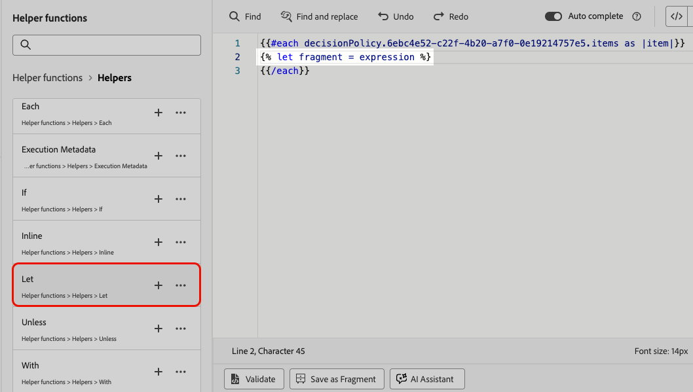

# Använd beslutspolicyer i meddelanden {#create-decision}

När en beslutspolicy har skapats kan policyn och de attribut som är kopplade till de returnerade beslutsposterna användas i ditt innehåll för personalisering. För att göra det måste koden som är kopplad till beslutsprincipen först infogas i ditt innehåll. När du är klar kan du utnyttja dess attribut för personalisering.

## Infoga koden för beslutspolicy {#insert-code}

>[!BEGINTABS]

>[!TAB Kodbaserad upplevelse]

1. Öppna anpassningsredigeraren och gå till menyn **[!UICONTROL Decision policies]**.

1. Välj **[!UICONTROL Insert policy]** om du vill lägga till koden som motsvarar beslutsprincipen.

   

   >[!NOTE]
   >
   >Om knappen för kodinfogning inte visas kan det bero på att en beslutsprincip redan har konfigurerats för den överordnade komponenten.

1. Koden för beslutspolicyn läggs till. Den här sekvensen upprepas det antal gånger som du vill att beslutsprincipen ska returneras. Om du t.ex. väljer att returnera två objekt när [du skapar beslutet](#add-decision) kommer samma sekvens att upprepas två gånger.

>[!TAB E-post]

1. Öppna anpassningsredigeraren och gå till menyn **[!UICONTROL Decision policy]**.

1. Välj **[!UICONTROL Insert syntax]** om du vill lägga till koden som motsvarar beslutsprincipen.

   

   >[!NOTE]
   >
   >Om knappen för kodinfogning inte visas kan det bero på att en beslutsprincip redan har konfigurerats för den överordnade komponenten.

1. Om ingen placering har associerats med komponenten i förväg väljer du en i listan och klickar på **[!UICONTROL Assign]**.

   

>[!ENDTABS]

När koden för beslutsprincipen har lagts till upprepas den här sekvensen det antal gånger du vill att beslutsprincipen ska returneras. Om du t.ex. väljer att returnera två objekt när [du skapar beslutet](#add-decision) kommer samma sekvens att upprepas två gånger.

## Utnyttja attribut för beslutsartiklar {#attributes}

Nu kan du lägga till alla beslutsattribut du vill i den koden. De tillgängliga attributen lagras i **[!UICONTROL Offers]**-katalogens schema. Anpassade attribut lagras i mappen **`_<imsOrg`>** och standardattribut i mappen **`_experience`**. [Läs mer om offertkatalogens schema](catalogs.md)


>[!NOTE]
>
>För artikelspårning för beslutsprincip måste attributet `trackingToken` läggas till enligt följande för beslutsprincipinnehåll:
>`trackingToken: {{item._experience.decisioning.decisionitem.trackingToken}}`

Om du vill lägga till ett attribut klickar du på plusikonen (+) bredvid det. Du kan lägga till så många attribut du vill i koden.


Se till att du kapslar in `#each`-slingan i ett par hakparenteser `[ ]` och lägger till ett komma precis före den avslutande `/each`.


Du kan också lägga till andra attribut som är tillgängliga i personaliseringsredigeraren, till exempel profilattribut.


## Utnyttja fragment (kodbaserad upplevelse) {#fragments}

Om din beslutspolicy innehåller beslutsposter, inklusive fragment, kan du utnyttja dessa fragment i beslutspolicykoden. [Läs mer om fragment](../content-management/fragments.md)

>[!AVAILABILITY]
>
>Den här funktionen är för närvarande endast tillgänglig för den kodbaserade upplevelsekanalen och för en uppsättning organisationer (begränsad tillgänglighet). Kontakta din Adobe-representant om du vill veta mer.

Anta till exempel att du vill visa olika innehåll för flera mobila enhetsmodeller. Se till att du har lagt till fragment som motsvarar de enheterna i beslutsposten som du använder i beslutspolicyn. [Lär dig hur](items.md#attributes).

{width=70%}

När du är klar kan du använda någon av följande metoder:

>[!BEGINTABS]

>[!TAB Infoga koden direkt]

Kopiera och klistra in kodblocket nedan i beslutspolicykoden. Ersätt `variable` med fragment-ID och `placement` med fragmentreferensnyckeln:

```

{{fragment id = variable}}
```

>[!TAB Följ de detaljerade stegen]

1. Navigera till **[!UICONTROL Helper functions]** och lägg till funktionen **** ` {{variable}}` i kodfönstret, där du kan deklarera variabeln för fragmentet.

   

1. Använd funktionen **Karta** > **Hämta** `` för att skapa ditt uttryck. Kartan är det fragment som beslutsobjektet refererar till och strängen kan vara den enhetsmodell som du angav i beslutsobjektet som **[!UICONTROL Fragment reference key]**.

   

1. Du kan också använda ett kontextuellt attribut som skulle innehålla detta enhetsmodell-ID.

   

1. Lägg till variabeln som du valde för fragmentet som fragment-ID.

   

>[!ENDTABS]

Fragment-ID och referensnyckel väljs från beslutsobjektets **[!UICONTROL Fragments]**-avsnitt.

>[!WARNING]
>
>Om fragmentnyckeln är felaktig eller om fragmentinnehållet inte är giltigt, kommer återgivningen att misslyckas och orsaka fel i Edge-anropet.

### Stödlinjer när fragment används {#fragments-guardrails}

**Beslutsobjekt och kontextattribut**

Attribut för beslutsobjekt och kontextalattribut stöds inte som standard i [!DNL Journey Optimizer]-fragment. Du kan emellertid använda globala variabler i stället, som beskrivs nedan.

Säg att du vill använda variabeln *sport* i ditt fragment.

1. Referera den här variabeln i fragmentet, till exempel:

   ```
   Elevate your practice with new {{sport}} gear!
   ```

1. Definiera variabeln med funktionen **Let** i beslutsprincipblocket. I exemplet nedan definieras *sport* med attributet för beslutsobjekt:

   ```
   {#each decisionPolicy.13e1d23d-b8a7-4f71-a32e-d833c51361e0.items as |item|}}
   
   {{fragment id = get(item._experience.decisioning.offeritem.contentReferencesMap, "placement1").id }}
   {{/each}}
   ```

**Innehållsvalidering av beslutsfragment**

* På grund av dessa fragment, när de används i en kampanj, hoppas meddelandevalideringen under skapandet av kampanjinnehåll över för fragment som refereras i beslutsobjekt.

* Valideringen av fragmentinnehållet sker bara när fragmenten skapas och publiceras.

* För JSON-fragment är JSON-objektets giltighet inte säkerställd. Kontrollera att uttrycksfragmentets innehåll är en giltig JSON så att det kan användas i beslutsobjekt.

Vid körning valideras kampanjinnehållet (inklusive fragmentinnehåll från beslutsobjekt). Om valideringen misslyckas återges inte kampanjen.

## Nästa steg {#final-steps}

När innehållet är klart kan du granska och publicera kampanjen eller resan:

* [Publicera en resa](../building-journeys/publish-journey.md)
* [Granska aktivering av en kampanj](../campaigns/review-activate-campaign.md)
* [Publicera och aktivera en kodbaserad upplevelse](../code-based/publish-code-based.md)

När utvecklaren gör ett API- eller SDK-anrop för att hämta innehåll för den yta som definieras i kanalkonfigurationen, kommer ändringarna att tillämpas på webbsidan eller appen för kodbaserade upplevelser.

>[!NOTE]
>
>För närvarande kan du inte simulera innehåll från användargränssnittet i en [kodbaserad upplevelse](../code-based/create-code-based.md) -kampanj eller resa med hjälp av beslut. Det finns en tillfällig lösning i [det här avsnittet](../code-based/code-based-decisioning-implementations.md).

Om du vill se hur dina beslut fungerar kan du skapa anpassade [Customer Journey Analytics-rapportinstrumentpaneler](cja-reporting.md).

