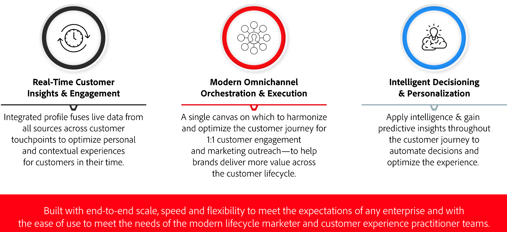

# Kom igång med Journey Optimizer {#cjm-gs}

>[!CONTEXTUALHELP]
>id="test_id"
>title="Testinnehåll"
>abstract="Testa innehållet för sammanhangsbaserad hjälpintegration i AJO."

## Vad är [!DNL Adobe Journey Optimizer]?{#about-cjm}

[!DNL Adobe Journey Optimizer] hjälper företag att leverera sammankopplade, kontextuella och personaliserade upplevelser till sina kunder. Kundresan är hela processen för en kunds interaktioner med varumärket, från det första kontaktytan tills kunden går ur. Det börjar med informationsfasen, där kunderna lär sig om varumärket och börjar engagera. Kunden kommer sedan att interagera ytterligare med varumärket, besöka webbplatser online och fysiska webbplatser samt göra inköp, skicka meddelanden eller genomföra granskningar.

[!DNL Adobe Journey Optimizer] bygger på  [!DNL Adobe Experience Platform] och kombinerar en enhetlig kundprofil i realtid, ett API-första öppet ramverk, centraliserad offer decisioning och artificiell intelligens (AI) och maskininlärning (ML) för personalisering och optimering. Med Journey Optimizer kan varumärken på ett intelligent sätt avgöra nästa bästa interaktion med skala, hastighet och flexibilitet under hela kundresan. Med [!DNL Adobe Journey Optimizer] kan företag skapa och leverera både schemalagda marknadsföringskampanjer (till exempel veckokampanjer för en butik) och skräddarsydd individuell kommunikation (till exempel ett push-meddelande för en artikel som en lojalitetsappkund kan ha tittat på som tidigare inte fanns i lager) inom samma program.

➡️ [Upptäck Journey Optimizer](https://experienceleague.adobe.com/docs/journey-optimizer-learn/tutorials/introduction-to-journey-optimizer/introduction.html){target=&quot;_blank&quot;} (video)

## Användningsfall

* Marknadsförarna kan använda [!DNL Adobe Journey Optimizer] för att skicka både individanpassad kommunikation och målgruppsbaserad gruppkommunikation. En klädbutik skickar till exempel vanligen enkäter till alla kunder som köpt produkter den senaste veckan. På grund av infallsvädret försenades några leveranser. När man ser vilka kunder som inte har fått leveranser kan klädbutiken utesluta dem från den schemalagda kundnöjdheten och istället skicka ett personligt mejl med en ursäkt för fördröjningen och erbjuda en rabattkod med produktrekommendationer som baseras på kundens tidigare inköp.

   Marknadsförarna kan också använda programmet för att skicka beteendebaserad kommunikation i realtid. Samma återförsäljare skulle till exempel kunna engagera en lojal kund som i realtid tar sig in på parkeringsplatsen genom att skicka ett push-meddelande till dem om en tröja som finns i lager i kundens storlek.

* Icke-marknadsförare som verksamhetsteam och kundsupport som är engagerade i kundupplevelsen kan använda [!DNL Adobe Journey Optimizer] för att hantera en mängd olika uppgifter, till exempel operativa meddelanden eller till och med för att övervaka introduktionsprocessen. Exempel: en nöjespark där parkbesökare laddar ned en mobilapp som en del av sin parkupplevelse. Underhållspersonalen kan använda [!DNL Adobe Journey Optimizer] för att meddela parkeringsbesökare om de platser som för närvarande är stängda på grund av underhåll.

## Viktiga möjligheter

[!DNL Adobe Journey Optimizer] är en flexibel och skalbar applikation för att skapa och leverera personaliserade, sammankopplade och vältajmade kundupplevelser i alla appar, enheter och kanaler.

Viktiga funktioner:

* **Kundinsikter och engagemang**  i realtid - En integrerad profil sammanför livedata från alla källor över kundens kontaktytor, inklusive beteendedata, transaktionsdata, ekonomiska data och driftdata för att optimera personliga och sammanhangsbaserade upplevelser för kunderna i deras tid.

* **Modern flerkanalssamordning och -körning**  - en enda arbetsyta där man kan harmonisera och optimera kundresan för personligt kundengagemang och marknadsföringsutåtriktad marknadsföring - för att hjälpa varumärken att leverera mer värde under hela kundlivscykeln. Kundresor som utformats i [!DNL Adobe Journey Optimizer] kan vara dynamiska och händelsebaserade för att hjälpa varumärken att reagera på realtidssignaler och koppla samman dessa interaktioner med schemalagda kampanjer så att rätt beslut kan fattas om vilken kommunikation som ska skickas till en kund, när och via vilka kanaler.

* **Intelligent Decisioning &amp; Personalization**  - Varumärken kan tillämpa centraliserad beslutsfattande och införliva artificiell intelligens och maskininlärning för att ta del av prediktiva insikter i hela kundupplevelsen, vilket gör det enklare att automatisera beslut och optimera upplevelsen i stor skala. offera decisioningen driver centraliserade erbjudanden över flera kanaler i stor skala via [!DNL Adobe Journey Optimizer].

## Arkitektur

Förstå den grundläggande arkitekturen för [!DNL Adobe Journey Optimizer], integreringspunkten och relationen mellan [!DNL Journey Optimizer] och andra Adobe-program.

>[!VIDEO](https://video.tv.adobe.com/v/334205?quality=12)

>[!NOTE]
>
> Adobe Experience Cloud allmänna riktlinjer och förfaranden för integritetsskydd gäller för [!DNL Journey Optimizer]. [Läs mer om Adobe Experience Cloud sekretess](https://www.adobe.com/privacy/experience-cloud.html).
> Du måste också vara medveten om [Guardrails för kundprofildata i realtid innan du startar](https://experienceleague.adobe.com/docs/experience-platform/profile/guardrails.html).

**Se även**

* [Viktiga steg att starta](quick-start.md)
* [Skapa ditt första meddelande](get-started-content.md)
* [Designa resor och skicka meddelanden](building-journeys/journey-gs.md)
* [Live-rapporter](reports/live-report.md)
* [Journey Optimizer FAQ](assets/do-not-localize/AJO-FAQ.pdf)  (PDF)
