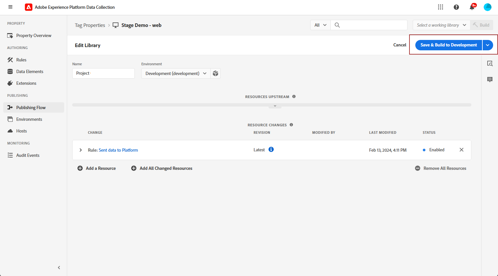

# Konfigurera webbkanalen i appen {#configure-in-app-web}

## Förhandskrav {#prerequisites}

* Kontrollera att du använder den senaste versionen för tillägget **Adobe Experience Platform Web SDK**.

* Installera tillägget **Adobe Experience Platform Web SDK** i **taggegenskaperna** och aktivera alternativet **Personalization Storage**.

  Den här konfigurationen är nödvändig för att lagra händelsehistorik på klienten, vilket är en förutsättning för att regler för frekvens ska kunna implementeras i Regelbyggaren. [Läs mer](https://experienceleague.adobe.com/docs/experience-platform/tags/extensions/client/web-sdk/web-sdk-extension-configuration.html?lang=sv-SE){target="_blank"}

  

## Konfigurera regel för skickade data till plattformen {#configure-sent-data-trigger}

1. Få åtkomst till din **Adobe Experience Platform Data Collection**-instans och navigera till **Taggegenskaper** som konfigurerats med **Adobe Experience Platform Web SDK**-tillägget.

1. Välj **Regler** och sedan **Skapa ny regel** eller **Lägg till regel** på menyn **Redigering**.

   

1. I avsnittet **Händelser** klickar du på **Lägg till** och konfigurerar det enligt följande:

   * **Tillägg**: Kärna

   * **Händelsetyp**: Biblioteket har lästs in (sidan överst).

   

1. Klicka på **Behåll ändringar** för att spara händelsekonfigurationen.

1. Klicka på **Lägg till** i avsnittet **Åtgärder** och konfigurera det på följande sätt:

   * **Tillägg**: Adobe Experience Platform Web SDK

   * **Åtgärdstyp**: Skicka händelse

   

1. Aktivera alternativet **Återge visuella personaliseringsbeslut** i **Personalization**-avsnittet av din **åtgärdstyp**.

   

1. I avsnittet **Beslutskontext** definierar du de **Key** - och **Value** -par som avgör vilken upplevelse som ska levereras.

   

1. Spara din **Åtgärdskonfiguration** genom att klicka på **Behåll ändringar**.

1. Navigera till menyn **Publiceringsflöde**. Skapa ett nytt **bibliotek** eller markera ett befintligt **bibliotek** och lägg till din nya **regel** i det. [Läs mer](https://experienceleague.adobe.com/docs/experience-platform/tags/publish/libraries.html?lang=sv-SE#create-a-library){target="_blank"}

1. Välj **Spara och bygg till utveckling** i ditt **bibliotek**.

   

## Konfigurera manuell regel {#configure-manual-trigger}

1. Få åtkomst till din **Adobe Experience Platform Data Collection**-instans och navigera till **Taggegenskaper** som konfigurerats med **Adobe Experience Platform Web SDK**-tillägget.

1. Välj **Regler** och sedan **Skapa ny regel** eller **Lägg till regel** på menyn **Redigering**.

   

1. I avsnittet **Händelser** klickar du på **Lägg till** och konfigurerar det enligt följande:

   * **Tillägg**: Kärna

   * **Händelsetyp**: Klicka

   

1. I **Klicka på konfigurationen** och definiera den **väljare** som ska utvärderas.

   

1. Klicka på **Behåll ändringar** för att spara **Event**-konfigurationen.

1. Klicka på **Lägg till** i avsnittet **Åtgärder** och konfigurera det på följande sätt:

   * **Tillägg**: Adobe Experience Platform Web SDK

   * **Åtgärdstyp**: Utvärdera regeluppsättningar

   

1. Aktivera alternativet **Återge visuella personaliseringsbeslut** i **Utvärdera regeluppsättningsåtgärd** för **åtgärdstypen**.

   

1. I avsnittet **Beslutskontext** definierar du de **Key** - och **Value** -par som avgör vilken upplevelse som ska levereras.

1. Gå till menyn **Publiceringsflöde**, skapa ett nytt **bibliotek** eller välj ett befintligt **bibliotek** och lägg till din nya **regel**. [Läs mer](https://experienceleague.adobe.com/docs/experience-platform/tags/publish/libraries.html?lang=sv-SE#create-a-library){target="_blank"}

1. Välj **Spara och bygg till utveckling** i ditt **bibliotek**.

   

## Skapa en webbkonfiguration i programmet {#in-app-config}

1. Gå till menyn **[!UICONTROL Channels]** > **[!UICONTROL General settings]** > **[!UICONTROL Channel configurations]** och klicka sedan på **[!UICONTROL Create channel configuration]**.

   

1. Ange ett namn och en beskrivning (valfritt) för konfigurationen och välj sedan den kanal som ska konfigureras.

   >[!NOTE]
   >
   > Namn måste börja med en bokstav (A-Z). Det får bara innehålla alfanumeriska tecken. Du kan också använda understreck `_`, punkt `.` och bindestreck `-`.

1. Om du vill tilldela anpassade eller grundläggande dataanvändningsetiketter till konfigurationen kan du välja **[!UICONTROL Manage access]**. [Läs mer om OLAC (Object Level Access Control)](../administration/object-based-access.md).

1. Välj **[!UICONTROL Marketing action]** om du vill associera medgivandeprinciper till meddelanden som använder den här konfigurationen. Alla policyer för samtycke som är kopplade till marknadsföringsåtgärden utnyttjas för att ta hänsyn till kundernas preferenser. [Läs mer](../action/consent.md#surface-marketing-actions)

1. Välj **Meddelandekanal i appen**.

1. Definiera en appkonfiguration. Du kan göra ändringar på två sätt:

   * Du kan antingen ange en **[!UICONTROL Page URL]** för att tillämpa ändringar på en viss sida.

   * Du kan skapa en regel för flera URL:er som följer samma mönster.

     +++ Så här skapar du en sidmatchningsregel.

      1. Välj **[!UICONTROL Pages matching rule]** som appkonfiguration och ange **[!UICONTROL Page URL]**.

      1. I fönstret **[!UICONTROL Edit configuration rule]** definierar du dina villkor för fälten **[!UICONTROL Domain]** och **[!UICONTROL Page]**.
      1. I listrutorna kan du anpassa villkoren ytterligare.

         Här kan du till exempel redigera element som visas på alla försäljningsproduktsidor på Luma-webbplatsen genom att välja Domän > Börjar med > luma och Sida > Innehåller > Försäljning.

         

      1. Klicka på **[!UICONTROL Add another page rule]** om du vill skapa en annan regel om det behövs.

      1. Markera **[!UICONTROL Default authoring and preview URL]**.

      1. Spara ändringarna. Regeln visas på skärmen **[!UICONTROL Create campaign]**.

     +++

1. Skicka in webbkonfigurationen i appen.

Du kan nu [skapa en webb-i-app](../in-app/create-in-app-web.md) i en kampanj.
