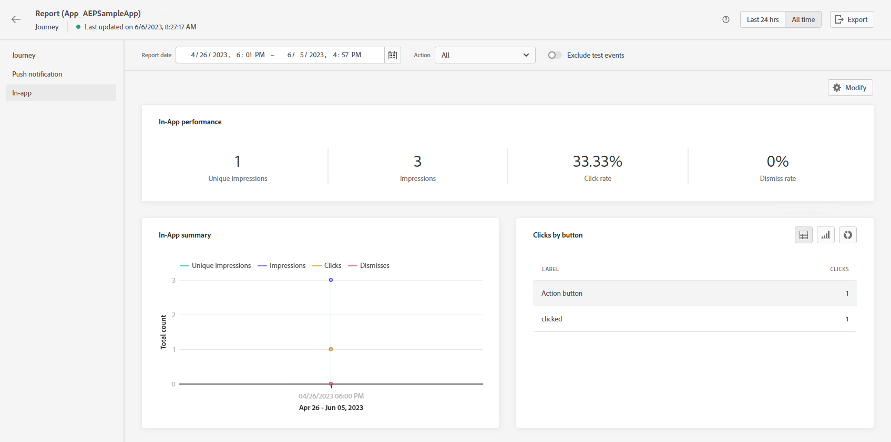

# Skapa ett meddelande i appen under en resa {#create-in-app-journey}

Så här lägger du till ett meddelande i appen under en resa:

1. Öppna din resa och dra och släpp en **[!UICONTROL In-app]** aktivitet från **[!UICONTROL Actions]** på paletten.

   När en profil når slutet av sin resa kommer alla meddelanden i appen som visas för dem automatiskt att upphöra att gälla. Av den anledningen läggs en Wait-aktivitet automatiskt till efter aktiviteten i appen för att säkerställa korrekt timing.

   

1. Ange en **[!UICONTROL Label]** och **[!UICONTROL Description]** för ditt meddelande.

1. Välj [Yta i appen](inapp-configuration.md) att använda.

   

1. Nu kan du börja utforma ditt innehåll med **[!UICONTROL Edit content]** -knappen. [Läs mer](design-in-app.md)

1. Klicka **[!UICONTROL Edit trigger]** för att konfigurera utlösaren.

   

1. Från **[!UICONTROL In-app message trigger]** väljer du de händelser och villkor som ska utlösa meddelandet:

   1. Klicka **[!UICONTROL Add condition]** om du vill att utlösaren ska ta hänsyn till flera händelser eller villkor.
   1. Från **[!UICONTROL Select an event]** väljer du typ av händelse för utlösaren.
   1. Välj hur dina händelser ska länkas, t.ex. välj **[!UICONTROL And]** om du vill **båda** utlösare är true för att ett meddelande ska kunna visas eller väljas **[!UICONTROL Or]** om du vill att meddelandet ska visas om **antingen** av utlösarna är sanna.
   1. Klicka **[!UICONTROL Make group]** för att gruppera utlösare tillsammans.

   

1. Välj hur ofta utlösaren ska visas när meddelandet i appen är aktivt:

   * **[!UICONTROL Every time]**: Visa alltid meddelandet när de händelser som valts i **[!UICONTROL Mobile app trigger]** inträffar.
   * **[!UICONTROL Once]**: Visa endast det här meddelandet första gången de händelser som markerats i **[!UICONTROL Mobile app trigger]** inträffar.
   * **[!UICONTROL Until click through]**: Visa det här meddelandet när händelser har markerats i **[!UICONTROL Mobile app trigger]** rullgardinsmenyn inträffar tills en interaktionshändelse skickas av SDK med åtgärden&quot;klickad&quot;.
   * **[!UICONTROL X number of times]**: Visa bara meddelandet ett visst antal gånger, vilket avgörs av det värde som anges i **[!UICONTROL Times to display]** fält.

1. Välj veckodag och den tidpunkt då du vill att ditt meddelande i appen ska utlösas och klicka på **[!UICONTROL Save]**.

1. Slutför vid behov kundresan genom att dra och släppa ytterligare åtgärder eller händelser. [Läs mer](../building-journeys/about-journey-activities.md)

1. När ditt meddelande i appen är klart slutför du konfigurationen och publicerar din resa för att aktivera den.

Mer information om hur du konfigurerar en resa finns i [den här sidan](../building-journeys/journey-gs.md).

## Rapport i appen {#inapp-report}

Från din resa **[!UICONTROL Global report]**, **[!UICONTROL In-app]** på fliken anger huvudinformationen i förhållande till de leveranser i appen som skickas på dina resor.

Läs mer om [Global reserapport](../reports/journey-global-report.md).

+++Läs mer om de olika mätvärden och widgetar som är tillgängliga för rapporten i appen.

The **[!UICONTROL In-app performance]** Nyckeltal anger den viktigaste informationen i relation till besökarnas engagemang i era meddelanden i appen, som:

* **[!UICONTROL Unique impressions]**: antal unika användare som meddelandet i appen levererades till.

* **[!UICONTROL Impressions]**: totalt antal meddelanden i appen som levereras till alla användare.

* **[!UICONTROL Click rate]**: Andel användare som interagerade med knapparna i meddelandet i appen jämfört med användare som såg meddelandet.

* **[!UICONTROL Dismiss rate]**: procent av meddelanden i appen som mottagarna avvisade.

The **[!UICONTROL In-app summary]** diagram visar hur dina visningar i appen har utvecklats för den aktuella perioden.

The **[!UICONTROL Clicks by button]** diagram och tabeller innehåller tillgängliga data för mottagarnas beteende per knapp:

* **[!UICONTROL Clicks]**: totalt antal mottagare som interagerat med knapparna i meddelandet i appen.

* **[!UICONTROL Click rate]**: Andel användare som interagerade med knapparna i meddelandet i appen jämfört med användare som såg meddelandet.
+++

**Relaterade ämnen:**

* [Design In-app-meddelande](design-in-app.md)
* [Testa och skicka meddelandet i appen](send-in-app.md)
* [Rapport i appen](../reports/campaign-global-report.md#inapp-report)
* [Konfiguration i appen](inapp-configuration.md)
