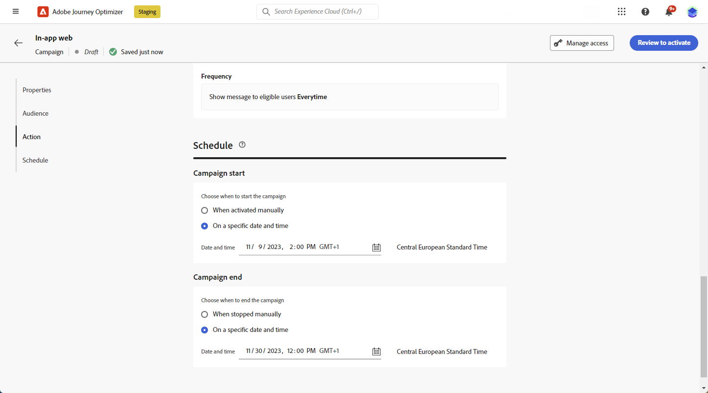

# Skapa ett meddelande i appen för webben {#create-in-app-web}

## Konfigurera webbkanalen i appen {#configure-web-inapp}

Följ stegen nedan för att konfigurera webbkanalen i appen:

* Installera taggtillägget Web SDK om du vill ha stöd för Web In-app Messaging. [Läs mer](https://experienceleague.adobe.com/docs/experience-platform/tags/extensions/client/web-sdk/web-sdk-extension-configuration.html?lang=sv-SE){target="_blank"}

* Anpassa utlösarna. Meddelanden i appen stöder två typer av utlösare: Skickade data till plattformen och Manuella utlösare. [Läs mer](https://experienceleague.adobe.com/docs/experience-platform/edge/personalization/ajo/web-in-app-messaging.html?lang=sv-SE){target="_blank"}

* Skapa en webbkonfiguration i appen. [Läs mer](inapp-configuration.md)

## Skapa en webbkampanj i appen {#create-inapp-web-campaign}

1. Öppna menyn **[!UICONTROL Campaigns]** och klicka sedan på **[!UICONTROL Create campaign]**.

1. Välj typ av kampanjkörning: Schemalagd eller API-utlöst. Läs mer om kampanjtyper på [den här sidan](../campaigns/create-campaign.md#campaigntype).

1. Välj **[!UICONTROL Actions]** i listrutan **[!UICONTROL In-app message]**.

   

1. Välj eller skapa en appkonfiguration. [Läs mer](inapp-configuration.md#channel-prerequisites)

## Definiera webbkampanjen i appen {#configure-inapp}

1. I avsnittet **[!UICONTROL Properties]** anger du **[!UICONTROL Title]** och **[!UICONTROL Description]**-beskrivningen.

1. Välj **[!UICONTROL Manage access]** om du vill tilldela etiketter för anpassad eller viktig dataanvändning till meddelandet i appen. [Läs mer](../administration/object-based-access.md).

1. Klicka på knappen **[!UICONTROL Select audience]** för att definiera målgruppen i listan över tillgängliga Adobe Experience Platform-målgrupper. [Läs mer](../audience/about-audiences.md).

   

1. I fältet **[!UICONTROL Identity namespace]** väljer du det namnutrymme som ska användas för att identifiera personer från den valda målgruppen. [Läs mer](../event/about-creating.md#select-the-namespace).

1. På menyn **[!UICONTROL Action]** hittar du de inställningar som tidigare konfigurerats som **[!UICONTROL App configuration]**. Du kan göra ändringar här om det behövs eller uppdatera regeln genom att klicka på **[!UICONTROL Edit Rule]**.

1. Klicka på **[!UICONTROL Create experiment]** för att börja konfigurera ditt innehållsexperiment och skapa behandlingar för att mäta deras prestanda och identifiera det bästa alternativet för målgruppen. [Läs mer](../content-management/content-experiment.md)

1. Klicka på **[!UICONTROL Edit triggers]** för att välja händelser och villkor som ska utlösa meddelandet. Regelbyggare gör det möjligt för användare att ange villkor och värden som, när de möts, utlöser en uppsättning åtgärder, till exempel att skicka ett meddelande i appen.

   1. Klicka på händelselistrutan för att ändra utlösaren om det behövs.

      +++Se tillgängliga utlösare.

      | Paket | Utlösare | Definition |
      |---|---|---|
      | Plattform | Skickade data till plattformen | Utlöses när mobilappen utfärdar en edge experience-händelse för att skicka data till Adobe Experience Platform. Vanligtvis API-anropet [sendEvent](https://developer.adobe.com/client-sdks/documentation/edge-network/api-reference/#sendevent){target="_blank"} från AEP Edge-tillägget. |
      | Manuell | Manuell utlösare | Två associerade dataelement: en nyckel, som är en konstant som definierar datauppsättningen (t.ex. kön, färg, pris), och ett värde, som är en variabel som tillhör uppsättningen (t.ex. man/kvinna, grön, 100). |

      +++

   1. Klicka på **[!UICONTROL Add condition]** om du vill att utlösaren ska ta hänsyn till flera händelser eller villkor.

   1. Välj villkoret **[!UICONTROL Or]** om du vill lägga till fler **[!UICONTROL Triggers]** för att utöka regeln ytterligare.

      

   1. Välj villkoret **[!UICONTROL And]** om du vill lägga till en anpassad **[!UICONTROL Trait]** och finjustera regeln bättre.

      +++Se tillgängliga egenskaper.

      | Paket | Trait | Definition |
      |---|---|---|
      | Plattform | XDM-händelsetyp | Utlöses när den angivna händelsetypen uppfylls. |
      | Plattform | XDM-värde | Utlöses när det angivna XDM-värdet uppfylls. |

      +++

      

   1. Klicka på **[!UICONTROL Make group]** för att gruppera utlösare.

1. Välj hur ofta utlösaren ska visas när meddelandet i appen är aktivt. Följande alternativ är tillgängliga:

   * **[!UICONTROL Everytime]**: Visa alltid meddelandet när de händelser som valts i listrutan **[!UICONTROL Mobile app trigger]** inträffar.
   * **[!UICONTROL Once]**: Visa endast det här meddelandet första gången som de händelser som är markerade i listrutan **[!UICONTROL Mobile app trigger]** inträffar.
   * **[!UICONTROL Until click through]**: Visa det här meddelandet när de händelser som markerats i listrutan **[!UICONTROL Mobile app trigger]** inträffar tills en interaktionshändelse skickas av SDK med åtgärden&quot;klickad&quot;.
   * **[!UICONTROL X number of times]**: Visa det här meddelandet X-tid.

1. Om det behövs väljer du vilken **[!UICONTROL Day of the week]** eller **[!UICONTROL Time of day]** meddelandet i appen ska visas.

1. Kampanjer är utformade för att köras ett visst datum eller med en återkommande frekvens. Lär dig hur du konfigurerar **[!UICONTROL Schedule]** för din kampanj i [det här avsnittet](../campaigns/create-campaign.md#schedule).

   

1. Nu kan du börja designa ditt innehåll med knappen **[!UICONTROL Edit content]**. [Läs mer](design-in-app.md)

   

**Relaterade ämnen:**

* [Testa och skicka meddelandet i appen](send-in-app.md)
* [Rapport i appen](../reports/campaign-global-report-cja-inapp.md)
* [Konfiguration i appen](inapp-configuration.md)
