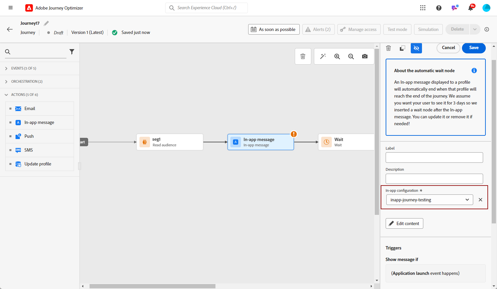

# Skapa ett meddelande i appen {#create-in-app}

>[!CONTEXTUALHELP]
>id="ajo_campaigns_inapp_triggers"
>title="Hantera utlösare i appen"
>abstract="Kontrollera effektivt era utlösare genom att välja specifika händelser och kriterier som ska aktivera dina meddelanden. Med regelbyggaren kan användare definiera exakta villkor och värden. När dessa villkor är uppfyllda initierar de en serie åtgärder, inklusive leverans av meddelanden i appen."

Du kan lägga till ett meddelande i appen i en kampanj eller under en resa. Följ stegen nedan för att skapa ett meddelande i appen i båda kontexterna.

Observera att meddelanden i appen inte påverkas av användarens val att välja att anmäla sig eller välja bort push-meddelanden i operativsystemet.

>[!BEGINTABS]

>[!TAB Lägg till ett meddelande i appen till en resa]

Så här lägger du till ett meddelande i appen under en resa:

1. Öppna din resa och dra och släpp en **[!UICONTROL In-app]**-aktivitet från **[!UICONTROL Actions]**-delen av paletten.

   När en profil når slutet av sin resa kommer alla meddelanden i appen som visas för dem automatiskt att upphöra att gälla. Av den anledningen läggs en Wait-aktivitet automatiskt till efter aktiviteten i appen för att säkerställa korrekt timing.

   

1. Ange **[!UICONTROL Label]** och **[!UICONTROL Description]** för meddelandet.

1. Välj den [konfiguration i appen](inapp-configuration.md#channel-prerequisites) som du vill använda.

   

1. Nu kan du börja designa ditt innehåll med knappen **[!UICONTROL Edit content]**. [Läs mer](design-in-app.md)

1. Klicka på **[!UICONTROL Edit triggers]** för att välja händelser och villkor som ska utlösa meddelandet. Regelbyggare gör det möjligt för användare att ange villkor och värden som, när de möts, utlöser en uppsättning åtgärder, till exempel att skicka ett meddelande i appen.

   

   1. Klicka på händelselistrutan för att ändra utlösaren om det behövs.

      +++Se tillgängliga utlösare.

      | Paket | Utlösare | Definition |
      |---|---|---|
      | Skicka data till plattformen | Skickade data till plattformen | Utlöses när mobilappen utfärdar en edge experience-händelse för att skicka data till Adobe Experience Platform. Vanligtvis API-anropet [sendEvent](https://developer.adobe.com/client-sdks/documentation/edge-network/api-reference/#sendevent) från AEP Edge-tillägget. |
      | Core tracking | Spåra åtgärd | Utlöses när den äldre funktionaliteten som erbjuds i API:t [trackAction](https://developer.adobe.com/client-sdks/documentation/mobile-core/api-reference/#trackaction) för mobilkod anropas. |
      | Core tracking | Spåra läge | Utlöses när den äldre funktionaliteten som erbjuds i API:t [trackState](https://developer.adobe.com/client-sdks/documentation/mobile-core/api-reference/#trackstate) för mobilkod anropas. |
      | Core tracking | Samla in PII | Utlöses när den äldre funktionaliteten som erbjuds i API:t [collectPII](https://developer.adobe.com/client-sdks/documentation/mobile-core/api-reference/#collectpii) för mobilkod anropas. |
      | Programmets livscykel | Programstart | Utlöses vid varje körning, inklusive krascher och installationer. Utlöses också vid ett återköp från bakgrunden när tidsgränsen för livscykelsessionen har överskridits. |
      | Programmets livscykel | Programinstallation | Utlöses vid första körningen efter installation eller ominstallation. |
      | Programmets livscykel | Programuppdatering | Utlöses vid första körningen efter en uppgradering eller när versionsnumret ändras. |
      | Programmets livscykel | Programmet stängs | Utlöses när programmet stängs. |
      | Programmets livscykel | Programkrasch | Utlöses när programmet inte är bakgrundsbelagt innan det stängs. Händelsen skickas när programmet startas efter kraschen. Kraschrapportering för Adobe Mobile implementerar inte en global hanterare för ej infångade undantag. |
      | Platser | Ange POI | Utlöses av Places SDK när kunden anger den POI (Point of Interest) som du har konfigurerat. |
      | Platser | Avsluta POI | Utlöses av Places SDK när kunden avslutar den POI (Point of Interest) som du konfigurerade. |

      +++

   1. Klicka på **[!UICONTROL Add condition]** om du vill att utlösaren ska ta hänsyn till flera händelser eller villkor.

   1. Välj villkoret **[!UICONTROL Or]** om du vill lägga till fler **[!UICONTROL Triggers]** för att utöka regeln ytterligare.

      

   1. Välj villkoret **[!UICONTROL And]** om du vill lägga till **[!UICONTROL Traits]** och finjustera regeln bättre.

      +++Se tillgängliga egenskaper.

      | Paket | Traits | Definition |
      |---|---|---|
      | Enhetsinformation | Transportföretagets namn | Utlöses när ett av transportföretagsnamnen i listan uppfylls. |
      | Enhetsinformation | Enhetsnamn | Utlöses när ett av enhetsnamnen uppfylls. |
      | Enhetsinformation | Språk | Utlöses när något av språken i listan uppfylls. |
      | Enhetsinformation | OS-version | Utlöses när en av de angivna operativsystemsversionerna uppfylls. |
      | Enhetsinformation | Tidigare OS-version | Utlöses när någon av de angivna versionerna av föregående operativsystem uppfylls. |
      | Enhetsinformation | Körningsläge | Utlöses om körningsläget är antingen program eller tillägg. |
      | Programmets livscykel | Program-ID | Utlöses när angivet program-ID uppfylls. |
      | Programmets livscykel | Veckodag | Utlöses när den angivna veckodagen har uppnåtts. |
      | Programmets livscykel | Dag sedan första användningen | Utlöses när det angivna antalet dagar sedan första användningen uppfylls. |
      | Programmets livscykel | Dag sedan senaste användning | Utlöses när det angivna antalet dagar sedan den senaste användningen uppfylls. |
      | Programmets livscykel | Dag sedan uppgraderingen | Utlöses när det angivna antalet dagar sedan den senaste uppgraderingen har uppnåtts. |
      | Programmets livscykel | Installationsdatum | Utlöses när det angivna installationsdatumet är uppfyllt. |
      | Programmets livscykel | Startar | Utlöses när det angivna antalet starter uppfylls. |
      | Programmets livscykel | Tid på dagen | Utlöses när den angivna tidpunkten på dagen uppfylls. |
      | Platser | Aktuell POI | Utlöses av Places SDK när kunden anger den angivna POI (Point of Interest). |
      | Platser | Senaste inmatade POI | Utlöses av Platser SDK beroende på vilken kund du senast angav. |
      | Platser | Senaste utloggad POI | Utlöses av Places SDK beroende på kundens sista utlämnade punkt för intresse. |

      +++

      

   1. Klicka på **[!UICONTROL Make group]** för att gruppera utlösare.

      

   1. Välj hur ofta utlösaren ska visas när meddelandet i appen är aktivt:

      * **[!UICONTROL Show every time]**: Visa alltid meddelandet när de händelser som valts i listrutan **[!UICONTROL Mobile app trigger]** inträffar.
      * **[!UICONTROL Show once]**: Det här meddelandet visas bara en gång per användarsession och är synligt i alla fönster eller aktiviteter tills det stängs. Använd anpassad logik med meddelandeombudet för att begränsa den till en viss skärm eller få den att stängas automatiskt.
      * **[!UICONTROL Show until click through]**: Visa det här meddelandet när de händelser som markerats i listrutan **[!UICONTROL Mobile app trigger]** inträffar tills en interaktionshändelse skickas av SDK med åtgärden&quot;klickad&quot;.

1. Slutför vid behov kundresan genom att dra och släppa ytterligare åtgärder eller händelser. [Läs mer](../building-journeys/about-journey-activities.md)

1. När ditt meddelande i appen är klart slutför du konfigurationen och publicerar din resa för att aktivera den.

Mer information om hur du konfigurerar en resa finns på [den här sidan](../building-journeys/journey-gs.md).

>[!NOTE]
>
>Om du vill visa ett meddelande i appen kort efter att du har skickat ett push-meddelande använder du en **Wait**-aktivitet för att tillåta att meddelandets nyttolasttid i appen sprids. Vanligtvis rekommenderas en 5-15 minuters väntan, men de exakta tiderna kan variera beroende på nyttolastens komplexitet och personaliseringsbehov.

>[!TAB Lägg till ett meddelande i appen i en kampanj]

Så här lägger du till ett meddelande i appen i en kampanj:

1. Öppna menyn **[!UICONTROL Campaigns]** och klicka sedan på **[!UICONTROL Create campaign]**.

1. Välj den typ av kampanj som du vill köra

   * **Schemalagd - marknadsföring**: Kör kampanjen direkt eller på ett angivet datum. Schemalagda kampanjer syftar till att skicka marknadsföringsmeddelanden. De konfigureras och körs från användargränssnittet.

   * **API-utlöst - Markering/transaktion**: Kör kampanjen med ett API-anrop. API-utlösta kampanjer syftar till att skicka antingen marknadsförings- eller transaktionsmeddelanden, dvs. meddelanden som skickas ut efter en åtgärd som utförs av en individ: lösenordsåterställning, kundvagn osv.

1. I avsnittet **[!UICONTROL Properties]** anger du **[!UICONTROL Title]** och **[!UICONTROL Description]**-beskrivningen.

1. Välj **[!UICONTROL Manage access]** om du vill tilldela etiketter för anpassad eller viktig dataanvändning till meddelandet i appen. [Läs mer](../administration/object-based-access.md).

1. Klicka på knappen **[!UICONTROL Select audience]** för att definiera målgruppen i listan över tillgängliga Adobe Experience Platform-målgrupper. [Läs mer](../audience/about-audiences.md).

   

1. I fältet **[!UICONTROL Identity namespace]** väljer du det namnutrymme som ska användas för att identifiera personer från den valda målgruppen. [Läs mer](../event/about-creating.md#select-the-namespace).

1. I avsnittet **[!UICONTROL Actions]** väljer du **[!UICONTROL In-app message]** och väljer eller skapar en ny konfiguration.

   Läs mer om konfigurationen i appen på [den här sidan](inapp-configuration.md).

   

1. Klicka på **[!UICONTROL Create experiment]** för att börja konfigurera ditt innehållsexperiment och skapa behandlingar för att mäta deras prestanda och identifiera det bästa alternativet för målgruppen. [Läs mer](../content-management/content-experiment.md)

1. Klicka på **[!UICONTROL Edit triggers]** för att välja händelser och villkor som ska utlösa meddelandet. Regelbyggare gör det möjligt för användare att ange villkor och värden som, när de möts, utlöser en uppsättning åtgärder, till exempel att skicka ett meddelande i appen.

   1. Klicka på händelselistrutan för att ändra utlösaren om det behövs.

      +++Se tillgängliga utlösare.

      | Paket | Utlösare | Definition |
      |---|---|---|
      | Skicka data till plattformen | Skickade data till plattformen | Utlöses när mobilappen utfärdar en edge experience-händelse för att skicka data till Adobe Experience Platform. Vanligtvis API-anropet [sendEvent](https://developer.adobe.com/client-sdks/documentation/edge-network/api-reference/#sendevent) från AEP Edge-tillägget. |
      | Core tracking | Spåra åtgärd | Utlöses när den äldre funktionaliteten som erbjuds i API:t [trackAction](https://developer.adobe.com/client-sdks/documentation/mobile-core/api-reference/#trackaction) för mobilkod anropas. |
      | Core tracking | Spåra läge | Utlöses när den äldre funktionaliteten som erbjuds i API:t [trackState](https://developer.adobe.com/client-sdks/documentation/mobile-core/api-reference/#trackstate) för mobilkod anropas. |
      | Core tracking | Samla in PII | Utlöses när den äldre funktionaliteten som erbjuds i API:t [collectPII](https://developer.adobe.com/client-sdks/documentation/mobile-core/api-reference/#collectpii) för mobilkod anropas. |
      | Programmets livscykel | Programstart | Utlöses vid varje körning, inklusive krascher och installationer. Utlöses också vid ett återköp från bakgrunden när tidsgränsen för livscykelsessionen har överskridits. |
      | Programmets livscykel | Programinstallation | Utlöses vid första körningen efter installation eller ominstallation. |
      | Programmets livscykel | Programuppdatering | Utlöses vid första körningen efter en uppgradering eller när versionsnumret ändras. |
      | Programmets livscykel | Programmet stängs | Utlöses när programmet stängs. |
      | Programmets livscykel | Programkrasch | Utlöses när programmet inte är bakgrundsbelagt innan det stängs. Händelsen skickas när programmet startas efter kraschen. Kraschrapportering för Adobe Mobile implementerar inte en global hanterare för ej infångade undantag. |
      | Platser | Ange POI | Utlöses av Places SDK när kunden anger den POI (Point of Interest) som du har konfigurerat. |
      | Platser | Avsluta POI | Utlöses av Places SDK när kunden avslutar den POI (Point of Interest) som du konfigurerade. |

      +++

   1. Klicka på **[!UICONTROL Add condition]** om du vill att utlösaren ska ta hänsyn till flera händelser eller villkor.

   1. Välj villkoret **[!UICONTROL Or]** om du vill lägga till fler **[!UICONTROL Triggers]** för att utöka regeln ytterligare.

      

   1. Välj villkoret **[!UICONTROL And]** om du vill lägga till **[!UICONTROL Traits]** och finjustera regeln bättre.

      +++Se tillgängliga egenskaper.

      | Paket | Traits | Definition |
      |---|---|---|
      | Enhetsinformation | Transportföretagets namn | Utlöses när ett av transportföretagsnamnen i listan uppfylls. |
      | Enhetsinformation | Enhetsnamn | Utlöses när ett av enhetsnamnen uppfylls. |
      | Enhetsinformation | Språk | Utlöses när något av språken i listan uppfylls. |
      | Enhetsinformation | OS-version | Utlöses när en av de angivna operativsystemsversionerna uppfylls. |
      | Enhetsinformation | Tidigare OS-version | Utlöses när någon av de angivna versionerna av föregående operativsystem uppfylls. |
      | Enhetsinformation | Körningsläge | Utlöses om körningsläget är antingen program eller tillägg. |
      | Programmets livscykel | Program-ID | Utlöses när angivet program-ID uppfylls. |
      | Programmets livscykel | Veckodag | Utlöses när den angivna veckodagen har uppnåtts. |
      | Programmets livscykel | Dag sedan första användningen | Utlöses när det angivna antalet dagar sedan första användningen uppfylls. |
      | Programmets livscykel | Dag sedan senaste användning | Utlöses när det angivna antalet dagar sedan den senaste användningen uppfylls. |
      | Programmets livscykel | Dag sedan uppgraderingen | Utlöses när det angivna antalet dagar sedan den senaste uppgraderingen har uppnåtts. |
      | Programmets livscykel | Installationsdatum | Utlöses när det angivna installationsdatumet är uppfyllt. |
      | Programmets livscykel | Startar | Utlöses när det angivna antalet starter uppfylls. |
      | Programmets livscykel | Tid på dagen | Utlöses när den angivna tidpunkten på dagen uppfylls. |
      | Platser | Aktuell POI | Utlöses av Places SDK när kunden anger den angivna POI (Point of Interest). |
      | Platser | Senaste inmatade POI | Utlöses av Platser SDK beroende på vilken kund du senast angav. |
      | Platser | Senaste utloggad POI | Utlöses av Places SDK beroende på kundens sista utlämnade punkt för intresse. |

      +++

      

   1. Klicka på **[!UICONTROL Make group]** för att gruppera utlösare.

1. Välj hur ofta utlösaren ska visas när meddelandet i appen är aktivt. Följande alternativ är tillgängliga:

   * **[!UICONTROL Everytime]**: Visa alltid meddelandet när de händelser som valts i listrutan **[!UICONTROL Mobile app trigger]** inträffar.
   * **[!UICONTROL Once]**: Visa endast det här meddelandet första gången som de händelser som är markerade i listrutan **[!UICONTROL Mobile app trigger]** inträffar.
   * **[!UICONTROL Until click through]**: Visa det här meddelandet när de händelser som markerats i listrutan **[!UICONTROL Mobile app trigger]** inträffar tills en interaktionshändelse skickas av SDK med åtgärden&quot;klickad&quot;.
   * **[!UICONTROL X number of times]**: Visa det här meddelandet X-tid.

1. Om det behövs väljer du vilken **[!UICONTROL Day of the week]** eller **[!UICONTROL Time of day]** meddelandet i appen ska visas.

1. Kampanjer är utformade för att köras ett visst datum eller med en återkommande frekvens. Lär dig hur du konfigurerar **[!UICONTROL Schedule]** för din kampanj i [det här avsnittet](../campaigns/create-campaign.md#schedule).

   

1. Nu kan du börja designa ditt innehåll med knappen **[!UICONTROL Edit content]**. [Läs mer](design-in-app.md)

   

>[!ENDTABS]

## Instruktionsfilmer{#video}

* I videon nedan visas hur du skapar, konfigurerar och publicerar meddelanden i appen i dina kampanjer.

  +++Se videon

  >[!VIDEO](https://video.tv.adobe.com/v/3410430?quality=12&learn=on)

  +++

* I videon nedan visas hur du konfigurerar och analyserar innehållsexperiment med A/B-testmeddelanden i appen.

  +++Se videon

  >[!VIDEO](https://video.tv.adobe.com/v/3419898/?learn=on&autoplay=true)

  +++

* I videon nedan visas hur du skapar ett meddelande i appen under en resa och hur du testar och publicerar din resa.

  +++Se videon

  >[!VIDEO](https://video.tv.adobe.com/v/3423077/?learn=on&autoplay=true)

  +++

**Relaterade ämnen:**

* [Design In-app-meddelande](design-in-app.md)
* [Testa och skicka meddelandet i appen](send-in-app.md)
* [Rapport i appen](../reports/campaign-global-report-cja-inapp.md)
* [Konfiguration i appen](inapp-configuration.md)