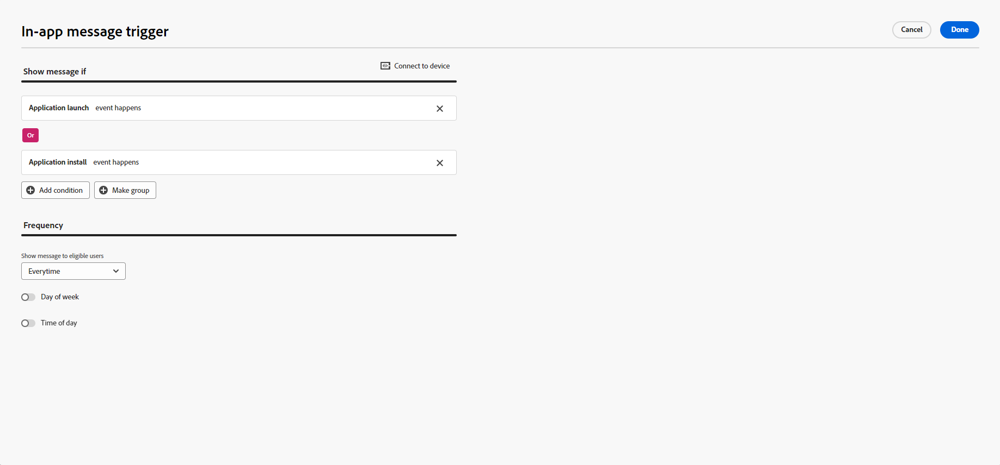
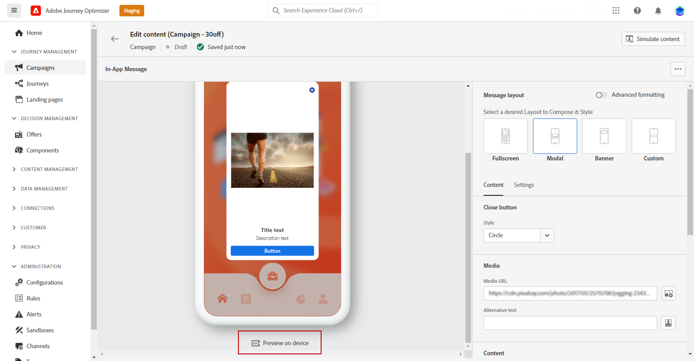

# Skapa ett meddelande i appen {#create-in-app}

## Skapa en kampanj och ett meddelande i appen{#create-in-app-in-a-campaign}

Följ stegen nedan för att skapa ett meddelande i appen:

1. Öppna **[!UICONTROL Campaigns]** menyn och klicka sedan på **[!UICONTROL Create campaign]**.

1. I **[!UICONTROL Properties]** anger du när kampanjen ska köras.

1. I **[!UICONTROL Actions]** väljer du **[!UICONTROL In-app message]** och **[!UICONTROL App surface]** tidigare konfigurerat för ditt meddelande i appen. Klicka sedan på **[!UICONTROL Create]**.

   [Läs mer om konfiguration i appen](inapp-configuration.md).

   

1. Från **[!UICONTROL Properties]** redigerar du Campaigns **[!UICONTROL Title]** och **[!UICONTROL Description]**.

1. Om du vill tilldela etiketter för anpassad eller grundläggande dataanvändning till landningssidan väljer du **[!UICONTROL Manage access]**. [Läs mer](../administration/object-based-access.md).

1. Klicka på **[!UICONTROL Select audience]** för att definiera målgruppen i listan över tillgängliga Adobe Experience Platform-segment. [Läs mer](../segment/about-segments.md).

   

1. I **[!UICONTROL Identity namespace]** väljer du det namnutrymme som ska användas för att identifiera individerna från det valda segmentet. [Läs mer](../event/about-creating.md#select-the-namespace).

1. Välj hur ofta utlösaren ska visas när meddelandet i appen är aktivt:

   * **[!UICONTROL Show every time]**
   * **[!UICONTROL Show once]**
   * **[!UICONTROL Show until click through]**

1. Välj den händelse som utlöser ditt meddelande i dialogrutan **[!UICONTROL Mobile app trigger]**
nedrullningsbar meny.

   Genom att välja en utlösare väljer du vilken användaråtgärd som gör att meddelandet i appen visas.

   

1. Kampanjer är utformade för att köras ett visst datum eller med en återkommande frekvens. Lär dig hur du konfigurerar **[!UICONTROL Schedule]** av kampanjen i [det här avsnittet](../campaigns/create-campaign.md#schedule).

   

1. Nu kan du börja designa ditt innehåll med **[!UICONTROL Edit content]** -knappen.

   

## Skicka meddelanden i appen{#in-app-send}

### Förhandsgranska på enhet {#preview-device}

Du kan förhandsgranska meddelandet i appen på en viss enhet.

1. Klicka på **[!UICONTROL Preview on device]**.

   

1. Från **[!UICONTROL Connect to device]** fönster, klicka **[!UICONTROL Start]**.

1. Skriv i **[!UICONTROL Base URL]** av programmet och klicka på **[!UICONTROL Next]**.

   

1. Skanna QR-koden med enheten och ange den PIN-kod som visas.

Ditt meddelande i appen kan nu utlösas direkt på din enhet så att du kan förhandsgranska och granska meddelandet på en faktisk enhet.

### Granska och aktivera meddelanden i appen{#in-app-review}

När ditt meddelande i appen har skapats och dess innehåll har definierats och anpassats kan du granska och aktivera det.

Gör så här:

1. Använd **[!UICONTROL Review to activate]** om du vill visa en sammanfattning av meddelandet.

   Sammanfattningen gör att du kan ändra kampanjen om det behövs och kontrollera om någon parameter är felaktig eller saknas.

   

1. Kontrollera att kampanjen är korrekt konfigurerad och klicka sedan på **[!UICONTROL Activate]**.

Din kampanj är nu aktiverad. Det meddelande i appen som konfigurerats i kampanjen skickas omedelbart, eller på det angivna datumet.

När du har skickat det kan du mäta effekten av dina meddelanden i appen i Campaign-rapporten. Mer information om rapportering finns i [det här avsnittet](inapp-report.md).

**Relaterade ämnen:**

* [Design In-app-meddelande](design-in-app.md)
* [Rapport i appen](inapp-report.md)
* [Konfiguration i appen](inapp-configuration.md)
