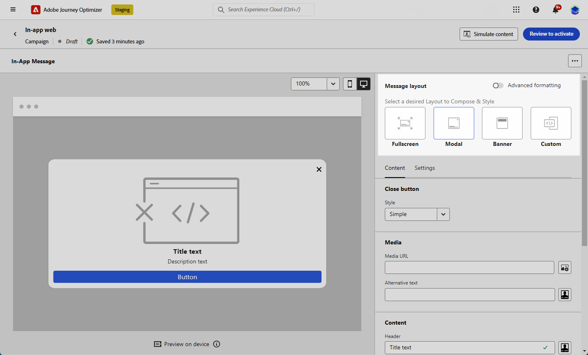
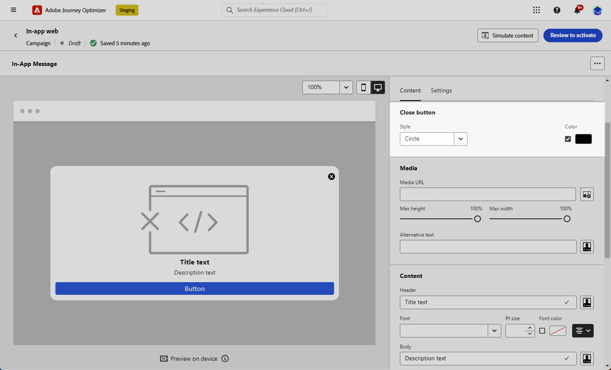
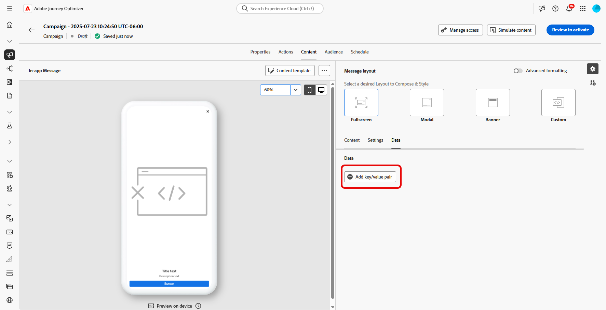

# Designa ditt innehåll i appen {#design-content}

>[!CONTEXTUALHELP]
>id="ajo_campaigns_inapp_content"
>title="Definiera innehåll i appen"
>abstract="Anpassa innehåll och format för meddelanden i appen. Du kan också lägga till media och åtgärdsknappar för att göra budskapen mer engagerande och effektiva."

Du kan redigera innehållet i appen för att konfigurera upplevelsealternativ:

* I en **[!UICONTROL Campaign]** klickar du på knappen **[!UICONTROL Action]** på menyn **[!UICONTROL Edit content]** för att konfigurera meddelandeinnehållet.

  

* I en **[!UICONTROL Journey]** kan du börja designa ditt innehåll med knappen **[!UICONTROL Action]** på den avancerade menyn i ditt program **[!UICONTROL Edit content]**.

  

**[!UICONTROL Advanced formatting]**-växeln aktiverar ytterligare alternativ för att anpassa upplevelsen.

När ditt meddelande i appen har skapats och dess innehåll har definierats och anpassats kan du granska och aktivera det. Meddelanden skickas sedan enligt kampanjschemat. Läs mer på [den här sidan](send-in-app.md).

## Meddelandelayout {#message-layout}

>[!CONTEXTUALHELP]
>id="ajo_campaigns_inapp_authoring_message_layout"
>title="Definiera innehåll i appen"
>abstract="Meddelandelayouten innehåller mallar som du använder ofta för att rama in meddelandet. Anpassad layout innehåller alternativ för att överföra eller skapa anpassade HTML-meddelanden."

I avsnittet **[!UICONTROL Message Layout]** väljer du ett av de fyra olika layoutalternativen som du kan välja mellan beroende på ditt meddelandebehov.

* **[!UICONTROL Fullscreen]**: Den här typen av layout täcker hela skärmen på målenheterna.

  Den stöder medie- (bild, video), text- och knappkomponenter.

* **[!UICONTROL Modal]**: Layouten visas i ett stort varningsfönster och programmet visas fortfarande i bakgrunden.

  Den stöder medie- (bild, video), text- och knappkomponenter.

* **[!UICONTROL Banner]**: Den här typen av layout visas som ett systemspecifikt varningsmeddelande.

  Du kan bara lägga till en **[!UICONTROL Header]** och en **[!UICONTROL Body]** i meddelandet.

* **[!UICONTROL Custom]**: I det anpassade meddelandeläget kan du importera och redigera ett av dina förkonfigurerade HTML-meddelanden direkt.

   * Välj **[!UICONTROL Compose]** om du vill ange eller klistra in HTML-råkod.

     Använd den vänstra rutan för att utnyttja Journey Optimizer personaliseringsfunktioner. Mer information om detta finns i [det här avsnittet](../personalization/personalize.md).

   * Välj **[!UICONTROL Import]** om du vill importera HTML- eller ZIP-filen med ditt HTML-innehåll.

## Fliken Innehåll {#content-tab}

På fliken **Innehåll** kan du definiera och anpassa innehållet i meddelandet och formatet för knappen **Stäng** . Du kan också lägga till media i meddelanden i appen och lägga till åtgärdsknappar på den här fliken.

### Knappen Stäng {#close-button}

>[!CONTEXTUALHELP]
>id="ajo_campaigns_inapp_authoring_close"
>title="Välj en stil för knappen Stäng."
>abstract="I avsnittet med stängningsknappar finns alternativ för att välja varianter av meddelandestängningsknappen och ett alternativ för att överföra en anpassad bild."

Välj **[!UICONTROL Style]** för **[!UICONTROL Close button]**.

Tillgängliga format är:

* **[!UICONTROL Simple]**
* **[!UICONTROL Circle]**
* **[!UICONTROL Custom image]** från en medie-URL eller din Assets.

+++Fler alternativ med avancerad formatering

Om **[!UICONTROL Advanced formatting mode]** är aktiverat kan du markera alternativet **[!UICONTROL Color]** och välja färg och opacitet för knappen.

+++

### Media {#add-media}

>[!CONTEXTUALHELP]
>id="ajo_campaigns_inapp_authoring_media"
>title="Lägg till media i ditt meddelande i appen för att skapa en övertygande upplevelse för slutanvändaren."
>abstract="Ange antingen en direkt länk till innehållet eller använd resursväljaren för att välja media i Resurser Essentials som ska läggas till i meddelandet."

I fältet **[!UICONTROL Media]** kan du lägga till media i ditt meddelande i appen för att skapa en övertygande upplevelse för slutanvändaren.

Ange din medie-URL eller klicka på ikonen **[!UICONTROL Select Assets]** för att lägga till resurser som lagras i ditt Assets-bibliotek direkt i ditt meddelande i appen. [Läs mer om resurshantering](../integrations/assets.md).
Du kan också lägga till en **[!UICONTROL Alternative text]** för skärmläsningsprogram.

+++Fler alternativ med avancerad formatering

Om **[!UICONTROL Advanced formatting mode]** är aktiverat kan du anpassa **[!UICONTROL Max height]** och **[!UICONTROL Max width]** för dina media.

+++

### Innehåll {#title-body}

>[!CONTEXTUALHELP]
>id="ajo_campaigns_inapp_authoring_content"
>title="Skriv innehållet i fälten Rubrik och Brödtext för att skapa meddelandet."
>abstract="Både rubrik och brödtext kan läggas till här. Om du vill ta med personaliseringstoken öppnar du dialogrutan för personalisering."

Skriv innehållet i fälten **[!UICONTROL Header]** och **[!UICONTROL Body]** för att skapa meddelandet.

Använd ikonen **[!UICONTROL Personalization]** för att lägga till personalisering. Läs mer om personalisering i Adobe Journey Optimizer personaliseringsredigerare [i det här avsnittet](../personalization/personalize.md).

+++Fler alternativ med avancerad formatering

Om **[!UICONTROL Advanced formatting mode]** är aktiverat kan du välja för **[!UICONTROL Header]** och **[!UICONTROL Body]**:

* **[!UICONTROL Font]**
* **[!UICONTROL Pt size]**
* **[!UICONTROL Font Color]**
* **[!UICONTROL Alignment]**
+++

### Knappar {#add-buttons}

>[!CONTEXTUALHELP]
>id="ajo_campaigns_inapp_authoring_buttons"
>title="Lägg till knappar så att användarna kan interagera med meddelandet i appen."
>abstract="I det här avsnittet kan du lägga till call-to-action-knappar i meddelandet. Du kan inkludera egen text och mål för varje knapp."

Lägg till knappar så att användarna kan interagera med meddelandet i appen.

Så här anpassar du knappen:

1. Redigera textfältet Knapp 1 (primär). Du kan också använda ikonen **[!UICONTROL Personalization]** för att definiera innehåll och personaliseringsdata.

1. Välj din **[!UICONTROL Interact event]** som definierar knappens åtgärd efter att användarna interagerat med den.

1. Ange din webb-URL eller deplink i fältet **[!UICONTROL Target]**.

1. Om du vill lägga till flera knappar klickar du på **[!UICONTROL Add button]**.

+++Fler alternativ med avancerad formatering

Om **[!UICONTROL Advanced formatting mode]** är aktiverat kan du välja för **[!UICONTROL Buttons]**:

* **[!UICONTROL Font]**
* **[!UICONTROL Pt size]**
* **[!UICONTROL Font Color]**
* **[!UICONTROL Alignment]**
* **[!UICONTROL Button style]**
* **[!UICONTROL Radius]**
* **[!UICONTROL Button color]**

+++

## Fliken Inställningar {#settings-tab}

På fliken **Inställningar** kan du definiera meddelandelayouten och förhandsgranska meddelandet i appen. Du kan även komma åt avancerade formateringsalternativ.

### Förhandsgranskning {#preview-tab}

>[!CONTEXTUALHELP]
>id="ajo_campaigns_inapp_authoring_preview"
>title="Förhandsgranska meddelandet i appen."
>abstract="Det här är den förhandsvisningsbild som visas när meddelandet skickas till enhetens meddelandesammanfattning."

>[!NOTE]
>
>Förhandsgranskning är bara tillgängligt för meddelanden i appen för mobiler.

Med **[!UICONTROL App Preview]** kan du lägga till en bakgrund bakom ditt meddelande i appen:

* Ett medium från en URL-länk.

* En resurs från ditt Assets-bibliotek.

* En bakgrundsfärg.

### Layout {#layout-options}

>[!CONTEXTUALHELP]
>id="ajo_campaigns_inapp_authoring_layout"
>title="Definiera meddelandelayouten för ditt meddelande i appen."
>abstract="I det här avsnittet kan du lägga till en bakgrund i meddelandet i appen. Detta kräver att övertagandet av användargränssnittet är aktiverat."

I fältet **[!UICONTROL Background image]** kan du lägga till en bakgrund i meddelandet i appen:

* Ett medium från en URL-länk.

* En bakgrundsfärg.

### Meddelande {#message-tab}

>[!CONTEXTUALHELP]
>id="ajo_campaigns_inapp_authoring_message_advanced"
>title="Definiera de avancerade inställningarna för meddelandet."
>abstract="I det här avsnittet kan du förbättra personaliseringen av ditt innehåll i appen, särskilt när avancerad formatering är aktiverat."

Med alternativet för övertagande av användargränssnitt, som är aktiverat som standard, kan du göra bakgrunden bakom ditt meddelande i appen mörkare för att framhäva fokus på ditt innehåll.

+++Fler alternativ med avancerad formatering

Om **[!UICONTROL Advanced formatting mode]** är aktiverat kan du anpassa meddelandet ytterligare med följande alternativ:

* **[!UICONTROL Customize gestures]**: gör att du kan anpassa vad användaren kan dra i. Om du väljer Avvisa kan du lägga till en anpassad interaktionshändelse och/eller målmål.

* **[!UICONTROL Customize UI takeover]**: gör att du kan välja en färg som ska visas i bakgrunden och dess opacitet.

* **[!UICONTROL Customize size]**: gör att du kan justera bredd och höjd för meddelanden i appen.

* **[!UICONTROL Customize position]**: gör att du kan anpassa positionen för dina meddelanden i appen på användarnas skärm. Du kan ändra justeringarna Lodrätt och Vågrätt.

* **[!UICONTROL Customize animation]**: gör att du kan anpassa dina Display- och Dismiss-animeringar, t.ex. om du får meddelanden i appen från vänster eller överst på användarens enhet.

* **[!UICONTROL Message round corner]**: gör att du kan lägga till runda hörn i meddelanden i appen genom att ändra **[!UICONTROL Corner radius]**.

+++

## Fliken Data {#data-tab}

På fliken **Data** kan du definiera en **[!UICONTROL Key]**-&#x200B; och **[!UICONTROL Value]** för att inkludera anpassade variabler i nyttolasten. Med dessa nyckel-/värdepar kan du skicka ytterligare data beroende på din konfiguration.

Mer information finns i [Utvecklardokumentationen](https://developer.adobe.com/client-sdks/edge/adobe-journey-optimizer/in-app-message/tutorials/messaging-metadata/).

1. På fliken **[!UICONTROL Data]** väljer du **[!UICONTROL Add key/value pair]**.

   

1. Fyll i fälten **[!UICONTROL Key]** &#x200B; och **[!UICONTROL Value]**.

   

1. Klicka på  om du vill ta bort de par som behövs.

**Relaterade ämnen:**

* [Skapa meddelande i appen](create-in-app.md)
* [Rapport i appen](../reports/campaign-global-report-cja-inapp.md)
* [Konfiguration i appen](inapp-configuration.md)

## Instruktionsvideo{#video}

I videon nedan visas hur du skapar och testar meddelanden i appen.

>[!VIDEO](https://video.tv.adobe.com/v/3410471?quality=12&learn=on)
