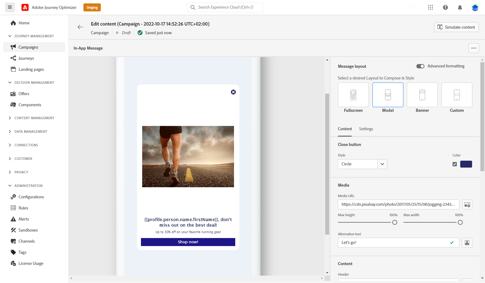

# Kom igång med kanalen i appen {#gs-in-app}

Meddelanden i appen är meddelanden som du kan skicka till användare i appen för att dirigera dem mot specifika intressepunkter. Meddelanden i appen kan användas för att föreslå en tjänst, marknadsföra en ny funktion, ett specialerbjudande eller introducera en ny användare.

Använd Journey Optimizer för att skapa meddelanden i appen och konfigurera upplevelsealternativ, inklusive meddelandelayout, visning, text och knappalternativ.

## Förutsättningar{#prerequisites-in-app}

Innan du skickar meddelanden i appen måste du:

* Konfigurera kanalen i appen. [Läs mer](inapp-configuration.md)

* Kontrollera att du har rätt behörigheter för Journey Optimizer-kampanjer innan du startar. [Läs mer](../campaigns/get-started-with-campaigns.md#campaign-prerequisites)

När du är klar kan du skapa, konfigurera och skicka ditt första meddelande i appen. Lär dig hur du uppnår detta i [det här avsnittet](create-in-app.md).

**Relaterade ämnen:**

* [Skapa meddelande i appen](create-in-app.md)
* [Design In-app-meddelande](design-in-app.md)
* [Rapport i appen](inapp-report.md)
* [Konfiguration i appen](inapp-configuration.md)
