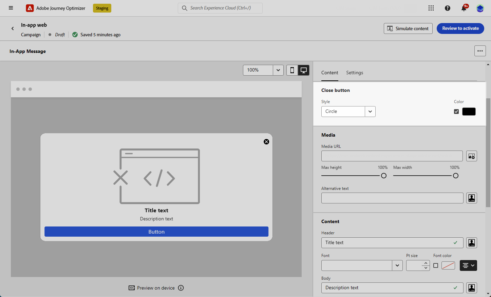

# Designa ditt webbinnehåll i appen {#in-app-web-design}

>[!BEGINSHADEBOX]

**Innehållsförteckning**

* [Konfigurera webbkanalen i appen](configure-in-app-web.md)
* [Skapa en webbkampanj i appen](create-in-app-web.md)
* **[Designa ditt webbinnehåll i appen](#in-app-web-design)**

>[!ENDSHADEBOX]

Om du vill redigera innehållet i meddelandet i appen klickar du på **[!UICONTROL Edit content]** från **[!UICONTROL Action]** -menyn i din Campaign.

The **[!UICONTROL Advanced formatting]** växlar aktiverar ytterligare alternativ för att anpassa upplevelsen.

När ditt meddelande i appen har skapats och dess innehåll har definierats och anpassats kan du granska och aktivera det. Meddelanden skickas sedan enligt kampanjschemat. Läs mer i [den här sidan](send-in-app.md).

## Meddelandelayout {#message-layout}

Från **[!UICONTROL Message Layout]** väljer du ett av de fyra olika layoutalternativen som du kan välja mellan beroende på ditt meddelandebehov.

* **[!UICONTROL Fullscreen]**: Den här typen av layout täcker hela skärmen på målenheterna.

  Den stöder medie- (bild, video), text- och knappkomponenter.

* **[!UICONTROL Modal]**: Layouten visas i ett stort varningsfönster och programmet visas fortfarande i bakgrunden.

  Den stöder medie- (bild, video), text- och knappkomponenter.

* **[!UICONTROL Banner]**: Den här typen av layout visas som ett systemspecifikt varningsmeddelande.

  Du kan bara lägga till en **[!UICONTROL Header]** och **[!UICONTROL Body]** till ditt meddelande.

* **[!UICONTROL Custom]**: I det anpassade meddelandeläget kan du importera och redigera ett av dina förkonfigurerade HTML-meddelanden direkt.

   * Välj **[!UICONTROL Compose]** för att ange eller klistra in HTML-koden i Raw-format.

     Använd den vänstra rutan för att utnyttja Journey Optimizer personaliseringsfunktioner. Mer information om detta finns i [det här avsnittet](../personalization/personalize.md).

   * Välj **[!UICONTROL Import]** om du vill importera HTML- eller ZIP-filen med HTML.

## Fliken Innehåll {#content-tab}

Från **Innehåll** kan du definiera och anpassa innehållet i meddelandet och formatet för **Stäng** -knappen. Du kan också lägga till media i meddelanden i appen och lägga till åtgärdsknappar på den här fliken.

### Knappen Stäng {#close-button}

Välj **[!UICONTROL Style]** på **[!UICONTROL Close button]**.

Tillgängliga format är:

* **[!UICONTROL Simple]**
* **[!UICONTROL Circle]**
* **[!UICONTROL Custom image]** från en medie-URL eller dina resurser.

+++Fler alternativ med avancerad formatering

Om **[!UICONTROL Advanced formatting mode]** är aktiverad kan du kontrollera **[!UICONTROL Color]** om du vill välja färg och opacitet för knappen.

+++

### Media {#add-media}

The **[!UICONTROL Media]** I kan du lägga till media i dina meddelanden i appen för att skapa en övertygande upplevelse för slutanvändaren.

Ange din medie-URL eller klicka på **[!UICONTROL Select Assets]** om du vill lägga till resurser som lagras i ditt resursbibliotek direkt i ditt meddelande i appen. [Läs mer om resurshantering](../content-management/assets-essentials.md).
Du kan också lägga till en **[!UICONTROL Alternative text]** för skärmläsningsprogram.

+++Fler alternativ med avancerad formatering

Om **[!UICONTROL Advanced formatting mode]** är aktiverat kan du anpassa **[!UICONTROL Max height]** och **[!UICONTROL Max width]** av era medier.

+++

### Innehåll {#title-body}

Skriv innehållet i **[!UICONTROL Header]** och **[!UICONTROL Body]** fält.

Använd **[!UICONTROL Personalization]** ikon för att lägga till personalisering. Läs mer om personalisering i Adobe Journey Optimizer Expression Editor [i det här avsnittet](../personalization/personalize.md).

+++Fler alternativ med avancerad formatering

Om **[!UICONTROL Advanced formatting mode]** är aktiverat kan du välja för **[!UICONTROL Header]** och **[!UICONTROL Body]**:

* den **[!UICONTROL Font]**
* den **[!UICONTROL Pt size]**
* den **[!UICONTROL Font Color]**
* den **[!UICONTROL Alignment]**
+++

### Knappar {#add-buttons}

Lägg till knappar så att användarna kan interagera med meddelandet i appen.

Så här anpassar du knappen:

1. Redigera textfältet Knapp 1 (primär). Du kan också använda **[!UICONTROL Personalization]** -ikon för att definiera innehåll och personaliseringsdata.

1. Välj **[!UICONTROL Interact event]** som definierar knappens åtgärd efter att användarna interagerat med den.

1. Ange webb-URL:en eller länken till **[!UICONTROL Target]** fält.

1. Om du vill lägga till flera knappar klickar du **[!UICONTROL Add button]**.

+++Fler alternativ med avancerad formatering

Om **[!UICONTROL Advanced formatting mode]** är aktiverat kan du välja för **[!UICONTROL Buttons]**:

* den **[!UICONTROL Font]**
* den **[!UICONTROL Pt size]**
* den **[!UICONTROL Font Color]**
* den **[!UICONTROL Alignment]**
* den **[!UICONTROL Button style]**
* den **[!UICONTROL Radius]**
* den **[!UICONTROL Button color]**

+++

## Fliken Inställningar {#settings-tab}

Från **Inställningar** kan du definiera meddelandelayouten och förhandsgranska meddelandet i appen. Du kan även komma åt avancerade formateringsalternativ.

### Layout {#layout-options}

The **[!UICONTROL Background image]** I kan du lägga till en bakgrund i meddelandet i appen:

* Ett medium från en URL-länk.

* En bakgrundsfärg.

### Meddelande {#message-tab}

Med alternativet för övertagande av användargränssnitt, som är aktiverat som standard, kan du göra bakgrunden bakom ditt meddelande i appen mörkare för att framhäva fokus på ditt innehåll.

+++Fler alternativ med avancerad formatering

Om **[!UICONTROL Advanced formatting mode]** är aktiverat kan du anpassa meddelandet ytterligare med följande alternativ:

* **[!UICONTROL Customize UI takeover]**: låter dig välja en färg som ska visas i bakgrunden och dess opacitet.

* **[!UICONTROL Customize size]**: låter dig justera bredd och höjd för meddelanden i appen.

* **[!UICONTROL Customize position]**: låter dig anpassa positionen för dina meddelanden i appen på användarnas skärm. Du kan ändra justeringarna Lodrätt och Vågrätt.

* **[!UICONTROL Message round corner]**: gör att du kan lägga till runda hörn i meddelanden i appen genom att ändra **[!UICONTROL Corner radius]**.

+++

**Relaterade ämnen:**

* [Testa och skicka meddelandet i appen](send-in-app.md)
* [Rapport i appen](../reports/campaign-global-report.md#inapp-report)
* [Konfiguration i appen](inapp-configuration.md)