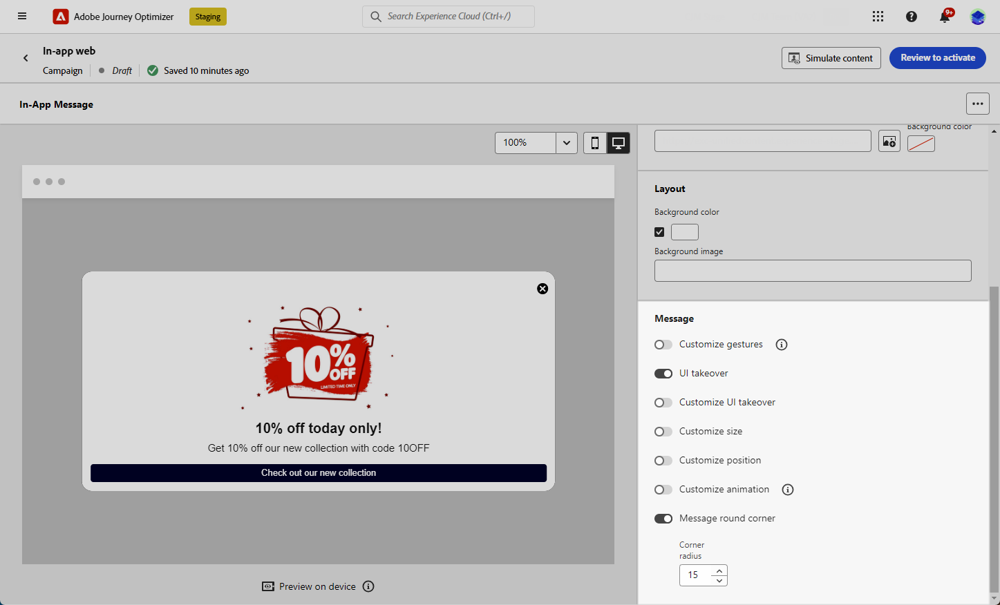

# Designa ditt webbinnehåll i appen {#in-app-web-design}

>[!BEGINSHADEBOX]

**Innehållsförteckning**

* [Konfigurera webbkanalen i appen](configure-in-app-web.md)
* [Skapa en webbkampanj i appen](create-in-app-web.md)
* Designa ditt webbinnehåll i appen

>[!ENDSHADEBOX]

Om du vill redigera innehållet i meddelandet i appen klickar du på knappen **[!UICONTROL Edit content]** på menyn **[!UICONTROL Action]** i din kampanj.

**[!UICONTROL Advanced formatting]**-växeln aktiverar ytterligare alternativ för att anpassa upplevelsen.

När ditt meddelande i appen har skapats och dess innehåll har definierats och anpassats kan du granska och aktivera det. Meddelanden skickas sedan enligt kampanjschemat. Läs mer på [den här sidan](send-in-app.md).

## Meddelandelayout {#message-layout}

I avsnittet **[!UICONTROL Message Layout]** väljer du ett av de fyra olika layoutalternativen som du kan välja mellan beroende på ditt meddelandebehov.

* **[!UICONTROL Fullscreen]**: Den här typen av layout täcker hela skärmen på målenheterna.

  Den stöder medie- (bild, video), text- och knappkomponenter.

* **[!UICONTROL Modal]**: Layouten visas i ett stort varningsfönster och programmet visas fortfarande i bakgrunden.

  Den stöder medie- (bild, video), text- och knappkomponenter.

* **[!UICONTROL Banner]**: Den här typen av layout visas som ett systemspecifikt varningsmeddelande.

  Du kan bara lägga till en **[!UICONTROL Header]** och en **[!UICONTROL Body]** i meddelandet.

* **[!UICONTROL Custom]**: I det anpassade meddelandeläget kan du importera och redigera ett av dina förkonfigurerade HTML-meddelanden direkt.

   * Välj **[!UICONTROL Compose]** om du vill ange eller klistra in HTML-råkod.

     Använd den vänstra rutan för att utnyttja Journey Optimizer personaliseringsfunktioner. Mer information om detta finns i [det här avsnittet](../personalization/personalize.md).

   * Välj **[!UICONTROL Import]** om du vill importera HTML- eller ZIP-filen med ditt HTML-innehåll.

## Fliken Innehåll {#content-tab}

På fliken **Innehåll** kan du definiera och anpassa innehållet i meddelandet och formatet för knappen **Stäng** . Du kan också lägga till media i meddelanden i appen och lägga till åtgärdsknappar på den här fliken.

### Knappen Stäng {#close-button}

Välj **[!UICONTROL Style]** för **[!UICONTROL Close button]**.

Tillgängliga format är:

* **[!UICONTROL Simple]**
* **[!UICONTROL Circle]**
* **[!UICONTROL Custom image]** från en medie-URL eller din Assets.

+++Fler alternativ med avancerad formatering

Om **[!UICONTROL Advanced formatting mode]** är aktiverat kan du markera alternativet **[!UICONTROL Color]** och välja färg och opacitet för knappen.

+++

### Media {#add-media}

I fältet **[!UICONTROL Media]** kan du lägga till media i ditt meddelande i appen för att skapa en övertygande upplevelse för slutanvändaren.

Ange din medie-URL eller klicka på ikonen **[!UICONTROL Select Assets]** för att lägga till resurser som lagras i ditt Assets-bibliotek direkt i ditt meddelande i appen. <!--[Learn more about asset management](../content-management/assets-essentials.md).-->

Du kan också lägga till en **[!UICONTROL Alternative text]** för skärmläsningsprogram.

+++Fler alternativ med avancerad formatering

Om **[!UICONTROL Advanced formatting mode]** är aktiverat kan du anpassa **[!UICONTROL Max height]** och **[!UICONTROL Max width]** för dina media.

+++

### Innehåll {#title-body}

Skriv innehållet i fälten **[!UICONTROL Header]** och **[!UICONTROL Body]** för att skapa meddelandet.

Använd ikonen **[!UICONTROL Personalization]** för att lägga till personalisering. Läs mer om personalisering i Adobe Journey Optimizer personaliseringsredigerare [i det här avsnittet](../personalization/personalize.md).

+++Fler alternativ med avancerad formatering

Om **[!UICONTROL Advanced formatting mode]** är aktiverat kan du välja för **[!UICONTROL Header]** och **[!UICONTROL Body]**:

* **[!UICONTROL Font]**
* **[!UICONTROL Pt size]**
* **[!UICONTROL Font Color]**
* **[!UICONTROL Alignment]**
+++

### Knappar {#add-buttons}

Lägg till knappar så att användarna kan interagera med meddelandet i appen.

Så här anpassar du knappen:

1. Redigera textfältet Knapp 1 (primär). Du kan också använda ikonen **[!UICONTROL Personalization]** för att definiera innehåll och personaliseringsdata.

1. Välj din **[!UICONTROL Interact event]** som definierar knappens åtgärd efter att användarna interagerat med den.

1. Ange din webb-URL eller deplink i fältet **[!UICONTROL Target]**.

1. Om du vill lägga till flera knappar klickar du på **[!UICONTROL Add button]**.

+++Fler alternativ med avancerad formatering

Om **[!UICONTROL Advanced formatting mode]** är aktiverat kan du välja för **[!UICONTROL Buttons]**:

* **[!UICONTROL Font]**
* **[!UICONTROL Pt size]**
* **[!UICONTROL Font Color]**
* **[!UICONTROL Alignment]**
* **[!UICONTROL Button style]**
* **[!UICONTROL Radius]**
* **[!UICONTROL Button color]**

+++

## Fliken Inställningar {#settings-tab}

På fliken **Inställningar** kan du definiera meddelandelayouten och förhandsgranska meddelandet i appen. Du kan även komma åt avancerade formateringsalternativ.

### Layout {#layout-options}

I fältet **[!UICONTROL Background image]** kan du lägga till en bakgrund i meddelandet i appen:

* Ett medium från en URL-länk.

* En bakgrundsfärg.

### Meddelande {#message-tab}

Med alternativet för övertagande av användargränssnitt, som är aktiverat som standard, kan du göra bakgrunden bakom ditt meddelande i appen mörkare för att framhäva fokus på ditt innehåll.

+++Fler alternativ med avancerad formatering

Om **[!UICONTROL Advanced formatting mode]** är aktiverat kan du anpassa meddelandet ytterligare med följande alternativ:

* **[!UICONTROL Customize UI takeover]**: gör att du kan välja en färg som ska visas i bakgrunden och dess opacitet.

* **[!UICONTROL Customize size]**: gör att du kan justera bredd och höjd för meddelanden i appen.

* **[!UICONTROL Customize position]**: gör att du kan anpassa positionen för dina meddelanden i appen på användarnas skärm. Du kan ändra justeringarna Lodrätt och Vågrätt.

* **[!UICONTROL Message round corner]**: gör att du kan lägga till runda hörn i meddelanden i appen genom att ändra **[!UICONTROL Corner radius]**.

+++

**Relaterade ämnen:**

* [Testa och skicka meddelandet i appen](send-in-app.md)
* [Rapport i appen](../reports/campaign-global-report-cja-inapp.md)
* [Konfiguration i appen](inapp-configuration.md)