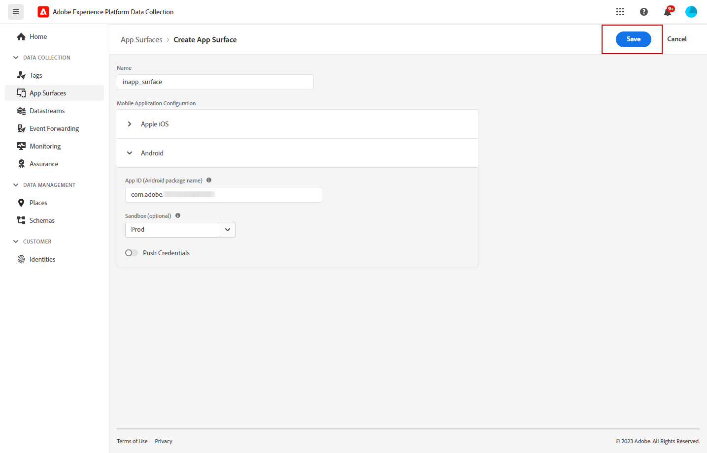

# Krav och konfiguration {#inapp-configuration}

## Konfigurationssteg {#inapp-steps}

Om du vill skicka meddelanden i appen under dina resor och kampanjer med [!DNL Journey Optimizer] måste du gå igenom följande konfigurationssteg.

1. Se till att du har rätt behörigheter för Journey Optimizer-kampanjer innan du startar, även om du bara tänker använda meddelanden i appen under resor. Kampanjbehörigheter krävs fortfarande. [Läs mer](../campaigns/get-started-with-campaigns.md#campaign-prerequisites).
En specifik behörighet måste beviljas för åtkomst till menyn **Appytor** i Adobe Experience Platform Data Collection. Läs mer i [den här videon](#video).
1. Aktivera Adobe Journey Optimizer i datastream för Adobe Experience Platform Data Collection och kontrollera din standardpolicy för sammanslagning i Adobe Experience Platform, enligt beskrivningen i [Leveranskrav](#delivery-prerequisites) nedan.
1. Skapa och konfigurera en appyta i Adobe Experience Platform Data Collection, vilket beskrivs i [det här avsnittet](#channel-prerequisites).
1. Om du använder innehållsexperiment måste du följa de krav som anges i [det här avsnittet](#experiment-prerequisite).

När du är klar kan du skapa, konfigurera och skicka ditt första meddelande i appen. Lär dig hur du uppnår detta i [det här avsnittet](create-in-app.md).

## Leveransvillkor {#delivery-prerequisites}

För att meddelanden i appen ska kunna levereras på rätt sätt måste följande inställningar definieras:

* I [Adobe Experience Platform Data Collection](https://experienceleague.adobe.com/docs/experience-platform/edge/datastreams/overview.html){target="_blank"} kontrollerar du att du har en datastream definierad, till exempel under **[!UICONTROL Adobe Experience Platform]**-tjänsten som du har aktiverat alternativet Adobe Experience Platform Edge och **[!UICONTROL Adobe Journey Optimizer]**.

  Detta säkerställer att Journey Optimizer inkommande händelser hanteras korrekt av Adobe Experience Platform Edge. [Läs mer](https://experienceleague.adobe.com/docs/experience-platform/edge/datastreams/configure.html){target="_blank"}

  

* I [Adobe Experience Platform](https://experienceleague.adobe.com/docs/experience-platform/profile/home.html?lang=sv){target="_blank"} kontrollerar du att standardprincipen för sammanslagning har aktiverats med alternativet **[!UICONTROL Active-On-Edge Merge Policy]**. Om du vill göra det väljer du en profil under menyn **[!UICONTROL Customer]** > **[!UICONTROL Profiles]** > **[!UICONTROL Merge Policies]** Experience Platform. [Läs mer](https://experienceleague.adobe.com/docs/experience-platform/profile/merge-policies/ui-guide.html#configure){target="_blank"}

  Den här sammanfogningsprincipen används av [!DNL Journey Optimizer] inkommande kanaler för att aktivera och publicera inkommande kampanjer korrekt. [Läs mer](https://experienceleague.adobe.com/docs/experience-platform/profile/merge-policies/ui-guide.html){target="_blank"}

  >[!NOTE]
  >
  >När du använder en anpassad **[!UICONTROL Dataset preference]**-sammanfogningsprincip måste du lägga till **[!UICONTROL Journey Inbound]**-datauppsättningen i den angivna sammanfogningsprincipen.

  

* Om du vill felsöka leveransen av Journey Optimizer mobilupplevelser kan du använda vyn **Edge Delivery** i **Adobe Experience Platform Assurance**. Med denna plugin kan du granska detaljerade förfrågningar, verifiera om förväntade gränsanrop inträffar och undersöka profildata, inklusive identitetskartor, segmentmedlemskap och inställningar för samtycke. Dessutom kan du granska de aktiviteter som begäran är kvalificerad för och identifiera de som den inte gjorde.

  Genom att använda plugin-programmet **Edge Delivery** får du de insikter du behöver för att förstå och felsöka dina inkommande implementeringar effektivt.

  [Läs mer om Edge Delivery-vyn](https://experienceleague.adobe.com/en/docs/experience-platform/assurance/view/edge-delivery)

## Krav för kanalkonfiguration {#channel-prerequisites}

1. Öppna menyn **[!UICONTROL App surfaces]** och klicka på **[!UICONTROL Create App surface]**.

1. Lägg till ett namn i din **[!UICONTROL App surface]**.

   

1. Konfigurera ditt mobilprogram för Apple iOS i listrutan **[!UICONTROL Apple iOS]**.

+++ Läs mer

   1. Skriv in din/ditt **[!UICONTROL iOS Bundle ID]**. Mer information om **Paket-ID** finns i [Apple-dokumentationen](https://developer.apple.com/documentation/appstoreconnectapi/bundle_ids).

   1. (valfritt) Välj **[!UICONTROL Sandbox]** varifrån du vill skicka push-meddelanden. Observera att den nödvändiga åtkomstbehörigheten krävs för att du ska kunna välja en viss sandlåda.

      Mer information om sandlådehantering finns på [den här sidan](../administration/sandboxes.md#assign-sandboxes).

   1. Aktivera alternativet **[!UICONTROL Push credentials]** om du vill dra och släppa .p8-filen för autentiseringsnyckel.

      Du kan också aktivera alternativet **[!UICONTROL Manually enter push credentials]** om du vill kopiera och klistra in APN:s auth-nyckel direkt.

   1. Ange din **[!UICONTROL Key ID]** och **[!UICONTROL Team ID]**.

      

+++

1. Konfigurera ditt mobilprogram för Android i listrutan **[!UICONTROL Android]**.

+++ Läs mer

   1. Skriv in din/ditt **[!UICONTROL Android package name]**. Mer information om **paketnamn** finns i [Android-dokumentationen](https://support.google.com/admob/answer/9972781?hl=en#:~:text=The%20package%20name%20of%20an,supported%20third%2Dparty%20Android%20stores).

   1. (valfritt) Välj **[!UICONTROL Sandbox]** varifrån du vill skicka push-meddelanden. Observera att den nödvändiga åtkomstbehörigheten krävs för att du ska kunna välja en viss sandlåda.

      Mer information om sandlådehantering finns på [den här sidan](../administration/sandboxes.md#assign-sandboxes).

   1. Aktivera alternativet **[!UICONTROL Push credentials]** om du vill dra och släppa .json-filen med den privata nyckeln.

      Du kan också aktivera alternativet **[!UICONTROL Manually enter push credentials]** om du vill kopiera och klistra in den privata FCM-nyckeln direkt.

      

1. Klicka på **[!UICONTROL Save]** när du är klar med konfigurationen av **[!UICONTROL App surface]**.

   

   Din **[!UICONTROL App surface]** är nu tillgänglig när du skapar en ny kampanj med ett meddelande i appen. [Läs mer](create-in-app.md)

1. När du har skapat appytan måste du nu skapa en mobil egenskap.

   Mer information finns på [den här sidan](https://experienceleague.adobe.com/docs/experience-platform/tags/admin/companies-and-properties.html#for-mobile).

   

1. Installera följande tillägg på menyn Tillägg för den nya egenskapen:

   * Adobe Experience Platform Edge Network
   * Adobe Journey Optimizer
   * AEP Assurance
   * Godkännande
   * Identitet
   * Mobile Core
   * Profil

   Mer information finns på [den här sidan](https://experienceleague.adobe.com/docs/experience-platform/tags/ui/extensions/overview.html#add-a-new-extension).

   

Kanalen i appen är nu konfigurerad. Du kan börja skicka meddelanden i appen till dina användare.

## Förutsättningar för innehållsexperiment {#experiment-prerequisites}

Om du vill aktivera innehållsexperiment för InApp-kanal måste du se till att [datamängden](../data/get-started-datasets.md) som används i implementeringen av [datastream](https://experienceleague.adobe.com/docs/experience-platform/datastreams/overview.html){target="_blank"} också ingår i rapportkonfigurationen.

Om du lägger till en datauppsättning som inte finns i webbdataströmmen när du konfigurerar experimentrapporter, kommer webbdata alltså inte att visas i innehållsexperimentrapporter.

Lär dig hur du lägger till datauppsättningar för rapportering av innehållsexperiment i [det här avsnittet](../content-management/reporting-configuration.md#add-datasets).

>[!NOTE]
>
>Datauppsättningen används skrivskyddat av rapportsystemet [!DNL Journey Optimizer] och påverkar inte datainsamling eller datainmatning.

Om du **inte** använder följande fördefinierade [fältgrupper](https://experienceleague.adobe.com/docs/experience-platform/xdm/tutorials/create-schema-ui.html#field-group){target="_blank"} för datamängdsschemat: `AEP Web SDK ExperienceEvent` och `Consumer Experience Event` (enligt definition i [den här sidan](https://experienceleague.adobe.com/docs/platform-learn/implement-web-sdk/initial-configuration/configure-schemas.html#add-field-groups){target="_blank"}), måste du lägga till följande fältgrupper: `Experience Event - Proposition Interactions`, `Application Details`, `Commerce Details` och `Web Details`. Dessa behövs av [!DNL Journey Optimizer]-innehållsexperimentets rapportering när de spårar vilka experiment och behandlingar varje profil deltar i.

>[!NOTE]
>
>När du lägger till dessa fältgrupper påverkas inte den normala datainsamlingen. Den är bara additiv för de sidor där ett experiment pågår, och lämnar all annan spårning orörd.

## Instruktionsvideo{#video}

I videon nedan visas hur du tilldelar behörigheten **Hantera appkonfiguration** för att komma åt appens ytmeny.

>[!VIDEO](https://video.tv.adobe.com/v/3421607)

**Relaterade ämnen:**

* [Skapa ett meddelande i appen](create-in-app.md)
* [Skapa en kampanj](../campaigns/create-campaign.md)
* [Design In-app-meddelande](design-in-app.md)
* [Rapport i appen](../reports/campaign-global-report.md#inapp-report)

