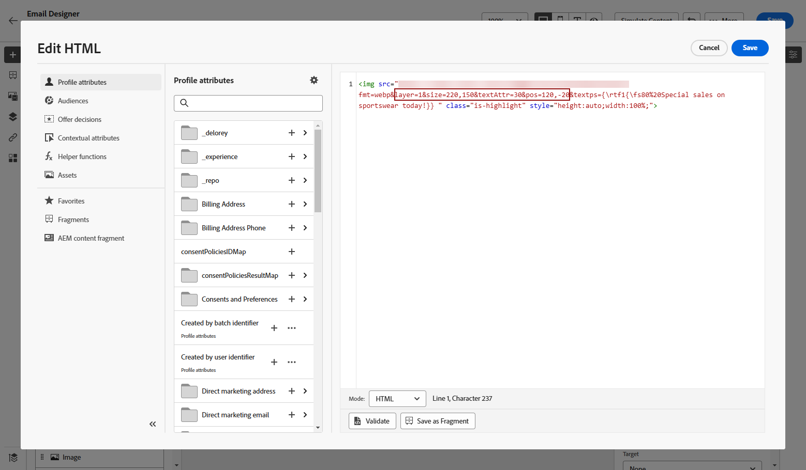
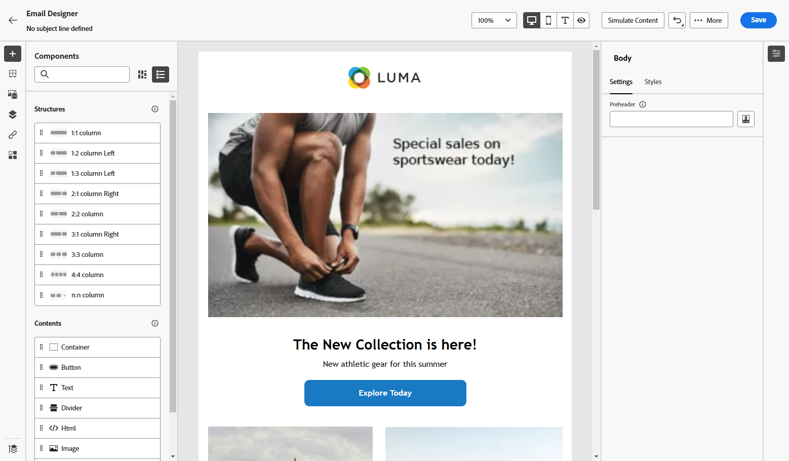

# Arbeta med Dynamic Media {#aem-dynamic}

## Kom igång med Dynamic Media {#gs-aem-dynamic}

Resursväljaren har nu stöd för dynamiska medier, vilket gör att du sömlöst kan välja och använda godkända dynamiska medierenderingar i Journey Optimizer. Ändringar som görs i Adobe Experience Manager återspeglas direkt i ditt Journey Optimizer-innehåll, vilket säkerställer att de senaste versionerna alltid används utan att manuella uppdateringar krävs.

Observera att den här integreringen endast är tillgänglig för kunder som använder Dynamic Media Manager as a Cloud Service.

Mer information om Dynamic Media i Adobe Experience Manager as a Cloud Service finns i [Experience Manager-dokumentationen](https://experienceleague.adobe.com/en/docs/experience-manager-cloud-service/content/assets/dynamicmedia/dynamic-media){target="_blank"}.

>[!AVAILABILITY]
>
>För hälso- och sjukvårdskunder aktiveras integreringen endast när man licensierar Journey Optimizer Healthcare Shield och Adobe Experience Manager Enhanced Security-tillägg.

## Lägga till och hantera dynamiska medier {#dynamic-media}

Förbättra och optimera materialet för alla skärmar och webbläsare genom att infoga dynamiska medier från Adobe Experience Manager as a Cloud Service direkt i Journey Optimizer-materialet.  Du kan sedan ändra storlek, beskära, förbättra och göra andra justeringar efter behov.

>[!IMPORTANT]
>
>Kontrollera att Dynamic Media med OpenAPI är aktiverat i Adobe Experience Manager as a Cloud Service. [Läs mer](https://experienceleague.adobe.com/en/docs/experience-manager-cloud-service/content/assets/dynamicmedia/dynamic-media-open-apis/dynamic-media-open-apis-overview#enable-dynamic-media-open-apis){target="_blank"}.

Dynamisk medieintegrering med Adobe Journey Optimizer är tillgängligt för både Dynamic Media [Scene7-läge](https://experienceleague.adobe.com/en/docs/experience-manager-65/content/assets/dynamic/config-dms7){target="_blank"} och [ med OpenAPI](https://experienceleague.adobe.com/en/docs/experience-manager-cloud-service/content/assets/dynamicmedia/dynamic-media-open-apis/dynamic-media-open-apis-overview){target="_blank"}.

<!--
>[!AVAILABILITY]
>
>Older versions of Outlook (including 2016) do not support rendering of content with Dynamic Media.  We are actively working on a permanent fix to enhance compatibility. In the meantime, apply the following guidelines:
>
>* For Dynamic Media Scene7 URLs: Append `?bfc=on` to the image URL. This enables automatic format negotiation, ensuring the most compatible image format is delivered based on the client's capabilities.
>
>* For Dynamic Media with Open API: Use the `.avif` format. This format includes built-in fallback mechanisms to deliver a compatible format when necessary.
>
-->

Så här lägger du till en Adobe Experience Manager-resurs i ditt HTML-innehåll:

1. Dra och släpp en **[!UICONTROL HTML component]** i ditt innehåll.

1. Välj **[!UICONTROL Show the source code]**.

   

1. Navigera till **[!UICONTROL Edit HTML]** på menyn **[!UICONTROL Assets]** och klicka sedan på **[!UICONTROL Open asset selector]**.

   Du kan också kopiera och klistra in resursens URL.

   

1. Bläddra bland dina AEM-resurser och välj den du vill lägga till i ditt innehåll.

1. Justera bildparametrarna (t.ex. höjd, bredd, rotering, vändning, intensitet, nyans) efter behov för att uppfylla dina mediebehov.

   En omfattande lista över bildparametrar som kan läggas till i URL:en finns i [Experience Manager-dokumentationen](https://experienceleague.adobe.com/en/docs/dynamic-media-developer-resources/image-serving-api/image-serving-api/http-protocol-reference/command-reference/c-command-reference){target="_blank"}.

   

1. Klicka på **[!UICONTROL Save]**.

Innehållet innehåller nu dynamiska medier. Alla uppdateringar du gör i Experience Manager visas automatiskt i Journey Optimizer.

## Anpassa textövertäckningen {#text-overlay}

Anpassa enkelt alla dynamiska medier genom att ersätta den befintliga textövertäckningen med valfri ny text, vilket möjliggör smidiga uppdateringar och personalisering.

Med experimenteringsfunktionen kan du till exempel uppdatera den befintliga textövertäckningen genom att ersätta den med en annan text för varje behandling, så att den anpassas för varje profil när de öppnar sina meddelanden.

>[!AVAILABILITY]
>
>**Anpassning av textövertäckning** är endast tillgängligt i läget [Scene7 ](https://experienceleague.adobe.com/en/docs/experience-manager-65/content/assets/dynamic/config-dms7){target="_blank"} för dynamiska media. Eftersom Scene7-läget inte är tillgängligt för hälso- och sjukvårdskunder återges innehållet med en binär kopia av bilden från Journey Optimizer. Kontakta Adobe om du har några undantag.

Så här anpassar du textövertäckningen:

1. Dra och släpp en **[!UICONTROL HTML component]** i ditt innehåll.

1. Välj **[!UICONTROL Show the source code]**.

1. Öppna **[!UICONTROL Edit HTML]** och sedan **[!UICONTROL Assets]** på menyn **[!UICONTROL Open asset selector]**.

   Du kan också kopiera och klistra in resursens URL.

1. Bläddra bland dina AEM-resurser och välj den du vill lägga till i ditt innehåll.

1. Ersätt övertäckningen med den önskade texten.

   

1. Uppdatera bildparametrarna:

   * **Lager**: Ange baselementet där texten ska placeras.
   * **Storlek**: uppdatera storleken på textblocket.
   * **TextAttr**: justera storleken på textteckensnittet.
   * **Pos**: Ange textens position i bilden.

   >[!WARNING]
   >
   >Parametern Layer krävs för att uppdatera dynamiska medier.

   

1. Klicka på **[!UICONTROL Save]**.

Innehållet innehåller nu din uppdaterade textövertäckning.

## Lägga till och hantera en mall för dynamiska media {#dynamic-media-template}

Lägg enkelt till din Dynamic Media-mall i Journey Optimizer och uppdatera medieinnehållet när det behövs. Ni kan nu lägga in personaliseringsfält i era medier, så att ni kan skapa mer anpassat och engagerande innehåll i Journey Optimizer.

Läs mer om [mallen för dynamiska media](https://experienceleague.adobe.com/en/docs/dynamic-media-classic/using/template-basics/quick-start-template-basics){target="_blank"}.

>[!AVAILABILITY]
>
>**Mallen för dynamiska media** är exklusivt tillgänglig i läget [Scene7](https://experienceleague.adobe.com/en/docs/experience-manager-65/content/assets/dynamic/config-dms7) för dynamiska media. Eftersom Scene7-läget inte är tillgängligt för hälso- och sjukvårdskunder återges inte innehållet. Kontakta Experience Manager support om du har några undantag.

### Med bildkomponent {#image-component}

Du kan infoga den dynamiska mallen direkt i innehållet med komponenten Bild:

1. Öppna kampanjen eller resan och få tillgång till innehållet.

1. Dra och släpp en **bildkomponent** i layouten.

   Mer information om bildkomponenten finns på [den här sidan](../email/content-components.md).

   

1. Bläddra bland dina AEM-resurser och välj den mall för dynamiska medier som du vill lägga till i ditt innehåll.

   

1. Gå till parametrarna för mallen för dynamiska media i **bildinställningarna**.

   Vilka fält som är tillgängliga beror på de parametrar som lagts till när [mallen ](https://experienceleague.adobe.com/en/docs/dynamic-media-classic/using/template-basics/creating-template-parameters#creating_template_parameters){target="_blank"} skapades i Adobe Experience Manager.

   

1. Fyll i de olika fälten och använd anpassningsredigeraren för att lägga till personaliserat innehåll. Du kan använda alla attribut, till exempel profilnamn, ort eller annan relevant information, för att skapa en mer anpassad upplevelse.

   Läs mer om personalisering på [den här sidan](../personalization/personalize.md).

   

1. Villkorligt innehåll kan användas på komponenten Dynamic Media för att generera olika varianter av innehållet. [Läs mer](../personalization/dynamic-content.md)

1. Klicka på **[!UICONTROL Save]**.

När du har utfört testerna och validerat innehållet kan du skicka meddelandet till mottagarna.

### Med HTML-komponent {#html-component}

Du kan infoga den dynamiska mallen direkt i ditt innehåll med HTML-komponenten:

1. Öppna kampanjen eller resan och få tillgång till innehållet.

1. Dra och släpp en **HTML-komponent** i layouten.

   

1. Välj **[!UICONTROL Show the source code]**.

   

1. Öppna **[!UICONTROL Edit HTML]** och sedan **[!UICONTROL Assets]** på menyn **[!UICONTROL Open asset selector]**.

   Du kan också kopiera och klistra in resursens URL.

1. Justera bildens textparametrar efter behov.

   

1. Klicka på **[!UICONTROL Save]**.

När du har utfört testerna och validerat innehållet kan du skicka meddelandet till mottagarna.

<!--
## Personalization with Text Overlay

Easily customize any dynamic media by replacing the existing text overlay with new text of your choice, allowing for seamless updates and personalization.

In this example, our goal is to update the existing text overlay by replacing it with a new validity date and adding a personalization block, ensuring it is customized for each profile when they open their messages.

1. Drag and drop an **[!UICONTROL HTML component]** into your content.

1. Select **[!UICONTROL Show the source code]**.

1. From the **[!UICONTROL Edit HTML]** menu, access **[!UICONTROL Assets]** then **[!UICONTROL Open asset selector]**.

    You can also simply copy and paste your assets URL.

1. Browse through your AEM assets and select the one you want to add to your content.

1. Replace the overlay with the desired text.

    Here we change the validity date from 31st December 2024 to the 1st July 2025.

1. Add the required personalization fields to your image.

1. Click **[!UICONTROL Save]**.

Your content now includes your updated text overlay and personalization.

## Add Dynamic media conditional content

Enable conditional content in your dynamic media to better target your audience and deliver a more personalized experience.

1. Drag and drop an **[!UICONTROL HTML component]** into your content.

1. Select **[!UICONTROL Show the source code]**.

1. From the **[!UICONTROL Edit HTML]** menu, access **[!UICONTROL Assets]** then **[!UICONTROL Open asset selector]**.

    You can also simply copy and paste your assets URL.

1. Browse through your AEM assets and select the one you want to add to your content.

1. Once your dynamic media is inserted to your content, select **[!UICONTROL Enable conditional]** content from your HTML component toolbar to create your different user experiences. 

1. From the Variant - 1, click **[!UICONTROL Select condition]** to fine tune your audience.

1. Choose your condition or create a new one if needed and click **[!UICONTROL Select]**.

    [Learn more about conditions](../personalization/create-conditions.md)

1. Select your **[!UICONTROL Component]** and access the **[!UICONTROL Settings]** menu.

1. In the **[!UICONTROL Custom Attributes]** menu, populate the Dynamic Media text and personalization fields to customize the content for your audience.

-->

## Instruktionsvideo {#video}

Lär dig integrera Adobe Experience Manager Dynamic Media med Adobe Journey Optimizer för att möjliggöra innehållsuppdateringar och personalisering i realtid.

I den här självstudiekursen beskrivs hur du ändrar bilder direkt i AJO, lägger till textöverlägg i HTML-läge, skapar dynamiska mediamallar i AEM för personalisering och anpassar kampanjer genom att anpassa innehåll för olika målgruppssegment. Tack vare den här integreringen kan marknadsförarna effektivt skapa engagerande och personaliserade kampanjer utan att behöva växla mellan olika program.

>[!VIDEO](https://video.tv.adobe.com/v/3457695/?learn=on&enablevpops=&autoplay=true)

