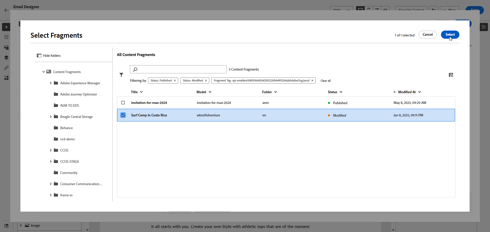

# Adobe Experience Manager Content Fragments {#aem-fragments}

Genom att integrera Adobe Experience Manager as a Cloud Service med Adobe Journey Optimizer kan du nu smidigt införliva dina AEM Content Fragments i ditt Journey Optimizer-innehåll. Denna smidiga anslutning förenklar processen att komma åt och utnyttja AEM-innehåll, vilket gör det möjligt att skapa personaliserade och dynamiska kampanjer och resor.

Mer information om AEM Content Fragments finns i [Arbeta med innehållsfragment](https://experienceleague.adobe.com/en/docs/experience-manager-cloud-service/content/sites/administering/content-fragments/content-fragments-with-journey-optimizer){target="_blank"} i Experience Manager-dokumentationen.

## Före start {#start}

>[!AVAILABILITY]
>
>För hälso- och sjukvårdskunder aktiveras integreringen endast när man licensierar Journey Optimizer Healthcare Shield och Adobe Experience Manager Enhanced Security-tillägg.

### Begränsningar {#limitations}

Observera följande begränsningar när du arbetar med Adobe Experience Manager Content Fragments i Journey Optimizer:

* **Typer av innehållsfragment**: Enkla innehållsfragment och kapslade innehållsfragment stöds. Varianter av innehållsfragment stöds för närvarande inte.

* **Flerspråkigt innehåll**: Endast det manuella flödet stöds. Varje språkvariant måste vara självständigt skapad i Adobe Experience Manager, taggad, publicerad och manuellt vald i Journey Optimizer. Det finns ingen automatisk språkupplösning eller reservmekanism.

* **Databasåtkomst**: Journey Optimizer integreras exklusivt med Adobe Experience Manager Publish-nivån, där innehållsfragment är tillgängliga via en offentlig, oautentiserad slutpunkt. Författardatabaser kan visas i databasväljaren, men bara innehållsfragment som publiceras till publiceringsnivån kan användas i Journey Optimizer.

* **Status för innehållsfragment**: Journey Optimizer visar innehållsfragment med statusen **Publicerad** och **Ändrad**. I samtliga fall används endast den senaste publicerade versionen. Om ett fragment ändras efter publiceringen återspeglas inte dessa ändringar i Journey Optimizer förrän innehållsfragmentet publiceras på nytt i Adobe Experience Manager. Det finns ingen automatisk versionsavstämning mellan Adobe Experience Manager och Journey Optimizer.

* **Personalization**: Endast profilattribut, kontextattribut, statiska strängar och fördeklarerade variabler stöds. Härledda eller beräknade attribut stöds inte.

* **Uppdateringar och versionshantering**: Uppdateringar av innehållsfragment kräver manuell publicering från Adobe Experience Manager. Det finns ingen automatisk versionsavstämning mellan Adobe Experience Manager och Journey Optimizer. När ett innehållsfragment publiceras i Adobe Experience Manager får Journey Optimizer en händelse och uppdateringar från Journey Optimizer sida. Om uppdateringen lyckas kommer den att vara tillgänglig efter 5 minuter för Unitary Journeys och i nästa batch för Batch use-cases.

* **Cachelagring och korrektur**: Innehållsfragment hämtas i realtid från Adobe Experience Manager publiceringsnivå. Det finns ingen cachelagring före rendering eller ögonblicksbild. Korrektur för kampanjer och resor återspeglar alltid den senast publicerade versionen av innehållsfragmentet, och historiska versioner kan inte låsas för korrektur.

* **Användaråtkomst**: Vi rekommenderar att du begränsar antalet användare som har behörighet att publicera innehållsfragment för att minska risken för oavsiktliga fel.

### Innehållssynkroniseringsflöde {#content-sync-flow}

Integrationen mellan Adobe Experience Manager och Journey Optimizer följer detta dataflöde:

1. **[Skapa och författare](https://experienceleague.adobe.com/en/docs/experience-manager-cloud-service/content/sites/administering/content-fragments/managing#creating-a-content-fragment)**: Innehåll skapas och konfigureras i Adobe Experience Manager som innehållsfragment.

1. **[Taggning](https://experienceleague.adobe.com/en/docs/experience-manager-cloud-service/content/sites/administering/content-fragments/managing#manage-tags)**: Innehållsfragment måste vara taggade med den Journey Optimizer-specifika taggen (`ajo-enabled:{OrgId}/{SandboxName}`).

1. **[Publicera](https://experienceleague.adobe.com/en/docs/experience-manager-cloud-service/content/sites/administering/content-fragments/managing#publishing-and-previewing-a-fragment)**: Innehållsfragment publiceras i Adobe Experience Manager och görs tillgängliga för Journey Optimizer.

1. **[Åtkomst](#aem-add)**: Journey Optimizer hämtar och visar tillgängliga innehållsfragment från Adobe Experience Manager publiceringsinstans i realtid.

1. **[Integrering](#aem-add)**: Innehållsfragment väljs ut och integreras i kampanjer eller resor.

När ett innehållsfragment publiceras i Adobe Experience Manager skickas en händelse för att uppdatera innehållet på Journey Optimizer-sidan. Om uppdateringen lyckas blir Content Fragment tillgängligt inom ungefär 5 minuter för Unitary-resor och i nästa batch för batchanvändning. När uppdateringen är tillgänglig i Journey Optimizer används det senaste publicerade innehållet för alla tillämpliga kampanjer och resor.

### Livscykel för innehållsfragment


Innehållsfragment följer olika livscykelsteg beroende på vilken Adobe Experience Manager-nivå de finns i. [Läs mer i Adobe Experience Manager-dokumentationen](https://experienceleague.adobe.com/en/docs/experience-manager-cloud-service/content/sites/authoring/author-publish)

Innehåll skapas och hanteras på **författarnivå**, där fragment kan ha status som Nytt, Utkast, Publicerat, Ändrat eller Opublicerat. Dessa statusvärden gäller endast för **författarnivån** och stöder skapande och granskning av innehåll.

När ett innehållsfragment publiceras skapas en kopia på **publiceringsnivån** och visas via en offentlig, oautentiserad slutpunkt. Journey Optimizer integreras exklusivt med denna **publiceringsnivå**.

Därför använder Journey Optimizer bara publicerade eller ändrade innehållsfragment och alltid den senaste publicerade versionen. Ändringar som görs efter publiceringen återspeglas inte i Journey Optimizer förrän innehållsfragmentet publiceras på nytt.

## Skapa och tilldela en tagg i Experience Manager

Innan du använder ditt Content-fragment i Journey Optimizer måste du skapa en tagg speciellt för Journey Optimizer:

1. Få åtkomst till din **Experience Manager**-miljö.

1. Välj **Taggning** på menyn **Verktyg**.

   

1. Klicka på **Skapa tagg**.

1. Kontrollera att ID:t följer följande syntax: `ajo-enabled:{AJO-OrgId}/{AJO-SandboxName}`.

1. Klicka på **Skapa**.

1. Definiera innehållsfragmentmodellen så som beskrivs i [Experience Manager-dokumentationen](https://experienceleague.adobe.com/en/docs/experience-manager-cloud-service/content/sites/administering/content-fragments/content-fragment-models){target="_blank"} och tilldela den nya Journey Optimizer-taggen.

Denna realtidsanslutning ser till att ert innehåll alltid är uppdaterat, men innebär också att ändringar i publicerade fragment omedelbart påverkar aktiva kampanjer och resor.

Nu kan du börja skapa och konfigurera ditt innehållsfragment för senare användning i Journey Optimizer. Läs mer i [Experience Manager-dokumentation](https://experienceleague.adobe.com/en/docs/experience-manager-cloud-service/content/sites/administering/content-fragments/managing){target="_blank"}.

## Lägg till Experience Manager Content-fragment {#aem-add}

När du har skapat och personaliserat dina AEM Content Fragments kan du nu importera det till din kampanj eller resa för att optimera resan.

1. Skapa din [kampanj](../campaigns/create-campaign.md) eller [resa](../building-journeys/journey-gs.md).

1. Om du vill komma åt ditt AEM-innehållsfragment klickar du på  i ett textfält eller öppnar källkoden via en HTML-innehållskomponent.

   

1. Klicka på **[!UICONTROL AEM Content Fragment]** på menyn **[!UICONTROL Open AEM CF selector]** i den vänstra rutan.

   

1. Välj en **[!UICONTROL Content Fragment]** i den tillgängliga listan för import till ditt Journey Optimizer-innehåll.

1. Klicka på **[!UICONTROL Show filters]** för att finjustera listan med innehållsfragment.

   Som standard är filtret Innehållsfragment förinställt så att endast godkänt innehåll visas.

   

1. När du har valt **[!UICONTROL Content Fragment]** klickar du på **[!UICONTROL Select]** för att öppna den.

   

1. Klicka på **[!UICONTROL View fragment]** om du vill visa fragmentinformationen. Observera att om du öppnar menyn **[!UICONTROL Fragment Info]** så är redigeraren skrivskyddad.

   Välj **[!UICONTROL Preview]** på den högra menyn för att visa ditt fragment i Adobe Experience Manager.

   

1. Klicka på ikonen  för att komma åt fragmentets avancerade meny:

   * **[!UICONTROL Swap fragment]**
   * **[!UICONTROL Explore references]**
   * **[!UICONTROL Open in AEM]**

   

1. Välj önskade fält från din **[!UICONTROL Fragment]** som ska läggas till i ditt innehåll.
   <!--
    Note that if you choose to copy the value, any future updates to the Content Fragment will not be reflected in your campaign or journey. However, using dynamic placeholders ensures real-time updates.-->

   

1. Om du vill aktivera realtidspersonalisering måste alla platshållare som används i en **[!UICONTROL Content fragment]** uttryckligen deklareras som parametrar i fragmenthjälpposten. Du kan mappa dessa platshållare till profilattribut, sammanhangsberoende attribut, statiska strängar eller fördefinierade variabler på följande sätt:

   1. **Mappning av profil- eller kontextuella attribut**: Tilldela platshållaren till en profil eller ett sammanhangsberoende attribut, t.ex. name = profile.person.name.firstName.

   1. **Statisk strängmappning**: Tilldela ett fast strängvärde genom att placera det inom dubbla citattecken, t.ex. name = &quot;John&quot;.

   1. **Variabelmappning**: Referera till en variabel som deklarerats tidigare inom samma HTML, t.ex. name = &#39;variableName&#39;.
I det här fallet kontrollerar du att **_variableName_** har deklarerats innan du lägger till fragment-ID:t, med följande syntax:

      ```html
       
      ```

   I exemplet nedan mappas platshållaren **_name_** till attributet **_profile.person.name.firstName_** i fragmentet.

   {zoomable="yes"}

1. Klicka på **[!UICONTROL Save]**. Du kan nu testa och kontrollera meddelandeinnehållet enligt beskrivningen i [det här avsnittet](../content-management/preview.md).
När du har utfört dina tester och validerat innehållet kan du [skicka din kampanj](../campaigns/review-activate-campaign.md) eller [publicera din resa](../building-journeys/publish-journey.md) till din målgrupp.

Med Adobe Experience Manager kan ni identifiera de Journey Optimizer-kampanjer eller resor där ett innehållsfragment används. Läs mer i [Adobe Experience Manager-dokumentation](https://experienceleague.adobe.com/en/docs/experience-manager-cloud-service/content/sites/administering/content-fragments/extension-content-fragment-ajo-external-references).

## Felsökning {#troubleshooting}

Om du får problem när du arbetar med Adobe Experience Manager Content Fragments i Journey Optimizer, se följande vanliga problem och lösningar:

| Problem | Orsak | Upplösning |
|-|-|-|
| **Taggen hittades inte** eller **Innehållsfragmentet visas inte i väljaren** | Adobe Experience Manager-taggsyntaxen matchar inte det obligatoriska formatet `ajo-enabled:{OrgId}/{SandboxName}` | Verifiera att tagg-ID:t använder rätt **organisations-ID** och **sandlådenamn**. Kontrollera att det inte finns några blanksteg eller felaktiga avgränsare. Publicera om innehållsfragmentet när du har korrigerat taggen. |
| **Innehållsfragment visas inte i listan** | Innehållsfragment är i utkastläge eller inte godkänt | Endast godkända och publicerade innehållsfragment visas i Journey Optimizer-väljaren. Publicera innehållsfragmentet i Adobe Experience Manager och kontrollera att det har statusen Godkänd. |
| **Variabelfel odefinierat** | Personalization-platshållaren har inte deklarerats i hjälptaggen för fragment | Lägg till alla nödvändiga parametrar i fragmentets hjälptagg. Varje platshållare som används i Content Fragment måste deklareras explicit med dess mappning. |
| **Korrektur visar oväntat innehåll** | Korrektur använder den senaste publicerade versionen från Adobe Experience Manager | Korrektur återspeglar alltid den senaste publikationen av Content Fragment i Adobe Experience Manager. Om du nyligen har gjort ändringar i Adobe Experience Manager publicerar du om fragmentet och uppdaterar korrekturet. |
| **Åtkomst nekad (CPES) fel** | Användarrollen har inte behörighet att komma åt vissa attribut | Kontakta systemadministratören för att verifiera att din roll har rätt behörighet för den profil eller de kontextuella attribut som används vid personalisering. |
| **Fragment visar tomt eller saknat innehåll** | Obligatoriska personaliseringsparametrar eller reservvärden saknas | Se till att alla obligatoriska parametrar anges och överväg att lägga till reservvärden för valfria attribut. |

Om problemet kvarstår kontaktar du Adobe-representanten med information om ditt ID för innehållsfragment, kampanj- eller resa samt eventuella felmeddelanden.
