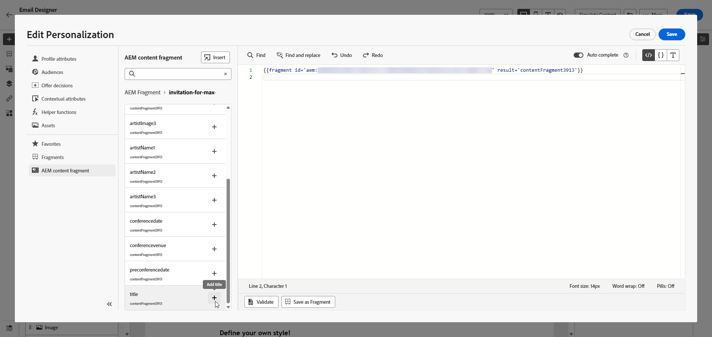
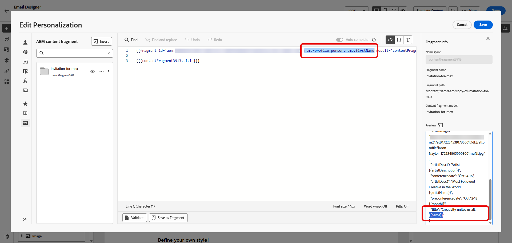

# Arbeta med Adobe Experience Manager Content Fragments {#aem-fragments}

Integrationen mellan Adobe Experience Manager och Journey Optimizer följer detta dataflöde:

1. **[Skapa och författare](https://experienceleague.adobe.com/en/docs/experience-manager-cloud-service/content/sites/administering/content-fragments/managing#creating-a-content-fragment)**: Innehåll skapas och konfigureras i Adobe Experience Manager som innehållsfragment.

1. **[Taggning](https://experienceleague.adobe.com/en/docs/experience-manager-cloud-service/content/sites/administering/content-fragments/managing#manage-tags)**: Innehållsfragment måste vara taggade med den Journey Optimizer-specifika taggen (`ajo-enabled:{OrgId}/{SandboxName}`).

1. **[Publicera](https://experienceleague.adobe.com/en/docs/experience-manager-cloud-service/content/sites/administering/content-fragments/managing#publishing-and-previewing-a-fragment)**: Innehållsfragment publiceras i Adobe Experience Manager och görs tillgängliga för Journey Optimizer.

1. **[Åtkomst](#aem-add)**: Journey Optimizer hämtar och visar tillgängliga innehållsfragment från Adobe Experience Manager publiceringsinstans i realtid.

1. **[Integrering](#aem-add)**: Innehållsfragment väljs ut och integreras i kampanjer eller resor.

När ett innehållsfragment publiceras i Adobe Experience Manager skickas en händelse för att uppdatera innehållet på Journey Optimizer-sidan. Om uppdateringen lyckas blir Content Fragment tillgängligt inom ungefär 5 minuter för Unitary-resor och i nästa batch för batchanvändning. När uppdateringen är tillgänglig i Journey Optimizer används det senaste publicerade innehållet för alla tillämpliga kampanjer och resor.

## Skapa och tilldela en tagg i Experience Manager

Innan du använder ditt Content-fragment i Journey Optimizer måste du skapa en tagg speciellt för Journey Optimizer:

1. Få åtkomst till din **Experience Manager**-miljö.

1. Välj **Taggning** på menyn **Verktyg**.

   

1. Klicka på **Skapa tagg**.

1. Kontrollera att ID:t följer följande syntax: `ajo-enabled:{AJO-OrgId}/{AJO-SandboxName}`.

1. Klicka på **Skapa**.

1. Definiera innehållsfragmentmodellen så som beskrivs i [Experience Manager-dokumentationen](https://experienceleague.adobe.com/en/docs/experience-manager-cloud-service/content/sites/administering/content-fragments/content-fragment-models){target="_blank"} och tilldela den nya Journey Optimizer-taggen.

Denna realtidsanslutning ser till att ert innehåll alltid är uppdaterat, men innebär också att ändringar i publicerade fragment omedelbart påverkar aktiva kampanjer och resor.

Nu kan du börja skapa och konfigurera ditt innehållsfragment för senare användning i Journey Optimizer. Läs mer i [Experience Manager-dokumentation](https://experienceleague.adobe.com/en/docs/experience-manager-cloud-service/content/sites/administering/content-fragments/managing){target="_blank"}.

## Lägg till Experience Manager Content-fragment {#aem-add}

När du har skapat och personaliserat dina AEM Content Fragments kan du nu importera det till din kampanj eller resa för att optimera resan.

1. Skapa din [kampanj](../campaigns/create-campaign.md) eller [resa](../building-journeys/journey-gs.md).

1. Om du vill komma åt ditt AEM-innehållsfragment klickar du på  i ett textfält eller öppnar källkoden via en HTML-innehållskomponent.

   

1. Klicka på **[!UICONTROL AEM Content Fragment]** på menyn **[!UICONTROL Open AEM CF selector]** i den vänstra rutan.

   

1. Välj en **[!UICONTROL Content Fragment]** i den tillgängliga listan för import till ditt Journey Optimizer-innehåll.

1. Klicka på **[!UICONTROL Show filters]** för att finjustera listan med innehållsfragment.

   Som standard är filtret Innehållsfragment förinställt så att endast godkänt innehåll visas.

   

1. När du har valt **[!UICONTROL Content Fragment]** klickar du på **[!UICONTROL Select]** för att öppna den.

   

1. Klicka på **[!UICONTROL View fragment]** om du vill visa fragmentinformationen. Observera att om du öppnar menyn **[!UICONTROL Fragment Info]** så är redigeraren skrivskyddad.

   Välj **[!UICONTROL Preview]** på den högra menyn för att visa ditt fragment i Adobe Experience Manager.

   

1. Klicka på ikonen  för att komma åt fragmentets avancerade meny:

   * **[!UICONTROL Swap fragment]**
   * **[!UICONTROL Explore references]**
   * **[!UICONTROL Open in AEM]**

   

1. Välj önskade fält från din **[!UICONTROL Fragment]** som ska läggas till i ditt innehåll.
   <!--
    Note that if you choose to copy the value, any future updates to the Content Fragment will not be reflected in your campaign or journey. However, using dynamic placeholders ensures real-time updates.-->

   

1. Om du vill aktivera realtidspersonalisering måste alla platshållare som används i en **[!UICONTROL Content fragment]** uttryckligen deklareras som parametrar i fragmenthjälpposten. Du kan mappa dessa platshållare till profilattribut, sammanhangsberoende attribut, statiska strängar eller fördefinierade variabler på följande sätt:

   1. **Mappning av profil- eller kontextuella attribut**: Tilldela platshållaren till en profil eller ett sammanhangsberoende attribut, t.ex. name = profile.person.name.firstName.

   1. **Statisk strängmappning**: Tilldela ett fast strängvärde genom att placera det inom dubbla citattecken, t.ex. name = &quot;John&quot;.

   1. **Variabelmappning**: Referera till en variabel som deklarerats tidigare inom samma HTML, t.ex. name = &#39;variableName&#39;.
I det här fallet kontrollerar du att **_variableName_** har deklarerats innan du lägger till fragment-ID:t, med följande syntax:

      ```html
       
      ```

   I exemplet nedan mappas platshållaren **_name_** till attributet **_profile.person.name.firstName_** i fragmentet.

   {zoomable="yes"}

1. Klicka på **[!UICONTROL Save]**. Du kan nu testa och kontrollera meddelandeinnehållet enligt beskrivningen i [det här avsnittet](../content-management/preview.md).
När du har utfört dina tester och validerat innehållet kan du [skicka din kampanj](../campaigns/review-activate-campaign.md) eller [publicera din resa](../building-journeys/publish-journey.md) till din målgrupp.

Med Adobe Experience Manager kan ni identifiera de Journey Optimizer-kampanjer eller resor där ett innehållsfragment används. Läs mer i [Adobe Experience Manager-dokumentation](https://experienceleague.adobe.com/en/docs/experience-manager-cloud-service/content/sites/administering/content-fragments/extension-content-fragment-ajo-external-references).

