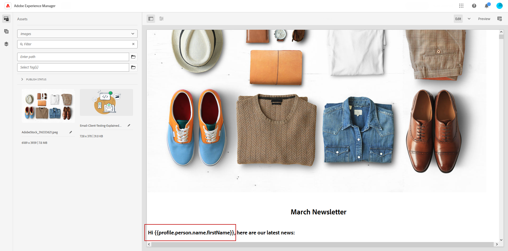
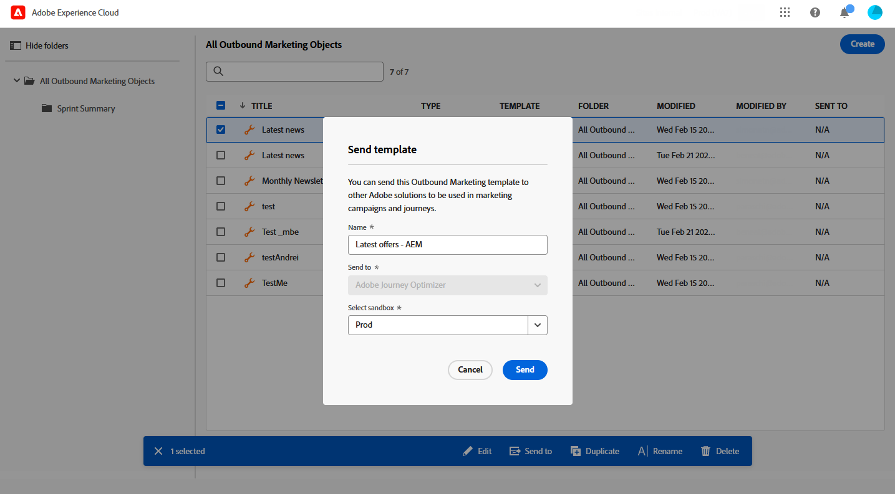
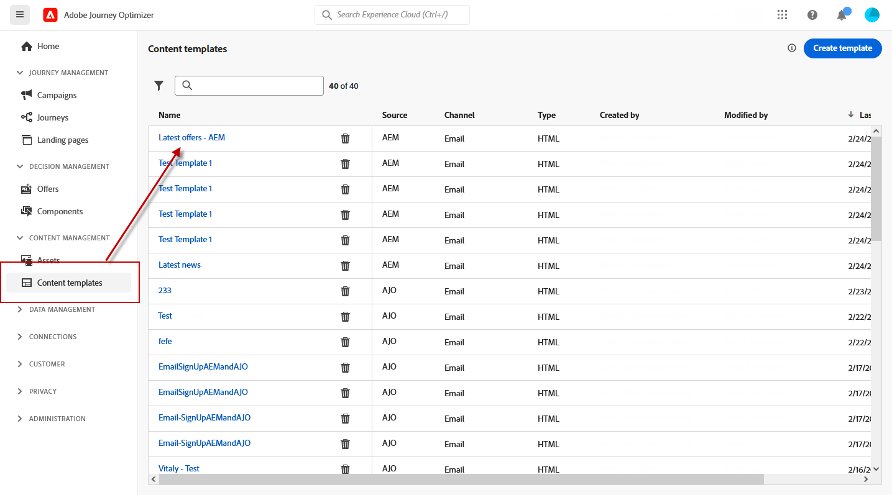
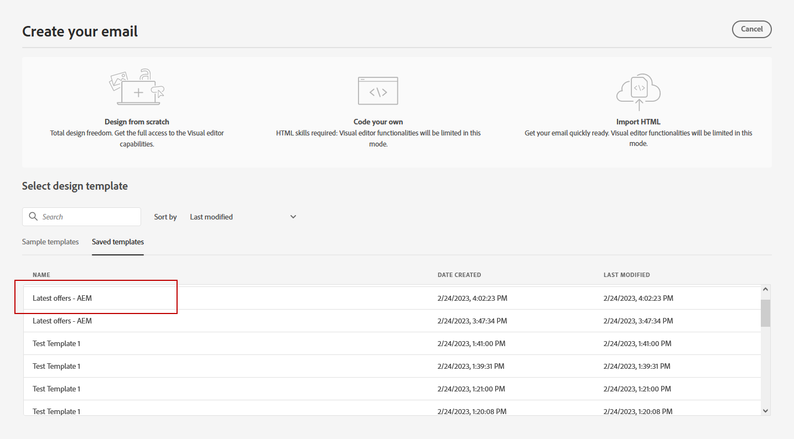
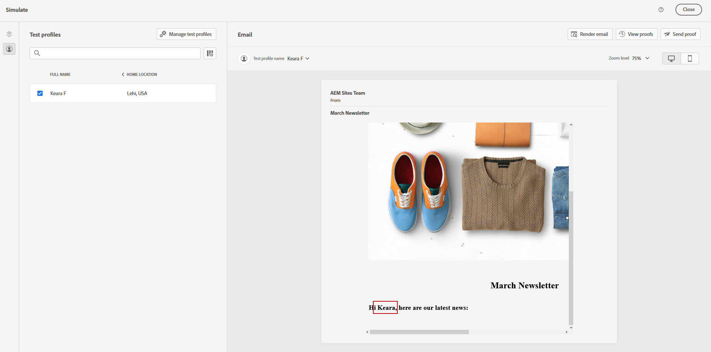

# Arbeta med Adobe Experience Manager-mallar {#aem-templates}

## Kom igång med Adobe Experience Manager-mallar {#gs-aem-templates}

Med Adobe Journey Optimizer kan du skapa skräddarsydda meddelanden via Adobe Experience Manager webbplatser. Börja med att designa mallarna med Adobe Experience Manager innehållskällor och skicka dem sedan till Adobe Journey Optimizer. När mallarna har delats kan de användas i Adobe Journey Optimizer Email Designer, vilket förenklar arbetet med att skapa och skicka meddelanden till rätt målgrupp.

>[!AVAILABILITY]
>
>Integrering med Adobe Experience Manager är för närvarande endast tillgängligt som betaversion för utvalda användare.
>Som betaanvändare använder du [det här formuläret](https://forms.office.com/pages/responsepage.aspx?id=Wht7-jR7h0OUrtLBeN7O4Wf0cbVTQ3tCpW_unE-w8-JUN1FaNlAzNkhPSUdaSkJXVFRCNTRJNVRFSy4u){target="_blank"} för att dela feedback.

### Förhandskrav {#prerequisites}

Innan du börjar använda den här funktionen bör du kontrollera att du uppfyller följande krav:

* **Experience Manager-inställningar**

  Den här funktionen är tillgänglig med [Adobe Experience Manager as a Cloud Service](https://experienceleague.adobe.com/docs/experience-manager-cloud-service/content/overview/introduction.html){target="_blank"}.

  Som en del av betaprogrammet utförs Cloud Service-konfigurationen av Adobe i Adobe Experience Manager för att ansluta till Adobe Journey Optimizer.

* **Behörigheter**

  Om du vill skapa, redigera och ta bort innehållsmallar i Adobe Journey Optimizer måste du ha behörigheten **[!DNL Manage Library Items]** i produktprofilen för **[!DNL Content Library Manager]**. [Läs mer](../administration/ootb-product-profiles.md#content-library-manager)

### Skyddsritningar och begränsningar{#aem-templates-limitations}

Om du vill optimera din användning av Adobe Experience Manager med Adobe Journey Optimizer ännu mer är det viktigt att du är medveten om följande extra skyddsförslag och begränsningar:

* Korrekt Journey Optimizer-syntax krävs för att personaliseringen i Experience Manager-mallen ska bli effektiv. [Läs mer](../personalization/personalization-syntax.md)

* Export av gruppmallar stöds inte för närvarande, mallar måste exporteras individuellt.

* Det går för närvarande inte att synkronisera mellan Experience Manager och Journey Optimizer. Om en Experience Manager-mall ändras efter att den har skickats till Journey Optimizer måste användaren exportera om mallen och skicka den till Journey Optimizer igen.

## Skicka en mall till Journey Optimizer{#aem-templates-send}

Om du vill exportera en Adobe Experience Manager-mall till Adobe Journey Optimizer följer du stegen nedan:

1. Välj **[!UICONTROL Outbound Marketing]** på Adobe Experience Manager hemsida.

   

1. Från ditt innehållsbibliotek kan du använda tidigare konfigurerade mallar eller skapa en från grunden. [Läs mer](https://experienceleague.adobe.com/docs/experience-manager-65/authoring/authoring/managing-pages.html#creating-a-new-page)

1. Genom att lägga in Journey Optimizer personaliseringssyntax i mallen kan du förbättra dess anpassningsmöjligheter. [Läs mer](../personalization/personalization-syntax.md)

   

1. Markera mallen som du vill exportera till Journey Optimizer och klicka på **[!UICONTROL Send to]** på den avancerade menyn.

   

1. Ange **[!UICONTROL Name]** för innehållsmallen och välj målet **[!UICONTROL Sandbox]**.

   

1. När du har klickat på knappen **[!UICONTROL Send]** påbörjas exportprocessen. När exporten är klar visas följande meddelande i användargränssnittet: &quot;Template &quot;XX&quot; skickad till AJO&quot;.

Mallen läggs till i Adobe Journey Optimizer-innehållsmallar för den valda sandlådan.

## Använda och anpassa en Adobe Experience Manager-mall{#aem-templates-perso}

När Experience Manager-mallen är tillgänglig i Journey Optimizer som en innehållsmall kan du identifiera och infoga det innehåll som behövs för e-postmeddelandet, inklusive personalisering.

1. I Journey Optimizer går du till den importerade mallen på menyn **[!UICONTROL Content template]**.

   

1. Genom att klicka på knappen **[!UICONTROL Alert]** kan du snabbt kontrollera om några viktiga inställningar saknas. Detta hjälper till att säkerställa att dina meddelanden är korrekt konfigurerade och förhindrar eventuella fel eller problem.

   

1. I fönstret **[!UICONTROL Template properties]** klickar du på knappen **[!UICONTROL Manage access]** för att tilldela egna eller grundläggande dataanvändningsetiketter till mallen. [Läs mer om OLAC (Object Level Access Control)](../administration/object-based-access.md)

1. Klicka på **[!UICONTROL Edit content]** om du vill anpassa din Experience Manager-mall ytterligare och lägga till anpassad anpassning i ditt innehåll. På så sätt kan du enkelt göra ändringar och anpassa mallen efter dina specifika behov. [Läs mer](../email/get-started-email-design.md)

   >[!WARNING]
   >
   > Om du vill redigera och anpassa mallen kan du bara använda kompatibilitetsläget.

1. [Testa och validera innehållsmallen](../content-management/content-templates.md#content-templates) när den är klar.

1. När innehållet har definierats kan du använda det när du skapar ny e-post genom att bläddra i samlingen **[!UICONTROL Saved templates]**. Välj sedan **[!UICONTROL Use this template]**.

   

1. Nu kan du redigera och anpassa ditt innehåll. Mer information om hur du skapar ditt e-postinnehåll finns på [sidan](../email/content-from-scratch.md).

   

1. Om du har lagt till anpassat innehåll i din Experience Manager-mall klickar du på **[!UICONTROL Simulate Content]** för att förhandsgranska hur det kommer att visas i meddelandet med testprofiler.

[Läs mer om förhandsgranskning och testprofiler](../content-management/preview-test.md)

   

1. När du visar förhandsgranskningen av meddelandet ersätts alla anpassade element automatiskt med motsvarande data från den valda testprofilen.

   Om det behövs kan ytterligare testprofiler läggas till med knappen **[!UICONTROL Manage test profiles]**.

   

När din e-post är klar slutför du konfigurationen av din [resa](../building-journeys/journey-gs.md) eller [kampanj](../campaigns/create-campaign.md) och aktiverar den för att skicka meddelandet.
