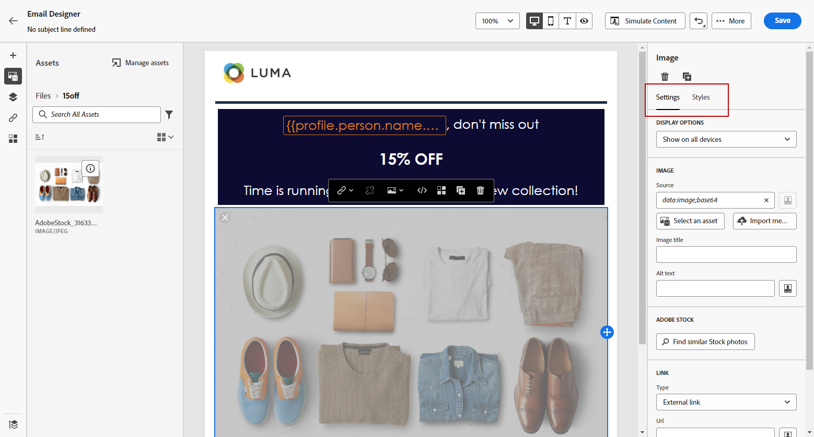

# Skapa och hantera resurser med [!DNL Experience Manager Assets]{#experience-manager-assets}

## Kom igång med [!DNL Experience Manager Assets] {#get-started-assets}

Sammanför arbetsflöden för marknadsföring och kreativitet med **[!DNL Adobe Experience Manager Assets]**. Inbyggt i **[!DNL Adobe Journey Optimizer]**, använd **[!DNL Assets Essentials]** eller **[!DNL Assets as a Cloud Service]** för att lagra, hantera, identifiera och distribuera digitala resurser. Det utgör en central databas med resurser som du kan använda för att fylla i dina meddelanden.

**[!DNL Adobe Experience Manager Assets]** erbjuder två samverkande och centraliserade resursytor som utökar ditt kreativa system och förenar digitala resurser för upplevelseleverans:

* **[!DNL Assets as a Cloud Service]**: Adobe Experience Manager Assets as a Cloud Service är en lättanvänd molnlösning för effektiv hantering av digitala resurser och dynamiska media. Programmet innehåller smidigt avancerade funktioner, bland annat artificiell intelligens och maskininlärning.

  Läs mer i [Adobe Experience Manager as a Cloud Service-dokumentation](https://experienceleague.adobe.com/docs/experience-manager-cloud-service/content/assets/overview.html){target="_blank"}.

* **[!DNL Assets Essentials]**: Experience Manager Assets Essentials är en lättviktig Assets as a Cloud Service-lösning för enhetlig resurshantering och samarbete. Med ett modernt, förenklat gränssnitt kan kreatörer och marknadsförare enkelt lagra, upptäcka och distribuera digitalt material.

  Läs mer i [dokumentationen till Adobe Experience Manager Assets Essentials](https://experienceleague.adobe.com/docs/experience-manager-assets-essentials/help/introduction.html){target="_blank"}.

Beroende på ditt kontrakt kan du komma åt **[!DNL Adobe Experience Manager Assets Essentials]** eller **[!DNL Adobe Experience Manager Assets as a Cloud Service]** direkt från **[!DNL Adobe Journey Optimizer]** till den vänstra menyn **[!UICONTROL Assets]**. Du kan också komma åt resurser och mappar när [du utformar ett e-postinnehåll](../email/get-started-email-design.md).

## Förhandskrav{#assets-prerequisites}

>[!BEGINTABS]

>[!TAB Adobe Experience Manager Assets Essentials]

Innan du använder [!DNL Adobe Experience Manager Assets Essentials] måste du lägga till användare i produktprofilerna **Assets Essentials Consumer Users** eller **Assets Essentials Users**. Läs mer i [dokumentationen för Assets Essentials](https://experienceleague.adobe.com/docs/experience-manager-assets-essentials/help/get-started-admins/deploy-administer.html#add-user-groups){target="_blank"}.

>[!NOTE]
>För Journey Optimizer-produkter som inhämtats före 6 januari 2022 måste du distribuera **[!DNL Adobe Experience Manager Assets Essentials]** för din organisation. Mer information finns i avsnittet [Distribuera resurser - Essentials](https://experienceleague.adobe.com/docs/experience-manager-assets-essentials/help/deploy-administer.html){target="_blank"}.

>[!TAB Adobe Experience Manager Assets as a Cloud Service]

Innan du använder **[!DNL Adobe Experience Manager Assets as a Cloud Service]** måste du lägga till användare i Assets Cloud Services. Läs mer i [Adobe Experience Manager Assets as a Cloud Service](https://experienceleague.adobe.com/docs/experience-manager-cloud-service/content/security/ims-support.html).

>[!ENDTABS]

## Överföra och infoga resurser{#add-asset}

Om du vill importera filer till **[!DNL Assets Essentials]** eller **[!DNL Assets as a Cloud Service]** måste du först bläddra i eller skapa den mapp som filen ska lagras i. Du kan sedan infoga dem i ditt e-postinnehåll.

1. Från startsidan för [!DNL Adobe Journey Optimizer] väljer du fliken **[!UICONTROL Assets]** under menyn **[!UICONTROL Content management]** för att få åtkomst till **[!DNL Assets Essentials]** eller **[!DNL Assets as a Cloud Service]**.

   

1. Välj databas för din Assets i Journey Optimizer. Du kan välja antingen en **[!DNL Assets Essentials]**- eller **[!DNL Assets as a Cloud Service]**-databas, förutsatt att du äger den här lösningen.

   

   +++ Lär dig hur du byter Assets-databas.

   Om du vill ändra din Assets-databas väljer du kontoikonen i det övre högra hörnet och klickar på **[!UICONTROL Select Repository]**.

   

   +++

1. Dubbelklicka på en mapp från det centrala avsnittet eller från trädvyn för att öppna den.

   Du kan också klicka på **[!UICONTROL Create folder]** om du vill skapa en ny mapp.

   

1. Klicka på **[!UICONTROL Add Assets]** i den valda eller skapade mappen för att överföra den nya resursen till din mapp.

   

1. Klicka på **[!UICONTROL Upload files]** i **[!UICONTROL Browse]** och välj om du vill **[!UICONTROL Browse files]** eller **[!UICONTROL Browse folders]**.

1. Markera filen som du vill överföra. När du är klar klickar du på **[!UICONTROL Upload]**. Mer information om hur du hanterar dina resurser finns på [sidan](https://experienceleague.adobe.com/docs/experience-manager-assets-essentials/help/manage-organize.html).

1. Om du vill redigera dina resurser ytterligare med Adobe Photoshop Express dubbelklickar du på resurserna. Välj sedan ikonen **[!UICONTROL Edit mode]** på den högra menyn. [Läs mer](https://experienceleague.adobe.com/docs/experience-manager-assets-essentials/help/edit-images.html){target="_blank"}.

   

1. I [!DNL Adobe Journey Optimizer] väljer du menyn **[!UICONTROL Asset picker]** i den vänstra rutan i e-post-Designer.

   

1. Välj den **[!UICONTROL Assets]**-mapp du skapat tidigare. Du kan också söka efter resursen eller mappen i sökfältet.

1. Dra och släpp mediefilen i e-postinnehållet.

   

1. Du kan anpassa dina resurser ytterligare, till exempel lägga till en extern länk eller en text med flikarna **[!UICONTROL Settings]** och **[!UICONTROL Styles]**. [Läs mer om komponentinställningar](../email/content-components.md)

   

   <!--
    After adding your asset to your email, use the **[!UICONTROL Find similar Stock photos]** option to locate Stock photos that match the content, color, and composition of your image. [Learn more about Adobe Stock](stock.md).

    Note that this option is available for licensed/unlicensed Stock images and images from your Assets folder. 

    
    -->

## Vanliga frågor {#faq-assets}

Nedan finns Frågor och svar om Adobe Experience Manager Assets.

Behöver du mer information? Använd alternativen för feedback längst ned på den här sidan för att ställa din fråga eller kontakta [Adobe Journey Optimizer Community](https://experienceleaguecommunities.adobe.com/t5/adobe-journey-optimizer/ct-p/journey-optimizer?profile.language=en){target="_blank"}.

+++ Kan jag fortsätta använda den paketerade databasen Assets Essentials i Journey Optimizer?

Om du har etablerats på **[!DNL Adobe Experience Manager Assets as a Cloud Service]** har du åtkomst till både **[!DNL Adobe Experience Manager Assets Essentials]**- och **[!DNL Adobe Experience Manager Assets as a Cloud Service]**-databaser om användaren har rätt behörigheter. Dessa databaser är separata och inte synkroniserade. En användare i Journey Optimizer kan se båda dessa databaser, inklusive andra miljöer som de är berättigade till som Stage, Dev osv., och bör kunna växla mellan dem med databasväljaren.

+++

+++ Hur hanteras resurser? återspeglas förändringar i Assets as a Cloud Service i Journey Optimizer?

**[!DNL Adobe Experience Manager Assets as a Cloud Service]** integreras med Journey Optimizer på liknande sätt som **[!DNL Adobe Experience Manager Assets Essentials]**. När resurser ändras genereras en binär kopia. Observera att uppdateringar i **[!DNL Assets as a Cloud Service]** inte automatiskt sprids till e-postkampanjer live. Alla ändringar måste markeras manuellt på nytt i e-postprogrammet för att säkerställa synkronisering mellan resurserna och de pågående e-postkampanjerna.

+++

+++ Kan jag använda dynamiska medie-URL:er när jag skriver e-post i Journey Optimizer?

Ja, du kan använda dynamiska medie-URL:er i Journey Optimizer e-postredigering. Klistra bara in URL:erna i stället för att välja från resursväljaren.

+++

+++ Kan Journey Optimizer-användare göra ändringar i Adobe Experience Manager Assets as a Cloud Service-databasen från Journey Optimizer gränssnitt?

Så länge som Journey Optimizer-användaren är en berättigad **[!DNL Adobe Experience Manager Assets as a Cloud Service]**-standardanvändare och har behörigheten Redigera i databasen, kan användaren redigera **[!DNL Adobe Experience Manager Assets as a Cloud Service]**-databasen.

+++

+++ Varför går det inte att läsa in bilder i e-postmeddelanden som skickas från Journey Optimizer?

Om resurser (t.ex. bilder) hanteras via Adobe Experience Manager och används i Journey Optimizer omfattas de av en livscykelpolicy med en TTL (Time-To-Live). När TTL-perioden har löpt ut kan resurser tas bort från lagringsutrymmet (CDN), vilket kan resultera i brutna bilder i e-postmeddelanden som refererar till dessa resurser.

>[!NOTE]
>
>Resursens TTL hanteras av Adobe Journey Optimizer backend-tjänster och kan för närvarande inte konfigureras av kunder. Den aktuella TTL-perioden är inställd på 730 dagar för alla Journey Optimizer-organisationer.

+++

+++ Hur kan jag lösa trasiga bilder på grund av att resursen har gått ut?

Så här återställer du bildens tillgänglighet när resurserna har gått ut:

1. **Publicera om de berörda resurserna**: Navigera till resursen i Adobe Experience Manager och publicera den igen. Detta gör att resursen blir tillgänglig igen i CDN.

2. **Uppdatera innehållsreferenser**: Om du använder innehållsfragment eller mallar som refererar till utgångna resurser:
   * Skapa ett utkast eller en klon av innehållsfragmentet
   * Lägg till eller markera om resursen
   * Publicera det uppdaterade innehållet

3. **Proaktiv hantering**: För att undvika framtida avbrott bör du regelbundet granska och publicera om resurser som används i aktiva e-postkampanjer, särskilt de som närmar sig TTL-förfalloperioden.

>[!CAUTION]
>
>Kraven för återpublicering gäller alla miljöer (produktion, fas, utveckling). Se till att resurserna är tillgängliga genom att hantera livscykeln på rätt sätt.

+++

+++ Kommer logiken för att förfalla tillgångar att förbättras i framtiden?

Ja, Adobe arbetar aktivt med förbättringar för att förfina tillgångarnas förfallodatum och logik för livscykelhantering. Dessa förbättringar syftar till att ge bättre insyn i tillgångarnas livscykelstatus och minska risken för trasiga bilder i livekampanjer.

Om du vill ha de senaste uppdateringarna kan du kontakta ditt Adobe-kontoteam eller övervaka versionsinformationen för Adobe Journey Optimizer.

+++
