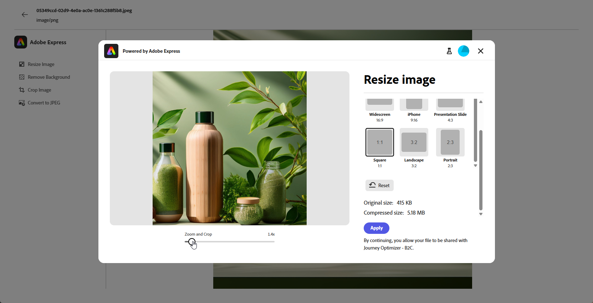
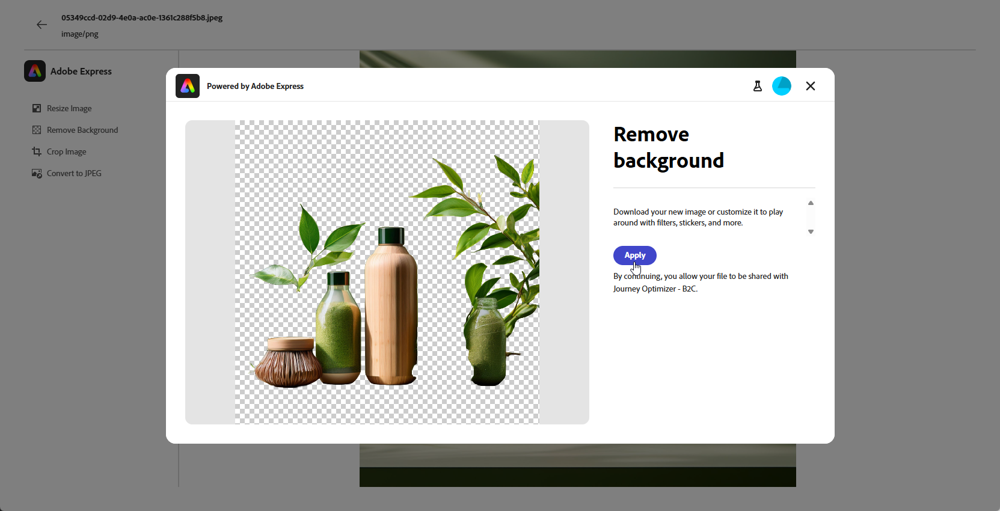

# Redigera resurser med [!DNL Adobe Express]{#express}

>[!CONTEXTUALHELP]
>id="ajo_express_menu"
>title="Integrering med Adobe Express"
>abstract="Börja personalisera materialet med Adobe Express integrering. Med den här funktionen kan du ändra storlek på bilder, ta bort bakgrunder, beskära bilder och konvertera resurser till JPEG eller PNG."

>[!AVAILABILITY]
>
>Adobe Express integrering i Adobe Journey Optimizer kan för närvarande inte användas tillsammans med hälso- och sjukvårdsskölden eller skölden för skydd av privatlivet och säkerheten.

Tack vare Adobe Express integrering i Adobe Journey Optimizer kan du enkelt komma åt Adobe Express kraftfulla redigeringsverktyg när du skapar innehåll. Tack vare den här integreringen kan du ändra storlek på bilder, ta bort bakgrunder, beskära bilder och konvertera resurser till JPEG eller PNG utan att behöva växla mellan lösningarna.

Mer information om Adobe Express finns i [den här dokumentationen](https://helpx.adobe.com/se/express/user-guide.html).

Du kommer åt menyn **[!DNL Adobe Express]** genom att gå till dina **bildinställningar** från e-postdesignern och klicka på **[!UICONTROL Edit in Adobe Express]**.

## Adobe Express Enterprise-licens {#licence}

De funktioner som beskrivs i avsnitten nedan är tillgängliga för användare som saknar Adobe Express Enterprise-licens.

Med Enterprise-licens får man tillgång till Adobe Express-redigeraren där man kan justera färg, ljusstyrka, skärpa, kontrast, dimensioner och ytterligare inställningar.

+++Tillgängliga användningsexempel för användare och Enterprise-licens för Adobe Express

* [Ta bort bakgrund](https://helpx.adobe.com/se/express/create-and-edit-images/edit-images/remove-background.html)
* [Ta bort objekt](https://helpx.adobe.com/se/express/create-and-edit-images/create-and-modify-with-generative-ai/remove-objects-generative-fill.html)
* [Radera](https://helpx.adobe.com/se/express/create-and-edit-images/edit-images/eraser.html)
* [Infoga objekt](https://helpx.adobe.com/se/express/adobe-express-on-mobile/create-and-edit-designs/generative-fill-mobile.html)
* [Beskär](https://helpx.adobe.com/se/express/create-and-edit-images/edit-images/crop-and-shape-images.html)
* [Effekter](https://helpx.adobe.com/se/express/add-effects-to-your-designs/add-images-and-visuals/apply-image-filters.html)

+++

## Ändra storlek på bild {#resize}

1. Välj **[!UICONTROL Resize image]** på Adobe Express-menyn.

   

1. Välj den **[!UICONTROL Aspect ratio]** som bäst passar resursens proportioner.

   

1. Använd skjutreglaget för att zooma och beskära resursen och dra för att panorera och justera det synliga området.

   

1. Klicka på **[!UICONTROL Reset]** om du vill återställa resursen till det ursprungliga tillståndet.

1. Klicka på **[!UICONTROL Apply]** när du vill ändra storlek på bilden. **[!UICONTROL Save]** din ändrade resurs.

1. I fönstret **[!UICONTROL Upload Image]** klickar du på **[!UICONTROL Next]** och väljer en mapp där den ändrade resursen ska lagras.

   Klicka sedan på **[!UICONTROL Import]**.

Din bild är nu klar att användas i ditt innehåll.

## Ta bort bakgrund {#background}

1. Välj **[!UICONTROL Remove background]** på Adobe Express-menyn.

   

1. Resursen visas automatiskt utan sin bakgrund.

   Klicka på **[!UICONTROL Apply]** om du vill använda det här i ditt innehåll.

   

1. Klicka på **[!UICONTROL Save]**.

1. I fönstret **[!UICONTROL Upload Image]** klickar du på **[!UICONTROL Next]** och väljer en mapp där den ändrade resursen ska lagras.

   Klicka sedan på **[!UICONTROL Import]**.

Din bild är nu klar att användas i ditt innehåll.

## Beskär bild {#crop-image}

1. Välj **[!UICONTROL Crop image]** på Adobe Express-menyn.

   

1. Dra i hörnhandtagen för att justera och beskära bilden efter behov.

   

1. Klicka på **[!UICONTROL Apply]** om du vill använda det här i ditt innehåll. **[!UICONTROL Save]** din ändrade resurs.

1. I fönstret **[!UICONTROL Upload Image]** klickar du på **[!UICONTROL Next]** och väljer en mapp där den ändrade resursen ska lagras.

   Klicka sedan på **[!UICONTROL Import]**.

Din bild är nu klar att användas i ditt innehåll.

## Konvertera till JPEG eller PNG {#convert}

1. På Adobe Express-menyn väljer du **[!UICONTROL Convert to JPEG]** eller **[!UICONTROL Convert to PNG]** beroende på bildens ursprungliga format.

   

1. Klicka på **[!UICONTROL Apply]** för att starta konverteringen.

   

1. Klicka på **[!UICONTROL Save]**.

1. Med formatändringen kan du spara den som en ny bild med ett annat namn. Uppdatera **[!UICONTROL Name]** och klicka på **[!UICONTROL Save]**.

   

1. I fönstret **[!UICONTROL Upload Image]** klickar du på **[!UICONTROL Next]** och väljer en mapp där den ändrade resursen ska lagras.

   Klicka sedan på **[!UICONTROL Import]**.

Din bild är nu klar att användas i ditt innehåll.
