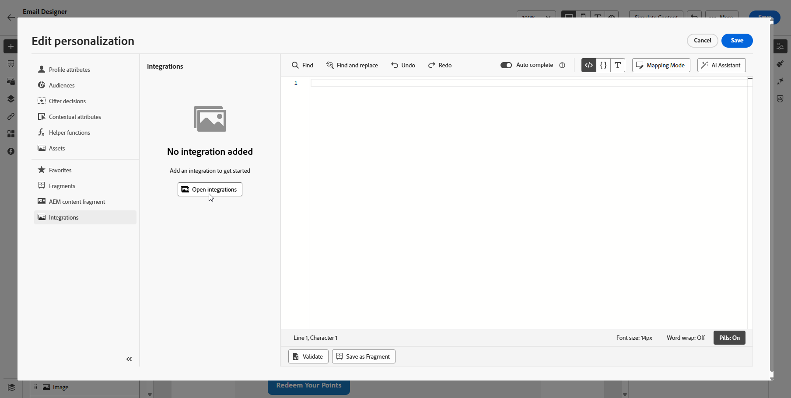

# Arbeta med integreringar {#external-sources}

## Översikt

Funktionen **Integrationer** möjliggör smidig integrering av datakällor från tredje part i Adobe Journey Optimizer. Den här funktionen effektiviserar integreringen av externa data och innehållskällor i era kampanjer, så att ni kan leverera personaliserade och dynamiska meddelanden över flera kanaler.

Du kan använda den här funktionen för att komma åt externa data och hämta innehåll från tredjepartsverktyg som:

* **Belöningspoäng** från lojalitetssystem.
* **Prisinformation** för produkter.
* **Produktrekommendationer** från rekommendationsmotorer.
* **Logistikuppdateringar** gillar leveransstatus.

## Beta begränsningar {#limitations}

Betaversionen har följande begränsningar:

* Utgående kanaler stöds endast.

* Endast JSON-format stöds för API-anropssvar. Binära utdata för HTML och råformat är inte tillgängliga.

* Endast hämtnings-API:er för specifikt innehåll stöds, lista-API:er är inte tillgängliga.

* Integreringsfunktionen är tillgänglig för både resor och kampanjer, men stöds inte i fragment.

## Konfigurera integreringen {#configure}

Som administratör kan du konfigurera externa integreringar genom att följa dessa steg:

1. Navigera till avsnittet **[!UICONTROL Configurations]** på den vänstra menyn och klicka på **[!UICONTROL Manage]** på kortet **[!UICONTROL Integrations]**.

   Klicka sedan på **[!UICONTROL Create Integration]** för att starta en ny konfiguration.

   

1. Ange **[!UICONTROL Name]** och **[!UICONTROL Description]** för din integrering.

   >[!NOTE]
   >
   >Dessa fält får inte innehålla blanksteg.

1. Ange API-slutpunkten **[!UICONTROL URL]**, som kan innehålla sökvägsparametrar med variabler som kan definieras med etiketter och standardvärden.

1. Konfigurera **[!UICONTROL Path Template]** med **[!UICONTROL Name]** och **[!UICONTROL Default value]**.

   

1. Välj **[!UICONTROL HTTP Method]** mellan GET och POST.

1. Klicka på **[!UICONTROL Add Header]** och/eller **[!UICONTROL Add Query Parameters]** efter behov för din integrering. Ange följande information för varje parameter:

   * **[!UICONTROL Parameter]**: En unik identifierare som används internt för att referera till parametern.

   * **[!UICONTROL Name]**: Det faktiska namnet på parametern enligt API:t.

   * **[!UICONTROL Type]**: Välj **Konstant** för ett fast värde eller **Variabel** för dynamiska indata.

   * **[!UICONTROL Value]**: Ange värdet direkt för konstanter eller välj en variabelmappning.

   * **[!UICONTROL Mandatory]**: Ange om den här parametern är obligatorisk.

   

1. Välj en **[!UICONTROL Authentication Type]**:

   * **[!UICONTROL No Authentication]**: För öppna API:er som inte kräver några autentiseringsuppgifter.

   * **[!UICONTROL API key]**: Autentisera begäranden med en statisk API-nyckel. Ange din **[!UICONTROL API Key Name &#x200B;]**, **[!UICONTROL API Key Value &#x200B;]** och ange din **[!UICONTROL Location]**.

   * **[!UICONTROL Basic Auth]**: Använd vanlig grundläggande HTTP-autentisering. Ange **[!UICONTROL Username]** och **[!UICONTROL Password]**.

   * **[!UICONTROL OAuth 2.0]**: Autentisera med OAuth 2.0-protokollet. Klicka på ikonen  för att konfigurera eller uppdatera **[!UICONTROL Payload]**.

   

1. Ange **[!UICONTROL Policy configuration]** som **[!UICONTROL Timeout]**-period för API-begäranden och välj att aktivera begränsning, cache och/eller försök igen.

1. Med fältet **[!UICONTROL Response payload]** kan du bestämma vilka fält i exempelutdata som ska användas för meddelandepersonalisering.

   Klicka på ikonen  och klistra in en JSON-svarsnyttolast för att automatiskt identifiera datatyper.

1. Välj de fält som ska visas för personalisering och ange deras motsvarande datatyper.

   

1. Använd **[!UICONTROL Send test connection]** för att validera integreringen.

   Klicka på **[!UICONTROL Activate]** när du har validerat.

## Använda externa integreringar för personalisering {#personalization}

Som marknadsförare kan ni använda konfigurerade integreringar för att personalisera ert innehåll. Följ de här stegen:

1. Få åtkomst till kampanjinnehållet och klicka på **[!UICONTROL Add personalization]** i din text eller HTML **[!UICONTROL Components]**.

[Läs mer om komponenter](../email/content-components.md)

   

1. Navigera till avsnittet **[!UICONTROL Integrations]** och klicka på **[!UICONTROL Open integrations]** för att visa alla aktiva integreringar.

   

1. Välj en integrering och klicka på **[!UICONTROL Save]**.

   

1. Aktivera läget **[!UICONTROL Pills]** om du vill låsa upp den avancerade integreringsmenyn.

   

1. Om du vill slutföra integrationsinställningarna definierar du dina integreringsattribut, som tidigare har angetts under [konfigurationen](#configure).

   Du kan tilldela värden till dessa attribut med hjälp av statiska värden, som förblir konstanta, eller profilattribut, som dynamiskt hämtar information från användarprofiler.

   

1. När integreringsattributen har definierats kan du nu använda integreringsfälten i ditt innehåll för anpassade meddelanden genom att klicka på ikonen  .

   

1. Klicka på **[!UICONTROL Save]**.

Din integrationspersonalisering tillämpas nu korrekt på ditt innehåll och säkerställer att alla mottagare får en skräddarsydd, relevant upplevelse baserat på de attribut du har konfigurerat.

