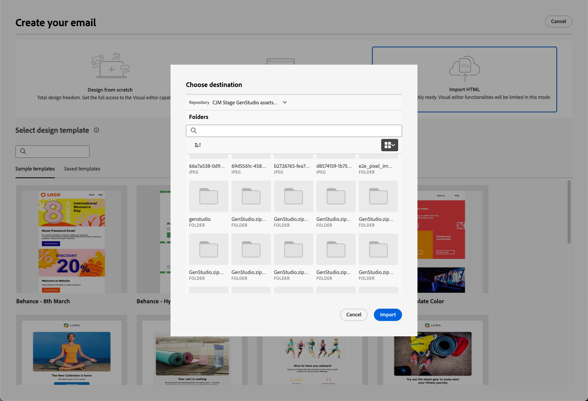
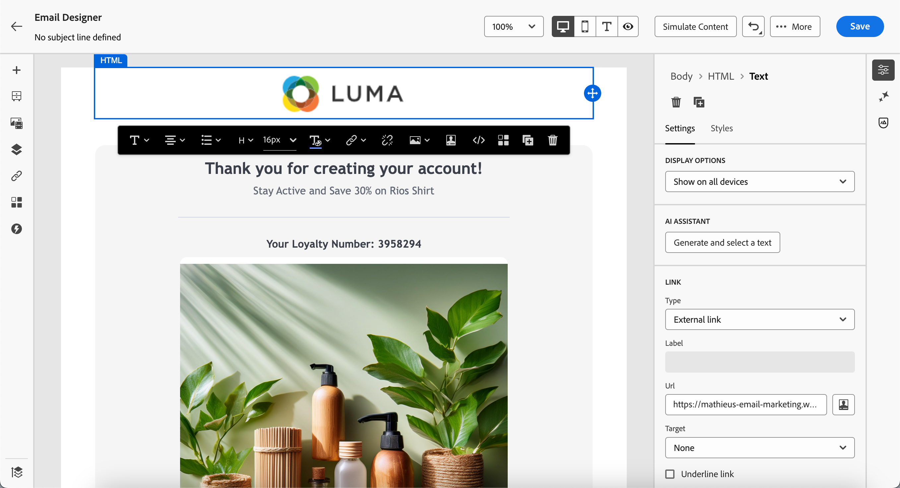

# Arbeta med GenStudio for Performance Marketing {#ajo-genstudio}

>[!CONTEXTUALHELP]
>id="ajo_genstudio_button"
>title="Använda en mall som byggts med GenStudio"
>abstract="Tack vare den smidiga integrationen med Adobe GenStudio for Performance Marketing kan du enkelt importera en GenStudio-mall som har förbättrats med Adobe AI-teknik."

## Kom igång med GenStudio {#gs-genstudio}

[Adobe GenStudio for Performance Marketing](https://experienceleague.adobe.com/sv/docs/genstudio-for-performance-marketing/user-guide/home){target="_blank"} är en generativ AI-tillämpning som gör att marknadsföringsteamen kan skapa egna annonser och e-postmeddelanden för att skapa effektiva, personaliserade marknadsföringskampanjer som följer ert varumärke och följer företagets policy. Genom att utnyttja Adobe AI-teknik får du en omfattande verktygslåda som förenklar komplexa funktioner för att skapa och hantera innehåll så att kreatörerna kan fokusera på innovation.

>[!AVAILABILITY]
>
>* GenStudio-integreringen i [!DNL Adobe Journey Optimizer] är för närvarande inte tillgänglig för användning med tilläggserbjudandena **Hälsovårdssköld** eller **Sekretess och säkerhetssköld**.
>
>* Den här funktionen är endast tillgänglig för e-postkanalen.

För att effektivisera marknadsföringen och upprätthålla varumärkets enhetlighet kan du sömlöst integrera [!DNL **GenStudio for Performance Marketing**]-upplevelser med [!DNL **Adobe Journey Optimizer**]. Detta gör att du kan utnyttja [!DNL GenStudio]s AI-baserade innehållsskapande tillsammans med [!DNL Journey Optimizer]s avancerade orkestreringsfunktioner.

>[!INFO]
>
>Mer information finns i [översikten](https://business.adobe.com/se/products/genstudio-for-performance-marketing.html#watch-overview){target="_blank"} och i [demon](https://business.adobe.com/se/products/genstudio-for-performance-marketing.html#demo){target="_blank"} av [!DNL Adobe GenStudio for Performance Marketing].

➡️ [Upptäck den här funktionen i en video](#video)

## Förhandskrav {#genstudio-prerequisites}

Om du vill använda integreringen [!DNL GenStudio for Performance Marketing] med [!DNL Journey Optimizer] måste du se till att följande krav uppfylls:

* Din organisation måste ha en aktiv licens för [!DNL GenStudio for Performance Marketing].

* Både [!DNL GenStudio for Performance Marketing] och [!DNL Adobe Journey Optimizer] måste tillhöra samma IMS-organisation.

* Användarna måste ha minst rollen **Collaborator** eller senare i [!DNL GenStudio for Performance Marketing] för att kunna använda integreringsfunktionerna. [Läs mer om användarroller i GenStudio](https://experienceleague.adobe.com/sv/docs/genstudio-for-performance-marketing/user-guide/intro/user-roles){target="_blank"}

<!--To access the GenStudio integration in [!DNL Adobe Journey Optimizer] feature, users need to be granted the **xxx** permission. [Learn more](../administration/permissions.md)

>[!IMPORTANT]
>
>* Before starting using this capability, read out related [Guardrails and Limitations](#generative-guardrails).-->

<!--Guardrails and limitations {#genstudio-guardrails}

General guidelines for using the GenStudio integration in [!DNL Adobe Journey Optimizer] for email generation are listed below:

See if guidelines/limitations such as the ones listed [here](../content-management/gs-generative.md#generative-guardrails) for AI Assistant can apply.

The following limitations apply to GenStudio integration in [!DNL Adobe Journey Optimizer]:-->

## Utnyttja GenStudio i Journey Optimizer {#use-genstudio}

Integreringen [!DNL GenStudio for Performance Marketing] och [!DNL Journey Optimizer] gör att du kan låta marknadsförare från ditt företag samarbeta bättre för att effektivisera processerna.

En teknisk marknadsförare, som använder [!DNL Journey Optimizer] för att utveckla och automatisera e-postkampanjer, kan till exempel samarbeta med en resultatmarknadsförare som skapar innehåll med [!DNL GenStudio].

Med den här integreringen kan båda fungera tillsammans för att enkelt integrera varumärkesinnehåll från [!DNL GenStudio] i [!DNL Journey Optimizer] och leverera engagerande e-postmeddelanden som riktar sig till specifika kundsegment och ökar försäljningen.

### Viktiga funktioner {#genstudio-capabilities}

Integrationen ger er kraftfulla funktioner för ert marknadsföringsföretag:

* **AI-baserad innehållsgenerering**: Använd Adobe generativa AI för att skapa flera e-postvarianter för olika varumärken på ett effektivt sätt, med intelligenta kopieringsförslag och designelement.

* **Smidig arbetsflödesintegrering**: Exportera Journey Optimizer e-postmallar till GenStudio, skapa varianter med AI-prompter och importera dem tillbaka till Journey Optimizer i en smidig process.

* **Centraliserad resurshantering**: Använd GenStudio ContentHub, som drivs av Adobe Experience Manager Assets, för att ordna, lagra och hämta alla digitala resurser på en central plats.

* **Experimentera med innehåll**: Importera flera varianter från GenStudio via e-post till Journey Optimizer och utnyttja experimenteringsfunktionerna för att testa och identifiera det innehåll som fungerar bäst.

* **Prestandadrivna insikter**: Spåra kampanjresultat med AI-baserad analys för att förstå vilka kreativa element som får gensvar hos er målgrupp och optimera framtida kampanjer.

### Vanliga användningsfall {#genstudio-use-cases}

Integrationen mellan [!DNL GenStudio for Performance Marketing] och 
Journey Optimizer &rbrack; har stöd för olika marknadsföringsscenarier:

* **Produktlanseringskampanjer**: Generera snabbt flera e-postvarianter för produktlanseringar, testa dem med olika målgruppssegment och skala den vinnande versionen för hela kundbasen.

* **Semester- och säsongskampanjer**: Producera tidskänsligt kampanjinnehåll i stor skala med hjälp av GenStudio-mallar, vilket ger ett enhetligt varumärke samtidigt som snäva deadlines hålls.

* **A/B-testning i stor skala**: Skapa flera olika innehållsvariationer i GenStudio och testa dem systematiskt i Journey Optimizer för att kontinuerligt förbättra e-postprestanda.

* **Flersegmentspersonalisering**: Generera skräddarsytt innehåll för olika kundprofiler i GenStudio och distribuera sedan varje ändring till motsvarande segment i Journey Optimizer för maximal relevans.

## Integrera med GenStudio {#how-to-use}

Integreringsarbetsflödet består av två huvudsteg: exportera en mall från Journey Optimizer till GenStudio och importera GenStudio-upplevelser tillbaka till Journey Optimizer.

### Exportera en HTML-mall från Journey Optimizer till GenStudio {#export-from-ajo-to-genstudio}

Börja med att exportera en [!DNL Journey Optimizer] HTML-mall med ditt varumärkes riktlinjer till [!DNL GenStudio for Performance Marketing]. Följ stegen nedan.

1. I [!DNL Journey Optimizer] får du tillgång till innehållet i din e-post under en resa eller kampanj. [Lär dig hur](../email/get-started-email-design.md#key-steps)

1. I e-postmeddelandet för Designer väljer du **[!UICONTROL Export HTML]** från knappen **[!UICONTROL More]**.

   {zoomable="yes"}

1. Överför den här HTML-exporterade mallen till [!DNL GenStudio for Performance Marketing]. <!--Make sure you detect the fields that the generative AI uses to insert content in order to create an actionable template.-->

   >[!NOTE]
   >
   >Lär dig hur du överför en HTML-mall till [!DNL GenStudio] i det dedikerade avsnittet [Adobe GenStudio for Performance Marketing användarhandbok](https://experienceleague.adobe.com/sv/docs/genstudio-for-performance-marketing/user-guide/content/templates/use-templates#templates-from-ajo-and-marketo){target="_blank"} .

1. I GenStudio använder du den här mallen för att skapa flera e-postvarianter med AI-uppmaningar och spara dem.

   >[!NOTE]
   >
   >Lär dig hur du skapar e-postupplevelser i den dedikerade [sektionen](https://experienceleague.adobe.com/sv/docs/genstudio-for-performance-marketing/user-guide/create/create-email-experience){target="_blank"} i GenStudio.

### Utnyttja GenStudio upplevelser i Journey Optimizer {#leverage-genstudio-experiences}

När du har skapat e-postvarianter i GenStudio kan du importera dem tillbaka till [!DNL Journey Optimizer] och använda dem i dina kampanjer. Följ stegen nedan.

1. I [!DNL Journey Optimizer] [lägger du till ett e-postmeddelande &#x200B;](../email/create-email.md) i en kampanj.

1. Gå igenom skärmen [Redigera innehåll](../email/create-email.md#define-email-content) på konfigurationsskärmen för kampanjen och klicka på **[!UICONTROL Edit email body]** för att öppna e-post-Designer. [Lär dig hur](../email/get-started-email-design.md#key-steps)

1. Markera **[!UICONTROL Import HTML]** på startsidan för e-post till Designer och klicka på knappen **[!UICONTROL Adobe GenStudio for Performance Marketing]**.

   {zoomable="yes"}

1. Bläddra bland GenStudio upplevelser för att börja bygga ditt innehåll. Ni kan filtrera upplevelserna utifrån flera kriterier som produkter, personer, varumärken eller till och med färger.

   <!--{zoomable="yes"}-->

1. Välj en upplevelse och klicka på **[!UICONTROL Use]**.

   {zoomable="yes"}

1. Markera den mapp där du vill importera GenStudio-upplevelsen.

   {zoomable="yes"}

1. Det markerade innehållet visas i e-post-Designer.

   {zoomable="yes"}

   >[!NOTE]
   >
   >GenStudio-upplevelser [&#x200B; som skapats från en [!DNL Journey Optimizer] mall](#export-from-ajo-to-genstudio) importeras direkt till e-postgränssnittet i Designer med fullständiga redigeringsfunktioner. GenStudio-upplevelser som skapats utan en [!DNL Journey Optimizer]-mall importeras till [kompatibilitetsläge](../email/existing-content.md), vilket kan ha begränsade redigeringsfunktioner.

1. Använd [redigeringsverktygen för e-postinnehåll](../email/content-from-scratch.md) och [anpassningsfälten](../personalization/personalize.md) för att redigera e-postmeddelandet efter behov. Spara innehållet.

1. Gå tillbaka till kampanjsammanfattningssidan och klicka på **[!UICONTROL Create experiment]** om du vill använda experimenterande. [Lär dig skapa ett innehållsexperiment](../content-management/content-experiment.md)

   <!--{zoomable="yes"}-->

1. Skapa flera behandlingar och upprepa stegen ovan för att importera och snabbt utnyttja de andra variationerna i e-postupplevelsen som du skapade i [!DNL GenStudio].

   {zoomable="yes"}

1. Spara ändringarna och [aktivera](../campaigns/review-activate-campaign.md) kampanjen.

1. När du har kört experimentet kan du följa upp hur kampanjbehandlingarna fungerar med [rapporten om experimentella kampanjer](../reports/campaign-global-report-cja-experimentation.md). Sedan kan du tolka resultatet av ditt experiment. [Lär dig hur](../content-management/get-started-experiment.md#interpret-results)

## Vanliga frågor och svar {#genstudio-faq}

Hitta svar på vanliga frågor om integreringen av [!DNL GenStudio for Performance Marketing] med [!DNL Journey Optimizer].

+++Kan jag använda GenStudio-integreringen för andra kanaler än e-post?

Integrationen [!DNL GenStudio for Performance Marketing] är för närvarande endast tillgänglig för e-postkanalen. Stöd för ytterligare kanaler kan läggas till i framtida versioner.
+++

+++Är GenStudio-integreringen tillgänglig för alla Journey Optimizer-kunder?

Integrationen är för närvarande inte tillgänglig för organisationer som använder tilläggserbjudandena **Hälsovårdssköld** eller **Sekretess och säkerhetssköld**.
+++

+++Kan jag redigera GenStudio-innehåll efter att ha importerat det till Journey Optimizer?

Ja, när du har importerat GenStudio-upplevelser till [!DNL Journey Optimizer] kan du använda Designer [innehållsredigeringsverktyg för e-post](../email/content-from-scratch.md) och lägga till [anpassningsfält](../personalization/personalize.md) för att anpassa ditt e-postinnehåll ytterligare.
+++

+++Vad händer med GenStudio-upplevelser som skapats utan en Journey Optimizer-mall?

GenStudio-upplevelser som har skapats från en [!DNL Journey Optimizer]-mall importeras direkt till e-post-Designer. GenStudio-upplevelser som skapats utan en [!DNL Journey Optimizer]-mall importeras till [kompatibilitetsläge](../email/existing-content.md).
+++

+++Kan jag testa flera e-postvarianter från GenStudio i Journey Optimizer?

Ja, du kan skapa flera innehållsbehandlingar genom att importera olika e-postvarianter från GenStudio och använda funktionen för Journey Optimizer [innehållsexperiment](../content-management/content-experiment.md) för att testa vilken variant som fungerar bäst för din målgrupp.
+++

+++Hur säkerställer GenStudio ett enhetligt varumärke?

GenStudio använder AI-baserade varumärkeskontroller för att säkerställa att allt genererat innehåll följer varumärkesstandarder och riktlinjer. När du överför mallar som innehåller varumärkets element, tillämpar GenStudio dessa standarder på alla innehållsvariationer som skapas inom plattformen.
+++

+++Kan jag samarbeta med andra teammedlemmar om GenStudio upplevelser?

Ja, GenStudio är utformat för samarbete. Flera teammedlemmar med lämplig behörighet kan arbeta tillsammans med att skapa och förfina e-postupplevelser innan de importeras till [!DNL Journey Optimizer].
+++

## Instruktionsvideo {#video}

Upptäck hur du exporterar en e-postmall från Journey Optimizer till GenStudio for Performance Marketing, skapar varumärkeskompatibla e-postmeddelanden med hjälp av mallen i GenStudio och importerar dem smidigt tillbaka till Journey Optimizer.

>[!VIDEO](https://video.tv.adobe.com/v/3456038/?quality=12)