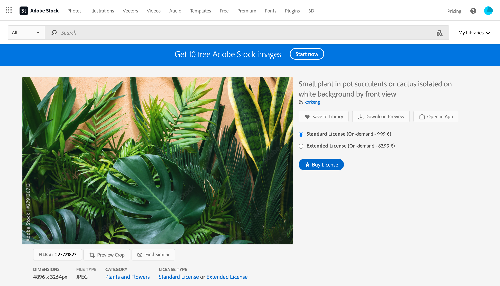

# Arbeta med [!DNL Adobe Stock] bilder {#stock}

## Kom igång med [!DNL Adobe Stock] {#get-started-stock}

Insticksprogrammet för integrering mellan [!DNL Adobe Stock] och [!DNL Adobe Journey Optimizer] e-post-Designer ger kunderna ett enkelt sätt att navigera, licensiera och spara bilder för användning i meddelanderedigering.

[Adobe Stock](https://helpx.adobe.com/stock/get-started.html){target="_blank"} ger tillgång till miljontals utvalda och royaltyfria foton, videor, illustrationer och vektorbilder av hög kvalitet. Du kan välja att köpa ett kreditpaket för att licensiera mediefiler eller bara köpa en Standard- eller Extended-licens för den mediefil du behöver. Adobe Stock erbjuder också en kostnadsfri samling resurser.

Med [!DNL Adobe Journey Optimizer] kan du överföra bilder till dina e-postmeddelanden direkt från [!DNL Adobe Stock] och lägga till dem i din **[!UICONTROL Assets]**-mapp med alternativet **[!UICONTROL Find Adobe Stock photos]**. Dessutom hjälper alternativet **[!UICONTROL Find Similar Stock photos]** dig att hitta bilder som matchar innehållet, färgen och kompositionen för resursen som används i leveransen.

## Behörigheter{#stock-permissions}

Alternativen **[!UICONTROL Find Adobe Stock photos]** och **[!UICONTROL Find Similar Image]** är tillgängliga för användare med tillgång till en produktprofil för AEM Assets Essentials.

Mer information finns i [Experience Manager Assets-dokumentationen](https://experienceleague.adobe.com/docs/experience-manager-assets-essentials/help/get-started-admins/deploy-administer.html#add-users-to-essentials){target="_blank"}.

## Infoga en bild från [!DNL Adobe Stock] {#add-stock-image}

Följ stegen nedan om du vill lägga till bilder från [!DNL Adobe Stock] i ditt innehåll:

1. Dra och släpp en **[!UICONTROL Content components]** bild **från**-delen av e-post-Designer.

1. Klicka på knappen **[!UICONTROL Find Adobe Stock photos]** till vänster om e-post-Designer.

   

1. Bläddra i biblioteket eller ange en term i sökfältet.

   

1. Markera den valda bilden och klicka på **[!UICONTROL Save]**.

   Om bilden du valde inte är licensierad måste du [hämta licensen](#license-stock-image).

## Söka efter liknande foton {#similar-stock-image}

Du kan ersätta befintliga bilder i ditt e-postinnehåll med ett foto från [!DNL Adobe Stock]. Observera att det här alternativet är tillgängligt för alla bilder: licensierade/ej licensierade Stock-bilder och bilder från din Assets-mapp.

Följ stegen nedan om du vill bläddra bland liknande foton:

1. Markera bilden som ska ersättas.
1. Klicka på knappen **[!UICONTROL Find similar Stock photos]** om du vill visa resurser i [!DNL Adobe Stock] som matchar bildens innehåll, färg och komposition.

   

1. Markera den valda bilden och klicka på **[!UICONTROL Save]**.

   

   Om bilden du valde inte är licensierad måste du [hämta licensen](#license-stock-image).

1. Anpassa bilden, om det behövs, med flikarna **[!UICONTROL Settings]** och **[!UICONTROL Styles]**. [Läs mer om komponentinställningar](../email/content-components.md).

## Hämta licensen från [!DNL Adobe Stock] {#license-stock-image}

Om din bild redan är licensierad visas den med ikonen . Annars måste du licensiera den.

Följ stegen nedan för att licensiera och hämta din bild:

1. Markera den och klicka på ikonen **[!UICONTROL License Adobe Stock image]**.

   

   Du omdirigeras sedan till webbplatsen [!DNL Adobe Stock] för att köpa licensen.

   

1. Från webbplatsen [!DNL Adobe Stock] måste du köpa resursen för att kunna hämta bilden och ta bort vattenstämpeln.

   Köpet beror på din Adobe Stock-prenumeration. Observera att om du har flera Adobe Stock-konton kommer du att omdirigeras till det senast använda Stock ID:t. I så fall måste du se till att du är inloggad på rätt konto innan du licensierar resursen.

   Mer information om Adobe Stock-planer och priser finns i [Adobe Stock-dokumentationen](https://stock.adobe.com/plans){target="_blank"}.

   >[!WARNING]
   > Om ett e-postmeddelande med en olicensierad bild skickas behåller bilden sin olicensierade form med vattenstämpeln.

1. När köpet är klart kan du gå tillbaka till e-postmeddelandet i [!DNL Adobe Journey Optimizer] och välja **[!UICONTROL Import stock image]** för att importera den licensierade bilden till dina mediefiler.

   

1. Välj i vilken mapp resursen ska lagras. Mer information om [!DNL Experience Manager Assets] finns på den här [sidan](assets.md#get-started-assets).

## Relaterade ämnen{#stock-related-topics}

* [E-postdesign i Journey Optimizer](../email/get-started-email-design.md)
* [Komponentinställningar för e-postdesign](../email/content-components.md)
* [Kom igång med Adobe Stock](https://helpx.adobe.com/stock/get-started.html){target="_blank"}.

