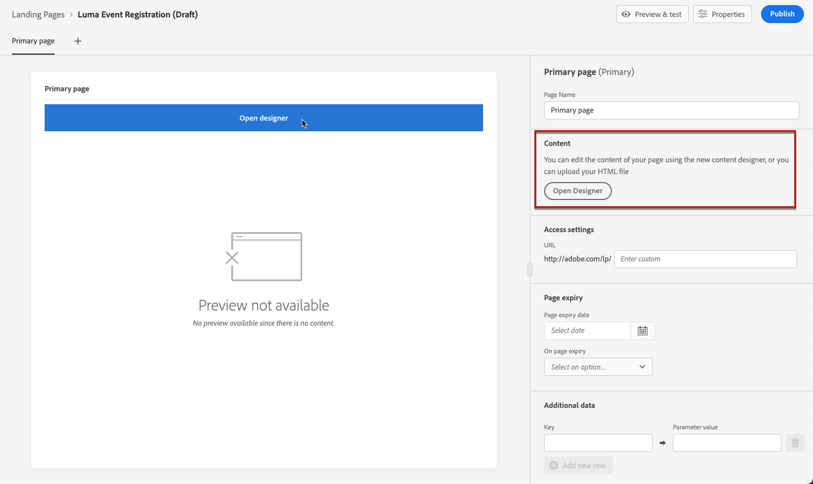

# Skapa och publicera landningssidor {#create-lp}

>[!CAUTION]
>
>Användningen av landningssidor är för närvarande endast tillgänglig i ett tidigt skede för att vissa användare ska kunna välja. Om du vill använda den här funktionen kontaktar du din kontoansvarige på Adobe.

## Åtkomst till landningssidor

Om du vill få åtkomst till landningssidans lista väljer du **[!UICONTROL Journey Management]** > **[!UICONTROL Landing pages]** från den vänstra menyn.

The **[!UICONTROL Landing Pages]** visas alla objekt som har skapats. Du kan filtrera dem baserat på deras status eller ändringsdatum.

## Skapa en landningssida

Stegen för att skapa en landningssida är följande.

1. I listan över landningssidor klickar du på **[!UICONTROL Create landing page]**.

   

1. Lägg till en titel. Du kan lägga till en beskrivning om det behövs.

   

1. Klicka på **[!UICONTROL Create]**.

1. Den primära sidan och dess egenskaper visas. Lär dig hur du konfigurerar sidinställningarna [här](#configure-primary-page).

   

1. Klicka på ikonen + för att lägga till en undersida. Lär dig hur du konfigurerar inställningarna [här](#configure-subpages).

   

När du har konfigurerat och utformat [primär sida](#configure-primary-page) och [undersidor](#configure-subpages) om det finns något, kan du [test](#test) och [publicera](#publish) din landningssida.

## Konfigurera den primära sidan {#configure-primary-page}

Den primära sidan är den sida som visas omedelbart för användarna när de klickar på länken till landningssidan, till exempel från ett e-postmeddelande eller en webbplats.

Följ stegen nedan för att definiera inställningarna för den primära sidan.

1. Du kan ändra sidnamnet, vilket är **[!UICONTROL Primary page]** som standard.

1. Redigera innehållet på sidan med hjälp av innehållsdesignern. Lär dig designa innehåll för landningssidor [här](design-lp.md).

   

1. Definiera URL-adressen till landningssidan.

   >[!CAUTION]
   >
   >Landningssidans URL måste vara unik.

   

   Den första delen av URL-adressen är förfylld och kan inte redigeras via användargränssnittet. Kontakta din kontorepresentant på Adobe eller [Adobe kundtjänstsupport](https://helpx.adobe.com/se/enterprise/admin-guide.html/enterprise/using/support-for-experience-cloud.ug.html){target=&quot;_blank&quot;}.

1. Du kan ange ett förfallodatum för sidan. I så fall måste du välja en åtgärd när sidan förfaller:

   * **[!UICONTROL Redirect URL]**: Ange URL-adressen till sidan som användarna ska omdirigeras till när sidan förfaller.
   * **[!UICONTROL Custom page]**: [Konfigurera en undersida](#configure-subpages) och välj den i listrutan som visas.
   * **[!UICONTROL Browser error]**: Skriv den feltext som ska visas i stället för sidan.

   

   <!--1. In the **[!UICONTROL Additional data]** section, define a **[!UICONTROL Key]** and the corresponding **[!UICONTROL Parameter value]**. // you can define how the data entered in the landing page is managed once it has been submitted by a user??-->

1. Om du valde en eller flera prenumerationslistor för den primära sidan visas de i **[!UICONTROL Subscription list]** -avsnitt.

   

1. Från landningssidan kan du direkt skapa en resa som skickar ett bekräftelsemeddelande till användarna när de skickar formuläret.

   

   Klicka **[!UICONTROL Create journey]** till början [konfigurera den här resan](../building-journeys/journey-gs.md#jo-build). Du omdirigeras till **[!UICONTROL Journey Management]** > **[!UICONTROL Journeys]** lista.

## Konfigurera undersidor {#configure-subpages}

Du kan lägga till så många undersidor som behövs. Du kan till exempel skapa en tacksida som visas när användarna skickar in formuläret. Du kan också definiera en felsida som ska anropas när ett fel inträffar med landningssidan.

Om du vill definiera en undersidsinställning följer du stegen nedan.

1. Du kan ändra sidnamnet, vilket är **[!UICONTROL Subpage 1]** som standard.

1. Redigera innehållet på sidan med hjälp av innehållsdesignern. Lär dig designa innehåll för landningssidor [här](design-lp.md).

1. Definiera URL-adressen till landningssidan.

   Den första delen av URL-adressen är förfylld och kan inte redigeras via användargränssnittet. Kontakta din kontorepresentant på Adobe eller [Adobe kundtjänstsupport](https://helpx.adobe.com/enterprise/admin-guide.html/enterprise/using/support-for-experience-cloud.ug.html){target=&quot;_blank&quot;}.

   >[!CAUTION]
   >
   >Landningssidans URL måste vara unik.

## Testa landningssidan {#test}

När inställningarna för landningssidan och innehållet har definierats kan du använda testprofiler för att förhandsgranska den. Om du infogade [personaliserat innehåll](../personalization/personalize.md)kan du kontrollera hur det här innehållet visas på landningssidan genom att utnyttja testprofildata.

>[!CAUTION]
>
>Du måste ha testprofiler tillgängliga för att kunna förhandsgranska meddelanden och skicka korrektur. Lär dig hur du skapar testprofiler i [den här sidan](../building-journeys/creating-test-profiles.md).

1. I startsidans gränssnitt eller i innehållsdesignern klickar du på **[!UICONTROL Preview & test]** för att komma åt valet av testprofil.

   

1. Markera en eller flera testprofiler.

   

   Stegen för att välja testprofiler är desamma som när du testar ett meddelande. De beskrivs i [det här avsnittet](../preview.md#select-test-profiles).

1. Klicka på **[!UICONTROL Preview]** för att testa landningssidan.

   <!---->

1. Personaliserade element ersätts med valda testprofildata. Välj andra testprofiler om du vill förhandsgranska återgivningen för varje variant av landningssidan.

## Kontrollera aviseringar {#alerts}

När du skapar en landningssida varnar du om du behöver vidta viktiga åtgärder innan du publicerar.

Varningar visas högst upp till höger på skärmen, som visas nedan:

>[!NOTE]
>
>Om knappen inte visas har ingen varning identifierats.

Två typer av varningar kan inträffa:

* **Varningar** hänvisa till rekommendationer och bästa praxis. <!--For example, a message will display if -->

* **Fel** förhindrar att du publicerar meddelandet så länge de inte är lösta. Ett meddelande varnar dig till exempel om att den primära sidans URL saknas.

<!--All possible warnings and errors are detailed [below](#alerts-and-warnings).-->

>[!CAUTION]
>
> Du måste lösa alla **fel** aviseringar före publicering.

<!--The settings and elements checked by the system are listed below. You will also find information on how to adapt your configuration to resolve the corresponding issues.

**Warnings**:

* 

**Errors**:

* 

>[!CAUTION]
>
> To be able to publish your message, you need to resolve all **error** alerts.
-->

## Publicera landningssidan {#publish}

När landningssidan är klar kan du publicera den så att den blir tillgänglig för användning i ett meddelande eller på en webbplats.

>[!CAUTION]
>
>Kontrollera och åtgärda varningar innan du publicerar. [Läs mer](#alerts)

När landningssidan har publicerats läggs den till i listan över landningssidor med **[!UICONTROL Published]** status.

Det är nu live och länken till det är klar att användas i en [message](../create-message.md) och skickas via [resa](../building-journeys/journey.md).
