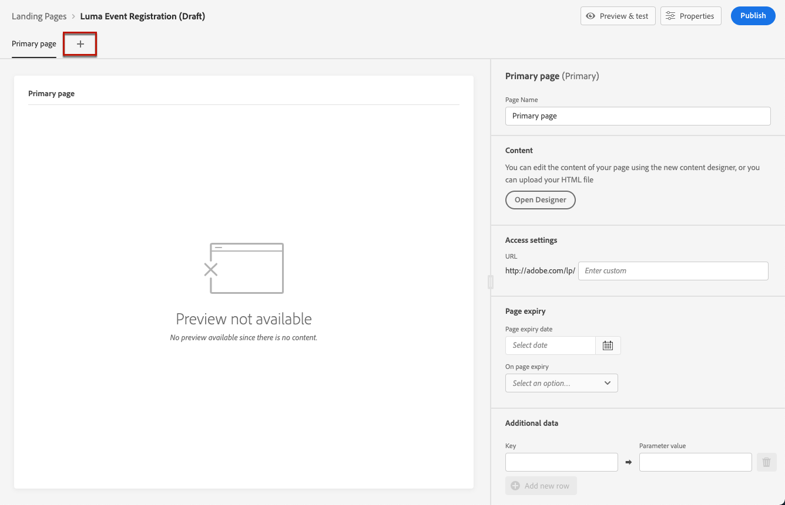
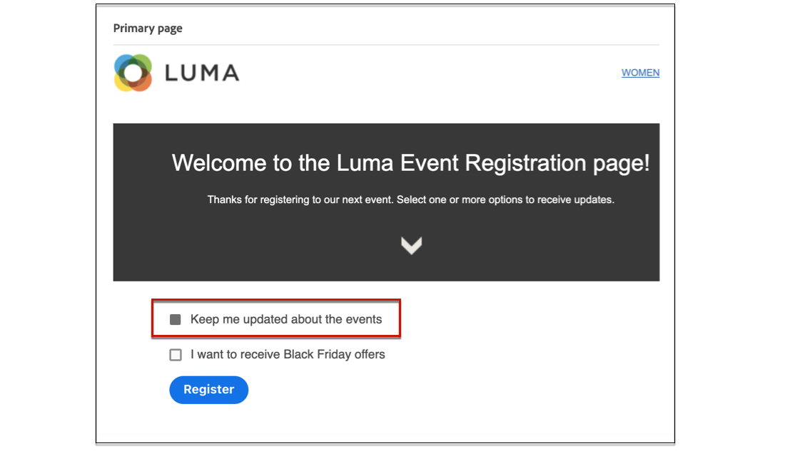
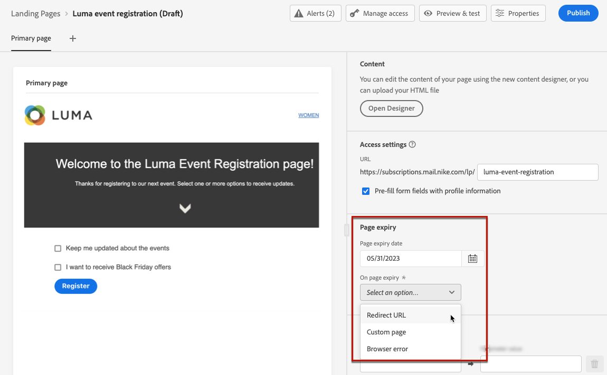
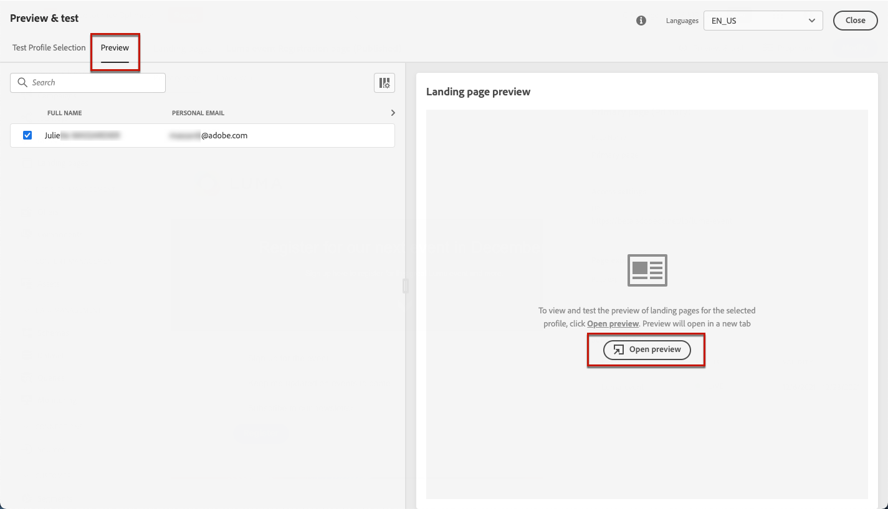
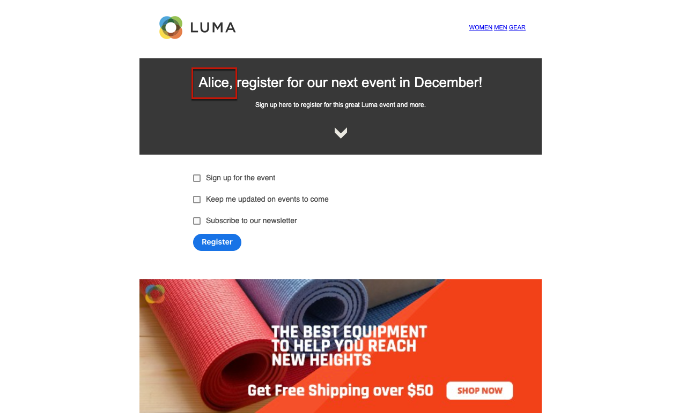

# Skapa och publicera landningssidor {#create-lp}

Om du vill dirigera dina kunder till en definierad webbsida som du vill visa när de klickar på en viss länk, skapar du en landningssida i [!DNL Journey Optimizer], konfigurerar den primära sidan och eventuella underordnade sidor, testar den och publicerar den.

De viktigaste stegen för att skapa landningssidor är följande:

## Skapa en landningssida {#create-landing-page}

>[!CONTEXTUALHELP]
>id="ajo_lp_create"
>title="Definiera och konfigurera landningssidan"
>abstract="Om du vill skapa en landningssida måste du välja en förinställning, konfigurera den primära sidan och underordnade sidor och slutligen testa sidan innan du publicerar den."

>[!CONTEXTUALHELP]
>id="ajo_lp_access_management_labels"
>title="Tilldela etiketter till landningssidan"
>abstract="För att skydda känsliga digitala resurser kan du definiera auktoriseringar för att hantera dataåtkomst till din landningssida med hjälp av etiketter."
>additional-url="https://experienceleague.adobe.com/docs/journey-optimizer/using/access-control/object-based-access.html?lang=sv-SE" text="Åtkomstkontroll på objektnivå"

Om du vill skapa en landningssida måste du välja en förinställning, konfigurera den primära sidan och underordnade sidor och slutligen testa sidan innan du publicerar den. Dessa steg beskrivs nedan:

1. Bläddra till **[!UICONTROL Content Management]** > **[!UICONTROL Landing pages]** från den vänstra menyn.

1. Klicka på **[!UICONTROL Create landing page]** i listan över landningssidor.

   

1. Lägg till en titel. Du kan lägga till en beskrivning om det behövs.

   

1. Välj **[!UICONTROL Manage access]** om du vill tilldela etiketter för anpassad eller viktig dataanvändning till landningssidan. [Läs mer om OLAC (Object Level Access Control)](../administration/object-based-access.md)

1. Välj eller skapa Adobe Experience Platform-taggar från fältet **[!UICONTROL Tags]** för att kategorisera landningssidan för förbättrad sökning. [Läs mer](../start/search-filter-categorize.md#tags)

1. Välj en förinställning. Lär dig hur du skapar förinställningar för landningssidor i [det här avsnittet](../landing-pages/lp-presets.md#lp-create-preset).

   

1. Klicka på **[!UICONTROL Create]**.

1. Den primära sidan och dess egenskaper visas. Lär dig hur du konfigurerar inställningarna för den primära sidan [här](#configure-primary-page).

   

1. Klicka på ikonen + för att lägga till en undersida. Lär dig hur du konfigurerar inställningarna för undersidan [här](#configure-subpages).

   

När du har konfigurerat och utformat den [primära sidan](#configure-primary-page) och eventuella [underordnade sidor](#configure-subpages) kan du [testa](#test-landing-page) och [publicera](#publish-landing-page) din landningssida.

>[!CAUTION]
>
>Du kan inte komma åt din landningssida genom att kopiera och klistra in den definierade URL-adressen i en webbläsare, även om den är publicerad. I stället kan du testa den med förhandsvisningsfunktionen som beskrivs i [det här avsnittet](#test-landing-page).

## Konfigurera den primära sidan {#configure-primary-page}

>[!CONTEXTUALHELP]
>id="ajo_lp_primary_page"
>title="Ange inställningar för den primära sidan"
>abstract="Den primära sidan visas omedelbart för användarna när de klickar på länken till din landningssida, till exempel från ett e-postmeddelande eller en webbplats."
<!--
>additional-url="https://experienceleague.adobe.com/docs/journey-optimizer/using/landing-pages/landing-pages-design/design-lp.html?lang=sv-SE" text="Design the landing page content"-->

>[!CONTEXTUALHELP]
>id="ajo_lp_access_settings"
>title="Ange URL-adress för landningssida"
>abstract="I det här avsnittet definierar du en unik URL för landningssidan. Den första delen av URL:en kräver att du tidigare har konfigurerat en underdomän för landningssidan som en del av den förinställning du valde."
>additional-url="https://experienceleague.adobe.com/sv/docs/journey-optimizer/using/content-management/landing-pages/lp-configuration/lp-subdomains" text="Konfigurera underdomäner för landningssidor"
>additional-url="https://experienceleague.adobe.com/sv/docs/journey-optimizer/using/content-management/landing-pages/lp-configuration/lp-presets#lp-create-preset" text="Skapa förinställningar för landningssidor"

Den primära sidan är den sida som visas omedelbart för användarna efter att de har klickat på länken till din landningssida, till exempel från ett e-postmeddelande eller en webbplats.

Följ stegen nedan för att definiera inställningarna för den primära sidan.

1. Du kan ändra sidnamnet, som är **[!UICONTROL Primary page]** som standard.

1. Redigera innehållet på sidan med hjälp av innehållsdesignern. Lär dig hur du definierar innehåll för landningssidan [här](design-lp.md).

   

1. Definiera URL-adressen till landningssidan. Den första delen av URL:en kräver att du tidigare har konfigurerat en underdomän för landningssidan som en del av den [förinställning](../landing-pages/lp-presets.md#lp-create-preset) som du valde. [Läs mer](../landing-pages/lp-subdomains.md)

   >[!CAUTION]
   >
   >Landningssidans URL måste vara unik.
   >
   >Du kan inte komma åt din landningssida genom att kopiera och klistra in URL-adressen i en webbläsare, även om den publicerats. I stället kan du testa den med förhandsvisningsfunktionen som beskrivs i [det här avsnittet](#test-landing-page).

   

1. Om du vill att landningssidan ska förhandsladda formulärdata som redan är tillgängliga väljer du **[!UICONTROL Pre-fill form fields with profile information]**.

   

   Om det här alternativet är aktiverat och en profil redan har valt in/ut eller redan har lagts till i en prenumerationslista, återspeglas deras val när landningssidan visas.

   Om en profil till exempel har valt att ta emot meddelanden om framtida händelser, kommer motsvarande kryssruta redan att vara markerad nästa gång landningssidan visas för den profilen.

   

1. Du kan ange ett förfallodatum för sidan. I så fall måste du välja en åtgärd när sidan förfaller:

   * **[!UICONTROL Redirect URL]**: Ange URL-adressen till sidan som användarna kommer att omdirigeras till när sidan förfaller.
   * **[!UICONTROL Custom page]**: [Konfigurera en undersida](#configure-subpages) och välj den i listrutan som visas.
   * **[!UICONTROL Browser error]**: Skriv den feltext som ska visas i stället för sidan.

   

<!--1. In the **[!UICONTROL Additional data]** section, define one or more keys and their corresponding parameter values. You will be able to leverage these keys in the content of your primary page and subpages using the [personalization editor](../personalization/personalization-build-expressions.md). Learn more in [this section](lp-content.md#use-form-component#use-additional-data).

    -->

1. Om du valde en eller flera prenumerationslistor när [du designade den primära sidan](design-lp.md) visas de i avsnittet **[!UICONTROL Subscription list]**.

   

1. Från landningssidan kan du direkt [skapa en resa](../building-journeys/journey-gs.md#jo-build) som skickar ett bekräftelsemeddelande till användare när de skickar formuläret. Lär dig hur du skapar en sådan resa i slutet av det här [användningsfallet](lp-use-cases.md#subscription-to-a-service).

   

   Klicka på **[!UICONTROL Create journey]** om du vill omdirigeras till listan **[!UICONTROL Journey Management]** > **[!UICONTROL Journeys]**.

## Konfigurera undersidor {#configure-subpages}

>[!CONTEXTUALHELP]
>id="ajo_lp_subpage"
>title="Definiera inställningar för undersidan"
>abstract="Du kan lägga till upp till två undersidor. Du kan till exempel skapa en&quot;tack&quot;-sida som visas när användarna skickar in formuläret, och du kan definiera en felsida som anropas om ett problem uppstår med landningssidan."
>additional-url="https://experienceleague.adobe.com/sv/docs/journey-optimizer/using/content-management/landing-pages/landing-pages-design/design-lp" text="Utforma innehållet på landningssidan"

>[!CONTEXTUALHELP]
>id="ajo_lp_access_settings-subpage"
>title="Ange URL-adress för landningssida"
>abstract="I det här avsnittet definierar du en unik URL för landningssidan. Den första delen av URL:en kräver att du tidigare har konfigurerat en underdomän för landningssidan som en del av den förinställning du valde."
>additional-url="https://experienceleague.adobe.com/docs/journey-optimizer/using/content-management/landing-pages/lp-configuration/lp-subdomains.html?lang=sv-SE" text="Konfigurera underdomäner för landningssidor"
>additional-url="https://experienceleague.adobe.com/docs/journey-optimizer/using/content-management/landing-pages/lp-configuration/lp-presets.html?lang=sv-SE#lp-create-preset" text="Skapa förinställningar för landningssidor"

Du kan lägga till upp till två undersidor. Du kan till exempel skapa en&quot;tack&quot;-sida som visas när användarna skickar in formuläret, och du kan definiera en felsida som anropas om ett problem uppstår med landningssidan.

Följ stegen nedan för att definiera inställningar för undersidan.

1. Du kan ändra sidnamnet, som är **[!UICONTROL Subpage 1]** som standard.

1. Redigera innehållet på sidan med hjälp av innehållsdesignern. Lär dig hur du definierar innehåll för landningssidan [här](design-lp.md).

   >[!NOTE]
   >
   >Du kan infoga en länk till den primära sidan från en undersida till samma landningssida. Om du till exempel vill dirigera om användare som har gjort ett misstag och vill prenumerera igen, kan du lägga till en länk från bekräftelseundersidan till den primära prenumerationssidan. Lär dig infoga länkar i [det här avsnittet](../email/message-tracking.md#insert-links).

1. Definiera URL-adressen till landningssidan. Den första delen av URL:en kräver att du tidigare har konfigurerat en underdomän för landningssidan. [Läs mer](../landing-pages/lp-subdomains.md)

   >[!CAUTION]
   >
   >Landningssidans URL måste vara unik.
   >
   >Du kan inte komma åt din undersida genom att kopiera och klistra in den här URL:en i en webbläsare, även om den är publicerad. I stället kan du testa den med förhandsvisningsfunktionen som beskrivs i [det här avsnittet](#test-landing-page).

## Testa landningssidan {#test-landing-page}

>[!CONTEXTUALHELP]
>id="ac_preview_lp_profiles"
>title="Förhandsgranska och testa landningssidan"
>abstract="När du har definierat inställningarna för landningssidan och innehållet kan du använda testprofiler för att förhandsgranska den."
>additional-url="https://experienceleague.adobe.com/docs/journey-optimizer/using/audiences-profiles-identities/profiles/creating-test-profiles.html?lang=sv-SE" text="Välj testprofiler"

När inställningarna för landningssidan och innehållet har definierats kan du använda testprofiler för att förhandsgranska den. Om du infogade [anpassat innehåll](../personalization/personalize.md) kan du med hjälp av testprofildata kontrollera hur det här innehållet visas på landningssidan.

>[!CAUTION]
>
>För att kunna testa landningssidor måste du ha behörighet **[!UICONTROL Publish Messages]**.
>
>Du måste ha testprofiler tillgängliga för att kunna förhandsgranska dina meddelanden och skicka korrektur. Lär dig hur du [skapar testprofiler](../audience/creating-test-profiles.md).

1. Klicka på knappen **[!UICONTROL Simulate content]** i landningssidans gränssnitt för att komma åt valet av testprofil.

   

   >[!NOTE]
   >
   >Knappen **[!UICONTROL Simulate content]** är också tillgänglig från innehållsdesignern.

1. Välj en eller flera testprofiler på skärmen **[!UICONTROL Simulate]**.

   

   Stegen för att välja testprofiler är desamma som när du testar ett meddelande. De beskrivs i avsnittet [Innehållshantering](../content-management/test-profiles.md).

1. Välj **[!UICONTROL Open preview]** om du vill testa landningssidan.

   

1. Förhandsgranskningen av landningssidan öppnas på en ny flik. Personaliserade element ersätts med valda testprofildata.

   <!---->

1. Välj andra testprofiler om du vill förhandsgranska återgivningen för varje variant av landningssidan.

## Kontrollera aviseringar {#check-alerts}

När du skapar en landningssida varnar du om när du måste vidta viktiga åtgärder innan du publicerar.

Varningar visas högst upp till höger på skärmen, som visas nedan:

>[!NOTE]
>
>Om du inte ser den här knappen har ingen varning identifierats.

Två typer av varningar kan inträffa:

* **Varningar** hänvisar till rekommendationer och bästa praxis. <!--For example, a message will display if -->

* **Fel** hindrar dig från att publicera landningssidan så länge som de inte har lösts. Du får till exempel en varning om den primära sidans URL saknas.

<!--All possible warnings and errors are detailed [below](#alerts-and-warnings).-->

>[!CAUTION]
>
> Du måste lösa alla **error**-varningar innan du kan publicera.

<!--The settings and elements checked by the system are listed below. You will also find information on how to adapt your configuration to resolve the corresponding issues.

**Warnings**:

* 

**Errors**:

-->

## Publicera landningssidan {#publish-landing-page}

>[!CAUTION]
>
>Användarna måste ha behörighet **[!UICONTROL Publish Messages]** för att kunna publicera landningssidor.

När landningssidan är klar kan du publicera den för att göra den tillgänglig för användning i ett meddelande.

>[!CAUTION]
>
>Kontrollera och åtgärda varningar innan du publicerar. [Läs mer](#check-alerts)

När landningssidan har publicerats läggs den till i listan över landningssidor med statusen **[!UICONTROL Published]**.

Det är nu direktsänt och klart att användas i ett [!DNL Journey Optimizer]-meddelande som skickas via en [resa](../building-journeys/journey.md).

>[!NOTE]
>
>Du kan inte komma åt din landningssida genom att kopiera och klistra in den URL-adress som definierades när [sidan skapades](#create-landing-page) i en webbläsare, även om den publicerades. I stället kan du testa den med förhandsvisningsfunktionen som beskrivs i [det här avsnittet](#test-landing-page).

Ni kan övervaka hur landningssidan påverkas genom specifika rapporter. [Läs mer](../reports/lp-report-live.md)
