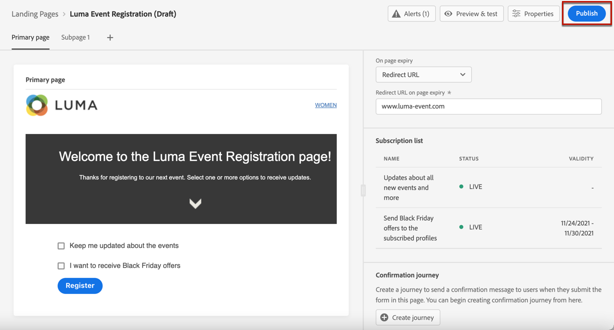

# Skapa och publicera landningssidor {#create-lp}

## Åtkomst till landningssidor {#access-landing-pages}

Om du vill få åtkomst till landningssidans lista väljer du **[!UICONTROL Journey Management]** > **[!UICONTROL Landing pages]** från den vänstra menyn.

The **[!UICONTROL Landing Pages]** visas alla objekt som har skapats. Du kan filtrera dem baserat på deras status eller ändringsdatum.

I den här listan kan du komma åt [landningssida Live-rapport](../reports/lp-report-live.md) eller [Global rapport för landningssida](../reports/lp-report-global.md) för publicerade objekt.

Du kan också ta bort, duplicera och avpublicera en landningssida.

>[!CAUTION]
>
>Om du avpublicerar en landningssida som det refereras till i ett opublicerat meddelande, kan meddelandet inte publiceras förrän landningssidan publiceras igen. Om meddelandet redan har publicerats bryts länken till landningssidan och en felsida visas.

Klicka på de tre punkterna bredvid en landningssida för att välja önskad åtgärd.

>[!NOTE]
>
>Du kan inte ta bort en publicerad landningssida. Om du vill ta bort den måste du först avpublicera den.

## Skapa en landningssida {#create-landing-page}

Stegen för att skapa en landningssida är följande.

1. I listan över landningssidor klickar du på **[!UICONTROL Create landing page]**.

   

1. Lägg till en titel. Du kan lägga till en beskrivning om det behövs.

   

1. Välj en förinställning. Lär dig hur du skapar förinställningar för landningssidor i [det här avsnittet](../configuration/lp-configuration.md#lp-create-preset).

   

1. Klicka på **[!UICONTROL Create]**.

1. Den primära sidan och dess egenskaper visas. Lär dig hur du konfigurerar inställningarna för den primära sidan [här](#configure-primary-page).

   

1. Klicka på ikonen + för att lägga till en undersida. Lär dig hur du konfigurerar inställningarna för undersidan [här](#configure-subpages).

   

När du har konfigurerat och utformat [primär sida](#configure-primary-page)och [undersidor](#configure-subpages) om det finns något, kan du [test](#test-landing-page) och [publicera](#publish-landing-page) din landningssida.

## Konfigurera den primära sidan {#configure-primary-page}

Den primära sidan är den sida som visas omedelbart för användarna efter att de har klickat på länken till din landningssida, till exempel från ett e-postmeddelande eller en webbplats.

Följ stegen nedan för att definiera inställningarna för den primära sidan.

1. Du kan ändra sidnamnet, vilket är **[!UICONTROL Primary page]** som standard.

1. Redigera innehållet på sidan med hjälp av innehållsdesignern. Lär dig definiera innehåll för landningssidor [här](design-lp.md).

   

1. Definiera URL-adressen till landningssidan. Den första delen av URL:en kräver att du tidigare har konfigurerat en underdomän för landningssidan. [Läs mer](../configuration/lp-configuration.md#lp-subdomains)

   >[!CAUTION]
   >
   >Landningssidans URL måste vara unik.

   

   >[!NOTE]
   >
   >Du kan inte komma åt din landningssida genom att kopiera och klistra in URL-adressen i en webbläsare, även om den publicerats. I stället kan du testa den med förhandsvisningsfunktionen som beskrivs i [det här avsnittet](#test-landing-page).

1. Du kan ange ett förfallodatum för sidan. I så fall måste du välja en åtgärd när sidan förfaller:

   * **[!UICONTROL Redirect URL]**: Ange URL-adressen till sidan som användarna ska omdirigeras till när sidan förfaller.
   * **[!UICONTROL Custom page]**: [Konfigurera en undersida](#configure-subpages) och välj den i listrutan som visas.
   * **[!UICONTROL Browser error]**: Skriv den feltext som ska visas i stället för sidan.

   

   <!--1. In the **[!UICONTROL Additional data]** section, define a **[!UICONTROL Key]** and the corresponding **[!UICONTROL Parameter value]**. // you can define how the data entered in the landing page is managed once it has been submitted by a user??-->

1. Om du valde en eller flera prenumerationer visas [utforma den primära sidan](design-lp.md)visas de i **[!UICONTROL Subscription list]** -avsnitt.

   

1. Från landningssidan kan du [skapa en resa](../building-journeys/journey-gs.md#jo-build) som skickar ett bekräftelsemeddelande till användarna när de skickar formuläret. Lär dig hur du skapar en sådan resa i slutet av detta [användningsfall](lp-use-cases.md#subscription-to-a-service).

   

   Klicka **[!UICONTROL Create journey]** omdirigeras till **[!UICONTROL Journey Management]** > **[!UICONTROL Journeys]** lista.

## Konfigurera undersidor {#configure-subpages}

Du kan lägga till upp till två undersidor. Du kan till exempel skapa en&quot;tack&quot;-sida som visas när användarna skickar in formuläret, och du kan definiera en felsida som anropas om ett problem uppstår med landningssidan.

Följ stegen nedan för att definiera inställningar för undersidan.

1. Du kan ändra sidnamnet, vilket är **[!UICONTROL Subpage 1]** som standard.

1. Redigera innehållet på sidan med hjälp av innehållsdesignern. Lär dig definiera innehåll för landningssidor [här](design-lp.md).

1. Definiera URL-adressen till landningssidan. Den första delen av URL:en kräver att du tidigare har konfigurerat en underdomän för landningssidan. [Läs mer](../configuration/lp-configuration.md#lp-subdomains)

   >[!CAUTION]
   >
   >Landningssidans URL måste vara unik.

## Testa landningssidan {#test-landing-page}

När inställningarna för landningssidan och innehållet har definierats kan du använda testprofiler för att förhandsgranska den. Om du infogade [personaliserat innehåll](../personalization/personalize.md)kan du kontrollera hur det här innehållet visas på landningssidan genom att utnyttja testprofildata.

>[!CAUTION]
>
>Du måste ha testprofiler tillgängliga för att kunna förhandsgranska dina meddelanden och skicka korrektur. Lär dig hur [skapa testprofiler](../segment/creating-test-profiles.md).

1. I landningssidans gränssnitt klickar du på **[!UICONTROL Preview & test]** för att komma åt valet av testprofil.

   

   >[!NOTE]
   >
   >The **[!UICONTROL Preview]** kan även användas av innehållsdesignern.

1. Från **[!UICONTROL Preview & test]** väljer du en eller flera testprofiler.

   

   Stegen för att välja testprofiler är desamma som när du testar ett meddelande. De beskrivs i [det här avsnittet](../design/preview.md#select-test-profiles).

1. Välj **[!UICONTROL Preview]** och klicka **[!UICONTROL Open preview]** för att testa landningssidan.

   

1. Förhandsgranskningen av landningssidan öppnas på en ny flik. Personaliserade element ersätts med valda testprofildata.

   

1. Välj andra testprofiler om du vill förhandsgranska återgivningen för varje variant av landningssidan.

## Kontrollera aviseringar {#check-alerts}

När du skapar en landningssida varnar du om när du måste vidta viktiga åtgärder innan du publicerar.

Varningar visas högst upp till höger på skärmen, som visas nedan:

>[!NOTE]
>
>Om knappen inte visas har ingen varning identifierats.

Två typer av varningar kan inträffa:

* **Varningar** hänvisa till rekommendationer och bästa praxis. <!--For example, a message will display if -->

* **Fel** hindra dig från att publicera landningssidan så länge som de inte är lösta. Du får till exempel en varning om den primära sidans URL saknas.

<!--All possible warnings and errors are detailed [below](#alerts-and-warnings).-->

>[!CAUTION]
>
> Du måste lösa alla **fel** aviseringar före publicering.

<!--The settings and elements checked by the system are listed below. You will also find information on how to adapt your configuration to resolve the corresponding issues.

**Warnings**:

* 

**Errors**:

* 

>[!CAUTION]
>
> To be able to publish your message, you must resolve all **error** alerts.
-->

## Publicera landningssidan {#publish-landing-page}

När landningssidan är klar kan du publicera den för att göra den tillgänglig för användning i ett meddelande.

>[!CAUTION]
>
>Kontrollera och åtgärda varningar innan du publicerar. [Läs mer](#check-alerts)

När landningssidan har publicerats läggs den till i listan över landningssidor med **[!UICONTROL Published]** status.

Den är nu klar att användas i en [!DNL Journey Optimizer] [message](../messages/get-started-content.md) som skickas via en [resa](../building-journeys/journey.md).

>[!NOTE]
>
>Ni kan övervaka hur landningssidan påverkas genom specifika rapporter. [Läs mer](../reports/lp-report-live.md)

