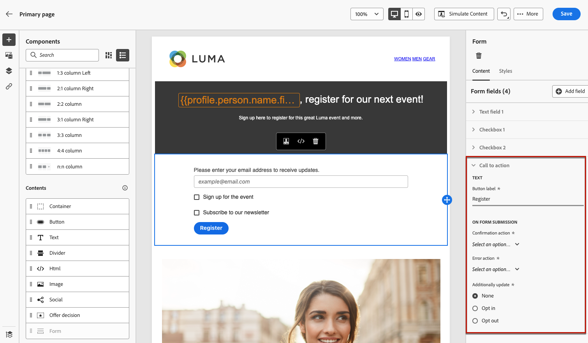
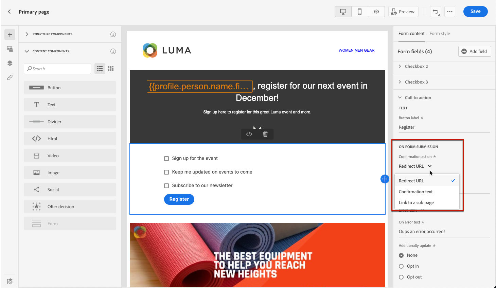
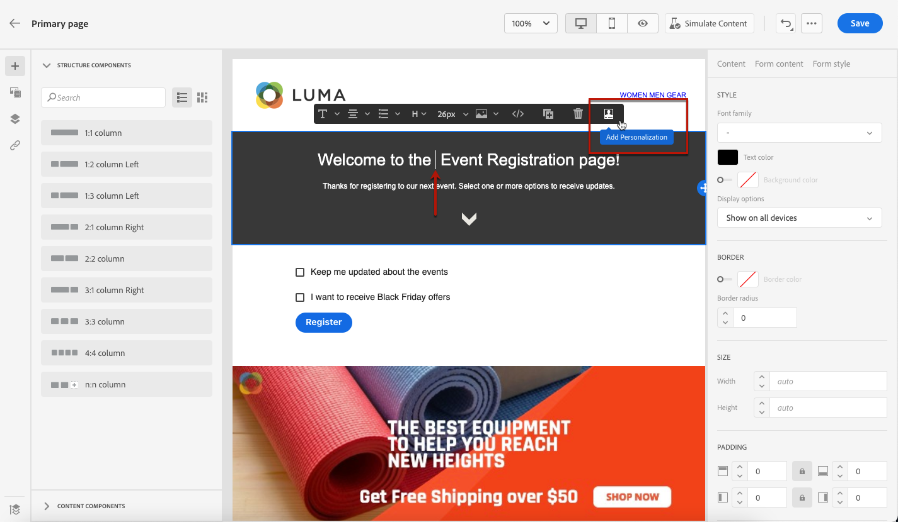

# Definiera landningssidspecifikt innehåll {#lp-content}

>[!CONTEXTUALHELP]
>id="ac_lp_components"
>title="Använda innehållskomponenter"
>abstract="Innehållskomponenterna är tomma platshållare för innehåll som du kan använda för att skapa layouten för en landningssida. Använd formulärkomponenten för att definiera specifikt innehåll som gör att användare kan välja och skicka sina val."
>additional-url="https://experienceleague.adobe.com/en/docs/journey-optimizer/using/channels/email/design-email/add-content/content-components#add-content-components" text="Lägga till innehållskomponenter"

Om du vill utforma innehållet på landningssidan kan du använda samma komponenter som för ett e-postmeddelande. [Läs mer](../email/content-components.md#add-content-components)

Om du vill utforma specifikt innehåll som gör det möjligt för användare att markera och skicka sina val, [använder du formulärkomponenten](#use-form-component) och definierar dess [landningssidspecifika format](#lp-form-styles).

>[!NOTE]
>
>Du kan också skapa en klickbar landningssida utan någon **[!UICONTROL Form]**-komponent. I så fall visas landningssidan för användarna, men de behöver inte skicka in något formulär. Detta kan vara användbart om du bara vill visa upp en landningssida utan att behöva vidta några åtgärder från dina mottagare, som att anmäla dig eller avanmäla dig, eller om du vill tillhandahålla information som inte kräver användarindata.

Med hjälp av layoutaren för landningssidans innehåll kan du även utnyttja sammanhangsberoende data som kommer från den primära sidan på en undersida. [Läs mer](#use-primary-page-context)

>[!NOTE]
>
>I den [europeiska tillgänglighetslagen](https://eur-lex.europa.eu/legal-content/EN/TXT/?uri=CELEX%3A32019L0882){target="_blank"} anges att all digital kommunikation ska vara tillgänglig. Kontrollera att du följer de specifika riktlinjerna som anges på [den här sidan](../email/accessible-content.md) när du designar innehåll i [!DNL Journey Optimizer].

## Använda formulärkomponenten {#use-form-component}

>[!CONTEXTUALHELP]
>id="ac_lp_formfield"
>title="Ange formulärkomponentfälten"
>abstract="Definiera hur dina mottagare ska se och skicka sina val från din landningssida."
>additional-url="https://experienceleague.adobe.com/en/docs/journey-optimizer/using/landing-pages/landing-pages-design/lp-content#lp-form-styles" text="Definiera format för landningssidor"

>[!CONTEXTUALHELP]
>id="ac_lp_submission"
>title="Vad händer när du klickar på knappen"
>abstract="Definiera vad som ska hända när användare skickar in landningssidans formulär."

Använd komponenten **[!UICONTROL Form]** om du vill definiera specifikt innehåll som gör att användare kan välja och skicka sina val från din landningssida. Följ stegen nedan för att göra det.

1. Dra och släpp den landningssidsspecifika **[!UICONTROL Form]**-komponenten från den vänstra paletten till huvudarbetsytan.

   

   >[!NOTE]
   >
   >Komponenten **[!UICONTROL Form]** kan bara användas en gång på samma sida.

1. Markera den. Fliken **[!UICONTROL Form content]** visas på den högra paletten så att du kan redigera de olika fälten i formuläret.

   

   >[!NOTE]
   >
   >Växla till fliken **[!UICONTROL Styles]** när du vill om du vill redigera formaten för formulärkomponentinnehållet. [Läs mer](#define-lp-styles)

1. I avsnittet **[!UICONTROL Checkbox 1]** kan du redigera etiketten som motsvarar den här kryssrutan.

1. Definiera om den här kryssrutan ska avanmäla användare till eller från: samtycker de till att ta emot meddelanden eller ber de att inte bli kontaktade längre?

   

   Välj bland tre alternativ nedan:

   * **[!UICONTROL Opt in if checked]**: användare måste markera kryssrutan för att godkänna (anmälan).
   * **[!UICONTROL Opt out if checked]**: användare måste markera kryssrutan för att ta bort sitt samtycke (avanmälan).
   * **[!UICONTROL Opt in if checked, opt out if unchecked]**: Med det här alternativet kan du infoga en enda kryssruta för anmälan/avanmälan. Användarna måste markera kryssrutan för att godkänna (anmälan) och avmarkera den för att ta bort sitt samtycke (avanmälan).

1. Välj vad som ska uppdateras mellan följande tre alternativ:

   

   * **[!UICONTROL Subscription list]**: Du måste välja den prenumerationslista som ska uppdateras om profilen markerar den här kryssrutan. Läs mer om [prenumerationslistor](subscription-list.md).

     <!---->

   * **[!UICONTROL Channel (email)]**: Anmäl dig eller avanmäl dig gäller hela kanalen. Om en profil som avanmäls till exempel har två e-postadresser, kommer båda adresserna att uteslutas från all kommunikation.

   * **[!UICONTROL Email identity]**: Avanmälan eller avanmälan gäller endast den e-postadress som användes för att komma åt landningssidan. Om en profil till exempel har två e-postadresser kommer bara den som användes att välja att ta emot meddelanden från varumärket.

1. Klicka på **[!UICONTROL Add field]** > **[!UICONTROL Checkbox]** för att lägga till en till kryssruta. Upprepa stegen ovan för att definiera dess egenskaper.

   

1. Du kan också lägga till en **[!UICONTROL Text field]**.

   

   * Ange **[!UICONTROL Label]** som ska visas ovanför fältet i formuläret.

   * Ange texten **[!UICONTROL Placeholder]**. Den visas i fältet innan användaren fyller i fältet.

   * Markera **[!UICONTROL Make form field mandatory]**-alternativet om det behövs.  I så fall kan landningssidan endast skickas om användaren har fyllt i detta fält. Om ett obligatoriskt fält inte är ifyllt visas ett felmeddelande när användaren skickar sidan.

   

1. När du har lagt till alla önskade kryssrutor och/eller textfält klickar du på **[!UICONTROL Call to action]** för att utöka motsvarande avsnitt. Det gör att du kan definiera beteendet för knappen i komponenten **[!UICONTROL Form]**.

   

1. Definiera vad som ska hända när du klickar på knappen:

   * **[!UICONTROL Redirect URL]**: Ange URL-adressen till sidan som användarna ska omdirigeras till.
   * **[!UICONTROL Confirmation text]**: Skriv den bekräftelsetext som ska visas.
   * **[!UICONTROL Link to a subpage]**: Konfigurera en [undersida](create-lp.md#configure-subpages) och välj den i listrutan som visas.

   

1. Definiera vad som ska hända när du klickar på knappen om ett fel inträffar:

   * **[!UICONTROL Redirect URL]**: Ange URL-adressen till sidan som användarna ska omdirigeras till.
   * **[!UICONTROL Error text]**: Skriv feltexten som ska visas. Du kan förhandsgranska feltexten när du definierar [formulärformaten](#define-lp-styles).

   * **[!UICONTROL Link to a subpage]**: Konfigurera en [undersida](create-lp.md#configure-subpages) och välj den i listrutan som visas.

   

1. Om du vill göra ytterligare uppdateringar när du skickar formuläret väljer du **[!UICONTROL Opt in]** eller **[!UICONTROL Opt out]** och definierar om du vill uppdatera en prenumerationslista, kanalen eller bara den e-postadress som används.

   

1. Spara ditt innehåll och klicka på pilen bredvid sidnamnet för att gå tillbaka till [landningssidans egenskaper](create-lp.md#configure-primary-page).

   

## Definiera format för landningssidor {#lp-form-styles}

1. Om du vill ändra formaten för formulärkomponentinnehållet växlar du när som helst till fliken **[!UICONTROL Style]**.

   

1. Avsnittet **[!UICONTROL Fields]** är utökat som standard och du kan redigera utseendet på textfältet, till exempel etikett- och platshållarteckensnitt, etikettens position, fältets bakgrundsfärg eller fältets kant.

   

1. Expandera avsnittet **[!UICONTROL Checkboxes]** för att definiera utseendet på kryssrutorna och motsvarande text. Du kan till exempel justera teckensnittsfamiljen eller storleken, eller kryssrutans kantfärg.

   

1. Expandera avsnittet **[!UICONTROL Buttons]** om du vill ändra utseendet på knappen i komponentformuläret. Du kan till exempel ändra teckensnitt, lägga till en kant, redigera etikettfärgen vid hovring eller justera justeringen av knappen.

   

   Du kan förhandsgranska vissa inställningar, till exempel knappetikettsfärg vid hovring, med knappen **[!UICONTROL Simulate content]**. Läs mer om hur du testar landningssidor [här](create-lp.md#test-landing-page).

   <!---->

1. Expandera avsnittet **[!UICONTROL Form layout]** om du vill redigera layoutinställningar som bakgrundsfärg, utfyllnad eller marginal.

   

1. Expandera avsnittet **[!UICONTROL Form error]** för att justera visningen av felmeddelandet som visas om ett problem inträffar. Markera motsvarande alternativ om du vill förhandsgranska feltexten i formuläret.

   

## Använd primär sidkontext {#use-primary-page-context}

Du kan använda kontextuella data från en annan sida på samma landningssida.

Om du till exempel länkar en kryssruta <!-- or the submission of the page--> till en [prenumerationslista](subscription-list.md) på den primära landningssidan kan du använda den prenumerationslistan på undersidan&quot;Tack&quot;.

Låt oss säga att du länkar två kryssrutor på din primära sida till två olika prenumerationslistor. Om en användare prenumererar på något av dessa, vill du visa ett specifikt meddelande när formuläret skickas, beroende på vilken kryssruta de har markerat.

För att göra detta, följ nedanstående steg:

1. På den primära sidan länkar du alla kryssrutor för komponenten **[!UICONTROL Form]** till den relevanta prenumerationslistan. [Läs mer](#use-form-component).

   

1. Placera muspekaren på den underordnade sidan där du vill infoga texten och välj **[!UICONTROL Add personalization]** i det sammanhangsberoende verktygsfältet.

   

1. I fönstret **[!UICONTROL Edit personalization]** väljer du **[!UICONTROL Contextual attributes]** > **[!UICONTROL Landing Pages]** > **[!UICONTROL Primary Page Context]** > **[!UICONTROL Subscription]**.

1. Alla prenumerationslistor som du har valt på den primära sidan visas. Markera de relevanta objekten med ikonen +.

   

1. Lägg till relevanta villkor med hjälpfunktionerna i personaliseringsredigeraren. [Läs mer](../personalization/functions/functions.md)

   

   >[!CAUTION]
   >
   >Om det finns ett specialtecken, t.ex. ett bindestreck i uttrycket, måste du undvika texten, inklusive bindestrecket.

1. Spara ändringarna.

Nu när användare markerar en av kryssrutorna

meddelandet som motsvarar den markerade kryssrutan visas när formuläret skickas.

<!---->

>[!NOTE]
>
>Om en användare markerar de två kryssrutorna visas båda texterna.

<!--
## Use landing page additional data {#use-additional-data}

When [configuring the primary page](create-lp.md#configure-primary-page), you can create additional data to enable storing information when the landing page is being submitted.

>[!NOTE]
>
>This data may not be visible to users who visit the page.

If you defined one or more keys with their corresponding values when [configuring the primary page](create-lp.md#configure-primary-page), you can leverage these keys in the content of your primary page and subpages using the [personalization editor](../personalization/personalization-build-expressions.md).

///When you reuse the same text on a page, this enables you to dynamically change that text if needed, without going through each occurrence.

For example, if you define the company name as a key, you can quickly update it everywhere (on all the pages of a given landing page) by changing it only once in the [primary page settings](create-lp.md#configure-primary-page).///

To leverage these keys in a landing page, follow the steps below:

1. When configuring the primary page, define a key and its corresponding value in the **[!UICONTROL Additional data]** section. [Learn more](create-lp.md#configure-primary-page)

    

1. When editing your primary page with the designer, place the pointer of your mouse where you want to insert your key and select **[!UICONTROL Add personalization]** from the contextual toolbar.

    

1. In the **[!UICONTROL Edit Personalization]** window, select **[!UICONTROL Contextual attributes]** > **[!UICONTROL Landing Pages]** > **[!UICONTROL Additional Context]**.

    

1. All the keys that you created when configuring the primary page are listed. Select the key of your choice using the + icon.

    

1. Save your changes and repeat the steps above as many times as needed.

    

    You can see that the personalization item corresponding to your key is now displayed everywhere you inserted it.
-->