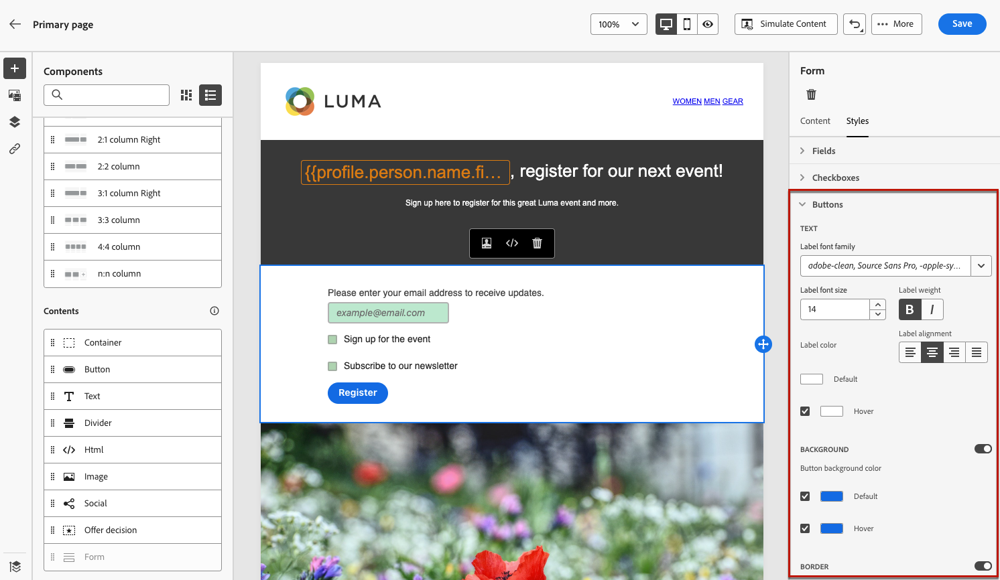

# Definiera landningssidspecifikt innehåll {#lp-content}

Använd **[!UICONTROL Form]** -komponenten. För att göra detta, följ nedanstående steg.

>[!NOTE]
>
>Du kan också skapa en klickbar landningssida utan en **[!UICONTROL Form]** -komponenten. I så fall visas landningssidan för användarna, men de behöver inte skicka in något formulär. Detta kan vara användbart om du bara vill visa upp en landningssida utan att behöva vidta några åtgärder från dina mottagare, som att anmäla dig eller avanmäla dig, eller om du vill tillhandahålla information som inte kräver användarindata.

## Använda formulärkomponenten {#use-form-component}

1. Dra och släpp den specifika landningssidan **[!UICONTROL Form]** från den vänstra paletten till huvudarbetsytan.

   

   >[!NOTE]
   >
   >The **[!UICONTROL Form]** -komponenten kan bara användas en gång på samma sida.

1. Markera den. The **[!UICONTROL Form content]** visas på den högra paletten så att du kan redigera de olika fälten i formuläret.

   

   >[!NOTE]
   >
   >Växla till **[!UICONTROL Form style]** när som helst för att redigera formaten för formulärkomponentens innehåll. [Läs mer](#define-lp-styles)

1. Från **[!UICONTROL Checkbox 1]** kan du redigera etiketten för den här kryssrutan.

1. Ange om den här kryssrutan ska avanmäla användare till eller från: samtycker de till att ta emot meddelanden eller ber de att inte bli kontaktade längre?

   

   Välj bland tre alternativ nedan:

   * **[!UICONTROL Opt in if checked]**: -användare måste markera kryssrutan för att godkänna (anmälan).
   * **[!UICONTROL Opt out if checked]**: användare måste markera kryssrutan för att ta bort sitt samtycke (avanmälan).
   * **[!UICONTROL Opt in if checked, opt out if unchecked]**: Med det här alternativet kan du infoga en enda kryssruta för anmälan/avanmälan. Användarna måste markera kryssrutan för att godkänna (anmälan) och avmarkera den för att ta bort sitt samtycke (avanmälan).

1. Välj vad som ska uppdateras mellan följande tre alternativ:

   

   * **[!UICONTROL Subscription list]**: Du måste välja den prenumerationslista som ska uppdateras om profilen markerar den här kryssrutan. Läs mer på [prenumerationslistor](subscription-list.md).

      

   * **[!UICONTROL Channel (email)]**: Avanmälningen eller avanmälningen gäller hela kanalen. Om en profil som avanmäls till exempel har två e-postadresser, kommer båda adresserna att uteslutas från all kommunikation.

   * **[!UICONTROL Email identity]**: Avanmälan eller avanmälan gäller endast den e-postadress som användes för att få åtkomst till landningssidan. Om en profil till exempel har två e-postadresser kommer bara den som användes att välja att ta emot meddelanden från varumärket.

1. Klicka **[!UICONTROL Add field]** > **[!UICONTROL Checkbox]** om du vill lägga till ytterligare en kryssruta. Upprepa stegen ovan för att definiera dess egenskaper.

   

1. När du har lagt till alla önskade kryssrutor klickar du på **[!UICONTROL Call to action]** för att expandera motsvarande avsnitt. Här kan du definiera hur knappen ska fungera i **[!UICONTROL Form]** -komponenten.

   

1. Definiera vad som ska hända när du klickar på knappen:

   * **[!UICONTROL Redirect URL]**: Ange URL-adressen till sidan som användarna ska omdirigeras till.
   * **[!UICONTROL Confirmation text]**: Skriv den bekräftelsetext som ska visas.
   * **[!UICONTROL Link to a subpage]**: Konfigurera en [undersida](create-lp.md#configure-subpages) och välj den i listrutan som visas.

   

1. Definiera vad som ska hända när du klickar på knappen om ett fel inträffar:

   * **[!UICONTROL Redirect URL]**: Ange URL-adressen till sidan som användarna ska omdirigeras till.
   * **[!UICONTROL Error text]**: Skriv den feltext som ska visas. Du kan förhandsgranska feltexten när du definierar [formulärformat](#define-lp-styles).

   * **[!UICONTROL Link to a subpage]**: Konfigurera en [undersida](create-lp.md#configure-subpages) och välj den i listrutan som visas.

   

1. Om du vill göra ytterligare uppdateringar när du skickar formuläret väljer du **[!UICONTROL Opt in]** eller **[!UICONTROL Opt out]** och ange om du vill uppdatera en prenumerationslista, kanalen eller bara den e-postadress som används.

   

1. Spara innehållet och klicka på pilen bredvid sidnamnet för att gå tillbaka till [egenskaper för landningssida](create-lp.md#configure-primary-page).

   

<!--Will the name Email Designer be kept if you can also design LP with the same tool? > To modify in Messages section > content designer or Designer-->

## Definiera format för landningssidor {#lp-form-styles}

1. Om du vill ändra formaten för formulärkomponentens innehåll växlar du när som helst till **[!UICONTROL Form style]** -fliken.

   

1. Expandera **[!UICONTROL Checkboxes]** för att definiera utseendet på kryssrutorna och motsvarande text. Du kan till exempel justera teckensnittsfamiljen eller storleken och kryssrutans kantlinjefärg.

   

1. Expandera **[!UICONTROL Buttons]** för att ändra utseendet på knappen i komponentformuläret. Du kan till exempel lägga till en kant, redigera etikettfärgen vid hovring eller justera justeringen av knappen.

   

   Du kan förhandsgranska vissa inställningar, t.ex. knappetikettfärg vid hovring med hjälp av **[!UICONTROL Preview]** -knappen. Läs mer om testning av landningssidor [här](create-lp.md#test-landing-page).

   

1. Expandera **[!UICONTROL Form layout]** om du vill redigera layoutinställningar som bakgrundsfärg, utfyllnad eller marginal.

   

1. Expandera **[!UICONTROL Form error]** för att justera visningen av felmeddelandet som visas om ett problem uppstår. Markera motsvarande alternativ för att förhandsgranska feltexten i formuläret.

   

