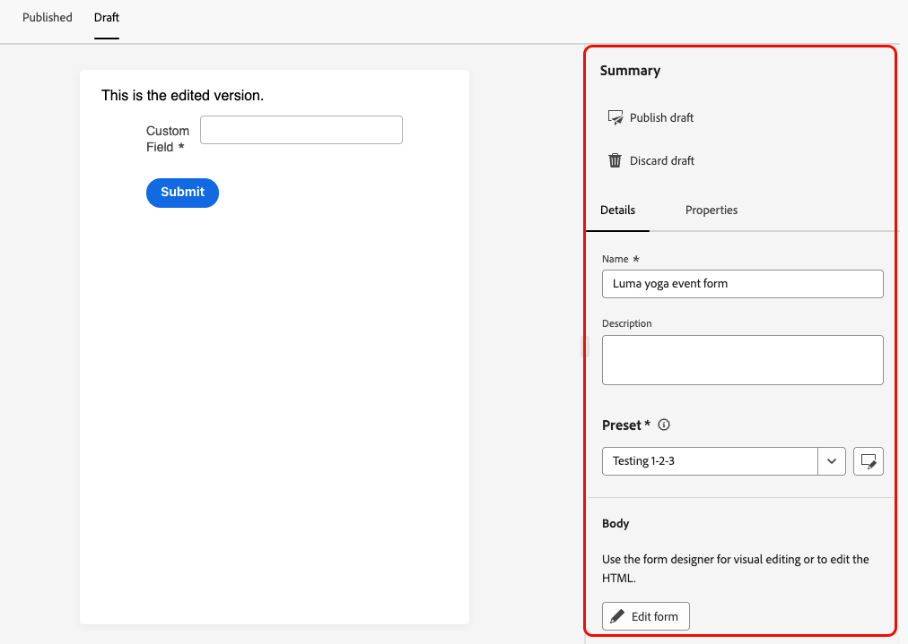
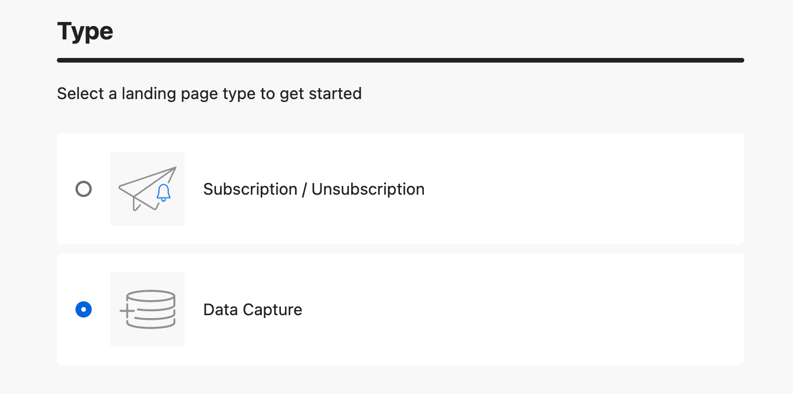

# Använd formulär på dina landningssidor {#lp-forms}

>[!AVAILABILITY]
>
>Den här funktionen är för närvarande begränsad för kunder i USA och Australien. Kontakta din Adobe-representant för att få åtkomst.

Om du vill samla in profildata med dina [!DNL Journey Optimizer] landningssidor och berika dina [!DNL Experience Platform] datauppsättningar kan du använda formulär på dina landningssidor.

## Skapa en formulärförinställning {#create-form-preset}

>[!CONTEXTUALHELP]
>id="ajo_lp_form_connection"
>title="Markera den slutpunkt som ska användas"
>abstract="Definiera slutpunkten för direktuppspelning där data skickas när formuläret skickas."
>additional-url="https://experienceleague.adobe.com/sv/docs/experience-platform/sources/ui-tutorials/create/streaming/http" text="Skapa en HTTP API-direktuppspelningsanslutning"

>[!CONTEXTUALHELP]
>id="ajo_lp_form_dataset"
>title="Välj en datauppsättning"
>abstract="Definiera en datauppsättning där formulärsvaren ska lagras och speglas. Du kan skriva för att söka efter en viss datauppsättning eller välja den i listan."

Innan du kan skapa ett formulär måste du skapa en dedikerad förinställning där du väljer anslutningens slutpunkt där data skickas och datauppsättningen där data som hämtas via formuläret ska lagras.

När data når direktuppspelningsslutpunkten länkas de till datauppsättningsinformationen. Med de genererade käll-/målanslutningarna och källflödet överförs data sedan till datauppsättningen.

När du skapar en förinställning:

* Du kan konfigurera flera förinställningar med olika kombinationer av datauppsättningar och direktuppspelningsanslutningar.
* Samma datauppsättning eller direktuppspelningsanslutning kan återanvändas i flera förinställningar.
* Varje direktuppspelningsanslutning genererar automatiskt resurser som:
   * **Source-anslutning** - där data kommer.
   * **Målanslutning** - där data lagras eller används.
   * **Source-flöde** - pipeline som flyttar data från källanslutningen till [!DNL Experience Platform], hanterar mappning, transformering och validering.

<!--
>[!NOTE]
>
> To access and edit form presets, you must have the **[!UICONTROL Manage form presets]** permission on the production sandbox. Learn more about permissions in [this section](../administration/high-low-permissions.md#administration-permissions).TBC
-->

Följ stegen nedan för att skapa en formulärförinställning.

1. Om du vill komma åt **[!UICONTROL Form presets]**-lagret väljer du **[!UICONTROL Administration]** > **[!UICONTROL Channels]** >**[!UICONTROL Form settings]** på den vänstra menyn.

1. Klicka på **[!UICONTROL Create form preset]**.

1. Uppdatera namnet så att det blir enklare att hämta det och lägg till en beskrivning om det behövs.

   {width=80%}

1. Välj **[!UICONTROL Streaming connection]** som ska användas för det formuläret. Det här är slutpunkten för direktuppspelning där data skickas när formuläret skickas.

   Läs mer om hur du skapar en direktuppspelad källanslutning i [Experience Platform-dokumentationen](https://experienceleague.adobe.com/sv/docs/experience-platform/sources/ui-tutorials/create/streaming/http){target="_blank"}.

   >[!IMPORTANT]
   >
   >För att en HTTP API-direktuppspelningsanslutning ska kunna visas i listrutan måste den uppfylla följande krav när den skapas i Adobe Experience Platform:
   >
   >* **Datatypen** måste anges till **XDM** (inte Raw-data)
   >* **Autentisering** måste vara **inaktiverad** (icke-autentiserad anslutning)
   >
   >Om din direktuppspelningsanslutning inte visas i listan kontrollerar du att båda villkoren är uppfyllda. <!--Learn how to [create a non-authenticated connection with XDM data type](https://experienceleague.adobe.com/sv/docs/experience-platform/sources/ui-tutorials/create/streaming/http#create-a-streaming-connection){target="_blank"}.-->

1. Välj en **[!UICONTROL Dataset]** att länka till formuläret. Här lagras och speglas formulärsvaren. Du kan skriva för att söka efter en viss datauppsättning eller välja den i listan.

   >[!NOTE]
   >
   >För närvarande är bara **profilaktiverade** - och **icke-profilaktiverade** [!DNL Adobe Experience Platform]-datauppsättningar tillgängliga för urval. En datauppsättning kan väljas åt gången. Systemdatauppsättningar kan inte användas för att spara formulärdata. [Läs mer om datauppsättningar](../data/get-started-datasets.md)

1. Klicka på **[!UICONTROL Publish]**. Din förinställning kan nu användas i ett formulär.

## Få åtkomst till och hantera formulär {#access-forms}

Om du vill komma åt formulärlistan väljer du **[!UICONTROL Content Management]** > **[!UICONTROL Forms]** på den vänstra menyn.

Alla befintliga formulär visas. Du kan filtrera formulär baserat på deras status, skapandedatum eller ändringsdatum.

## Skapa och utforma ett formulär {#create-form}

>[!CONTEXTUALHELP]
>id="ajo_lp_form_preset"
>title="Välj en förinställning"
>abstract="Välj en fördefinierad förinställning som innehåller anslutningen som ska användas och en fördefinierad datauppsättning för formuläret."
>additional-url="https://experienceleague.adobe.com/sv/docs/journey-optimizer/using/content-management/landing-pages/lp-forms#create-form-preset" text="Skapa en formulärförinställning"

Följ stegen nedan när du vill skapa ett formulär.

1. Klicka på **[!UICONTROL Forms]** i listan **[!UICONTROL Create form]**.

1. Lägg till ett namn. Du kan lägga till en beskrivning om det behövs.

   

1. Välj en **[!UICONTROL Preset]** som innehåller anslutningen som ska användas och en fördefinierad datauppsättning för formuläret. [Lär dig skapa en formulärförinställning](#create-form-preset)

1. Klicka på **[!UICONTROL Create]**. Formulärdesignern öppnas och du kan lägga till strukturer och innehåll [komponenter](../email/content-components.md#add-content-components) för att skapa ditt innehåll. Du kan använda komponenterna [Text](../email/content-components.md#text) och **[!UICONTROL Field]**.

1. Om du vill samla in profildata och attribut lägger du till specifika fält i formuläret. [Läs mer](#define-fields)

1. Konfigurera och utforma dessa fält. [Läs mer](#configure-fields)

1. Du kan justera formulärets layout, format och mått efter behov med hjälp av rutan **[!UICONTROL Styles]**. [Läs mer om formatering](../email/get-started-email-style.md)

1. När du har konfigurerat alla fält klickar du på **[!UICONTROL Save & close]**.

1. Konfigurera sidan Tack. [Lär dig hur](#thank-you-page)

1. **[!UICONTROL Publish]** formuläret för att göra det tillgängligt för markering på landningssidor.

### Definiera specifika fält {#define-fields}

Om du vill lägga till specifika fält i formuläret drar och släpper du en struktur på arbetsytan och drar en **[!UICONTROL Field]**-komponent inuti.<!--**[!UICONTROL Select field attribute]** or **[!UICONTROL Add custom field]**.-->

Välj sedan något av följande alternativ:

>[!BEGINTABS]

>[!TAB Välj fältattribut]

Använd det här alternativet om du vill välja ett attribut baserat på det datamängdsschema som är länkat till ditt formulär.

>[!NOTE]
>
>Datauppsättningen definieras i den förinställning som är vald för formuläret. [Läs mer](#create-form-preset)

{width=100%}

Du kan till exempel ange e-post och person-ID. När användarna fyller i dessa fält sparas den angivna informationen i den valda datauppsättningen.

{width=55%}

Om du vill mappa insamlade data till en profil väljer du ett profilidentitetsfält. Identitetsfälten markeras som **[!UICONTROL Required]** i attributlistan - du kan filtrera på dem.

{width=65%}

>[!TAB Lägg till anpassat fält]

Med det här alternativet kan du definiera ett kostnadsfritt fält utan att mappa det till ett fält i den länkade datauppsättningen.

{width=85%}

>[!ENDTABS]

### Konfigurera och utforma ett fält {#configure-fields}

När du har valt ett fältattribut eller lagt till ett anpassat fält kan du justera dess detaljer och beteende ytterligare när du skickar formuläret.

1. I avsnittet **[!UICONTROL Field details]** på fliken **[!UICONTROL Content]** till höger kan du ange följande element efter behov:

   * Justera **[!UICONTROL Label]** så att det tydligt framgår för mottagarna av formuläret.
   * Ändra **[!UICONTROL Field type]** efter dina behov. Det kan vara en kryssruta, en valuta, ett datum, ett reglage, en URL-adress osv.

     >[!NOTE]
     >
     >Övriga fältdetaljer kan variera beroende på vald fälttyp.

   * Lägg till en **[!UICONTROL Placeholder]**.<!--To explain-->
   * Ange **[!UICONTROL Instructions]**.<!--How will they be displayed in the form? To explain-->
   * Ange en **[!UICONTROL Default value]** som visas innan användarna av formuläret fyller i fältet.
   * Du kan definiera en anpassad **[!UICONTROL Validation message]**.
   * Ange **[!UICONTROL Maximum length]**. Ett felmeddelande visas om formulärets mottagare överskrider gränsen när fältet fylls i.

   {width=85%}

1. I avsnittet **[!UICONTROL Field behaviors]** kan du definiera följande:

   * Välj **[!UICONTROL Required]** om du vill göra det här fältet obligatoriskt. Om användaren inte fyller i fältet kan han/hon inte skicka formuläret.
   * Välj **[!UICONTROL Sensitive]** om du vill att fältet ska vara skiftlägeskänsligt. <!--To confirm - do you mean retain capitalization when added to the dataset?-->
   * Välj **[!UICONTROL Prefilled Enabled]** om du vill fylla i fältet från profilinformationen om det är tillgängligt.<!--Even for a custom field, or a field not mapped to a profile? What happens if no data is available?-->
   * Välj **[!UICONTROL Enable input mask]** om du vill ersätta användarens indata med generiska tecken. Du kan använda *9* för att ange valfri siffra, *a* för att ange en bokstav eller * för att ange en siffra eller bokstav.<!--Not sure how you define that in the form-->

   {width=75%}

### Konfigurera sidan Tack {#thank-you-page}

>[!CONTEXTUALHELP]
>id="ajo_lp_forms_thankyou_page"
>title="Tack"
>abstract="Konfigurera vad som ska hända när någon fyller i eller vidarebefordrar formuläret."

I formulärinformationen från avsnittet **[!UICONTROL Thank you page]** konfigurerar du vad som ska hända när en användare fyller i formuläret.

Gör något av följande:

* **[!UICONTROL Stay on page]** - Det här alternativet håller besökaren synkad när formuläret har skickats.
* **[!UICONTROL Landing page]** - Välj en publicerad [landningssida](create-lp.md) som användaren omdirigeras till efter att formuläret har skickats.
* **[!UICONTROL External URL]** - Ange den fullständiga URL-adressen som du vill använda som uppföljningssida. När användaren har skickat formuläret dirigeras de till den angivna URL:en.
* **[!UICONTROL Conditional redirect]** - Ställ in regler för att dynamiskt visa olika uppföljningsåtgärder baserat på formulärsvaren.

  Du kan definiera en regel för varje specifik målgrupp. Du kan till exempel visa en specifik landningssida för amerikanska medborgare, en annan sida för Kanadas invånare och så vidare. Skapa slutligen en standardåtgärd för användare som inte omfattas av någon regel som du har definierat.

  >[!NOTE]
  >
  >De villkor som definieras i en regel läses sekventiellt.

  {width=40%}

## Redigera ett publicerat formulär {#edit-form}

När ett formulär har publicerats kan du fortfarande redigera det. Följ stegen nedan.

1. Gå till [formulärlistan](#access-forms) och välj ett publicerat formulär.

1. Klicka på knappen **[!UICONTROL Edit form]**.

   {width=90%}

1. En ny version av formuläret skapas med utkaststatusen. Klicka på **[!UICONTROL Create draft version]**.

1. Uppdatera formuläret efter behov och klicka på **[!UICONTROL Save]**. Formuläret har nu statusen **[!UICONTROL Published (with draft)]**:

   * Den aktuella versionen har fortfarande statusen **[!UICONTROL Published]** tills du publicerar den uppdaterade versionen.

   * Den uppdaterade versionen har statusen **[!UICONTROL Draft]**.

1. I formulärsammanfattningen kan du navigera mellan de två versionerna av formuläret.

   {width=70%}

1. I avsnittet **[!UICONTROL Draft]** kan du antingen publicera eller ignorera utkastet samt redigera informationen eller innehållet i formuläret.

   {width=75%}

## Utnyttja formuläret på en landningssida {#leverage-form-in-lp}

Nu kan du bädda in det här formuläret på en landningssida för att samla in data som motsvarar de attribut du definierade i formuläret och spara det i den valda datauppsättningen. Följ stegen nedan.

1. Skapa en landningssida. [Lär dig hur](create-lp.md#create-landing-page)

1. Välj **[!UICONTROL Data Capture]** som typ av landningssida och klicka på **[!UICONTROL Create]**.

   {width=65%}

1. Konfigurera den primära sidan. [Lär dig hur](create-lp.md#configure-primary-page)

1. Öppna [startsidans designer](design-lp.md).

1. Dra och släpp **[!UICONTROL Structure component]** i ditt innehåll. Dra och släpp en **[!UICONTROL Form]**-komponent i den strukturen.

   >[!NOTE]
   >
   >Endast publicerade formulär kan väljas på en landningssida.

1. I avsnittet **[!UICONTROL Embed form]** markerar du formuläret som du skapade.

   

   >[!NOTE]
   >
   >Du kan uppdatera det markerade formuläret med knappen **[!UICONTROL Edit form]**. Formuläret öppnas på en ny flik. Stegen för att redigera formulärinnehållet beskrivs i [det här avsnittet](#create-form).

1. Konfigurera vad som ska hända när en användare fyller i formuläret i avsnittet **[!UICONTROL Follow up type]**:

   * Välj **[!UICONTROL Form defined]** om du vill välja åtgärden som definierades i det inbäddade formuläret. [Läs mer](#thank-you-page)

   * Du kan också välja en publicerad [landningssida](create-lp.md) som användaren omdirigeras till efter att formuläret har skickats.

   * Eller definiera en **[!UICONTROL External URL]** som uppföljningssida där användarna dirigeras när de skickar formuläret.

1. Spara och testa landningssidan. [Lär dig hur](create-lp.md#test-landing-page)

När landningssidan är [publicerad](create-lp.md#publish-landing-page) och används på en resa, hämtas den angivna informationen till den valda datauppsättningen när användarna fyller i formuläret.

>[!NOTE]
>
>Om du avpublicerar ett formulär som används på en landningssida, redigerar formuläret och publicerar det igen, används alltid den senaste publicerade versionen av formuläret på landningssidan.
