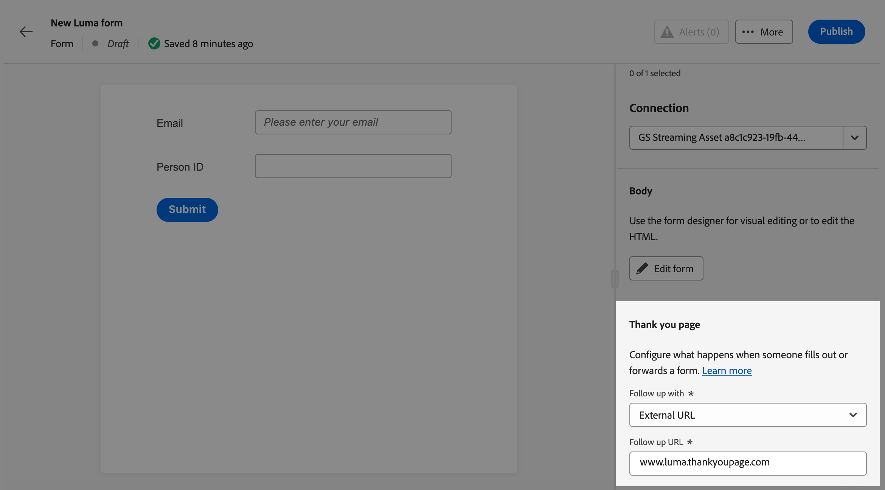

# Använd formulär på dina landningssidor {#lp-forms}

>[!AVAILABILITY]
>
>Den här funktionen är tillgänglig med begränsad tillgänglighet. Kontakta din Adobe-representant för att få åtkomst.

Om du vill samla in profildata med dina [!DNL Journey Optimizer] landningssidor och berika dina [!DNL Experience Platform] datauppsättningar kan du använda formulär på dina landningssidor.

## Skapa en formulärförinställning {#create-form-preset}

>[!CONTEXTUALHELP]
>id="ajo_lp_form_connection"
>title="Markera den slutpunkt som ska användas"
>abstract="Definiera slutpunkten för direktuppspelning där data skickas när formuläret skickas."
>additional-url="https://experienceleague.adobe.com/sv/docs/experience-platform/sources/ui-tutorials/create/streaming/http" text="Skapa en HTTP API-direktuppspelningsanslutning"

>[!CONTEXTUALHELP]
>id="ajo_lp_form_dataset"
>title="Välj en datauppsättning"
>abstract="Definiera en datauppsättning där formulärsvaren ska lagras och speglas. Du kan skriva för att söka efter en viss datauppsättning eller välja den i listan."

Innan du kan skapa ett formulär måste du skapa en dedikerad förinställning där du väljer anslutningens slutpunkt där data skickas och datauppsättningen där data som hämtas via formuläret ska lagras.

När data når strömningsslutpunkten länkas den med datauppsättningsinformationen. Med de genererade käll-/målanslutningarna och källflödet överförs data sedan till datauppsättningen.

När du skapar en förinställning:

* Du kan konfigurera flera förinställningar med olika kombinationer av datauppsättningar och direktuppspelningsanslutningar.
* Samma datauppsättning eller direktuppspelningsanslutning kan återanvändas i flera förinställningar.
* Varje direktuppspelningsanslutning genererar automatiskt resurser som:
   * **Source-anslutning** - där data kommer.
   * **Målanslutning** - där data lagras eller används.
   * **Source-flöde** - pipeline som flyttar data från källanslutningen till [!DNL Experience Platform], hanterar mappning, transformering och validering.

>[!NOTE]
>
> Om du vill komma åt och redigera formulärförinställningar måste du ha behörigheten **[!UICONTROL Manage form presets]** i produktionssandlådan. Läs mer om behörigheter i [det här avsnittet](../administration/high-low-permissions.md#administration-permissions).<!--TBC-->

1. Om du vill komma åt **[!UICONTROL Form presets]**-lagret väljer du **[!UICONTROL Administration]** > **[!UICONTROL Channels]** >**[!UICONTROL Form settings]** på den vänstra menyn.

1. Klicka på **[!UICONTROL Create form preset]**.

1. Uppdatera namnet så att det blir enklare att hämta det och lägg till en beskrivning om det behövs.

   {width=80%}

1. Välj **[!UICONTROL Streaming connection]** som ska användas för det formuläret. Det här är slutpunkten för direktuppspelning där data skickas när formuläret skickas.

   >[!NOTE]
   >
   >Läs mer om hur du skapar en direktuppspelad källanslutning i [Experience Platform-dokumentationen](https://experienceleague.adobe.com/sv/docs/experience-platform/sources/ui-tutorials/create/streaming/http){target="_blank"}.

1. Välj en **[!UICONTROL Dataset]** att länka till formuläret. Här lagras och speglas formulärsvaren. Du kan skriva för att söka efter en viss datauppsättning eller välja den i listan.

   >[!NOTE]
   >
   >För närvarande är bara [!DNL Adobe Experience Platform] datauppsättningar tillgängliga för val. Det går bara att välja en datauppsättning åt gången.

1. Klicka på **[!UICONTROL Publish]**. Din förinställning kan nu användas i ett formulär.

## Få åtkomst till och hantera formulär {#access-forms}

Om du vill komma åt formulärlistan väljer du **[!UICONTROL Content Management]** > **[!UICONTROL Forms]** på den vänstra menyn.

Alla befintliga formulär visas. Du kan filtrera formulär baserat på deras status, skapandedatum eller ändringsdatum.

## Skapa och utforma ett formulär {#create-form}

>[!CONTEXTUALHELP]
>id="ajo_lp_form_preset"
>title="Välj en förinställning"
>abstract="Välj en fördefinierad förinställning som innehåller anslutningen som ska användas och en fördefinierad datauppsättning för formuläret."
>additional-url="https://experienceleague.adobe.com/sv/docs/journey-optimizer/using/content-management/landing-pages/lp-forms#create-form-preset" text="Skapa en formulärförinställning"

Följ stegen nedan när du vill skapa ett formulär.

1. Klicka på **[!UICONTROL Forms]** i listan **[!UICONTROL Create form]**.

1. Lägg till ett namn. Du kan lägga till en beskrivning om det behövs.

   

1. Välj en **[!UICONTROL Preset]** som innehåller anslutningen som ska användas och en fördefinierad datauppsättning för formuläret. [Lär dig skapa en formulärförinställning](#create-form-preset)

1. Klicka på **[!UICONTROL Create]**.

   <!--{width=50%}-->

1. Formulärdesignern öppnas. Lägg till [komponenter](../email/content-components.md#add-content-components) för att skapa formulärinnehållet. Du kan använda [Text](../email/content-components.md#text) -komponenter och **[!UICONTROL Field]**-komponenter.

1. Med komponenten **[!UICONTROL Field]** kan du välja attribut baserat på det valda dataset-schemat.

   >[!NOTE]
   >
   >Om du vill mappa insamlade data till en profil väljer du ett profilidentitetsfält. Identifiera identitetsfälten från attributlistan genom att söka efter fälten som markerats som **[!UICONTROL Required]**.<!--Explain-->

   Du kan till exempel ange e-post och person-ID. När användarna fyller i dessa fält sparas den angivna informationen i den valda datauppsättningen.

   

1. Du kan ange varje **[!UICONTROL Field details]**, till exempel instruktioner, ett standardvärde, ett valideringsmeddelande, maximal längd osv.

   

1. Du kan justera formulärets layout, format och mått efter behov med hjälp av rutan **[!UICONTROL Styles]**. [Läs mer om formatering](../email/get-started-email-style.md)

1. Klicka på **[!UICONTROL Save & close]**.

1. Konfigurera sidan Tack. [Lär dig hur](#thank-you-page)

1. **[!UICONTROL Publish]** formuläret för att göra det tillgängligt för markering på landningssidor.

### Konfigurera sidan Tack {#thank-you-page}

>[!CONTEXTUALHELP]
>id="ajo_lp_forms_thankyou_page"
>title="Tack"
>abstract="Konfigurera vad som ska hända när någon fyller i eller vidarebefordrar formuläret."

Konfigurera vad som ska hända när en användare fyller i formuläret i avsnittet **[!UICONTROL Thank you page]**.

{width=70%}

Gör något av följande:

* **[!UICONTROL Stay on page]** - Det här alternativet håller besökaren synkad när formuläret har skickats.
* **[!UICONTROL Landing page]** - Välj en publicerad [landningssida](create-lp.md) som användaren omdirigeras till efter att formuläret har skickats.
* **[!UICONTROL External URL]** - Ange den fullständiga URL-adressen som du vill använda som uppföljningssida. När användaren har skickat formuläret dirigeras de till den angivna URL:en.
* **[!UICONTROL Conditional redirect]** - Ställ in regler för att dynamiskt visa olika uppföljningsåtgärder baserat på formulärsvaren.

  Du kan definiera en regel för varje specifik målgrupp. Du kan till exempel visa en specifik landningssida för amerikanska medborgare, en annan sida för Kanadas invånare och så vidare. Skapa slutligen en standardåtgärd för användare som inte omfattas av någon regel som du har definierat.

  >[!NOTE]
  >
  >De villkor som definieras i en regel läses sekventiellt.

  {width=40%}

## Utnyttja formuläret på en landningssida {#leverage-form-in-lp}

Nu kan du bädda in det här formuläret på en landningssida för att samla in data som motsvarar de attribut du definierade i formuläret och spara det i den valda datauppsättningen. Följ stegen nedan.

1. Skapa en landningssida. [Lär dig hur](create-lp.md#create-landing-page)

1. Välj **[!UICONTROL Data Capture]** som typ av landningssida och klicka på **[!UICONTROL Create]**.

   {width=65%}

1. Konfigurera den primära sidan. [Lär dig hur](create-lp.md#configure-primary-page)

1. Öppna [startsidans designer](design-lp.md).

1. Dra och släpp **[!UICONTROL Structure component]** i ditt innehåll. Dra och släpp en **[!UICONTROL Form]**-komponent i den strukturen.

   >[!NOTE]
   >
   >Endast publicerade formulär kan väljas på en landningssida.

1. I avsnittet **[!UICONTROL Embed form]** markerar du formuläret som du skapade.

   

   >[!NOTE]
   >
   >Du kan uppdatera det markerade formuläret med knappen **[!UICONTROL Edit form]**. Formuläret öppnas på en ny flik. Stegen för att redigera formulärinnehållet är desamma som beskrivs i [det här avsnittet](#create-form).

1. Konfigurera vad som ska hända när en användare fyller i formuläret i avsnittet **[!UICONTROL Follow up type]**:

   * Välj **[!UICONTROL Form defined]** om du vill välja åtgärden som definierades i det inbäddade formuläret. [Läs mer](#thank-you-page)

   * Du kan också välja en publicerad [landningssida](create-lp.md) som användaren omdirigeras till efter att formuläret har skickats.

   * Eller definiera en **[!UICONTROL External URL]** som uppföljningssida där användarna dirigeras när de skickar formuläret.

1. Spara och testa landningssidan. [Lär dig hur](create-lp.md#test-landing-page)

När landningssidan är [publicerad](create-lp.md#publish-landing-page) och används på en resa, hämtas den angivna informationen till den valda datauppsättningen när användarna fyller i formuläret.

>[!NOTE]
>
>Om du avpublicerar ett formulär som används på en landningssida, redigerar formuläret och publicerar det igen, används alltid den senaste publicerade versionen av formuläret på landningssidan.
