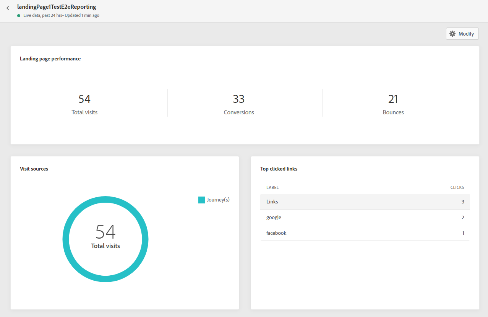
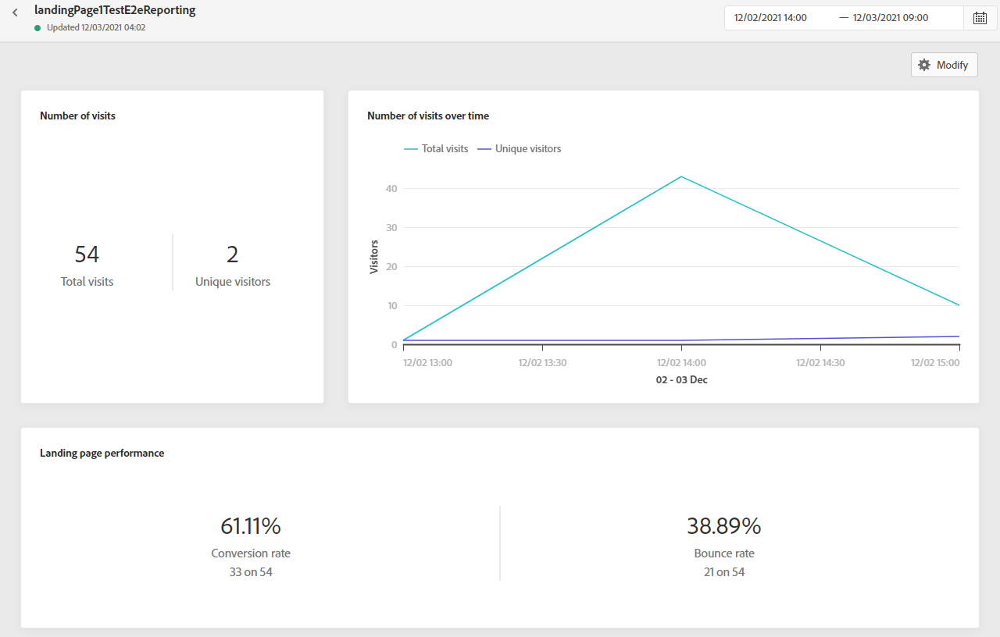

# Rapport om landningssida {#lp-report}

Rapporten om landningssidan innehåller detaljer om landningssidornas påverkan. Det finns två rapporttyper:

* The **[!UICONTROL Live report]** för att mäta och visualisera landningssidornas framgångar bara under de senaste 24 timmarna.

* The **[!UICONTROL Global report]** för att mäta och visualisera landningssidornas framgång under en viss tidsperiod.

Välj **Live** eller **[!UICONTROL Global report]** på den avancerade menyn på den valda landningssidan.

## Landningssidans Live-rapport {#lp-live}

The **[!UICONTROL Landing page performance]** widgeten visar huvudinformationen i förhållande till ditt meddelande under de senaste 24 timmarna via KPI:er:

* **[!UICONTROL Total visits]**: Totalt antal besök på landningssidan från en resa eller andra källor, inklusive flera besök av en mottagare.

* **[!UICONTROL Conversions]**: Antal personer som interagerat med landningssidan, t.ex. prenumererat på ett formulär.

* **[!UICONTROL Bounces]**: Antal personer som inte interagerade med landningssidan och inte slutförde prenumerationsåtgärden.

The **[!UICONTROL Visit sources]** widgeten visar hur besökare kommer åt din landningssida:

* **[!UICONTROL Journey(s)]**: Antal besök på landningssidan som kommer från en resa.

* **[!UICONTROL Other sources]**: Antal besök på landningssidan som kommer från en extern källa i stället för en resa.

The **[!UICONTROL Top clicked links]** identifierar besökarnas interaktion med landningssidan:

* **[!UICONTROL Clicks]**: Antal gånger som ett innehåll klickades på på landningssidan.

The **[!UICONTROL Journey(s)]** widgeten visar antalet besök på din landningssida från en resa.

The **[!UICONTROL Other sources]** widgeten representerar antalet besök på din landningssida från en extern källa i stället för en resa.

The **[!UICONTROL Visits by messages]** / **[!UICONTROL Conversions by messages]** Diagrammen visar totalt antal besök och personer som lyckats interagera med landningssidan under de senaste 24 timmarna beroende på skickade meddelanden.

The **[!UICONTROL Visits by channels]** / **[!UICONTROL Conversions by channels]** Diagrammen visar totalt antal besök och personer som lyckats interagera med landningssidan under de senaste 24 timmarna beroende på kanalerna.

## Global rapport för landningssida {#lp-global}

The **[!UICONTROL Number of visits]** och **[!UICONTROL Number of visits over time]** Med widgetar kan du se effekten av landningssidan under den valda tidsperioden genom ett diagram och KPI:er med följande mått:

* **[!UICONTROL Total visits]**: Totalt antal besök på din landningssida som kommer från resor och externa källor, inklusive flera besök av en mottagare.

* **[!UICONTROL Unique visitors]**: Antal personer som besökte landningssidan, varav flera besök av en mottagare inte beaktas.

The **[!UICONTROL Landing page performance]** widgeten innehåller information om huvudinformationen i förhållande till meddelandet via KPI:er:

* **[!UICONTROL Conversion rate]**: Antal personer som interagerat med landningssidan, t.ex. prenumererat på ett formulär, i förhållande till det totala antalet besök.

* **[!UICONTROL Bounce rate]**: Antal personer som inte interagerade med landningssidan och inte slutförde prenumerationsåtgärden i förhållande till det totala antalet besök.

The **[!UICONTROL Visit sources]** widgeten visar hur besökare kommer åt din landningssida:

* **[!UICONTROL Journey(s)]**: Antal besök på landningssidan som kommer från en resa.

* **[!UICONTROL Other sources]**: Antal besök på landningssidan som kommer från en extern källa i stället för en resa.

The **[!UICONTROL Top clicked links]** identifierar besökarnas interaktion med leveransen:

* **[!UICONTROL Clicks]**: Antal gånger som ett innehåll klickades på på landningssidan.

* **[!UICONTROL Click rate]**: Procentandel klick på landningssidan.

The **[!UICONTROL Journey(s)]** widgeten visar antalet besök på din landningssida från en resa:

* **[!UICONTROL Visits]**: Antal besök på landningssidan, inklusive flera besök av en mottagare.

The **[!UICONTROL Other sources]** widgeten representerar antalet besök på din landningssida från en extern källa i stället för en resa.

The **[!UICONTROL Visits by messages]** / **[!UICONTROL Conversions by messages]** diagram visar det totala antalet besök och personer som lyckades interagera med landningssidan under den aktuella perioden, beroende på skickade meddelanden.

The **[!UICONTROL Visits by channels]** / **[!UICONTROL Conversions by channels]** Diagrammen visar det totala antalet besök och personer som lyckades interagera med landningssidan under den aktuella perioden, beroende på kanalerna.
