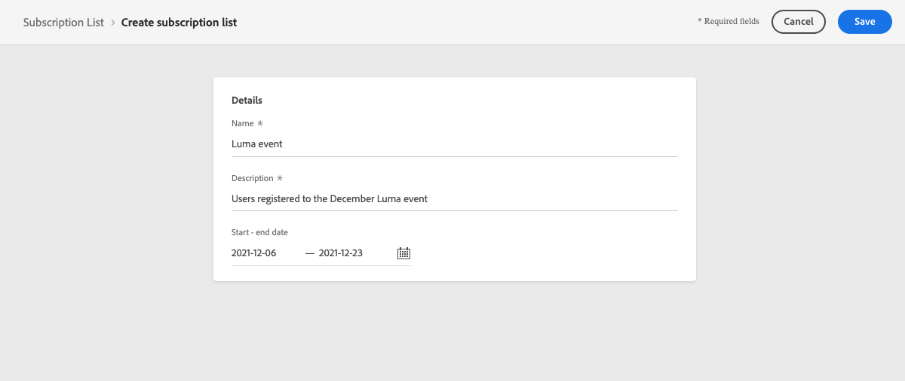
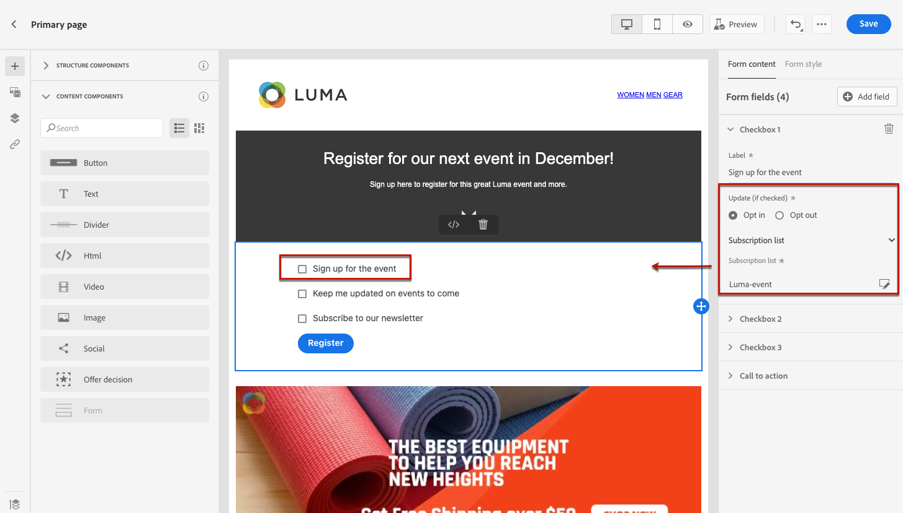
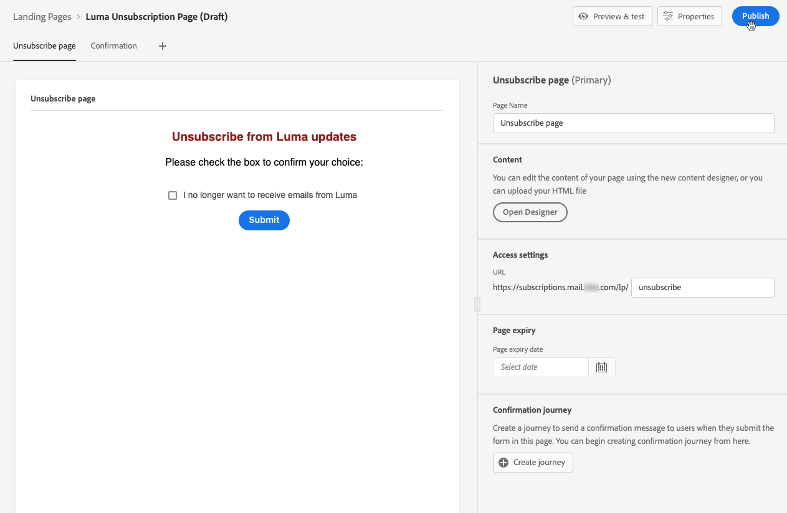

# Användningsexempel för landningssida {#lp-use-cases}

Nedan finns några exempel på hur du kan använda [!DNL Journey Optimizer] landningssidor så att dina kunder kan välja att inte ta emot vissa eller alla meddelanden.

<!--The main use cases are:
* Subscription to a service
* Opt-in
* Opt-out-->

## Prenumeration på en tjänst {#subscription-to-a-service}

Ett av de vanligaste användningsområdena är att bjuda in kunderna till [prenumerera på en tjänst](subscription-list.md) (till exempel ett nyhetsbrev eller ett evenemang) via en landningssida. De viktigaste stegen visas i diagrammet nedan:

Anta till exempel att du ordnar ett event nästa månad och vill starta en kampanj för att registrera event<!--to keep your customers that are interested updated on that event-->. För att göra detta ska du skicka ett e-postmeddelande med en länk till en landningssida där mottagarna kan registrera sig för evenemanget. De användare som registrerar sig läggs till i prenumerationslistan som du har skapat för detta ändamål.

### Ställ in landningssida {#set-up-lp}

1. Skapa händelseregistreringens prenumerationslista, som lagrar registrerade användare. Lär dig hur du skapar en prenumerationslista [här](subscription-list.md#define-subscription-list).

   

1. [Skapa en landningssida](create-lp.md) för att göra det möjligt för mottagarna att registrera sig för evenemanget.

1. Konfigurera registreringen [primär landningssida](create-lp.md#configure-primary-page).

1. När du utformar [innehåll på landningssidan](design-lp.md)markerar du den prenumerationslista som du skapade för att uppdatera den med de profiler som markerar kryssrutan för registrering.

   

1. Skapa en&quot;tack&quot;-sida som visas för mottagarna när de har skickat in registreringsformuläret. Lär dig konfigurera delsidor för landning [här](create-lp.md#configure-subpages).

   

1. [Publicera](create-lp.md#publish) landningssidan.

1. [Skapa ett e-postmeddelande](../messages/create-message.md) för att meddela att registreringen nu är öppen för ditt event.

1. [Infoga en länk](../messages/message-tracking.md#insert-links) i ert meddelandeinnehåll. Välj **[!UICONTROL Landing page]** som **[!UICONTROL Link type]** och väljer [landningssida](create-lp.md#configure-primary-page) som du har skapat för registrering.

   

1. Spara innehåll och [publicera meddelandet](../messages/publish-manage-message.md).

1. Skicka ditt meddelande via en [resa](../building-journeys/journey.md) att köra trafik till landningssidan för registrering.

   

   När mottagarna har fått e-postmeddelandet och klickar på länken till landningssidan dirigeras de till&quot;tack&quot;-sidan och läggs till i prenumerationslistan.

### Skicka ett bekräftelsemeddelande via e-post {#send-confirmation-email}

Dessutom kan du skicka ett bekräftelsemeddelande via e-post till de mottagare som har registrerat sig för din aktivitet. För att göra detta, följ nedanstående steg.

1. Skapa en till [resa](../building-journeys/journey.md). Du kan göra det direkt från landningssidan genom att klicka på **[!UICONTROL Create journey]** -knappen. Läs mer [här](create-lp.md#configure-primary-page)

   

1. Ta fram **[!UICONTROL Events]** kategori och släpp en **[!UICONTROL Segment Qualification]** på arbetsytan. Läs mer [här](../building-journeys/segment-qualification-events.md)

1. Klicka på **[!UICONTROL Segment]** och välj den prenumerationslista du har skapat.

   

1. Välj ett bekräftelsemeddelande och skicka det via resan.

   

Alla användare som har registrerat sig för din aktivitet får bekräftelsemeddelandet via e-post.

<!--The event registration's subscription list tracks the profiles who registered and you can send them targeted event updates.-->

## Avanmäl dig {#opt-out}

Om du vill att mottagarna ska kunna avbeställa din kommunikation kan du inkludera en länk till en avanmälningssida i dina e-postmeddelanden.

Läs mer om hur du hanterar mottagarnas samtycke och varför detta är viktigt i [det här avsnittet](../messages/consent.md).

### Hantering av avanmälan {#opt-out-management}

Att ge mottagarna möjlighet att avbryta prenumerationen på information från ett varumärke är ett juridiskt krav. Läs mer om gällande lagstiftning i [Experience Platform dokumentation](https://experienceleague.adobe.com/docs/experience-platform/privacy/regulations/overview.html#regulations){target=&quot;_blank&quot;}.

Därför måste du alltid inkludera en **avbeställ länk** i varje e-postmeddelande som skickas till mottagarna:

* När du klickar på den här länken dirigeras mottagarna till en landningssida med en knapp som bekräftar att de avanmäler sig.
* När du klickar på avanmälningsknappen uppdateras profildata med den här informationen.

### Konfigurera avanmälan {#configure-opt-out}

Följ stegen nedan om du vill att mottagarna av ett e-postmeddelande ska kunna avbeställa från din kommunikation via en landningssida.

1. Skapa en landningssida. [Läs mer](create-lp.md)

1. Definiera den primära sidan. [Läs mer](create-lp.md#configure-primary-page)

1. [Design](design-lp.md) det primära sidinnehållet: använda landningssidans specifika **[!UICONTROL Form]** -komponent, definiera **[!UICONTROL Opt-out]** kryssruta och välj att uppdatera **[!UICONTROL Channel (email)]**: profilen som markerar avanmälningsrutan på landningssidan avvisas från all kommunikation.

   

   <!--You can also build your own landing page and host it on the third-party system of your choice. To keep?-->

1. Lägg till en bekräftelse [undersida](create-lp.md#configure-subpages) som visas för de användare som skickar formuläret.

   

   >[!NOTE]
   >
   >Se till att du refererar till undersidan på den primära sidans **[!UICONTROL Call to action]** i **[!UICONTROL Form]** -komponenten. [Läs mer](design-lp.md)

1. När du har konfigurerat och definierat innehållet på dina sidor [publicera](create-lp.md#publish) landningssidan.

   

1. [Skapa ett e-postmeddelande](../messages/create-message.md) in [!DNL Journey Optimizer].

1. Markera text i innehållet och [infoga en länk](../messages/message-tracking.md#insert-links) med hjälp av kontextverktygsfältet. Du kan också använda en länk på en knapp.

   

1. Välj **[!UICONTROL Landing page]** från **[!UICONTROL Link type]** och väljer [landningssida](create-lp.md#configure-primary-page) som du skapade för att avanmäla dig.

   

1. Spara innehåll och [publicera meddelandet](../messages/publish-manage-message.md).

1. Skicka ditt budskap genom en resa. [Läs mer](../building-journeys/journey.md).

1. När meddelandet har tagits emot visas din startsida om en mottagare klickar på länken för att avbryta prenumerationen i e-postmeddelandet.

   

   Om mottagaren markerar rutan och skickar formuläret:

   * Mottagaren omdirigeras till bekräftelsemeddelandeskärmen.

   * Profildata uppdateras och kommer inte att få information från ert varumärke om ni inte prenumererar igen.

Om du vill kontrollera att den aktuella profilens val har uppdaterats går du till Experience Platform och öppnar profilen genom att markera ett identitetsnamnutrymme och ett motsvarande identitetsvärde. Läs mer i [Experience Platform dokumentation](https://experienceleague.adobe.com/docs/experience-platform/profile/ui/user-guide.html#getting-started){target=&quot;_blank&quot;}.

I **[!UICONTROL Attributes]** kan du se värdet för **[!UICONTROL choice]** har ändrats till **[!UICONTROL no]**.

<!--

### Other ways to opt out

You can also enable your recipients to unsubscribe whithout using landing pages.

* **One-click opt-out**

    You can add a one-click opt-out link into your email content. This will enable your recipients to quickly unsubscribe from your communications, without being redirected to a landing page where they need to confirm opting out. [Learn more](../messages/consent.md#one-click-opt-out-link)

* **Unsubscribe link in header**

    If the recipients' email client supports displaying an unsubscribe link in the email header, emails sent with [!DNL Journey Optimizer] automatically include this link. [Learn more](../messages/consent.md#unsubscribe-email)
-->
