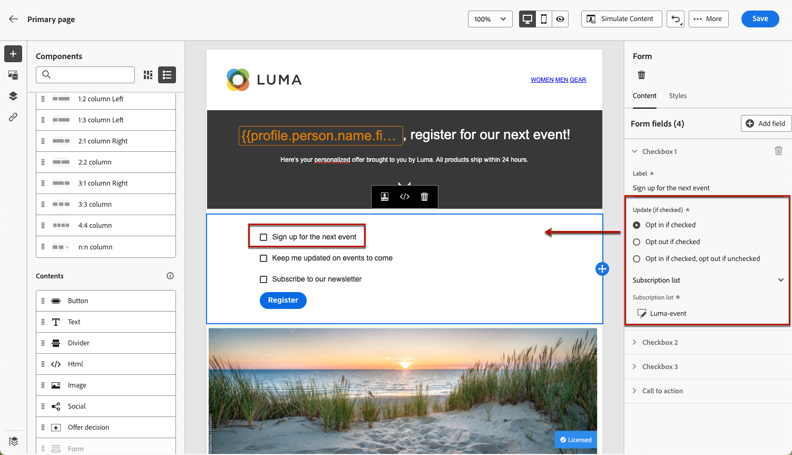

# Användningsexempel för landningssida {#lp-use-cases}

Nedan visas några exempel på hur du kan använda [!DNL Journey Optimizer] landningssidor för att få dina kunder att välja att inte ta emot vissa eller alla meddelanden.

## Prenumerera på en tjänst {#subscription-to-a-service}

Ett av de vanligaste användningsområdena är att bjuda in dina kunder att [prenumerera på en tjänst](subscription-list.md) (till exempel ett nyhetsbrev eller en händelse) via en landningssida. De viktigaste stegen visas i diagrammet nedan:

Anta att du organiserar en händelse nästa månad och vill starta en händelseregistreringskampanj <!--to keep your customers that are interested updated on that event-->. För att göra detta kommer du att skicka ett e-postmeddelande med en länk till en landningssida där mottagarna kan registrera sig för evenemanget. De användare som registrerar sig läggs till i prenumerationslistan som du har skapat för detta ändamål.

### Konfigurera en landningssida {#set-up-lp}

1. Skapa händelseregistreringens prenumerationslista, som lagrar registrerade användare. Lär dig skapa en prenumerationslista [här](subscription-list.md#define-subscription-list).

   

1. [Skapa en landningssida](create-lp.md) så att dina mottagare kan registrera sig för din aktivitet.

   

1. Konfigurera registreringssidan [för primär landningssida](create-lp.md#configure-primary-page).

1. När du utformar [innehållet på landningssidan](design-lp.md) markerar du den prenumerationslista som du skapade för att uppdatera den med de profiler som har markerat kryssrutan för registrering.

   

1. Skapa en&quot;tack&quot;-sida som visas för mottagarna när de har skickat in registreringsformuläret. Lär dig hur du konfigurerar landningsundersidor [här](create-lp.md#configure-subpages).

   

1. [Publicera](create-lp.md#publish) landningssidan.

1. I en [resa](../building-journeys/journey.md) lägger du till en **e-post**-aktivitet för att köra trafik till startsidan för registrering.

   

1. [Designa e-postmeddelandet](../email/get-started-email-design.md) för att meddela att registreringen nu är öppen för evenemanget.

1. [Infoga en länk](../email/message-tracking.md#insert-links) i meddelandeinnehållet. Välj **[!UICONTROL Landing page]** som **[!UICONTROL Link type]** och välj den [landningssida](create-lp.md#configure-primary-page) som du skapade för registrering.

   

   >[!NOTE]
   >
   >Om du vill kunna skicka ditt meddelande kontrollerar du att landningssidan du valt inte har gått ut ännu. Lär dig hur du uppdaterar förfallodatumet [i det här avsnittet](create-lp.md#configure-primary-page).

   När mottagarna har fått e-postmeddelandet och klickar på länken till landningssidan dirigeras de till&quot;tack&quot;-sidan och läggs till i prenumerationslistan.

### Skicka en bekräftelse via e-post {#send-confirmation-email}

Dessutom kan du skicka ett bekräftelsemeddelande via e-post till de mottagare som har registrerat sig för din aktivitet. Följ stegen nedan för att göra det.

1. Skapa en annan [resa](../building-journeys/journey.md). Du kan göra det direkt från landningssidan genom att klicka på knappen **[!UICONTROL Create journey]**. [Läs mer](create-lp.md#configure-primary-page)

   

1. Öppna kategorin **[!UICONTROL Events]** och släpp en **[!UICONTROL Audience Qualification]**-aktivitet på arbetsytan. [Läs mer](../building-journeys/audience-qualification-events.md)

1. Klicka i fältet **[!UICONTROL Audience]** och välj den prenumerationslista som du har skapat.

   

1. Lägg till ett bekräftelsemeddelande som du väljer och skicka det genom resan.

   

Alla användare som har registrerat sig för din aktivitet får bekräftelsemeddelandet via e-post.

<!--The event registration's subscription list tracks the profiles who registered and you can send them targeted event updates.-->

## Landningssida för avanmälan {#opt-out}

Om du vill att mottagarna ska kunna avbeställa din kommunikation kan du inkludera en länk till en avanmälningssida i dina e-postmeddelanden.

>[!NOTE]
>
>Läs mer om hur du hanterar mottagarnas samtycke och varför detta är viktigt i [det här avsnittet](../privacy/opt-out.md).

### Hantering av avanmälan {#opt-out-management}

Att ge mottagarna möjlighet att avbryta prenumerationen på information från ett varumärke är ett juridiskt krav. Läs mer om gällande lagstiftning i [Experience Platform-dokumentationen](https://experienceleague.adobe.com/docs/experience-platform/privacy/regulations/overview.html?lang=sv-SE#regulations){target="_blank"}.

Därför måste du alltid inkludera en **länk för att avbryta prenumerationen** i alla e-postmeddelanden som skickas till mottagarna:

* När du klickar på den här länken dirigeras mottagarna till en landningssida med en knapp som bekräftar att de avanmäler sig.
* När du klickar på avanmälningsknappen uppdateras profildata med den här informationen.

### Konfigurera e-postavanmälan {#configure-opt-out}

Följ stegen nedan för att göra det möjligt för mottagarna av ett e-postmeddelande att avbeställa din kommunikation via en landningssida:

1. Skapa en landningssida. [Läs mer](create-lp.md)

1. Definiera den primära sidan. [Läs mer](create-lp.md#configure-primary-page)

1. [Design](design-lp.md) är det primära sidinnehållet: använd den landningssidsspecifika **[!UICONTROL Form]** komponenten, definiera en **[!UICONTROL Opt-out]** kryssruta och välj att uppdatera **[!UICONTROL Channel (email)]**: profilen som markerar avanmälningsrutan på landningssidan avmarkeras från all kommunikation.

   

   <!--You can also build your own landing page and host it on the third-party system of your choice.-->

1. Lägg till en [undersida](create-lp.md#configure-subpages) som ska visas för de användare som skickar formuläret.

   

   >[!NOTE]
   >
   >Se till att du refererar till undersidan i den primära sidans **[!UICONTROL Call to action]**-avsnitt i komponenten **[!UICONTROL Form]**. [Läs mer](design-lp.md)

1. När du har konfigurerat och definierat innehållet på dina sidor [publicerar](create-lp.md#publish) landningssidan.

1. [Skapa ett e-postmeddelande](../email/get-started-email-design.md) på en resa.

1. Markera text i innehållet och [infoga en länk](../email/message-tracking.md#insert-links) med hjälp av det sammanhangsberoende verktygsfältet. Du kan också använda en länk på en knapp.

1. Välj **[!UICONTROL Landing page]** i listrutan **[!UICONTROL Link type]** och välj den [landningssida](create-lp.md#configure-primary-page) som du skapade för att avanmäla dig.

   

   >[!NOTE]
   >
   >Om du vill kunna skicka ditt meddelande kontrollerar du att landningssidan du valt inte har gått ut ännu. Lär dig hur du uppdaterar förfallodatumet [i det här avsnittet](create-lp.md#configure-primary-page).

1. Publicera och kör resan. [Läs mer](../building-journeys/journey.md).

1. När meddelandet har tagits emot visas din startsida om en mottagare klickar på länken för att avbryta prenumerationen i e-postmeddelandet.

   

   Om mottagaren markerar rutan och skickar formuläret:

   * Mottagaren omdirigeras till bekräftelsemeddelandeskärmen.

   * Profildata uppdateras och kommer inte att få information från ert varumärke om ni inte prenumererar igen.

Om du vill kontrollera att den aktuella profilens val har uppdaterats går du till Experience Platform och öppnar profilen genom att välja ett identitetsnamnutrymme och ett motsvarande identitetsvärde. Läs mer i [Experience Platform-dokumentationen](https://experienceleague.adobe.com/docs/experience-platform/profile/ui/user-guide.html?lang=sv-SE#getting-started){target="_blank"}.

På fliken **[!UICONTROL Attributes]** ser du att värdet för **[!UICONTROL choice]** har ändrats till **[!UICONTROL no]**.

Information om avanmälan lagras i datamängden för **tjänsten för samtycke**. [Läs mer om datauppsättningar](../data/get-started-datasets.md)

>[!NOTE]
>
>Om sammanfogningsmetoden för din standardprincip för [Adobe Experience Platform](https://experienceleague.adobe.com/docs/experience-platform/profile/home.html?lang=sv){target="_blank"} **[!UICONTROL Profiles]** är **[!UICONTROL Dataset Precedence]** måste du aktivera **[!UICONTROL AJO Consent Service Dataset]** och prioritera den i sammanfogningsprincipen. [Läs mer](https://experienceleague.adobe.com/docs/experience-platform/profile/merge-policies/ui-guide.html?lang=sv-SE#dataset-precedence-profile){target="_blank"}
>
>Även om inga batchar har lagts till i den här datauppsättningen kommer den fortfarande att innehålla information om anmälan/avanmälan.

**Se även:**

* [Avanmäl dig med ett klick](../email/email-opt-out.md#one-click-opt-out-link)
* [Länk för avanmälan i e-posthuvudet](../email/email-opt-out.md#unsubscribe-header)

<!--

### Other ways to opt out

You can also enable your recipients to unsubscribe whithout using landing pages.

* **One-click opt-out**

    You can add a one-click opt-out link into your email content. This will enable your recipients to quickly unsubscribe from your communications, without being redirected to a landing page where they need to confirm opting out. [Learn more](../privacy/opt-out.md#one-click-opt-out-link)

* **Unsubscribe link in header**

    If the recipients' email client supports displaying an unsubscribe link in the email header, emails sent with [!DNL Journey Optimizer] automatically include this link. [Learn more](../privacy/opt-out.md#unsubscribe-header)

////////

## Leverage landing page submission event {#leverage-lp-event}

You can use information that was submitted on a landing page to send communications to your customers. For example, if a user subscribes to a given subscription list, you can leverage that information to send an email recommending other subscription lists to that user.

To do this, you need to create an event containing the landing page submission information and use it in a journey. Follow the steps below.

1. Go to **[!UICONTROL Administration]** > **[!UICONTROL Configurations]**, and in the **[!UICONTROL Events]** section, select **[!UICONTROL Manage]**.

    

1. The list of events displays. Select **[!UICONTROL Create Event]**.

    

1. The event configuration pane opens on the right side of the screen. Configure a rule-based unitary event. [Learn more](../event/about-creating.md)

1. Define the schema: select **[!UICONTROL AJO Email Tracking Experience Event Schema v.1]** (available by default in [!DNL Journey Optimizer]).

    

1. In the **[!UICONTROL Fields]** section, select the following elements:

    * **[!UICONTROL _experience]** > **[!UICONTROL customerJourneyManagement]** > **[!UICONTROL messageInteraction]** > **[!UICONTROL Interaction Type]**
    
    * **[!UICONTROL _experience]** > **[!UICONTROL customerJourneyManagement]** > **[!UICONTROL messageInteraction]** > **[!UICONTROL Landing Page Details]** > **[!UICONTROL Landing Page ID]**

    

1. Click inside the **[!UICONTROL Event ID condition]** field. Using the simple personalization editor, define the condition for the **[!UICONTROL Interaction Type]** and **[!UICONTROL Landing Page ID]** fields. This will be used by the system to identify the events that will trigger your journey.

    

    >[!NOTE]
    >
    >To find the landing page ID, you can insert the landing page as a link into an email and select the source code from the contextual toolbar to display the landing page information.
    >
    >

1. Save your changes.

1. Create a [journey](../building-journeys/journey.md). You can do it directly from the landing page by clicking the **[!UICONTROL Create journey]** button. Learn more [here](create-lp.md#configure-primary-page)

    

1. In the journey, unfold the **[!UICONTROL Events]** category and drop the event that you created into the canvas. Learn more [here](../building-journeys/audience-qualification-events.md)

    

1. Unfold the **[!UICONTROL Actions]** category and drop an email action into the canvas.

    

///How do you use the information from the event to send an email to the users? -->
